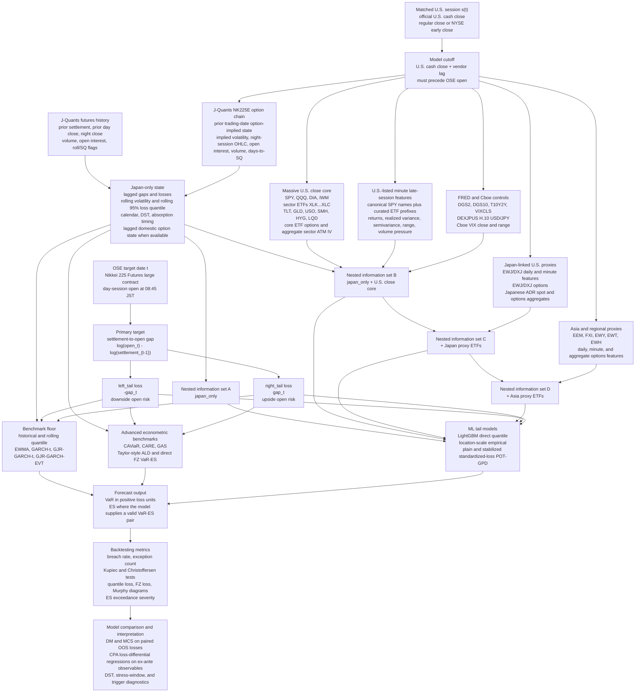

---
hide:
  - navigation
---

# Paper Plan

## Working Title

**U.S. Close Information and Pre-Open Tail Risk in OSE Nikkei 225 Futures**

- This paper asks whether information observed at the U.S. cash-market close helps forecast the tail risk of the next Osaka Exchange (OSE) Nikkei 225 Futures day-session open.
- The setting is not a standard overnight-return problem. OSE futures trade through an active night session, so part of the U.S. information may already be incorporated before the Japanese opening auction.
- The contribution is a point-in-time (PiT) out-of-sample forecast evaluation of VaR and Expected Shortfall (ES), not a new machine-learning algorithm.
- The forecast origin is the U.S. close plus a realistic data-availability lag; all predictors are subject to look-ahead-bias controls.

## Main Question

- Does U.S. close information improve out-of-sample forecasts of OSE Nikkei 225 Futures opening-gap tail risk beyond Japan-only history and established econometric benchmarks?
- Related questions:
    - Does the effect differ between downside and upside opening-gap risk?
    - Does most of the marginal information arrive with the core U.S. close variables, with limited additional contribution from Japan and Asia proxy ETFs?
    - Do ML tail models lower average VaR-ES loss mainly through less conservative VaR estimates, or do they improve conditional tail calibration?
    - Does an EVT layer improve VaR-ES performance relative to direct LightGBM quantile forecasts?
    - Do loss differentials vary with ex-ante observables such as VIX, EST/EDT timing, or calendar-based trading conditions?

## Institutional Setting

- OSE Nikkei 225 Futures have a Japanese day session and an extended night session.
- The U.S. cash close precedes the next OSE day-session open, but the amount of post-U.S.-close OSE night trading differs between EST and EDT.
- The PiT condition is:

  `feature_available_ts_utc <= model_cutoff_ts_utc < target_open_ts_utc`.

- FRED macro-financial predictors use conservative publication lags, but they do not use unrevised real-time ALFRED vintages. This is a data limitation, not a timing violation.
- DST comparisons are descriptive timing-regime tests. They do not identify a structural causal mechanism.

## Sample and Data

- Current clean evaluation window: `2018-06-20` to `2026-05-01`.
- Current forecast-sample size: `1661` trading-day observations.
- Current registered headline tail level: 95% VaR, corresponding to a nominal 5% exception rate.
- 97.5% VaR/ES is not part of the current headline pipeline. It can be reconsidered only as a separate future specification with sufficient common-sample size, exception counts, and EVT diagnostics.
- Main data sources:
    - J-Quants Premium: Nikkei 225 Futures prices, settlement, volume, and open interest; `NK225E` large-option chains enter only as lagged domestic option-implied and night-session option state when enabled and audited.
    - Massive: U.S. ETFs, sector ETFs, dollar ETF proxy, Japan proxy ETFs, Asia proxy ETFs, and curated U.S.-listed ETF late-session minute predictors.
    - FRED: Treasury rates, VIX, H.10 USD/JPY, and audited credit-spread controls with publication-lag controls.
    - CBOE: volatility-index predictors, including VIX.

## Forecast Computation Flow

The empirical unit is one OSE target date \(t\). For that date, the model uses
only information available by the matched U.S. cash-market close plus the
registered data-availability lag, then forecasts the tail risk of the next OSE
Nikkei 225 Futures day-session open.

Operationally, the calculation proceeds as follows:

- Map each OSE target date \(t\) to the relevant U.S. session \(s(t)\), accounting for U.S. holidays, Japan holidays, NYSE early closes, and DST.
- Set the forecast origin to the U.S. cash close plus the configured vendor lag. No predictor is eligible unless its availability timestamp is no later than this cutoff.
- Construct the main gap from the previous settlement to the OSE day-session open:

  `gap_t = log(day_session_open_t) - log(previous_settlement_{t-1})`.

- Convert the same gap into two separate loss surfaces:
    - downside risk: `left_tail_loss_t = -gap_t`;
    - upside risk: `right_tail_loss_t = gap_t`.
- Estimate benchmark, advanced benchmark, and ML tail models on expanding historical windows, with monthly refits for the ML tail models.
- Store VaR and ES forecasts in positive loss units. A VaR exception is always `realized_loss_t > var_forecast_t`.
- Compare forecasts on common out-of-sample dates using calibration tests, quantile loss, FZ loss for valid VaR-ES pairs, DM/MCS inference, CPA loss-differential regressions, and supporting diagnostics.

## Risk Surfaces

- The paper treats both sides of futures risk as economically meaningful:
    - `left_tail`: downside opening-gap risk, with realized loss defined as `-gap_t`.
    - `right_tail`: upside opening-gap risk, with realized loss defined as `gap_t`.
- VaR and ES are expressed in positive loss units.
- For both sides, a VaR exception is defined as:

  `realized_loss > var_forecast`.

- Left and right tails are evaluated separately. They are not assumed to have the same economic mechanism.

## Targets

- **Settlement-to-open gap**: log day-session open minus log previous settlement.
    - Main target.
    - Measures full opening-level risk relative to the prior settlement.
- **Close-to-open gap**: log day-session open minus log previous day-session close.
    - Secondary target.
    - Provides an alternative opening-gap reference.
- **Night-close-to-open gap**: log day-session open minus log night-session close.
    - Absorption robustness target.
    - Available only when the night close is observed and PiT-valid.
- **U.S.-close-mark-to-open gap**: log day-session open minus a timestamped Nikkei futures mark at the U.S. cash close.
    - Deferred target.
    - Requires licensed intraday OSE, CME, SGX, or equivalent Nikkei futures marks.

## Nested Information Sets

- `japan_only`
    - Target history, lagged Japanese futures variables, rolling volatility, volume/open-interest information, and Japanese calendar variables.
- `japan_only_plus_us_close_core`
    - Adds U.S. broad/core close equity, minute, volatility, FX, rates, credit-spread, dollar-risk ETF, and U.S. core options predictors available before the OSE open.
- `japan_only_plus_us_close_core_plus_japan_proxy`
    - Adds U.S.-traded Japan proxy ETFs such as `EWJ` and `DXJ`, Japan ETF minute features, Japan ETF options, and Japanese ADR spot/options aggregates.
- `japan_only_plus_us_close_core_plus_japan_proxy_plus_asia_proxy`
    - Adds Asia and regional proxy ETFs such as `EEM`, `FXI`, `EWY`, `EWT`, and `EWH`, with daily, minute, and aggregate options features routed by economic exposure.
- Interpretation:
    - The nested information sets test marginal predictive content.
    - Proxy ETF blocks are pre-specified robustness and mechanism checks, not an exhaustive variable search.
    - Computed ATM-IV proxies are routed by underlying exposure: U.S. core and sector aggregate options into B, Japan ETF and ADR aggregate options into C, and Asia proxy aggregate options into D.

## Forecasting Models

- Benchmark floor:
    - Historical empirical quantile.
    - Rolling empirical quantile.
    - EWMA or volatility-scaled quantile.
    - GARCH and GJR-GARCH with Student-t innovations.
    - GJR-GARCH-EVT in the McNeil-Frey tradition.
- Advanced econometric benchmarks:
    - CAViaR.
    - CARE / expectile-based tail models.
    - Generalized Autoregressive Score (GAS) models.
    - Taylor-style asymmetric-Laplace VaR-ES specifications.
    - Joint VaR-ES estimation via Fissler-Ziegel (FZ) scoring-function minimization, subject to numerical convergence checks.
- ML tail specifications:
    - Flexible, tree-based direct quantile estimation via gradient boosting (LightGBM).
    - LightGBM location-scale empirical tail calibration.
    - LightGBM standardized-loss Peaks-Over-Threshold Generalized Pareto Distribution (POT-GPD) with a plain MLE comparator.
    - LightGBM standardized-loss POT-GPD stabilized variant, reported transparently as a finite-sample regularized filtered-EVT variant.
    - Intermediate capped-MLE, EVI-shrink, and extremal-index-weighted (`ei_weighted`) POT-GPD variants for ablation evidence, not as headline model-family claims.
- Estimation protocol:
    - All specifications follow the same point-in-time out-of-sample forecasting protocol and the same minimum training-history requirement.
    - Most specifications use expanding pre-forecast training histories.
    - The rolling empirical quantile benchmark is the exception: by design, it uses the most recent 1,000 clean observations.
    - ML tail models are refit monthly using expanding training windows.
    - LightGBM hyperparameters are held fixed across information sets and refit dates to limit data-dependent tuning bias.
    - The comparison is therefore aligned in forecast timing and sample discipline, but not in predictor dimensionality; benchmark models are target-history-only, whereas the ML specifications evaluate nested information sets.

## EVT Protocol

- EVT is used for tail calibration and ES extrapolation, not as a standalone contribution.
- Plain POT-GPD is fitted to training-window standardized losses after conditional filtering and remains the standard filtered-EVT comparator.
- Stabilized POT-GPD is a finite-sample regularized filtered-EVT variant, not plain standard POT-GPD.
- VaR and ES forecasts are transformed back into the target loss units.
- The primary comparison focuses on 95% direct LightGBM quantile forecasts, 95% location-scale empirical forecasts, 95% plain standardized-loss POT-GPD forecasts, and 95% stabilized standardized-loss POT-GPD forecasts on common out-of-sample dates.
- Tail calibration gates are decoupled from the LightGBM final model training gate so the location-scale and POT-GPD variants can be evaluated without shortening the direct-quantile sample unnecessarily.
- The stabilized variant records `evt_variant`, `evt_shape_method`, `evt_cap_policy`, `evt_evi_status`, `evt_ei_status`, `cap_hit`, `xi_mle`, `xi_evi_anchor`, `theta_hat`, `n_eff`, scale-refit status, and ES finite/unavailable status.
- The primary EVI anchor is the de Haan-Ferreira moment estimator. Hill is diagnostic only and interpreted only when diagnostics support positive heavy-tail shape; Pickands is a cross-check.
- The primary extremal-index estimator is Ferro-Segers. K-gaps is a robustness diagnostic. Extremal-index (`EI`) weighting is used only as a finite-sample effective-exceedance heuristic, not as a new GPD likelihood.
- Shape cap sensitivity reports conservative `(-0.1, 0.5)`, baseline `(-0.25, 0.75)`, and loose `(-0.5, 1.0)` caps. If any sensitivity run has `xi_final >= 1`, ES is marked unavailable for that run.

## Options Feature Protocol

- Options are used only as additional predictors for the same N225 futures settle-to-open VaR/ES target.
- J-Quants Nikkei 225 large options (`NK225E`) enter the domestic `japan_only` block as lagged option-implied and night-session option state only, using prior available option-chain aggregates, including `EO/EH/EL/EC` night-session OHLC summaries, and excluding same target-date option rows.
- Massive live option snapshots are not used for historical backfill.
- Historical U.S. options features use Massive OPRA `day_aggs_v1`, computed ATM-IV proxies from option daily close prices, underlying daily closes, FRED `DGS2`, and zero-dividend Black-Scholes. Vendor historical IV/Greeks/OI are not assumed.
- Candidate underlyings are capped before modeling:
    - core U.S. options (`SPY`, `QQQ`, `DIA`, `IWM`) enter B with the U.S. core block;
    - sector and semiconductor option aggregates (`XLK`, `XLF`, `XLE`, `XLV`, `XLI`, `XLY`, `XLP`, `XLB`, `XLU`, `XLC`, `SMH`) enter B as aggregate state only;
    - Japan ETF options (`EWJ`, `DXJ`) enter C with the Japan proxy block;
    - primary ADR aggregate options (`TM`, `SONY`, `MUFG`, `SMFG`, `MFG`) enter C as a Japan-linked U.S. corporate-risk proxy.
    - Asia proxy option aggregates (`EEM`, `FXI`, `EWY`, `EWT`, `EWH`) enter D as aggregate state only.
- DTE buckets are short `7-30` and medium `31-90`. ATM uses closest-to-spot by absolute log-moneyness in v1 because day aggregates do not contain delta; delta-neutral selection remains a future quote/Greeks-enabled upgrade.
- ADR aggregate features use median and 20% trimmed mean as primary summaries; max, breadth, and count are diagnostics.
- Curated options features are capped at 45 and routed by economic exposure. Raw per-contract, per-sector, per-Asia-ETF, and per-ADR outputs remain audit or appendix material.

## Evaluation and Inference

- VaR calibration:
    - empirical breach rate;
    - Kupiec unconditional coverage test;
    - Christoffersen independence or conditional coverage test where sample size permits.
- VaR loss:
    - quantile loss on paired out-of-sample observations.
- Joint VaR-ES evaluation:
    - Fissler-Ziegel joint loss for valid VaR-ES pairs;
    - Murphy diagrams to assess sensitivity to the scoring function within the relevant family;
    - ES exceedance severity, interpreted conditional on an exception.
- Model comparison:
    - block-bootstrap Diebold-Mariano tests on paired loss differentials;
    - Hansen-Lunde-Nason Model Confidence Set where common-sample and exception-count gates pass;
    - Conditional Predictive Ability (CPA) regressions, specified as loss-differential regressions on ex-ante observables.
- Supporting diagnostics:
    - DST attenuation;
    - stress-window performance;
    - pre-open VaR trigger summaries.
- Trigger summaries are risk-monitoring diagnostics. They are not hedge PnL, transaction-cost, or trading-alpha evidence.

## Preliminary Empirical Findings and Caveats

- PiT audit:
    - The current audit records zero hard look-ahead-bias failures.
    - Warnings remain visible and should be discussed rather than suppressed.
    - FRED predictors are lagged by publication timing but are not ALFRED real-time vintages.
- Benchmark calibration:
    - Benchmark floor models have breach rates closer to the nominal 5% level than the ML direct-quantile headline models.
    - In the current clean evaluation, the benchmark floor median breach rate is about 6.1%.
- ML tail coverage drift:
    - The ML direct-quantile nested information sets produce breach rates of about 9.1% to 12.6%, above the nominal 5% level.
    - Lower average loss across information sets must therefore be interpreted alongside the coverage drift.
- Nested information sets:
    - The largest reduction in quantile loss occurs when core U.S. close variables are added.
    - Japan proxy and Asia proxy blocks appear to add less marginal loss reduction after U.S. close core variables are included.
- Restricted model-family comparison:
    - Location-scale empirical, plain POT-GPD, and stabilized POT-GPD specifications are implemented.
    - Their common out-of-sample comparison is shorter than the direct-quantile headline sample.
    - These results are useful for model-family evidence, but they should not replace the headline nested-information-set analysis unless they pass the registered headline coverage and common-sample gates.
- Options features:
    - U.S.-listed OPRA day aggregates can now supply computed ATM-IV proxy features when enabled.
    - The headline ladder routes options by economic exposure: U.S. core and sector aggregate options enter B, Japan ETF and Japanese ADR aggregate options enter C, and Asia proxy aggregate options enter D.
    - U.S.-listed options should remain out of headline claims when coverage, liquidity, or timestamp-safe feature reconstruction is not proven.
    - J-Quants `NK225E` option-implied and night-session option features are domestic, lagged, and source-audited separately inside `japan_only`.
- CPA:
    - CPA is an inference layer over loss differentials.
    - It does not generate VaR or ES forecasts.
    - It does not replace unconditional DM/MCS comparisons.

## Main Tables and Figures

- Main text candidates:
    - data and timing audit;
    - benchmark common-sample table;
    - ML headline nested-information-set table for direct quantile and any eligible location-scale or POT-GPD variants;
    - left-tail and right-tail coverage breach-rate figure;
    - ML tail Murphy diagrams, read together with coverage diagnostics.
- Appendix candidates:
    - full benchmark metrics;
    - restricted model-family result matrix;
    - EVT ablation, shape-stability, extremal-index, and cap-sensitivity diagnostics;
    - options source, coverage, and liquidity audit artifacts;
    - result-matrix DM/MCS notes;
    - CPA tables;
    - DST attenuation figures;
    - ES severity figures;
    - trigger diagnostics;
    - stress-window diagnostics;
    - feature availability and PiT audit details.

## Manuscript Structure

- Introduction:
    - motivate pre-open tail risk in OSE Nikkei 225 Futures;
    - explain why the night session matters;
    - state the nested-information-set question.
- Institutional setting and data:
    - describe OSE day/night sessions, U.S. close timing, DST regimes, source availability, and target construction.
- Methodology:
    - define loss units, tail sides, information sets, benchmark models, ML tail models, and EVT calibration.
- Empirical design:
    - define OOS splits, refit schedule, common-sample rules, inference tests, and claim boundaries.
- Results:
    - begin with PiT and sample audit;
    - report benchmark calibration;
    - report ML direct-quantile nested information sets for left and right tails;
    - report restricted location-scale and POT-GPD comparisons;
    - discuss coverage, DM/MCS, CPA, DST, ES severity, and trigger diagnostics.
- Conclusion:
    - summarize the incremental information content of U.S. close variables;
    - distinguish downside and upside risk;
    - state limits from coverage drift, FRED vintages, EVT sample size, and missing U.S.-close Nikkei futures marks.

## Claim Boundaries

- No structural causal spillover claim.
- No price-discovery claim.
- No claim that left-tail and right-tail mechanisms are identical.
- No trading-alpha claim.
- No hedge PnL or transaction-cost claim.
- No live deployment claim from historical J-Quants OHLC data.
- No `residual_usclosemark_to_open` claim without licensed timestamped intraday Nikkei futures marks.
- No claim that LightGBM-EVT is a new ML algorithm.
- No claim that stabilized POT-GPD is the same object as plain maximum-likelihood POT-GPD.
- No options-risk headline claim unless historical options entitlement, timestamp safety, and liquidity gates pass.
- No model-family ranking claim from restricted short samples.
- No extreme-tail claim without sufficient exceptions and rolling out-of-sample diagnostics.

## Source Notes

- JPX Nikkei 225 Futures contract specifications: [Nikkei 225 Futures | Japan Exchange Group](https://www.jpx.co.jp/english/derivatives/products/domestic/225futures/01.html)
- JPX derivatives trading hours: [Trading Hours | Derivatives | Japan Exchange Group](https://www.jpx.co.jp/english/derivatives/rules/trading-hours/index.html)
- J-Quants plan coverage: [Available APIs and Data Periods per Plan | J-Quants API](https://jpx.gitbook.io/j-quants-en/outline/data-spec)
- J-Quants data timing: [Update Timing of Provided Data | J-Quants API](https://jpx.gitbook.io/j-quants-en/outline/data-update)
- Massive.com stock-market timestamp semantics: [Stocks Overview | Massive.com](https://massive.com/docs/rest/stocks/overview)
- NYSE trading hours and early closes: [Holidays and Trading Hours | NYSE](https://www.nyse.com/trade/hours-calendars)
- FRED observations API: [fred/series/observations | FRED](https://fred.stlouisfed.org/docs/api/fred/series_observations.html)
- Cboe VIX historical data: [VIX Index Historical Data | Cboe](https://www.cboe.com/tradable_products/vix/vix_historical_data)
- CME Nikkei products: [Nikkei 225 futures | CME Group](https://www.cmegroup.com/nikkei)
- Patton, Ziegel, and Chen dynamic ES-VaR models: [Dynamic semiparametric models for expected shortfall](https://www.sciencedirect.com/science/article/abs/pii/S030440761930048X)
- Taylor asymmetric-Laplace VaR-ES benchmark: [Forecasting Value at Risk and Expected Shortfall](https://www.tandfonline.com/doi/abs/10.1080/07350015.2017.1281815)
- Creal, Koopman, and Lucas score-driven models: [Generalized autoregressive score models with applications](https://tinbergen.nl/publication/160131/general-autoregressive-score-models-with-applications)
- Hansen, Lunde, and Nason model comparison: [The Model Confidence Set](https://econpapers.repec.org/RePEc:ecm:emetrp:v:79:y:2011:i:2:p:453-497)
- Murphy-diagram evaluation: [Murphy Diagrams: Forecast Evaluation of Expected Shortfall](https://arxiv.org/abs/1705.04537)
