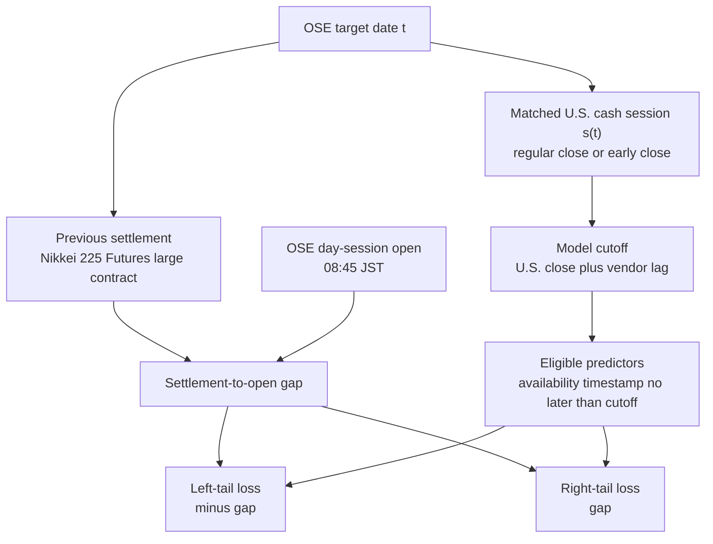
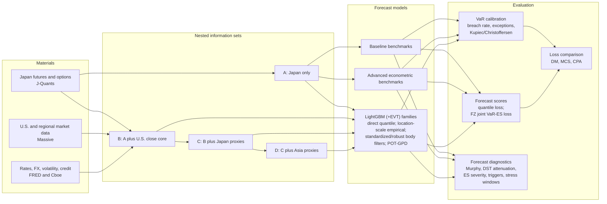

---
hide:
  - navigation
---

# Paper Plan

## Working Title

**U.S. Close Information and Pre-Open Tail Risk in OSE Nikkei 225 Futures**

This page is the paper-facing plan for the empirical design. It is organized in
the order a reader would expect in a finance paper: research question,
institutional context, data, methods, workflow, expected outputs, and
appendix material.

## 1. Introduction

### 1.1 Main Question

- The paper asks whether information observed by the U.S. cash-market close helps forecast the tail risk of the next Osaka Exchange (OSE) Nikkei 225 Futures day-session open.
- The primary empirical object is the settlement-to-open gap of the Nikkei 225 Futures large contract:

  `gap_t = log(day_session_open_t) - log(previous_settlement_{t-1})`.

- The same gap is evaluated as two loss surfaces:
    - `left_tail`: downside opening-gap risk, `realized_loss_t = -gap_t`;
    - `right_tail`: upside opening-gap risk, `realized_loss_t = gap_t`.
- The registered primary tail level is 95% VaR, with a nominal 5% exception rate.
- The empirical question is predictive and out-of-sample. It is not a structural causal design.

### 1.2 Market Context

- OSE Nikkei 225 Futures trade in both day and night sessions.
- The U.S. cash close occurs before the next OSE day-session open, but the Japanese night session means that some U.S. information may already be reflected before the opening auction.
- The amount of post-U.S.-close night trading differs between EST and EDT, which makes DST a useful descriptive timing diagnostic.
- The paper therefore studies pre-open tail risk, not a generic close-to-close or overnight-return problem.
- The forecast origin is the matched U.S. cash-market close plus the registered vendor-data availability lag.
- The point-in-time condition is:

  `feature_available_ts_utc <= model_cutoff_ts_utc < target_open_ts_utc`.

### 1.3 Relation To The Literature

- **International information transmission**:
    - The empirical setting is cross-market and timing-sensitive: U.S. equity, rates, volatility, FX, credit, and proxy-ETF information is observed before the Japanese futures open.
    - The paper does not claim price discovery or structural spillover identification.
- **VaR and ES forecasting**:
    - The study evaluates one-day-ahead opening-gap VaR and ES in positive loss units.
    - VaR calibration is assessed through exception rates and coverage tests.
    - ES enters through valid VaR-ES forecast pairs and Fissler-Ziegel (FZ) joint scoring.
- **Dynamic quantile and tail models**:
    - Econometric comparators include historical quantiles, volatility-scaled quantiles, GARCH/GJR-GARCH, CAViaR, CARE/expectile models, GAS models, and Taylor-style VaR-ES specifications.
    - Machine-learning models use LightGBM as a flexible tabular forecaster, not as a new algorithmic contribution.
- **Filtered EVT**:
    - The EVT component follows the filtered-tail logic: use a conditional model to remove body/scale variation, then fit a POT-GPD tail model to exceedances.
    - Plain fixed-location POT-GPD is the registered EVT estimator.
- **Forecast comparison**:
    - Average loss comparisons use paired out-of-sample losses.
    - DM/MCS are interpreted as unconditional average-sample inference.
    - CPA is treated as loss-differential regressions on ex-ante observables, not as a forecasting model.

### 1.4 Research Questions

- Does U.S. close information add predictive content beyond Japan-only history?
- Is most of the marginal content captured by core U.S. close variables, or do Japan and Asia proxy blocks add further information?
- Do the left and right tails display different patterns in calibration, loss, and timing diagnostics?
- Are LightGBM direct quantile forecasts well calibrated at the 95% VaR level?
- Do LightGBM body filters combined with POT-GPD tail extrapolation improve VaR/ES behavior relative to direct 95% quantile forecasts?
- Are loss differentials related to ex-ante observables such as VIX, DST timing, or calendar conditions?

## 2. Materials

### 2.1 Sample And Evaluation Window

- Current clean evaluation window: `2018-06-20` to `2026-05-08`.
- Current forecast-sample size: `1712` trading-day observations.
- The current clean run is a research-candidate evidence set, not a final manuscript freeze.
- The current primary level is 95% VaR/ES.

### 2.2 Target Contract

- Primary target:
    - Settlement-to-open gap: log day-session open minus log previous settlement.
    - This is the main target because settlement is the economically standard daily futures reference.
- Secondary target:
    - Close-to-open gap: log day-session open minus log previous day-session close.
    - This provides an alternative opening-gap reference.
- Absorption robustness target:
    - Night-close-to-open gap: log day-session open minus log night-session close.
    - This is available only when the night close is observed and point-in-time valid.
- Deferred target:
    - U.S.-close-mark-to-open gap: log day-session open minus a timestamped Nikkei futures mark at the U.S. cash close.
    - This requires licensed intraday OSE, CME, SGX, or equivalent Nikkei futures marks.

### 2.3 Japanese Data

- J-Quants Premium provides the domestic futures data used for the current target and Japan-only predictors:
    - Nikkei 225 Futures large-contract OHLC fields;
    - settlement price;
    - day-session and night-session prices where available;
    - volume;
    - open interest;
    - roll and SQ-related calendar variables.
- Lagged Japanese futures history supplies:
    - prior settlement and prior day-session close;
    - lagged gap and loss variables;
    - rolling volatility;
    - rolling 95% loss quantile;
    - volume and open-interest state;
    - contract-roll and days-to-SQ variables.
- J-Quants Nikkei 225 large options (`NK225E`) are treated as domestic option-state predictors when enabled and audited:
    - lagged option-chain aggregates;
    - prior available implied-volatility proxies;
    - night-session option OHLC summaries;
    - option volume, open interest, and days-to-SQ features.
- Same target-date option rows are not used as predictors for that target date.

### 2.4 U.S. And Cross-Market Data

- Massive daily data supply U.S. and regional market predictors:
    - broad U.S. ETFs: `SPY`, `QQQ`, `DIA`, `IWM`;
    - sector ETFs: `XLK`, `XLF`, `XLE`, `XLV`, `XLI`, `XLY`, `XLP`, `XLB`, `XLU`, `XLC`;
    - cross-asset ETFs: `TLT`, `GLD`, `USO`, `SMH`, `HYG`, `LQD`;
    - Japan proxies: `EWJ`, `DXJ`;
    - Asia and regional proxies: `EEM`, `FXI`, `EWY`, `EWT`, `EWH`.
- Massive minute data supply late-session U.S. predictors:
    - last-30-minute and last-60-minute returns;
    - realized variance;
    - upside and downside semivariance;
    - late-session range;
    - final-window momentum;
    - volume pressure and volume-surge variables.
- Massive OPRA day aggregates are used only for opt-in historical option-feature reconstruction and are excluded from the canonical full-history run by default:
    - core U.S. options enter the U.S. core block;
    - sector and semiconductor options enter as aggregate U.S. market-state variables;
    - Japan ETF and Japanese ADR option aggregates enter the Japan proxy block;
    - Asia proxy option aggregates enter the Asia proxy block.
- Massive live option snapshots are not used for historical backfill.

### 2.5 FRED, Cboe, FX, Rates, Volatility, And Credit Controls

- FRED supplies macro-financial controls:
    - Treasury yields: `DGS2`, `DGS10`;
    - term spread: `T10Y2Y`;
    - H.10 USD/JPY: `DEXJPUS`;
    - VIX close where available through `VIXCLS`;
    - credit-spread controls, including high-yield and investment-grade spread series when enabled in the clean run.
- Cboe supplies volatility-index predictors:
    - VIX close;
    - VIX range and related volatility-state variables where available.
- FRED variables use conservative publication-lag controls.
- FRED predictors do not use unrevised real-time ALFRED vintages. This is a data-vintage limitation, not a look-ahead-bias failure.
- The canonical USD/JPY control is FRED `DEXJPUS`; U.S.-listed dollar ETFs such as `UUP` are risk proxies, not a replacement for USD/JPY.

### 2.6 Pretreatment And Data Discipline

- Every row carries separate event, source, availability, cutoff, and target timestamps.
- A predictor can enter only if its availability timestamp is no later than the model cutoff.
- Data are staged through cache-first bronze/silver/gold artifacts:
    - bronze: source-shaped cached data;
    - silver: cleaned and source-specific intermediate data;
    - gold: modeling panel and evaluation artifacts.
- Contract rolls and calendar joins are audited before model evaluation.
- Missingness, duplicate rows, source coverage, and calendar alignment are recorded in run artifacts.
- The current clean run includes a narrow timestamp-safe event-calendar layer:
  BOJ same-OSE-session information in the Japan-only set, and FOMC, CPI,
  NFP/payroll, plus simple major-event intensity controls from the U.S. close
  core set onward. Broader Japan macro-event expansion remains candidate work.

### 2.7 Feature Engineering And Nested Information Sets

- The information sets are nested by design:
    - `japan_only`;
    - `japan_only_plus_us_close_core`;
    - `japan_only_plus_us_close_core_plus_japan_proxy`;
    - `japan_only_plus_us_close_core_plus_japan_proxy_plus_asia_proxy`.
- `japan_only` includes:
    - target history;
    - lagged Japanese futures variables;
    - rolling volatility and tail-loss history;
    - volume and open-interest state;
    - Japanese calendar, contract-roll, and SQ variables;
    - lagged domestic option state when enabled and audited.
- `japan_only_plus_us_close_core` adds:
    - broad U.S. ETF daily and late-session information;
    - sector ETF state;
    - U.S. rates, volatility, FX, credit, dollar-risk, and cross-asset controls;
    - core U.S. option aggregates when enabled and audited.
- `japan_only_plus_us_close_core_plus_japan_proxy` adds:
    - `EWJ` and `DXJ` daily and minute features;
    - Japan ETF option aggregates;
    - Japanese ADR spot and option aggregate state.
- `japan_only_plus_us_close_core_plus_japan_proxy_plus_asia_proxy` adds:
    - Asia and regional ETF features;
    - Asia proxy option aggregates when enabled and audited.
- These blocks test marginal predictive content. They are not an exhaustive variable search.

## 3. Methods

### 3.1 Forecasting Protocol

- All models use the same point-in-time forecasting protocol.
- The minimum training-history requirement is common across model families.
- Most specifications use expanding pre-forecast training histories.
- The rolling empirical quantile benchmark is the exception: it uses the most recent 1,000 clean observations by design.
- ML tail models are refit monthly using expanding training windows.
- LightGBM hyperparameters are held fixed across information sets and refit dates to avoid data-dependent tuning-search evidence.
- Forecasts are stored in positive loss units.
- A VaR exception is always:

  `realized_loss_t > var_forecast_t`.

### 3.2 Baseline Benchmarks

- The baseline benchmarks are target-history and econometric:
    - historical empirical quantile;
    - rolling empirical quantile;
    - EWMA or volatility-scaled quantile;
    - GARCH with Student-t innovations;
    - GJR-GARCH with Student-t innovations;
    - GJR-GARCH-EVT in the McNeil-Frey filtered-EVT tradition.
- These models establish the external VaR/ES reference before adding high-dimensional cross-market predictors.

### 3.3 Advanced Econometric Benchmarks

- Advanced econometric benchmarks are implemented to widen the peer comparison:
    - CAViaR;
    - CARE and expectile-based tail models;
    - Generalized Autoregressive Score (GAS) models;
    - Taylor-style asymmetric-Laplace/FZ0 joint VaR-ES specifications.
- These rows are claim-gated.
- Numerical convergence and common-sample availability determine how they are used in the paper.

### 3.4 LightGBM Direct Quantile

- `lightgbm_direct_quantile` estimates the conditional 95% loss quantile directly:

  `VaR_t = q_0.95(realized_loss_t | X_t)`.

- It uses LightGBM with a quantile objective.
- It is the cleanest specification for evaluating nested information sets.
- Its ES companion is empirical rather than a separate ES model.
- Current evidence shows that direct quantile rows must be read together with coverage diagnostics because lower average loss can coincide with higher exception rates.

### 3.5 LightGBM Location-Scale Empirical Tail

- `lightgbm_location_scale_empirical` separates conditional body learning from tail calibration:
    - first-stage LightGBM estimates a conditional mean-like location with an L2 objective;
    - second-stage LightGBM estimates log absolute residual scale;
    - Duan-style smearing maps the scale estimate back to original units;
    - out-of-fold standardized losses are used for empirical VaR/ES calibration.
- This is the main non-EVT filtered-tail comparator inside the LightGBM family.

### 3.6 LightGBM Standardized-Loss POT-GPD

- The standardized-loss POT-GPD family uses the same location-scale body filter, then fits a GPD to standardized-loss exceedances.
- Current registered variants:
    - `lightgbm_standardized_loss_pot_gpd_plain_mle`;
    - `lightgbm_standardized_loss_pot_gpd_unibm`.
- Plain MLE is the registered fixed-location POT-GPD estimator and remains the standard comparator.
- The UniBM route keeps the same LightGBM mean/log-scale body filter and POT threshold, but replaces the MLE shape estimate with a UniBM block-maxima-derived estimate of `xi`; the GPD scale is then refit with `xi` fixed.
- This is a shape-estimator diagnostic variant, not a new primary ML specification.

### 3.7 LightGBM Robust Body Filters

- New research-candidate LightGBM+EVT models are implemented at the 95% level only and remain outside the primary ML table until post-rerun review:
    - `lightgbm_median_mad_pot_gpd_plain_mle`;
    - `lightgbm_median_iqr_pot_gpd_plain_mle`.
- Median/MAD route:
    - LightGBM q50 estimates conditional median location;
    - LightGBM L1 regression estimates conditional median absolute residual scale;
    - the MAD normalization factor is recorded in artifacts.
- Median/IQR route:
    - LightGBM q25, q50, and q75 estimate conditional quantiles;
    - scale is `(q75 - q25) / 1.349`;
    - quantile crossing is handled and recorded.
- These routes test whether a more robust body filter improves the filtered tail supplied to POT-GPD.

### 3.8 EVT Details

- POT-GPD is applied only to strictly positive exceedances.
- The GPD location is fixed at zero for exceedances.
- The base shape estimate is fixed-location maximum likelihood:

  `stats.genpareto.fit(excesses, floc=0.0)`.

- The registered EVT estimator uses the fixed-location MLE shape directly.
- The UniBM comparison estimates the GPD shape `xi` as an extreme value index from the selected-plateau slope of a sliding block-maxima summary scaling regression. This is not the reciprocal Pareto tail index `alpha`; when a Pareto tail index is reported under the convention `P(X > x) ~ x^{-alpha}`, the relationship is `xi = 1 / alpha`.
- UniBM failures are fail-closed and reported as unavailable; they are not silently replaced by plain MLE.
- ES is available only when the fitted shape implies a finite ES.
- If the shape is negative, finite-endpoint support is checked before accepting the extrapolated quantile.
- EVT diagnostics include:
    - log survival plots;
    - QQ plots;
    - mean excess plots;
    - Hill/EVI paths;
    - threshold stability;
    - extremal-index diagnostics;
    - raw versus filtered tail summaries.

### 3.9 Performance Metrics And Inference

- VaR calibration:
    - empirical breach rate;
    - exception count;
    - deviation from the nominal 5% exception rate;
    - Kupiec unconditional coverage test;
    - Christoffersen independence or conditional coverage test where sample size permits.
- VaR loss:
    - quantile loss on paired out-of-sample forecasts.
- Joint VaR-ES evaluation:
    - Fissler-Ziegel joint loss for valid VaR-ES pairs;
    - ES exceedance severity, interpreted conditional on a VaR exception.
- Terminology is fixed as follows:
    - `FZ loss` means the Fissler-Ziegel joint VaR-ES evaluation score;
    - `Taylor ALD/FZ0` means the advanced benchmark training objective/working-likelihood interpretation;
    - the paper should not report a separate `ALD loss` metric.
- Scoring-function diagnostics:
    - Murphy diagrams for baseline benchmarks and ML-tail information sets.
- Model comparison:
    - block-bootstrap Diebold-Mariano tests on paired loss differentials;
    - Hansen-Lunde-Nason MCS where sample and exception-count gates permit;
    - CPA as loss-differential regressions on ex-ante observables.
- Supporting diagnostics:
    - DST attenuation;
    - stress-window performance;
    - pre-open risk-trigger summaries.
- Pre-open risk-trigger summaries are not VaR calibration tests. They use a
  within-model alert rule: a date is flagged when that model's VaR forecast is
  above its own 75th-percentile VaR forecast on the evaluation sample. The rule
  therefore selects roughly the highest-risk quartile of model-date forecasts
  and is evaluated by false-alarm and missed-exception rates. The nominal 95%
  VaR level remains the tail forecast target and is evaluated separately by
  breach rates, coverage tests, quantile loss, and FZ loss.

## 4. Workflow Chart

### 4.1 Timing And Data Flow

### 4.2 Empirical Pipeline

- The LightGBM block represents the implemented ML-tail registry: direct
  quantile, location-scale empirical, standardized-loss POT-GPD, and robust
  median/MAD or median/IQR POT-GPD variants. All use the same registered nested
  information sets where the model family is eligible.
- Forecast diagnostics are computed from forecasts, realized losses, timing
  regimes, and scoring outputs. They are not downstream products of DM, MCS, or
  CPA.

## 5. Expected Outputs

### 5.1 Main Tables

- Data and timing audit:
    - sample period;
    - forecast rows;
    - target construction;
    - zero hard look-ahead-bias failures;
    - warnings and FRED vintage limitation.
- Baseline benchmark and advanced econometric benchmark table:
    - breach rate;
    - exception count;
    - quantile loss;
    - FZ loss where available;
    - coverage test status.
- ML-tail nested information-set table:
    - separate left and right tails;
    - four nested information sets;
    - 95% VaR breach rates;
    - quantile loss;
    - FZ loss;
    - exception counts.
- All-model diagnostic scan:
    - broad inventory of implemented benchmark and ML model families;
    - useful for screening;
    - not a formal common-sample ranking.
- Restricted common-sample result matrix:
    - direct quantile, location-scale, and POT-GPD family comparisons;
    - common-sample flags;
    - DM/MCS availability;
    - sample-size and exception-count gates.
- CPA tables:
    - loss-differential regressions on ex-ante observables;
    - quantile-loss CPA and FZ-loss CPA reported separately.

### 5.2 Main Figures

- Target distribution and raw-tail diagnostics:
    - histogram and density of the settlement-to-open gap;
    - left/right loss QQ plots;
    - log survival plot;
    - mean excess plot;
    - Hill plot;
    - GPD threshold stability summary.
- Coverage breach-rate plots:
    - left and right tails shown separately;
    - nominal 5% reference line;
    - baseline benchmarks, advanced econometric benchmarks, and ML-tail families shown together where readable.
- Murphy diagrams:
    - benchmark Murphy diagnostics;
    - ML-tail nested information-set Murphy diagnostics;
    - interpreted as scoring-function diagnostics, not pairwise dominance claims.
- EVT standardized-residual diagnostics:
    - log survival;
    - QQ;
    - mean excess;
    - Hill;
    - threshold stability.
- Side-specific ML-tail promotion table:
    - left tail: median/IQR POT-GPD after N/coverage gate and restricted DM/MCS review;
    - right tail: location-scale empirical after N/coverage gate and restricted DM/MCS review;
    - interpret as promoted tail-side rows, not as a universal model-family ranking.

### 5.3 Appendix Figures And Tables

- DST attenuation diagnostics.
- ES severity diagnostics.
- Pre-open trigger diagnostics.
- Stress-window diagnostics.
- Full per-model metrics.
- Full DM/MCS and CPA artifacts.
- Feature availability, missingness, and source-coverage audits.
- Options-source and options-feature audit tables.
- EVT EVI-path, extremal-index, and threshold-stability outputs.

### 5.4 Appendix Configuration Robustness

- The primary design compares pre-specified point-in-time forecast specifications.
- Configuration sensitivity is reported only as appendix robustness evidence and is not used to select primary selections.
- LightGBM capacity sensitivity varies only:
    - number of trees;
    - learning rate;
    - number of leaves;
    - minimum child samples;
    - row and column subsampling.
- EWMA sensitivity reports the primary `lambda = 0.94` row and sensitivity rows at `0.90` and `0.97`.
- POT threshold sensitivity reports forecastable thresholds `0.90` and `0.925`.
- At 95% VaR, threshold `0.95` is recorded only as a boundary diagnostic with status `not_applicable_threshold_not_below_tail_level`.
- Sensitivity artifacts live under `reports/runs/<run_id>/sensitivity/` and carry `primary_claim_allowed=false`.
- Robustness labels describe conclusion stability versus the registered primary specification. They do not feed DM/MCS gates, promoted rows, result-matrix selection, or selected-model figures.

## 6. Manuscript Structure

- Introduction:
    - state the pre-open tail-risk problem;
    - explain why the OSE night session makes the U.S. close question nontrivial;
    - state the nested information-set design;
    - preview the calibration-versus-loss tension in ML tail forecasts.
- Institutional setting:
    - describe OSE day/night trading;
    - define the U.S. close cutoff;
    - explain DST timing relevance;
    - state the point-in-time rule.
- Materials:
    - describe Japanese futures and options data;
    - describe U.S. ETF, minute, option, rates, FX, volatility, and credit data;
    - describe preprocessing, contract rolls, calendar joins, and feature blocks.
- Methods:
    - define target, left/right losses, VaR, and ES;
    - describe benchmark and advanced econometric models;
    - describe LightGBM direct quantile and filtered-tail models;
    - describe POT-GPD shape, scale, and ES gates;
    - describe evaluation metrics and inference.
- Results:
    - begin with sample, timing, and target-tail diagnostics;
    - report baseline benchmark calibration;
    - report ML-tail nested information sets separately for left and right tails;
    - report restricted model-family comparisons;
    - report EVT, DST, ES severity, stress-window, and trigger diagnostics as supporting evidence.
- Discussion:
    - interpret U.S. close information content;
    - distinguish downside and upside risk;
    - discuss VaR coverage before loss-based claims;
    - explain where LightGBM+EVT is useful and where sample gates are still limiting.
- Conclusion:
    - summarize the predictive evidence;
    - state limitations from coverage drift, FRED vintages, EVT sample size, and missing U.S.-close Nikkei futures marks;
    - define the next empirical extension only where it sharpens interpretation of the current OSE pre-open tail-risk design.

## 7. Claim Boundaries

- No structural causal spillover claim.
- No price-discovery claim.
- No claim that left-tail and right-tail mechanisms are identical.
- No deployment claim from historical OHLC data.
- No `residual_usclosemark_to_open` claim without licensed timestamped intraday Nikkei futures marks.
- No claim that LightGBM-EVT is a new ML algorithm.
- No options-risk primary claim unless historical options entitlement, timestamp safety, and liquidity gates pass.
- No model-family ranking claim from restricted short samples.
- Risk-trigger diagnostics are monitoring diagnostics; they are not VaR
  calibration tests, hedge PnL, transaction-cost, trading-alpha, or execution
  performance evidence.

## 8. Appendix And Source Notes

### 8.1 Source Notes

- JPX Nikkei 225 Futures contract specifications: [Nikkei 225 Futures | Japan Exchange Group](https://www.jpx.co.jp/english/derivatives/products/domestic/225futures/01.html)
- JPX derivatives trading hours: [Trading Hours | Derivatives | Japan Exchange Group](https://www.jpx.co.jp/english/derivatives/rules/trading-hours/index.html)
- J-Quants plan coverage: [Available APIs and Data Periods per Plan | J-Quants API](https://jpx.gitbook.io/j-quants-en/outline/data-spec)
- J-Quants data timing: [Update Timing of Provided Data | J-Quants API](https://jpx.gitbook.io/j-quants-en/outline/data-update)
- Massive.com stock-market timestamp semantics: [Stocks Overview | Massive.com](https://massive.com/docs/rest/stocks/overview)
- NYSE trading hours and early closes: [Holidays and Trading Hours | NYSE](https://www.nyse.com/trade/hours-calendars)
- FRED observations API: [fred/series/observations | FRED](https://fred.stlouisfed.org/docs/api/fred/series_observations.html)
- Cboe VIX historical data: [VIX Index Historical Data | Cboe](https://www.cboe.com/tradable_products/vix/vix_historical_data)
- CME Nikkei products: [Nikkei 225 futures | CME Group](https://www.cmegroup.com/nikkei)

### 8.2 Literature Notes

- McNeil-Frey filtered EVT: conditional volatility/body filtering followed by EVT tail estimation.
- Basel VaR backtesting: exception-counting intuition for VaR validation; this
  paper reports coverage and exception diagnostics but does not apply regulatory
  traffic-light capital zones.
- CAViaR: dynamic quantile modeling for VaR.
- CARE and expectile-based models: expectile links to tail-risk measures.
- GAS models: score-driven updating for dynamic conditional distributions.
- Fissler-Ziegel scoring: joint VaR-ES evaluation.
- Murphy diagrams: sensitivity of forecast comparison to scoring-function choice.
- Diebold-Mariano and MCS: unconditional average-sample model comparison.
- CPA: state-dependent loss-differential inference using ex-ante instruments.

### 8.3 Reproducibility Notes

- The generated results snapshot is the evidence map; this paper plan is the manuscript design.
- Data source details are maintained in `docs/data.md`.
- Current result tables and figure provenance are maintained in `docs/results_snapshot.md`.
- The canonical run artifacts live under `REPORTS_DIR/runs/<run_id>/`.
- Paper-facing tables and figures are emitted under `REPORTS_DIR/runs/<run_id>/latex/`.
- The local data root should be an absolute external-storage path, not a cloud-synced repo directory or repo-local symlink. `REPORTS_DIR` can remain local because generated reporting artifacts are comparatively small.
- `table_manifest.json` and `figure_manifest.json` provide source-artifact and claim-scope traceability for the generated paper-facing outputs.
