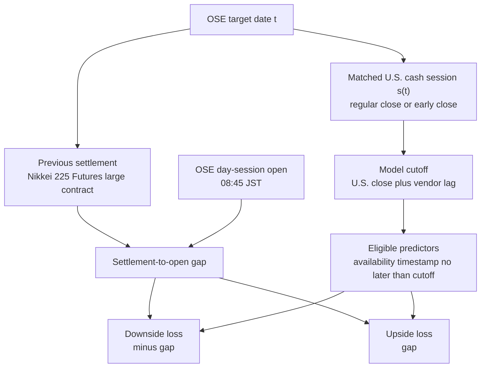
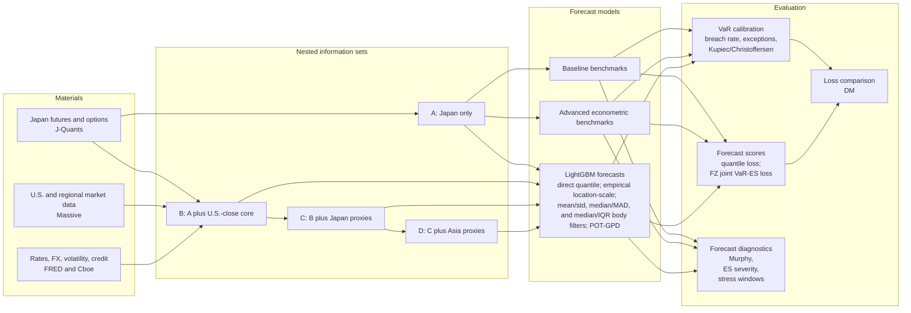

---
hide:
  - navigation
---

# Paper Plan

## Working Title

**U.S. Close Information and Pre-Open Tail Risk in OSE Nikkei 225 Futures**

This page is the paper-facing manuscript blueprint. It follows the order of a
finance paper: introduction, literature and gap, contribution, materials and
methods, registered experiments, expected results/discussion, claim boundaries,
and appendix/source notes.

## P0 Revision Decisions — 2026-09-09

The author accepted Q1--Q13 below as the P0 implementation basis and subsequently
accepted Q14, revised Q15, revised Q16, Q19--Q25, Q26a, and Q27--Q35. Q17 is declined. Q18's
e-backtesting scope and primary betting method are settled by Q19--Q20; the
monitoring protocol is settled by Q23, Q26a and Q28--Q30, with implementation
verification still pending. Q21 excludes XGBoost; Q22 fixes common LightGBM
hyperparameters, with its sensitivity component deferred this round by Q26b.
Q23 adopts a 500-observation betting history; Q26a adds W=250 sensitivity on
all available candidates. The author wants broad coverage
of objectives that genuinely fit the central/spread/tail architecture. Q24
accepts the objective families; Q25 requires matched three-tail controls for
each admitted body recipe. Q27 accepts nine body recipes; Q28 accepts
Taylor-approximate GREM; Q29 accepts native-date cumulative monitoring; Q30
accepts a common per-sequence reference level 20 for both betting windows.
Q31 originally settled percentage-unit training; it is withdrawn by Q38 below.
Q32--Q34 settle Gamma zero-label treatment, the fixed Tweedie power/Poisson
safeguard, and RMS scale flooring. Q35 settles the fixed Huber/Fair constants.
No unresolved author choice has been identified that prevents starting P0.
The author subsequently authorized the initial P0 step
with "开始"; its fixes and frozen-forecast replay are now complete. The local
run report is `.cache/reports/p0_reevaluation_20260909.md` (untracked).
This does not authorize the wider training experiment.
The current phase is broad experiment exploration, not manuscript revision.
Q14 onward is not yet backed by a completed new-model OOS experiment.

Implementation checkpoint: the nine-body assembler, monthly expanding dispatcher,
and explicit 28-model evaluation roster are now implemented. Legacy eight-model
replays retain their default roster. The two executed one-date pilots (A/left
and D/right, 2026-05-01) establish bounded numerical/runtime evidence only;
the full rolling experiment, new external-reference selection and GREM results
remain pending. Local receipts are in `.cache/reports/p1_integration_20260909.md`
and `.cache/reports/body_pilot_D_right_20260501_20260909.md`.

**2026-09-10 checkpoint (supersedes the pending-execution wording above):**
the 28-spec rolling run, fresh 12-model/both-tail external suite and new
`reevaluate` (including all-candidate W=500/250 GREM) have completed. Source run:
`artifacts/body28_20260909`; evaluation:
`artifacts/reevaluation_body28_20260909_20260909T163658597621Z`.
No ML specification passes all eight native-gate scenarios; post-gate ML
comparisons are explicitly unavailable, not silently replaced by pre-screen
winners. Four external models pass both tails, and fresh common-date FZ0 selection
chooses GJR-GARCH-EVT for each tail. The full 496 GREM summaries and native-date
curves are retained independently of selection. This is same-inspected-OOS
exploration, not a fresh holdout or evidence of uniform EVT/UniBM superiority.
No manuscript changes were made. Detailed results, checks and next diagnostic
questions: `.cache/reports/evaluation_20260910.md`; machine-readable review tables
are in the evaluation directory's `review/` subdirectory. The original accepted
decision records below retain their historical implementation-status wording.

**2026-09-10 Q38 checkpoint: Q31 withdrawn; decimal training restored.**
The author accepts the minimal implementation and test scope: use L, not 100L,
as the base loss in all nine bodies and direct quantile, including historical
OOF and final fits. Retain each spread recipe's existing residual transform
and decimal VaR/ES reconstruction. New forecast/diagnostic/manifests record
`training_multiplier=1`; frozen replay records the source run's multiplier,
leaving absent historical metadata unknown. Historical
`artifacts/body28_20260909` remains a percentage-training run with multiplier
100; neither its forecasts nor the completed evaluation above is overwritten
or relabelled as decimal-training evidence.

Only training units and their provenance change. Training history, missing-value
handling, seeds, common LightGBM hyperparameters, Huber alpha=0.9, Fair fair_c=1.0,
EVT methods, gates and GREM remain unchanged. The numerical constants in Q35
are retained, but their former percentage-unit/90--100 bp interpretation does
not apply to the restored decimal training. Any later adjustment is a separate
author decision, not part of this withdrawal.

Q39's proposed L-versus-100L diagnostic experiment is declined: the author has
decided to restore decimal training without an empirical unit comparison.
This change does not authorize retraining, HPO or manuscript revision, and no
post-withdrawal OOS performance or gate result is available yet. Verification
uses the existing body-fitting, forecast and artifact/replay interfaces, not
statistical gate success as a software-test condition.

**Q1 accepted, with the author's Q10 sample clarification; implemented for the
frozen replay.** Fix common-date samples by comparison question, not
for the primary model-specific coverage gates:

- Model comparisons hold the tail side and information set fixed and use common
  dates within a specified candidate group.
- Information-increment comparisons hold the model and tail side fixed and use
  common dates across the information sets being compared.
- Apply primary coverage gates to each model/scenario's full native valid VaR
  OOS sample. Retain forecast availability relative to scheduled target dates
  and failure reasons. Common dates improve score comparability but do not
  remove missingness selection or establish calibration on unobserved dates.

**Q2 accepted; fixed-reference component superseded by Q7 below.** The initial
main model-comparison design contains the eight existing LightGBM
specifications and an external reference, grouped by tail and information set.
The original proposal fixed that reference to GJR-GARCH-EVT; Q7 instead makes
its identity a result of external-model screening and ranking. External models
remain target-history-only benchmarks, not users of the LightGBM information
sets. Information-increment groups retain all four
A--D sets. Full baseline and advanced benchmark comparisons use separate
groups. Missing required members or insufficient common dates are reported
explicitly rather than silently shrinking the specified group. An unavailable
comparison does not prevent other models' native-sample coverage evaluation;
model-specific results and availability remain visible.

**Q3 accepted, with the author's sequencing clarification.** Retain the FZ0
formula in P0. VaR coverage and quantile loss require valid VaR forecasts and
realized losses independently of ES availability. FZ0 additionally requires a
coherent finite VaR--ES pair with positive ES, and score-domain exclusions are
reported without clipping ES. The downstream FZ0 contender group must be
derived from the corrected coverage-gate results, which may change membership;
the old two-EVT, Set-C comparison is not a fixed group for the new evaluation.
FZ0 comparison may be deferred until those gate results are available. Q5--Q13
below specify the post-gate date and reference policies.

**Q4 accepted.** P0 delivers implementation fixes, regression tests, a bounded
end-to-end check, and re-evaluation of the existing frozen predictions with
their original provenance retained. This re-evaluation is not a new forecast
run from the revised code. Full retraining and updates to manuscript headline
results remain downstream. The original deferral of all UniBM work is modified
by Q15 below: updating the integration is accepted, without a standalone
migration-parity experiment. Frozen-forecast re-evaluation and forecasts from
the updated estimator remain distinct deliverables.

**Q5 author modification accepted; wording corrected by Q10.** After coverage
screening determines the FZ0 contender group, use its maximal score-feasible
common-date sample within the existing OOS window. This may exceed the common
intersection of the initial, larger candidate roster, but remains a subset of
every retained member's native VaR gate sample. The earlier description of an
expansion beyond an "initial gate sample" incorrectly conflated the two
samples. This retains Q1's common-date comparison principle, not a comparison
of unpaired model-specific means.

**Q6 accepted.** Retain A--D in the post-gate FZ0 analysis instead of selecting
a best information set first. Compare models within each information set and
compare information increments on cross-set common dates. Unadjusted DM
evidence remains exploratory after model screening.

**Q7 author modification accepted.** Select the best-performing external model
among those passing the required coverage gates, and replace the reference
when that selection changes. GJR-GARCH-EVT is not an unconditional reference.
Q8 settles the external candidate pool, Q9 the ranking statistic, Q11 the
tail-specific reference policy, Q12 the selection-date policy, and Q13 the
both-tail gate requirement.

**Q8 accepted.** Include all twelve existing external models in the candidate
pool: the six baseline and six advanced benchmark specifications. Pool
membership is not evidence of eligibility or a coverage pass. Make eligibility
explicit before selecting the reference; do not silently drop unavailable or
ineligible candidates from the candidate ledger.

**Q9 accepted.** Use FZ0 as the primary joint VaR--ES ranking score, including
for external-reference selection, and retain quantile loss as supporting VaR
evidence. Report disagreements between the scores rather than switch the
primary criterion after observing results. Q11 selects references separately
by tail, so no cross-tail aggregation or weighting rule is needed.

**Q10 author clarification accepted.** Each model, tail, and information set
uses its own maximal valid OOS VaR sample for the primary coverage gates;
another candidate's missing forecasts and ES score-domain restrictions do not
remove its valid VaR dates. Common-date samples are used for subsequent
comparisons. The assistant's proposed additional common-date admission gate
is withdrawn, not adopted. Common-date coverage sensitivity can be reported
as a diagnostic without redefining primary eligibility after inspecting it.

**Q11 author modification accepted.** Select the best external reference
separately for the left and right tails by mean FZ0 on the applicable shared
selection dates. The two references may be different models; do not combine
the tail scores to select one overall winner. Q13 requires both-tail gate
passes before either tail-specific ranking.

**Q12 accepted, with the author's maximal-history emphasis.** Use all valid
native OOS dates for each model/scenario's coverage evaluation. Select each
external reference independently of LightGBM forecast availability, using
the maximal shared FZ0-eligible OOS dates among the eligible external
contenders for that tail: selecting the best external model is itself a
model comparison. Subsequent LightGBM comparisons use their own group-specific
shared dates without reselecting the reference for each information set or
comparison sample. Within P0, longer history means using the existing frozen
OOS forecast records fully; it does not change training windows or authorize
a new forecast run.

**Q13 accepted.** An external model must pass the coverage gates on both the
left and right tails before it can enter either tail's reference selection.
Then select the lowest mean FZ0 separately for each tail from this same
admissible model pool. Retain the existing scenario rules: at least 450 valid
OOS VaR forecasts, an exception rate within 2.5 percentage points of the
nominal 5%, and both Kupiec and Christoffersen independence p-values at least
0.05. A model passing only one tail cannot serve as that tail's reference.

These are author-approved revision decisions, not new empirical results or a
preregistration of the already inspected OOS sample. The initial P0 implementation
and frozen replay are complete; updated-method training remains pending.
Later sections retain the previous blueprint until
the corresponding revisions and evidence updates are completed. See
the local, untracked `CONTEXT.md` glossary for the sample terminology.

## Extension Grill — Accepted Decisions and Open Questions

Current stage: ARS experiment planning through the ask-matt grill-with-docs
flow. New model experiments have not been run. Q1--Q13 remain the accepted core;
Q14, the author's revised Q15, revised Q16, Q19--Q25, Q26a, and Q27--Q35 are accepted
additions. Q17 is declined; Q26b defers LightGBM sensitivity this round.
Explore experiment results before deciding manuscript changes;
do not treat this planning record as implemented methodology or new evidence.

Feasibility was checked against N225 `08c5f9b`, manuscript `b75d019`, the locked
`7f628ff4` forecast artifacts, and UniBM `ffb107c`. The supplied earlier audit is
historical evidence, not a fresh experiment result.

- Frozen forecasts contain the dates and VaR/ES/realized-loss values needed for
  additional forecast diagnostics. The existing Murphy implementation uses
  VaR and realized loss, not ES; it is not already a joint VaR--ES diagram.
- Complete OOF residual vectors and body models were not found in the frozen
  outputs. New estimator forecasts therefore require reconstructing their
  inputs; they cannot be obtained by relabelling old forecast records. The
  previously proposed old/new OLS parity study is withdrawn under Q15.
- Old standard MLE and UniBM forecasts share the same body on their matched
  valid dates. The empirical route has some different training endpoints;
  using all three old outputs is not automatically a controlled tail ablation.
- UniBM's public API supports controlled OLS/FGLS fits on a shared curve and
  plateau. Its CI is conditional on the observed selected plateau; adaptive
  bootstrap precision is not a guarantee of CI coverage or VaR/ES accuracy.

### Current Decision Frontier

**Q14 accepted: evaluation-only diagnostic package.** Add joint VaR--ES
calibration diagnostics and joint Murphy-style score sensitivity using the
frozen forecasts after the P0 validity/time-axis fixes. Keep FZ0 primary and
these additions diagnostic, not new admission gates. Joint calibration errors
must not be attributed to ES alone when VaR can also be misspecified. Existing
availability and common-sample coverage reports remain mandatory.

**Q15 author revision accepted: update to current public UniBM, not a parity
study.** Replace the copied estimator integration with the current public
implementation. On 2026-09-09, local UniBM and remote default-branch HEAD both
resolved to `ffb107cfb48a437ccff01fd886d2705e49df22af`; the checkout was clean.
The implementation recommendation is the documented strict FGLS route, with
the regression choice explicit rather than assumed to be an API default.
Retain ordinary bounded integration and failure-path checks: residual positions,
block eligibility, actual regression used, bootstrap precision metadata, GPD
support and finite-ES handling. Do not silently fall back to OLS or MLE. The
proposed 24-case legacy/public OLS/FGLS parity experiment is withdrawn; legacy
OLS is not retained as a new experimental arm solely for migration validation.
Old frozen runs keep their original OLS provenance. Updated-method performance
requires new forecasts, not re-evaluation of old predictions under a new label.

**Q16 revised recommendation accepted: no added ridge arm; retain controlled
tail comparisons.** LightGBM financial-tail applications already exist:
[Blom, de Lange and Risstad (2023)](https://www.mdpi.com/1911-8074/16/7/312)
study EURUSD VaR using implied-volatility information, while
[Ma and Zhang (2026)](https://doi.org/10.1002/for.70154) include LightGBM in an
expectile-risk ensemble. These motivate a model choice; neither establishes
nonlinear location/scale gains for this N225 target. The 2023 paper also reports
different relative performance at lower and upper quantiles. Omit a new ridge
arm and position this as an empirical
evaluation of the information/filter/tail architecture, without claiming to
identify the independent contribution of nonlinearity.
The controlled comparison among existing empirical, POT-MLE and updated-UniBM
tail routes is accepted: it must reuse each body's fitted
forecasts and residuals, rather than pool incompatible old runs. The twelve-model
external-reference roster is unchanged. The author's earlier acceptance of
LightGBM and XGBoost in principle is superseded by Q21's LightGBM-only scope;
XGBoost was never a thirteenth external-reference candidate.

**Q17 declined by the author.** Do not add a known-truth Normal/Student-t or
dependence simulation study. The paper remains focused on real-data forecasting;
use existing methodological literature for estimator properties, retaining its
assumptions and applicability limits. Those citations do not independently
establish finite-sample calibration on N225. Ordinary implementation checks
remain part of Q15; they are not the declined simulation research programme.

**Q18 wanted; scope and protocol settled by the later accepted decisions.** The author wants to
add e-backtesting and asks about computational cost. It can post-process existing
VaR/ES/loss forecasts without model retraining, residual reconstruction or new
data. The original paper appeared online on 2025-09-23 and in the June 2026 issue
of [Management Science](https://pubsonline.informs.org/doi/10.1287/mnsc.2023.01659);
its first preprint dates to 2022. Recent publication is not evidence of a first
financial application or of a novel contribution by this paper.

The accepted role is a sequential diagnostic alongside Q14, not an
additional coverage gate or replacement for FZ0. Q19 includes all available
candidates, including candidates failing the coverage screen, subject to the
diagnostic's own input requirements. Q20 makes the original paper's GREM mixture
the primary betting method, not a betting-strategy competition. Q23 fixes its
primary betting-history length at 500 observations; Q26a adds W=250 sensitivity.
Q28 accepts the documented Taylor approximation, which must not be labelled
an exact growth-optimal solver. Q29 accepts initialization and native-date
monitoring, including the predictable-missingness principle. Exact input-mask
implementation still needs verification; Q30 accepts the per-sequence
threshold/reporting convention without simultaneous-testing claims. For the basic ES
construction, conditional VaR correctness is part of the null, so an alarm is
not automatically attributable to ES alone. Non-rejection neither establishes
calibration nor ranks sharpness. Retrospective e-backtesting does not repair
earlier model selection or make an inspected OOS sample a fresh holdout.

Cost-only feasibility check on 2026-09-09, not a substantive e-backtest:

- Read 58,261 benchmark/ML forecast records from locked run `7f628ff4`;
  the legacy successful/valid flags retained 47,450 rows in 88 sequences.
  Requiring finite q/e/loss/level, a level in (0,1), and ES greater than VaR
  removed no additional rows. This legacy mask is not the formal P0/e-test mask.
- Group by suite, target family, model, information set, tail, level and refit
  frequency, then sort by forecast date. Python 3.12.13, Polars 1.40.1 and
  NumPy 2.4.4; Polars/OpenBLAS/OMP single-threaded; no bytecode or output writes.
- Taylor-approximate GREM used W=500 past valid observations, gamma=0.5,
  available history when shorter, and zero betting for empty history or zero
  denominator. GREE used past e-statistics; GREL used past losses with current
  forecasts; both used only earlier rows. The two log-processes were mixed
  equally. These are timing settings, not an adopted monitoring protocol.
- Across three repeats, read/decode/concatenate times were 44.04/2.41/2.42 ms;
  filtering, grouping, sorting and calculation took 233.91/216.40/217.92 ms.
  Later reads were cached; the first is not guaranteed cold-cache. Each pass
  evaluated 12,788,284 historical-loss inputs for GREL.
- Peak process RSS was 121.1 MiB on macOS, including the interpreter and
  dependencies; this is not incremental live memory. Timing excludes imports,
  plotting, report output and training. No alarms, terminal e-values or model
  rankings were reported. This does not time exact growth-optimal optimization
  or verify the null, missingness policy, calibration or statistical power.

**Q19 accepted: broad diagnostic coverage.** Apply e-backtesting to all
available candidates rather than only the post-gate FZ0 contenders. Preserve
input availability and the distinction between a model failing coverage and a
diagnostic being unavailable. The author explicitly defers manuscript changes
until the wider experiment results have been inspected. The author subsequently
reaffirmed that GREM primary diagnostics are not limited to gate-passing models.

**Q20 accepted: GREM as the primary betting method.** Do not add a contest among
GREE, GREL and GREM. Q23 subsequently fixes the primary historical window at
500. Q28 subsequently accepts Taylor-approximate optimization, and Q29 accepts
monitoring dates, warmup and the predictable-missingness principle. Input-mask
implementation remains to be checked; Q30 accepts the threshold/reporting
convention and explicitly excludes a joint 5% or post-selection guarantee.

### Learner and Tuning Design — Accepted Scope, Not Implemented

Read-only source inspection on 2026-09-09 found fixed LightGBM settings, five
expanding OOF blocks and monthly refits, but no inner temporal hyperparameter
search or early stopping. Existing local parameter sensitivity checks use
already inspected OOS results and are explicitly non-primary; they are not an
inner tuning procedure. XGBoost is absent from the current dependency and model
registries. Frozen ML runtime fields are null, so there is no measured full-run
training cost on which to base an hours estimate.

- The current eight LightGBM specifications comprise one direct-quantile route,
  three mean/scale routes (empirical, POT-MLE, UniBM), and two each of median/MAD
  and median/IQR (POT-MLE, UniBM). This is not a full body-by-tail factorial.
- Q21 accepted after the author's scope challenge: do not add XGBoost
  in this round. Retain the eight LightGBM specifications (64 A--D-by-side
  scenario series), with the mean/scale empirical/POT-MLE/updated-UniBM trio as
  the controlled main comparison and the other existing specifications visible.
  XGBoost would test dependence on the body learner; it is not required to test
  the tail-estimator contrast conditional on LightGBM. Defer it unless that
  cross-learner generalization question becomes necessary. The eight existing
  specifications are a starting roster, not a cap: the author requests broader
  consideration of compatible central/spread objectives. This supersedes the
  assistant's unaccepted proposal to add 24 XGBoost series; it is not a claim
  that XGBoost has no possible predictive value.
- Q22 accepted, subsequently narrowed by Q26b: fixed common LightGBM
  capacity/regularization settings for the primary controlled experiment, with
  no formal hyperparameter search and no LightGBM parameter sensitivity this
  round. The earlier lightweight-sensitivity proposal is deferred, not executed;
  preserve the existing mechanism and artifacts without treating old Set-C
  results as robustness evidence for new specifications. Do not select a
  replacement primary setting from final
  OOS gate/FZ0 results. This supersedes the assistant's unaccepted symmetric
  two-learner tuning proposal. Fixed settings do not establish an optimally tuned
  learner, and equal numeric settings do not guarantee equal effective capacity
  across objectives.
- The current common values are 160 trees, learning rate 0.025, 20 leaves,
  minimum child samples 25, depth -1, row/feature fractions 0.85, row-sampling
  frequency 1, and L1/L2 regularization 0.1/0.5. They are not LightGBM 4.6.0
  wrapper defaults. Both constructor paths explicitly enable row sampling;
  there is no missing-frequency defect. No inspected repo source attributes
  this exact vector to a paper. Do not retrofit a literature provenance claim.
  Objective and quantile alpha remain task-specific, as do the targets, number
  of regressors, scale transformations and tail estimators. Fixed hyperparameters
  do not mean fixed fitted trees; the monthly expanding refits remain.
- Literature can motivate LightGBM and plausible parameter choices, not certify
  that borrowed settings are optimal for N225. The accessible author preprint
  of [Blom et al. (2023), Section 4.7](https://www.preprints.org/manuscript/202305.0594)
  describes tuning by software and trial-and-error, not a universal fixed
  financial-tail configuration. The [official tuning guide](https://lightgbm.readthedocs.io/en/stable/Parameters-Tuning.html)
  explicitly makes leaf size and the learning-rate/iteration choice depend on
  sample size, data and objective. Existing exact settings remain a provisional
  controlled baseline, not a newly literature-selected configuration.
- At any temporal validation origin, fit feature filters, choose hyperparameters
  and any early-stopping iteration, and construct residual/scale/tail estimates
  using the applicable preceding training data. Tuning on an outer training
  sample and retrospectively reusing that choice in earlier OOF blocks avoids
  outer-test leakage but introduces fold-level selection optimism. Either tune
  within each historical prefix or apply an earlier choice only prospectively.
  Pooled OOF smearing/tail fits cannot score their own contributing dates as if
  they were complete inner-OOS VaR--ES forecasts.
- Hold body fits, residuals and tuning choices fixed across the empirical,
  POT-MLE and updated-UniBM comparison. Existing separate jobs repeat body fits;
  equivalent seeds alone do not establish shared inputs when refit failures
  change training endpoints. Reuse existing machinery rather than introduce a
  separate caching framework. Direct quantile has a different ES companion and
  must not be described as sharing this OOF-tail pipeline.
- If formal tuning is later adopted, its search budget, retuning frequency and
  A--D adaptation policy remain downstream choices. Under revised Q22, hold
  common hyperparameters fixed across A--D and refit dates. Any tail-effect claim
  remains conditional on the chosen body: the current MAD/IQR pairs compare
  POT-MLE with UniBM, but lack empirical-tail controls. Adding those two controls
  would answer a broader EVT-versus-empirical question across bodies and is now
  accepted under Q25. No full experiment or tuning dependency is authorized.
- Q23 accepted, with an explicit lightweight constraint: retain a rolling-500
  betting-history convention as primary. Q26a accepts rolling-250 sensitivity
  on the same all-available-candidate pool and defers all-past sensitivity.
  Shorter initial history, zero betting with no history, and no cumulative
  process resets are now accepted under Q29, not inferred merely from the
  earlier acceptance of window lengths.
  Do not select the window producing
  the most favorable alarms. Observation eligibility and predictable missingness
  implementation still require verification before substantive interpretation.

Q23 source clarification: [Wang, Wang and Ziegel, Sections 5.1 and 8.1 and
Appendix E](https://arxiv.org/html/2209.00991v6) explicitly discuss rolling
250/500 betting histories. Their NASDAQ application uses rolling 500 for both
forecast estimation and betting, but accumulates the e-process over 5,536 days.
Section 7.1 instead uses 500 for forecast estimation, all-past betting history
and a 500-day monitoring horizon. These are three distinct quantities. The
rolling rationale is relevance to current market conditions and avoiding
persistently low bets after an earlier conservative period; Appendix E.2 also
notes the estimation-precision cost of discarding history under stationarity.
No special optimality or power guarantee for 500, or systematic betting-window
robustness comparison, was found. Theorem 2's validity depends on the conditional
null and predictable admissible betting, not on a 500-observation threshold;
Theorem 3's asymptotic result must not be transferred to fixed rolling-500
without its assumptions. These passages were also checked in the author's
[4 May 2026 public manuscript](https://www.math.uwaterloo.ca/~wang/papers/2025Wang-Wang-Ziegel-MS.pdf),
not the inaccessible publisher-typeset full text. The N225 forecast-training
history and accepted native-sample coverage policy remain unchanged by Q23.

### Objective Breadth and Sensitivity — Q24--Q26 Settled; Not Implemented

The author accepts LightGBM-only development but requests broad consideration
of objectives that fit body central/spread learning and downstream tail
estimation. This is not authorization to run an unrestricted Cartesian product
or to replace the accepted scoring/gate policies. Current production paths use
only L2, L1 and quantile; merely being accepted by the LightGBM API does not make
another objective an implemented forecasting specification.

**Q24 accepted:** consider the eight relevant native regression objectives L2, L1,
quantile, Huber, Fair, Poisson, Gamma and Tweedie, organized by statistical role.
Keep MAPE outside the primary pool because its implemented label-weighted
absolute loss adds no clear new role here and becomes MAE when all absolute
labels are at most one. Do not add custom expectile or joint VaR--ES/FZ training
by default; neither is a native objective. Candidate family acceptance is not
acceptance of every possible center/spread pairing. Exact recipes follow.

- Central: retain mean (L2) and median (L1/quantile 0.5), and consider Huber and
  Fair M-location. L1 and median quantile share a population target, not
  necessarily identical finite tree fits; do not count them as two distinct
  central estimands without a specific numerical question.
- Spread: retain L2 on floored log absolute OOF residuals with smearing,
  L1 absolute-residual MAD, and quantile-based IQR. Consider squared-OOF-residual
  targets fitted by L2 or a positive-link Poisson/Gamma/Tweedie objective and
  transformed by a square root. These require new target/transform/metadata
  paths, not a replacement objective string in the existing log-abs path.
- For the same nonnegative proxy, Poisson/Gamma/Tweedie are different
  mean-oriented scores under suitable moment/domain conditions, not three
  automatically different spread estimands. With proxy (L-c(X))^2, the target
  is a residual second moment; it equals conditional variance only if the
  center equals the conditional mean. Neither MAD/IQR nor a robust-center
  residual second moment should automatically be labelled conditional SD.
- Tail calibration remains empirical, POT-MLE and current public UniBM. These
  are not LightGBM objectives. Gamma spread regression does not assume that the
  standardized tail is Gamma, nor replace its EVT estimator.

Version refresh on 2026-09-09: the current worktree's uncommitted `uv.lock`
locks LightGBM 4.7.0, and a read-only import from the README-designated external
environment confirms LightGBM 4.7.0 / Python 3.13.15. `pyproject.toml` declares
LightGBM >=4.5.0 and Python >=3.13.15,<3.15. No dependency was changed or synced
during this check. The earlier pilot keeps its original recorded environment;
it is not a benchmark of the current environment. Objective, metric and
leaf-output semantics below were initially checked at 4.6.0 and now rechecked
against the official 4.7.0 sources.

- Huber alpha is a fixed residual-unit clipping threshold, not a residual
  quantile; Fair's positive fair_c is also in residual units. Defaults 0.9/1.0
  need not give meaningful robustness on decimal log returns. Q31 now fixes
  percentage-unit training in every historical OOF and final fit; no fitted
  per-window normalization is adopted. Q35 fixes Huber/Fair constants at
  0.9/1.0; they must not be selected from final OOS gate or score results.
- Poisson accepts nonnegative continuous targets (not only integers) with a
  positive aggregate and can be used as a quasi objective, without a Poisson
  distributional claim. Gamma's objective inherits those label checks, but
  native Gamma likelihood/deviance metrics require strictly positive labels;
  zero residual targets therefore require an explicit interpretation/metric
  policy, not silent epsilon addition. Tweedie supports zeros; a native metric
  denominator problem at power 1 means the Poisson endpoint should use its own
  objective, not that endpoint of the Tweedie metric. Interior power choice is
  another objective-specific policy, not a public-capacity tuning sweep.
- Positive-link forecasts and unconstrained L2-on-squared-residual forecasts
  have different positivity properties. Existing MAD/IQR code floors finite
  scales, including negative MAD predictions, and does not retain daily raw-scale
  or floor-hit fields. That existing mapping is not permission to silently
  repair new routes; positivity/floor definitions and their diagnostics must
  be explicit, without removing existing safeguards in this planning phase.

Sources: [LightGBM 4.7.0 objectives](https://lightgbm.readthedocs.io/en/v4.7.0/Parameters.html#objective),
[native objective implementation](https://github.com/microsoft/LightGBM/blob/v4.7.0/src/objective/regression_objective.hpp),
[native metrics](https://github.com/microsoft/LightGBM/blob/v4.7.0/src/metric/regression_metric.hpp),
and [Gneiting (2011)](https://doi.org/10.1198/jasa.2011.r10138) on matching a
score to its statistical target. These support definitions and constraints,
not empirical performance or the optimality of a proposed recipe.

**Q25 accepted:** every body recipe admitted to the formal comparison receives
empirical, POT-MLE and current-UniBM tail variants sharing its actual body fits
and residuals. This includes filling the two existing MAD/IQR empirical-control
gaps. Do not count direct quantile as a fourth residual-tail method; retain it
as a separate existing benchmark. Exact model count depends on subsequent
body-recipe choices.

**Q26a accepted:** compute W=250 GREM sensitivity on the same all-input-eligible
candidate pool as primary W=500, including coverage failures; defer all-past
sensitivity and do not add a betting-method contest. The previous suggestion
to restrict W=250 to selected models to save computation is withdrawn.
Detailed presentation may still concentrate on the
post-gate FZ0-selected models and tail-specific external references. Define that
focused group before inspecting GREM results and retain all diagnostic records.
GREM tests sequential risk-forecast nulls, not relative FZ0 performance, and low e-values
or no alarm do not establish superiority. Same-OOS model selection remains
exploratory and does not supply a post-selection or simultaneous-testing
guarantee. Do not reselect primary models or windows from these checks, or fix
the focused group to old Set-C winners. The recorded W=500 Taylor-approximation
pilot supports lightweight post-processing only at its tested scale; it does
not time W=250, exact optimization, a larger roster, reports or training.

**Q26b deferred this round:** do not run LightGBM parameter sensitivity.
The proposed near_low 128/16/30 perturbation and its 24 scenario series are
removed from this round's execution scope. Retain the primary common settings
and the existing sensitivity code/artifacts; do not delete them. This does not
cancel the accepted investigation of different central/spread objectives.

### Body and Monitoring Design — Q27--Q30 Accepted, Not Implemented

**Q27 accepted: nine body recipes, not a Cartesian product.** Retain the three
existing bodies (mean/log-abs, median/MAD, median/IQR); add Huber/log-abs and
Fair/log-abs; add four mean/squared-OOF-residual bodies using L2, Poisson, Gamma
or Tweedie for the spread learner, followed by a square root rather than the
log-abs route's exponentiation/smearing. For Huber/Fair, log-abs residuals must
come from that body's own historical OOF center predictions. For the four
squared-residual routes, share the same mean OOF residual target so the spread
objective is the controlled change. This covers the Q24 families without
crossing every center with every spread learner.

Under accepted Q25, nine bodies times three tails plus the separate existing
direct-quantile benchmark gives 28 ML specifications, or 224 A--D-by-side
scenario series at the existing 0.95 level, excluding external benchmarks.
These are accepted planned-roster counts, not implemented models, fit counts or cost
estimates. Currently eight specifications exist; filling the two accepted
empirical-control gaps alone would yield ten. Q31--Q34 now settle training units,
Gamma/zero-label handling, Tweedie power, positivity and floor policies.
Q35 explicitly accepts the Huber/Fair constants, closing this body-specification
design branch; none of these decisions is implemented evidence.

**Q28 accepted: documented Taylor-approximate GREM.** Use the paper's Taylor
betting rule with gamma=0.5 and the equal mixture of the two capital processes,
not the average of their logarithms or a simple average of daily bets. Do not
add exact-optimizer sensitivity. Label the approximation explicitly; it does
not claim exact growth optimality. Conditional-null validity requires
predictable admissible bets, not exact numerical maximization. Verify these
properties with bounded deterministic checks before substantive diagnostics.

**Q29 accepted: native-date cumulative monitoring.** Start each candidate's
diagnostic on its own eligible OOS timeline with capital one; use only earlier
eligible observations to learn bets, shorter history initially, and zero betting
with no history. W=250 and W=500 share the same monitoring dates; the window
limits bet-learning history, not cumulative evidence. Do not reset after a
refit or alarm, or discard dates just to match another candidate. Retain the
scheduled-date availability ledger. A no-bet decision for an unavailable
forecast must be known at the forecast cutoff, not selected after observing
that day's loss. Missing realized losses or unverified availability timing
require an explicit unavailable diagnostic segment, not hindsight deletion
presented as a valid uninterrupted e-process. Exact input-mask handling remains
to be audited during implementation.

**Q30 accepted: per-sequence diagnostic evidence, not a new gate.** Report
curves, running maxima and first crossings of a reference level 20. Under the
stated null/predictability conditions, 20 corresponds to the single-sequence
anytime 5% bound; it is neither familywise 5% across all candidates/windows nor
a post-selection guarantee. Do not add a multiple-testing procedure this round
or describe a cross-model winner as formally validated by these diagnostics.
Retain GREM outside coverage gates and FZ0 model/reference selection.

Q30 source clarification, accepted after discussion: the author asked whether
20 is used in the original paper and whether it is tied to W=500. Section 7.2 explicitly
uses 20 to match a 5% significance level; its 250-day monitoring horizon there
is not our W=250 betting-history sensitivity. Section 8.1 instead displays
thresholds 2, 5 and 10 for its NASDAQ example with W=500 betting history.
Theorem 2 gives P(sup_t M_t >= 1/alpha_test) <= alpha_test under the stated null
and predictability conditions, with initial capital one. Thus 20 comes from
alpha_test=0.05, not from the betting window or monitoring horizon. It is also
distinct from the forecast's 5% tail probability. The author accepts a
common reference level 20 for both W=500 and W=250, without a joint 5% guarantee
across windows or candidates.

Q28--Q30 are informed by [Wang, Wang and Ziegel, Sections 4--5, 7.2, 8.1 and Appendix A](https://arxiv.org/html/2209.00991v6).
Q27--Q35 are author-accepted designs, not implemented evidence. The numerical
conventions and body-specification choices are settled for this round.

### Numerical Conventions — Q31--Q34 Accepted, Not Implemented

Current code fits centers/direct quantiles in decimal log-return units without
target normalization. It passes reg_alpha=0.1 and reg_lambda=0.5, aliases for
lambda_l1/lambda_l2; objective alpha is a separate parameter. The wrapper's
min_split_gain default is 0.0. Huber/Fair and squared-residual routes are not
implemented. Fixed numeric hyperparameters do not remove response-scale
effects: native L2 gradients are score minus label, and L1 leaf regularization
thresholds the sum of gradients. No new empirical diagnosis of underfitting is
claimed here. See [native leaf-output calculation](https://github.com/microsoft/LightGBM/blob/v4.7.0/src/treelearner/feature_histogram.hpp).

**Historical Q31: percentage-unit training, superseded by Q38 above.**
Use L*=100L in every newly generated ML specification, including existing
body recipes and direct quantile; keep the stored target and reported forecasts
in decimal log-return units. Apply the same convention inside every historical
OOF and final fit. Absolute residuals and scales multiply by 100, squared
residuals by 10000; log-abs epsilon and scale floors must represent the same
physical magnitudes after conversion. Convert outputs back before stored
VaR/ES/loss comparisons, and never treat the display conversion as a new target.
This is a fixed unit convention, not fitted per-window normalization or HPO.
It can change finite regularized tree fits, so old raw-unit forecasts are not
parity controls for these new runs. External benchmarks and frozen P0 replay
are unchanged. Q35 fixes Huber/Fair constants in these training units;
equal units do not equalize curvature
or effective regularization across objectives.

**Q32 accepted: Gamma as native quasi-mean regression, with zeros retained.**
Use the shared nonnegative squared-residual labels without adding epsilon or
dropping zeros. The native Gamma objective accepts nonnegative labels with a
positive aggregate, whereas its Gamma likelihood/deviance metrics require
strictly positive labels; explicitly use L2 for any fit logging instead. This
does not replace FZ0 evaluation. Interpret the Gamma objective as the quasi
loss log(v)+y/v for v>0, not as evidence that residual squares are Gamma
distributed. For m=E[Y|X]>0, its conditional expected derivative is (v-m)/v^2,
so its population minimizer is m. Zero labels have zero Gamma Hessian, so
numerical and fit failures remain reportable; no successful fit is guaranteed.
An all-zero training prefix is unavailable for the positive-link objective
rather than silently perturbed into positive data. A deterministic native-API
domain check is required at implementation, not a simulation study.

The author asks whether this is a new LightGBM. It is a new spread specification
relative to the currently implemented repo roster, using LightGBM's existing
native Gamma objective and log link; it is not a new boosting algorithm or a
custom objective. The label is the shared mean-center OOF residual square,
and the predicted residual second moment is square-rooted into a scale before
the accepted empirical/POT-MLE/UniBM tail step. No Gamma law is imposed on the
standardized tail. Changing the logged metric to L2 does not change the Gamma
training objective. This is already one of Q27's nine bodies, not an additional
body. Whether the application/combination is novel requires separate literature
evidence; native-objective use alone establishes no novelty claim.

**Q33 accepted: one fixed Tweedie interior power.** Set
tweedie_variance_power=1.5 and keep poisson_max_delta_step=0.7, the native
documented defaults; do not search powers or add objective-parameter
sensitivity this round. Poisson and Gamma already provide separate endpoint
families. These are transparent baseline choices, not evidence that 1.5 is
optimal or that the data follow a particular Tweedie variance law.

**Q34 accepted: explicit positive-scale projection for the four new RMS routes.**
After converting the predicted residual second moment v_hat back to decimal
return-squared units, define s_hat=sqrt(max(v_hat,(1e-4)^2)) for finite v_hat.
Reuse the existing robust routes' physical scale floor 1e-4 (one basis point),
with the same rule in OOF and final fits. Record raw v_hat, nonpositive values,
all floor hits and availability separately; this projection is part of the
model definition, not a claim that an unconstrained raw L2 prediction is a valid
variance. Nonfinite predictions remain unavailable, not floored. Preserve
existing MAD/IQR flooring and log-abs finite/positive checks (including the
same checks for new Huber/Fair log-abs bodies); do not silently impose a new
floor on the log-abs route or change ES to make FZ0 finite. Floor diagnostics
do not add another gate. The inherited floor is not claimed optimal.

### Huber/Fair Constants — Q35 Accepted, Not Implemented

**Historical Q35: native fixed Huber/Fair constants in percentage units.**
Q38 retains the numerical constants but supersedes the unit interpretation below.
Set Huber objective alpha=0.9 and Fair fair_c=1.0, the documented native defaults,
under Q31's L*=100L convention. Huber clips the center-loss gradient when the
absolute prediction residual exceeds 0.9 training units (0.009 decimal log
return, approximately 90 bp); alpha is not a 90th percentile or confidence
level. Fair uses a smooth attenuation scale of 1.0 training unit (0.01 decimal
log return, approximately 100 bp), not a hard clipping threshold. Apply the
same constants across A--D, both tails, historical OOF fits and final fits.
Do not learn thresholds from each window, perform HPO, or add sensitivity this
round. These are transparent baseline constants, not literature-validated N225
optima or a guarantee of equal effective robustness across regimes/objectives.
Keep log-abs/smearing and actual three-tail input sharing as accepted; the
robust center does not delete extreme observations from the residual-tail data.
See [official parameter defaults](https://lightgbm.readthedocs.io/en/v4.7.0/Parameters.html#alpha)
and [native Huber/Fair gradients](https://github.com/microsoft/LightGBM/blob/v4.7.0/src/objective/regression_objective.hpp).

### Grill Closure — Initial P0 Authorized and Completed

After Q35, no further author choice has been identified that blocks the initial
P0 implementation. Remaining availability, calendar, adjacency, score-domain
and numerical questions are facts to verify during implementation, not reasons
to reopen accepted sample or model-design decisions. If implementation reveals
a conflict requiring a changed scientific policy, bring that specific decision
back to the author rather than silently changing the policy.

The author authorized step 1 with "开始". It is complete. The subsequent
"继续。要 grill 吗？" starts step 2 implementation and bounded checks; step 3
still requires confirmation of the wider execution scope:

1. Implement the accepted P0 validity/time-axis/evaluation fixes with focused
   regression checks and a bounded end-to-end check. Re-evaluate the existing
   frozen forecasts on their original provenance, reporting native gates,
   availability, external references and comparison-specific FZ0 results. Do
   not relabel them as forecasts from the new body units or updated UniBM.
2. Integrate the accepted nine-body, matched-three-tail design and current
   public UniBM using existing machinery, then verify numerical/failure paths
   and measure a bounded training pilot before estimating full-run cost.
3. Run the wider experiment only after the execution scope is confirmed.
   Apply the accepted evaluation and input-eligible diagnostic policies; retain
   unavailable/failed candidates in the ledger. Manuscript revisions follow
   the resulting evidence, not this plan. No new holdout or unconditional
   superiority claim follows from replaying the inspected OOS period.

The 2026-09-09 P0 implementation changes evaluation code and tests and produces
a separate frozen-forecast re-evaluation. Original forecast artifacts and
manuscript text remain unchanged. At that P0 checkpoint no updated-model training
experiment had started. See the local, untracked report
`.cache/reports/p0_reevaluation_20260909.md` for the source
revision, recovered VaR rows, gates, selected references and comparison results.

Step 2 now has an initial nine-body fitting core and public strict-FGLS adapter,
not an end-to-end experiment result or a replacement of the default production
runner. Native API checks exposed a new boundary: passing structural OOF warm-up
NaNs into the public adaptive bootstrap fails, while the same complete residual
sequence succeeds. **Q36 accepted:** begin UniBM's observation
clock after the structurally undefined OOF warm-up prefix, retaining original
date/position mapping and all internal missing positions. Do not drop internal
missing values, shift signed residuals, replace the public bootstrap or fall
back to OLS/MLE. Internal-missing failures remain reported as unavailable.
The author also permits necessary data preprocessing; this does not authorize
changing the target, silently dropping internal missing values or choosing
transformations using OOS scores. The implemented adapter accepts an explicit
`warmup_rows` derived from the expanding-OOF schedule, checks that the omitted
prefix contains only undefined OOF values, and records the original offset and
retained length. It does not infer warm-up from the first successful prediction.
The local integration checkpoint is `.cache/reports/p1_integration_20260909.md`
(untracked).

The subsequent continuation wires a shared single-refit assembler and a separate
`body-pilot` command: 28 specs, one date/info set/exposure, existing feature gates
and leakage bindings, percentage-unit direct quantile, and partial VaR retention
without GPD ES substitution. Offline tests pass. After explicit execution
confirmation, the A/left 2026-05-01 pilot completed: 28 numerically eligible
VaR/ES records, nine actual public FGLS fits, 31.559 seconds and 2.247 GiB peak RSS.
The pilot retains signed-data warnings and five RMS-L2 OOF floor hits; these are
diagnostics, not new gates. Full rolling integration and wider-run scope remain
outstanding; no new forecast-performance claim is established. The local pilot
report is `reports/pilots/body_20260909_A_left_20260501/result.md` (untracked).

### Q37 Accepted — Target History Before Predictor Coverage

A read-only check of the frozen panel found a separate sample-policy issue:
the combined clean start, 2018-06-20, is set by the latest first-valid date
across source-family predictors (`massive_daily`, specifically `xlc_return`),
not by target availability. This uniformly truncates all information sets,
including A, which does not use XLC. There are 420 target-clean, finite-loss
dates from 2016-07-20 through 2018-06-19 excluded only by
`before_combined_clean_start`. The source-date lower bound also differs from
XLC's first available forecast date, 2018-06-21.

**Q37 accepted:** for the new training experiment,
remove the predictor-driven global lower bound while retaining the existing
target, mapping, roll/SQ and other quality exclusions. Use the existing
training-window feature gates to admit available predictors; do not backfill
unobserved history. Preserve the requested date range, model training rules,
feature-availability reports and comparison-specific common-date policy.
The author accepts the full tradeoff: more expanding history can change both
late-period fits and feature admission. XLC is no longer a required global
sample-start control; its pre-inception missingness is not backfilled and the
20% ordinary-feature missingness threshold is not relaxed to retain it.

Implemented for new panel builds: the lower bound is the maximum of the
requested start and J-Quants required-field coverage. The existing lower-bound
helper can restore only previously lower-bound-excluded rows, rechecking target
and timing eligibility and synchronizing both sample flags, reason and bound.
A real-panel in-memory check restored exactly 420 rows (1,722 to 2,142),
preserved all other fields and changed the existing panel signature. Refreshed
ML histories give an earliest scheduled OOS date of 2021-02-22 and 1,142 scheduled
dates for both tails/all sets under unchanged training rules. These are sample
and schedule checks, not fitted-forecast availability or performance.
The completed P0 frozen replay remains unchanged, and the earlier records are
not a new holdout. No additional scientific decision was identified at this
checkpoint. Subsequent work completed two bounded training pilots and the monthly
dispatcher/evaluation wiring; the full real-data rolling run remains pending.
The evidence and clean-observation versus evaluation-calendar distinction are
recorded in `.cache/reports/p1_integration_20260909.md` (local, untracked).

Accepted changes
will still be evaluated under the existing native-sample coverage and
comparison-specific common-date policies. Do not tune against final OOS gate
passes, select a flattering information set, or describe a replay of the
inspected historical OOS window as a new holdout.

Recommendation for the remaining supplied tasks: retain cache/version, validity,
session adjacency, calendar and evaluation-policy fixes in the accepted P0;
plan factual JPX/FRED-vintage and method disclosures with those fixes, and revise
numerical manuscript claims only after their evidence is updated. Direct-quantile
retuning, a residual-risk target, a DST-identification study, ALFRED reconstruction
and contemporaneous intraday OSE acquisition are not bundled by default.
New forecasts on an already inspected OOS period are not a fresh holdout.

Primary methodological reading: [Nolde and Ziegel](https://arxiv.org/abs/1608.05498)
for calibration versus comparative backtesting;
[Ziegel et al.](https://arxiv.org/abs/1705.04537) for joint score-family diagnostics;
[Wang, Wang and Ziegel](https://arxiv.org/html/2209.00991v6) for e-backtesting and
its forecast/predictability assumptions. These inform proposals, not automatic
method adoption or new empirical claims.

## 1. Introduction

### 1.1 Overview And Why This Work

- The paper asks whether information observed by the U.S. cash-market close helps forecast the tail risk of the next Osaka Exchange (OSE) Nikkei 225 Futures day-session open.
- The primary empirical object is the settlement-to-open gap of the Nikkei 225 Futures large contract:

  `gap_t = log(day_session_open_t) - log(previous_settlement_{t-1})`.

- The same gap is evaluated through two loss orientations:
    - `left_tail`: downside loss, `realized_loss_t = -gap_t`;
    - `right_tail`: upside loss, `realized_loss_t = gap_t`.
- In prose, left and right tail identify the corresponding sides of the original
  opening-gap return distribution; downside and upside describe their economic
  interpretation. Both losses are evaluated through the upper tail of their
  respective loss distributions.
- The registered primary tail level is 95% VaR, with a nominal 5% exception rate.
- The empirical question is predictive and out-of-sample. It is not a structural causal design.
- Why this setting is useful:
    - the target is economically concrete: a futures opening gap relative to a
      settlement reference;
    - the forecast origin is observable before the next OSE open;
    - the information experiment is naturally nested: Japan-only history,
      then U.S. close information, then Japan and Asia proxy blocks;
    - tail-risk claims can be disciplined by VaR coverage tests before reading
      average loss improvements.

### 1.2 Market Context

- OSE Nikkei 225 Futures trade in both day and night sessions.
- The U.S. cash close occurs before the next OSE day-session open, but the Japanese night session means that some U.S. information may already be reflected before the opening auction.
- The paper therefore studies pre-open tail risk, not a generic close-to-close or overnight-return problem.
- The forecast origin is the matched U.S. cash-market close plus the registered vendor-data availability lag.
- The point-in-time condition is:

  `feature_available_ts_utc <= model_cutoff_ts_utc < target_open_ts_utc`.

### 1.3 Literature Review And Existing Results

- **International information transmission**:
    - The empirical setting is cross-market and timing-sensitive: U.S. equity, rates, volatility, FX, credit, and proxy-ETF information is observed before the Japanese futures open.
    - The paper does not claim price discovery or structural spillover identification.
- **VaR and ES forecasting**:
    - The study evaluates one-day-ahead opening-gap VaR and ES in positive loss units.
    - VaR calibration is assessed through exception rates and coverage tests.
    - ES enters through valid VaR-ES forecast pairs and Fissler-Ziegel (FZ) joint scoring.
- **Dynamic quantile and tail models**:
    - Econometric comparators include historical quantiles, volatility-scaled quantiles, GARCH/GJR-GARCH, CAViaR, CARE/expectile models, and GAS models.
    - Paper-facing evaluation terminology uses Fissler-Ziegel loss for the joint VaR-ES score.
    - Machine-learning models use LightGBM as a flexible tabular forecaster, not as a new algorithmic contribution.
- **Filtered EVT**:
    - The EVT component follows the filtered-tail logic: use a conditional model to remove body/scale variation, then fit a POT-GPD tail model to exceedances.
    - Plain fixed-location POT-GPD is the registered EVT estimator.
- **Forecast comparison**:
    - Average loss comparisons use paired out-of-sample losses.
    - DM is interpreted as unconditional average-sample inference.
- **Model-validation robustness**:
    - The paper separates scalar forecast ranking from pass/fail risk-model adequacy.
    - Quantile loss and Fissler-Ziegel loss rank average predictive performance; Kupiec and Christoffersen tests assess VaR calibration and exception dynamics.
    - A diagnostic-admissibility profile summarizes whether a model remains acceptable across tail sides and nested information sets. This is an information-set robustness or robust-satisficing idea.
- Existing evidence in the current research run:
    - the 1,722-date modeling sample supports distributional analysis, while
      the recursive out-of-sample benchmark window contains 722 dates from
      2023-01-26 to 2026-05-22 and remains thin in realized 5% tail events;
    - direct-quantile LightGBM rows are useful information-set comparators but
      fail the current all-scenario calibration story;
    - GJR-GARCH-EVT and two mean/scale LightGBM-EVT specifications form the post-screen
      comparison set for the current FZ DM heatmap;
    - the current manuscript story should therefore sell calibration robustness
      first, then loss and information-set gains among admissible models.

### 1.4 Research Gap

- Standard international-transmission work is usually about returns,
  volatility, or price discovery, not the VaR/ES risk of the next OSE futures
  day-session open under a strict point-in-time U.S. close cutoff.
- Standard VaR/ES forecast comparisons often rank models by average scores
  without first asking whether a model remains usable across sparse and rich
  information sets.
- Flexible ML quantile methods can improve average loss while producing
  exception rates that are too high for risk-model claims; this paper makes
  that tension visible rather than hiding it behind a single ranking.
- Filtered EVT models are natural for heavy-tailed standardized losses, but the
  empirical question is whether the filtered-tail route remains stable under
  actual market timing, nested predictors, and finite tail-event counts.

### 1.5 Contributions

- A point-in-time OSE pre-open tail-risk dataset and timing design linking
  J-Quants Nikkei 225 Futures data to U.S. close market information.
- A nested information-set experiment that separates Japan-only history, U.S.
  close core variables, Japan proxy variables, and Asia proxy variables.
- A benchmark-versus-ML tail-risk comparison that evaluates VaR calibration,
  quantile loss, and Fissler-Ziegel joint VaR-ES loss in one consistent
  consistent loss orientation.
- A post-coverage-screen comparison design: headline comparisons are made only
  among models that pass the current calibration/admissibility screen.
- A generated evidence map connecting every table and figure to source
  artifacts and claim scope, so manuscript statements remain traceable.

### 1.6 Research Questions

- Does U.S. close information add predictive content beyond Japan-only history?
- Is most of the marginal content captured by core U.S. close variables, or do Japan and Asia proxy blocks add further information?
- Do the left and right tails display different patterns in calibration, loss, and timing diagnostics?
- Are direct-quantile LightGBM forecasts well calibrated at the 95% VaR level?
- Do LightGBM body filters combined with POT-GPD tail extrapolation improve VaR/ES behavior relative to direct 95% quantile forecasts?
- Are loss differentials related to ex-ante observables such as VIX or calendar conditions?

## 2. Materials And Data Description

### 2.1 Sample, Market, And Evaluation Window

- Current clean evaluation window: `2018-06-20` to `2026-05-22`.
- Current forecast-sample size: `1722` trading-day observations.
- The current clean run is a research-candidate evidence set, not a final manuscript freeze.
- The current primary level is 95% VaR/ES.

### 2.2 Market Description And Target Contract

- The Osaka Exchange day session opens at 08:45 JST and follows a prior
  settlement reference for the Nikkei 225 Futures large contract.
- The OSE night session overlaps the U.S. trading day, so U.S. close
  information is not simply "overnight" relative to the Japanese futures market.
- The empirical design therefore locks a forecast origin after the matched U.S.
  cash close and evaluates the next OSE day-session opening gap.
- This market design makes timing alignment part of the empirical question, not
  only a data-cleaning detail.

- Primary target:
    - Settlement-to-open gap: log day-session open minus log previous settlement.
    - This is the main target because settlement is the economically standard daily futures reference.
- Secondary target:
    - Close-to-open gap: log day-session open minus log previous day-session close.
    - This provides an alternative opening-gap reference.
- Absorption robustness target:
    - Night-close-to-open gap: log day-session open minus log night-session close.
    - This is available only when the night close is observed and point-in-time valid.
- Current evidence boundary:
    - The current locked run evaluates only `full_gap_settle_to_open`.
    - The close-to-open and night-close-to-open target variants remain deferred and
      must not be described as completed robustness experiments.
- Deferred target:
    - U.S.-close-mark-to-open gap: log day-session open minus a timestamped Nikkei futures mark at the U.S. cash close.
    - This requires licensed intraday OSE, CME, SGX, or equivalent Nikkei futures marks.

### 2.3 Japanese Data

- J-Quants Premium provides the domestic futures data used for the current target and Japan-only predictors:
    - Nikkei 225 Futures large-contract OHLC fields;
    - settlement price;
    - day-session and night-session prices where available;
    - volume;
    - open interest;
    - roll and SQ-related calendar variables.
- Lagged Japanese futures history supplies:
    - prior settlement and prior day-session close;
    - lagged gap and loss variables;
    - rolling volatility;
    - rolling 95% loss quantile;
    - volume and open-interest state;
    - contract-roll and days-to-SQ variables.
- J-Quants Nikkei 225 large options (`NK225E`) are treated as domestic option-state predictors when enabled and audited:
    - lagged option-chain aggregates;
    - prior available implied-volatility proxies;
    - night-session option OHLC summaries;
    - option volume, open interest, and days-to-SQ features.
- Same target-date option rows are not used as predictors for that target date.

### 2.4 U.S. And Cross-Market Data

- Massive daily data supply U.S. and regional market predictors:
    - broad U.S. ETFs: `SPY`, `QQQ`, `DIA`, `IWM`;
    - sector ETFs: `XLK`, `XLF`, `XLE`, `XLV`, `XLI`, `XLY`, `XLP`, `XLB`, `XLU`, `XLC`;
    - cross-asset ETFs: `TLT`, `GLD`, `USO`, `SMH`, `HYG`, `LQD`;
    - Japan proxies: `EWJ`, `DXJ`;
    - Asia and regional proxies: `EEM`, `FXI`, `EWY`, `EWT`, `EWH`.
- Massive minute data supply late-session U.S. predictors:
    - last-30-minute and last-60-minute returns;
    - realized variance;
    - upside and downside semivariance;
    - late-session range;
    - final-window momentum;
    - volume pressure and volume-surge variables.
- Massive OPRA day aggregates are used only for opt-in historical option-feature reconstruction and are excluded from the canonical full-history run by default:
    - core U.S. options enter the U.S. core block;
    - sector and semiconductor options enter as aggregate U.S. market-state variables;
    - Japan ETF and Japanese ADR option aggregates enter the Japan proxy block;
    - Asia proxy option aggregates enter the Asia proxy block.
- Massive live option snapshots are not used for historical backfill.

### 2.5 FRED, Cboe, FX, Rates, Volatility, And Credit Controls

- FRED supplies macro-financial controls:
    - Treasury yields: `DGS2`, `DGS10`;
    - term spread: `T10Y2Y`;
    - H.10 USD/JPY: `DEXJPUS`;
    - VIX close where available through `VIXCLS`;
    - credit-spread controls, including high-yield and investment-grade spread series when enabled in the clean run.
- Cboe supplies volatility-index predictors:
    - VIX close;
    - VIX range and related volatility-state variables where available.
- FRED variables use conservative publication-lag controls.
- FRED predictors do not use unrevised real-time ALFRED vintages. This is a data-vintage limitation, not a look-ahead-bias failure.
- The canonical USD/JPY control is FRED `DEXJPUS`; U.S.-listed dollar ETFs such as `UUP` are risk proxies, not a replacement for USD/JPY.

### 2.6 Pretreatment And Data Discipline

- Every row carries separate event, source, availability, cutoff, and target timestamps.
- A predictor can enter only if its availability timestamp is no later than the model cutoff.
- Data are staged through cache-first bronze/silver/gold artifacts:
    - bronze: source-shaped cached data;
    - silver: cleaned and source-specific intermediate data;
    - gold: modeling panel and evaluation artifacts.
- Contract rolls and calendar joins are audited before model evaluation.
- Missingness, duplicate rows, source coverage, and calendar alignment are recorded in run artifacts.
- The current clean run includes a narrow timestamp-safe event-calendar layer:
  BOJ same-OSE-session information in the Japan-only set, and FOMC, CPI,
  NFP/payroll, plus simple major-event intensity controls from the U.S. close
  core set onward. Broader Japan macro-event expansion remains candidate work.

### 2.7 Feature Engineering And Nested Information Sets

- The information sets are nested by design:
    - `japan_only`;
    - `japan_only_plus_us_close_core`;
    - `japan_only_plus_us_close_core_plus_japan_proxy`;
    - `japan_only_plus_us_close_core_plus_japan_proxy_plus_asia_proxy`.
- `japan_only` includes:
    - lagged opening-gap losses;
    - lagged Japanese futures variables;
    - rolling volatility and tail-loss history;
    - volume and open-interest state;
    - Japanese calendar, contract-roll, and SQ variables;
    - lagged domestic option state when enabled and audited.
- `japan_only_plus_us_close_core` adds:
    - broad U.S. ETF daily and late-session information;
    - sector ETF state;
    - U.S. rates, volatility, FX, credit, dollar-risk, and cross-asset controls;
    - core U.S. option aggregates when enabled and audited.
- `japan_only_plus_us_close_core_plus_japan_proxy` adds:
    - `EWJ` and `DXJ` daily and minute features;
    - Japan ETF option aggregates;
    - Japanese ADR spot and option aggregate state.
- `japan_only_plus_us_close_core_plus_japan_proxy_plus_asia_proxy` adds:
    - Asia and regional ETF features;
    - Asia proxy option aggregates when enabled and audited.
- These blocks test marginal predictive content. They are not an exhaustive variable search.

## 3. Methods

This section defines the empirical procedure after data construction: forecast
origin, benchmark and ML-tail model families, EVT calibration, performance
metrics, inference, and the criteria used to decide which comparisons are
paper-facing.

### 3.1 Pipeline Structure

| Step | Layer | Purpose |
| --- | --- | --- |
| 1 | Vendor and calendar sources | Pull or read J-Quants, Massive, FRED, Cboe, and exchange-calendar inputs. |
| 2 | Bronze and silver cache | Preserve typed vendor/cache rows, then normalize point-in-time research features. |
| 3 | Gold modeling panel | Join targets, calendar map, feature coverage, and leakage-bound signatures. |
| 4 | Leakage and coverage gates | Enforce timestamp ordering and sample eligibility before evaluation. |
| 5 | Baseline benchmarks and ML-tail registry | Run benchmarks based on lagged opening-gap losses and the LightGBM forecast families. |
| 6 | Metrics, inference, diagnostics | Build loss matrices, DM/Murphy diagnostics, stress windows, and result matrix artifacts. |
| 7 | Results snapshot | Summarize run-specific evidence and claim boundaries for reader review. |

- Data-access and cache artifacts live under `data/bronze` and `data/silver`.
- Durable modeling evidence lives under `data/gold`.
- Forecasts, metrics, diagnostics, and LaTeX exports live under
  `artifacts/<run_id>`.
- Reporting rebuilds read from gold and artifacts; they must not trigger vendor
  data calls.

### 3.2 Model And Evaluation Protocol

- The registered risk level is `tail_level = 0.95`; the nominal VaR exception
  rate is 5%.
- A VaR exception is counted when `realized_loss > var_forecast`.
- Forecast evaluation uses coverage diagnostics, Kupiec/Christoffersen tests
  where available, quantile loss, Fissler-Ziegel joint VaR-ES loss, and DM
  inference.
- Benchmarks use lagged opening-gap losses only.
- ML-tail models add predictors through fixed nested information sets.
- DM inference is read as unconditional average-sample forecast-comparison
  evidence.

### 3.3 Forecasting Protocol

- All models use the same point-in-time forecasting protocol.
- The minimum training-history requirement is common across model families.
- Most specifications use expanding pre-forecast training histories.
- The rolling empirical quantile benchmark is the exception: it uses the most recent 1,000 clean observations by design.
- ML tail models are refit monthly using expanding training windows.
- LightGBM hyperparameters are held fixed across information sets and refit dates to avoid data-dependent tuning-search evidence.
- Forecasts are stored in positive loss units.
- A VaR exception is always:

  `realized_loss_t > var_forecast_t`.

### 3.4 Baseline Benchmarks

- The baseline benchmark set comprises statistical and econometric specifications based on lagged opening-gap losses:
    - historical empirical quantile;
    - rolling empirical quantile;
    - EWMA or volatility-scaled quantile;
    - GARCH with Student-t innovations;
    - GJR-GARCH with Student-t innovations;
    - GJR-GARCH-EVT in the McNeil-Frey filtered-EVT tradition.
- These models establish the external VaR/ES reference before adding high-dimensional cross-market predictors.

### 3.5 Advanced Econometric Benchmarks

- Advanced econometric benchmarks are implemented to widen the peer comparison:
    - CAViaR;
    - CARE and expectile-based tail models;
    - Generalized Autoregressive Score (GAS) models.
- These rows are claim-gated.
- Numerical convergence and common-sample availability determine how they are used in the paper.

### 3.6 LightGBM Direct Quantile

- `lightgbm_direct_quantile` estimates the conditional 95% loss quantile directly:

  `VaR_t = q_0.95(realized_loss_t | X_t)`.

- It uses LightGBM with a quantile objective.
- It is the cleanest specification for evaluating nested information sets.
- Its ES companion is empirical rather than a separate ES model.
- Current evidence shows that direct quantile rows must be read together with coverage diagnostics because lower average loss can coincide with higher exception rates.

### 3.7 LightGBM Empirical Location-Scale Forecast

- `lightgbm_location_scale_empirical`, displayed as `LightGBM empirical location-scale`, separates conditional body learning from tail calibration:
    - first-stage LightGBM estimates a conditional mean-like location with an L2 objective;
    - second-stage LightGBM estimates log absolute residual scale;
    - Duan-style smearing maps the scale estimate back to original units;
    - out-of-fold standardized losses are used for empirical VaR/ES calibration.
- This is the main non-EVT filtered-tail comparator inside the LightGBM model class.

### 3.8 LightGBM-EVT with the Standard Filter

- `LightGBM mean/scale POT-GPD MLE` and `LightGBM mean/scale POT-GPD UniBM` use the same location-scale body filter, then fit a GPD to standardized-loss exceedances.
- Current registered variants:
    - `lightgbm_standardized_loss_pot_gpd_plain_mle`;
    - `lightgbm_standardized_loss_pot_gpd_unibm`.
- Plain MLE is the registered fixed-location POT-GPD estimator and remains the standard comparator.
- The UniBM route keeps the same LightGBM mean/log-scale body filter and POT threshold, but replaces the MLE shape estimate with a UniBM block-maxima-derived estimate of `xi`; the GPD scale is then refit with `xi` fixed.
- This comparison isolates tail-shape estimation while holding the body filter and POT threshold fixed.

### 3.9 LightGBM-EVT with Robust Filters

- Four robust-filter LightGBM-EVT specifications are implemented at the 95% level:
    - `lightgbm_median_mad_pot_gpd_plain_mle`;
    - `lightgbm_median_mad_pot_gpd_unibm`;
    - `lightgbm_median_iqr_pot_gpd_plain_mle`;
    - `lightgbm_median_iqr_pot_gpd_unibm`.
- Median/MAD route:
    - LightGBM q50 estimates conditional median location;
    - LightGBM L1 regression estimates conditional median absolute residual scale;
    - the MAD normalization factor is recorded in artifacts.
- Median/IQR route:
    - LightGBM q25, q50, and q75 estimate conditional quantiles;
    - scale is `(q75 - q25) / 1.349`;
    - quantile crossing is handled and recorded.
- These routes test whether a more robust body filter improves the filtered tail supplied to POT-GPD.

### 3.10 EVT Details

- POT-GPD is applied only to strictly positive exceedances.
- The GPD location is fixed at zero for exceedances.
- The base shape estimate is fixed-location maximum likelihood:

  `stats.genpareto.fit(excesses, floc=0.0)`.

- The registered EVT estimator uses the fixed-location MLE shape directly.
- The UniBM comparison estimates the GPD shape `xi` as an extreme value index from the selected-plateau slope of a sliding block-maxima summary scaling regression. This is not the reciprocal Pareto tail index `alpha`; when a Pareto tail index is reported under the convention `P(X > x) ~ x^{-alpha}`, the relationship is `xi = 1 / alpha`.
- UniBM failures are fail-closed and reported as unavailable; they are not silently replaced by the MLE route.
- ES is available only when the fitted shape implies a finite ES.
- If the shape is negative, finite-endpoint support is checked before accepting the extrapolated quantile.
- EVT diagnostics include:
    - log survival plots;
    - QQ plots;
    - mean excess plots;
    - Hill/EVI paths;
    - threshold stability;
    - extremal-index diagnostics;
    - raw versus filtered tail summaries.

### 3.11 Performance Metrics, Selection Criteria, And Inference

- VaR calibration:
    - empirical breach rate;
    - exception count;
    - deviation from the nominal 5% exception rate;
    - Kupiec unconditional coverage test;
    - Christoffersen independence test where sample size permits.
- Why calibration comes first:
    - VaR is a risk-limit object, so an apparently low loss is not enough if
      realized exceptions are too frequent or clustered;
    - the current paper sells robustness across tail sides and information
      sets, so pass/fail calibration evidence must precede any model-win
      language.
- VaR loss:
    - quantile loss on paired out-of-sample forecasts.
- Why quantile loss is retained:
    - it is the proper score for VaR alone;
    - it keeps direct quantile rows interpretable even when ES is empirical or
      auxiliary.
- Joint VaR-ES evaluation:
    - Fissler-Ziegel joint loss for valid VaR-ES pairs;
    - ES exceedance severity, interpreted conditional on a VaR exception.
- Why FZ loss is the main joint score:
    - it evaluates VaR and ES as a pair;
    - it is used only as evaluation language in the paper;
    - legacy likelihood-style implementation language is treated as benchmark
      objective interpretation, not as a second paper-facing loss.
- Terminology is fixed as follows:
    - `FZ loss` means the Fissler-Ziegel joint VaR-ES evaluation score;
    - no separate likelihood-style VaR-ES loss label is used in the paper.
- Scoring-function diagnostics:
    - Murphy diagrams for the benchmark suite and the LightGBM specifications
      satisfying the coverage screen across the four nested information sets.
- Model comparison:
    - block-bootstrap Diebold-Mariano tests on paired loss differentials.
- Why DM is supporting inference:
    - it tests average paired loss differences on common forecast dates;
    - it is not a conditional state-by-state mechanism test;
    - the post-screen 3-by-3 heatmap uses strict common dates across
      GJR-GARCH-EVT, LightGBM mean/scale POT-GPD MLE (C), and LightGBM mean/scale POT-GPD UniBM (C).
- Supporting diagnostics:
    - stress-window performance.
- Cross-scenario coverage admissibility:
    - The headline robustness question is whether a model remains acceptable
      across four information sets and both downside and upside exposures.
    - The eight-scenario VaR coverage screen applies a descriptive exception-rate
      tolerance check, the Kupiec unconditional-coverage test, and the
      Christoffersen independence test in each scenario.
    - The resulting 16 formal tests and eight descriptive checks form a
      transparent validation profile, not a joint hypothesis test or proof of
      universal optimality.

## 4. Workflow Chart

### 4.1 Timing And Data Flow

```mermaid
flowchart TD
    A["OSE target date t"]
    B["Previous settlement<br/>Nikkei 225 Futures large contract"]
    C["Matched U.S. cash session s(t)<br/>regular close or early close"]
    D["Model cutoff<br/>U.S. close plus vendor lag"]
    E["Eligible predictors<br/>availability timestamp no later than cutoff"]
    F["OSE day-session open<br/>08:45 JST"]
    G["Settlement-to-open gap"]
    H["Downside loss<br/>minus gap"]
    I["Upside loss<br/>gap"]

    A --> B
    A --> C
    C --> D
    D --> E
    B --> G
    F --> G
    G --> H
    G --> I
    E --> H
    E --> I
```

### 4.2 Empirical Pipeline

```mermaid
flowchart LR
    subgraph Data["Materials"]
        J["Japan futures and options<br/>J-Quants"]
        U["U.S. and regional market data<br/>Massive"]
        M["Rates, FX, volatility, credit<br/>FRED and Cboe"]
    end

    subgraph Features["Nested information sets"]
        A["A: Japan only"]
        B["B: A plus U.S.-close core"]
        C["C: B plus Japan proxies"]
        D["D: C plus Asia proxies"]
    end

    subgraph Models["Forecast models"]
        BF["Baseline benchmarks"]
        AB["Advanced econometric benchmarks"]
        LGBM["LightGBM forecasts<br/>direct quantile; empirical location-scale;<br/>mean/std, median/MAD, and median/IQR body filters; POT-GPD"]
    end

    subgraph Evaluation["Evaluation"]
        CAL["VaR calibration<br/>breach rate, exceptions,<br/>Kupiec/Christoffersen"]
        LOSS["Forecast scores<br/>quantile loss;<br/>FZ joint VaR-ES loss"]
        INF["Loss comparison<br/>DM"]
        DIAG["Forecast diagnostics<br/>Murphy,<br/>ES severity,<br/>stress windows"]
    end

    J --> A
    J --> B
    U --> B
    M --> B
    B --> C
    C --> D
    A --> BF
    A --> AB
    A --> LGBM
    B --> LGBM
    C --> LGBM
    D --> LGBM
    BF --> CAL
    BF --> LOSS
    BF --> DIAG
    AB --> CAL
    AB --> LOSS
    AB --> DIAG
    LGBM --> CAL
    LGBM --> LOSS
    LGBM --> DIAG
    CAL --> INF
    LOSS --> INF
```

- The LightGBM block represents the implemented ML-tail registry: direct
  quantile, empirical location-scale, standard-filter POT-GPD, and robust
  median/MAD or median/IQR POT-GPD variants. All use the same registered nested
  information sets where the model family is eligible.
- Forecast diagnostics are computed from forecasts, realized losses, timing
  regimes, and scoring outputs. They are not downstream products of DM or
  other loss-comparison inference.

## 5. Expected Experiments

### 5.1 Primary Data And Timing Experiments

- Build the OSE settlement-to-open gap target and verify the final forecast
  sample.
- Audit U.S./Japan session matching, early closes, holiday desynchronization,
  DST regimes, roll/SQ exclusions, and vendor availability timestamps.
- Report target-tail motivation diagnostics: density versus Gaussian, log
  survival, mean excess, and Hill/GPD tail-index paths.
- Output expected evidence:
    - `market_timing_design`;
    - `target_tail_motivation`;
    - run metadata, panel construction, target-audit, calendar, feature
      coverage, and leakage sections in the Results Snapshot.

### 5.2 Benchmark Experiments

- Run the benchmark suite on downside and upside 95% loss surfaces.
- Include historical/rolling quantile, EWMA or volatility-scaled quantile,
  GARCH-t, GJR-GARCH-t, and GJR-GARCH-EVT.
- Include advanced econometric benchmarks where they converge and pass artifact
  gates; these rows remain claim-gated.
- Output expected evidence:
    - benchmark metrics tables;
    - benchmark Murphy diagnostics;
    - selected benchmark-versus-LightGBM performance figures;
    - all-model diagnostic scan.

### 5.3 Nested Information-Set ML Experiments

- Run direct-quantile LightGBM and LightGBM-EVT specifications over the
  nested A/B/C/D information sets.
- Evaluate left and right tails separately.
- Treat direct quantile rows as information-set comparators, but do not promote
  them when they fail calibration/admissibility gates.
- Output expected evidence:
    - primary ML nested-information-set table;
    - per-model ML-tail appendix table;
    - eight-scenario VaR coverage-screen discussion;
    - LightGBM Murphy diagnostics for the LightGBM-EVT specifications satisfying the coverage screen.

### 5.4 Post-Screen Common-Sample Comparison

- Restrict the headline comparison set to models that pass the current
  calibration/admissibility screen:
    - `GJR-GARCH-EVT`;
    - `LightGBM mean/scale POT-GPD MLE (C)`;
    - `LightGBM mean/scale POT-GPD UniBM (C)`.
- Compute the 3-by-3 pairwise FZ DM heatmap separately for downside and upside exposure.
- Use a strict global common sample within each exposure so the benchmark and
  LightGBM rows are paired on identical forecast dates.
- Output expected evidence:
    - `dm_heatmap_left_tail`;
    - `dm_heatmap_right_tail`;
    - common-sample N in the figure subtitle/caption.

### 5.5 Information-Increment And Stress Diagnostics

- Plot cumulative FZ gains relative to the corresponding Japan-only LightGBM-EVT specification.
- Compare GJR-GARCH-EVT and the B/C/D information expansions against that
  Japan-only anchor to show information increments after the coverage screen.
- Use stress-window overlays to illustrate VaR/ES behavior in broad stress
  episodes; do not interpret them as PnL, trading alpha, or validation by
  themselves.
- Output expected evidence:
    - `cumulative_lgbm_a_anchor_fz_gain`;
    - `var_es_stress_overlay_2024_stress_episode`;
    - `var_es_stress_overlay_2025_stress_episode`;
    - full-sample VaR overlay diagnostics.

### 5.6 Appendix Robustness Experiments

Historical blueprint below: Q26b defers LightGBM parameter sensitivity in the
current revision round; this is not an instruction to run the old bundle.

- Run `just sensitivity` as post-screen appendix evidence only.
- Perturb nearby LightGBM capacity for the two pass-all C-information LightGBM-EVT
  families.
- Perturb POT thresholds at `0.875` and `0.925`, which bracket the registered
  primary threshold of `0.90`.
- Do not let sensitivity rows alter coverage admissibility, canonical forecasts,
  or the post-screen FZ DM comparison.

## 6. Expected Results And Discussion Outputs

### 6.1 Main Tables

- Predictor block and coverage table: data/methods table showing information
  blocks, source families, feature counts, representative variables, missingness,
  and model role. Coverage is not admissibility; timestamp and feature-matrix
  gates still apply.
- Model inventory table: compact methods table explaining Historical,
  GARCH/GJR, GARCH-EVT, advanced econometric, direct-quantile LightGBM, location-scale,
  and POT-GPD constructions. Performance belongs in result tables, not here.
- Benchmark suite table: common-sample benchmark breach rates and loss metrics,
  with left/right tail detail available when page space allows.
- ML information-ladder table: the main nested information-set table for direct
  LightGBM, reported separately for left and right tails.
- Coverage-admissibility table: all eight exposure-by-information-set scenarios for
  every LightGBM specification, with breach-band, Kupiec, and Christoffersen-independence
  pass counts shown separately.
- Post-screen FZ DM table: exact paired comparisons among GJR-GARCH-EVT,
  LightGBM mean/scale POT-GPD MLE (C), and LightGBM mean/scale POT-GPD UniBM (C) on one global common sample per exposure.

### 6.2 Main Figures

- Figure 1, market timing design: institutional timing diagram for OSE
  settlement, night session, U.S. close, model cutoff, and next OSE open. This
  is a forecast-origin diagram, not a causal price-discovery diagram.
- Figure 2, opening-gap tail motivation: density versus Gaussian, left/right
  log survival, mean-excess diagnostics, and Hill tail-index paths. This single
  composite motivates the target and EVT route; it is not forecast validation.
- Coverage-screen evidence is summarized in tables rather than a compact
  main-text coverage figure; this avoids duplicating the eight-scenario pass/fail
  story.
- Direct-quantile LightGBM information-ladder graphics are not main-text figures under
  the coverage-first comparison because the direct-quantile rows fail the
  calibration screen.
- Figure 3, cumulative FZ-gain diagnostics: one 2-by-2 figure after the
  eight-scenario VaR coverage screen. Each panel fixes an exposure and one of the two
  LightGBM-EVT specifications satisfying the coverage screen. The anchor is the corresponding Japan-only
  LightGBM-EVT forecast; plotted candidates are GJR-GARCH-EVT and the within-specification
  B/C/D information expansions. Upward movement means the candidate has lower
  accumulated FZ loss than Japan only under the fixed
  anchor-loss-minus-candidate-loss convention.

### 6.3 Appendix Figures And Tables

- Raw target diagnostics: histogram/density, left/right QQ plots, log survival,
  mean excess, and Hill plot.
- Full coverage diagnostics: appendix checks backing the eight-scenario coverage-screen summary.
- Stress-window overlays: broad out-of-sample stress episodes with downside and upside exposures
  sharing the same x-axis; LightGBM lines use information set C, the best-FZ row
  within the two mean/scale LightGBM-EVT specifications satisfying the coverage screen. Illustration only, not validation,
  PnL, cost, or trading-performance evidence.
- DM heatmaps: appendix pairwise FZ detail for the post-screen
  set; rows are candidates, columns are anchors, and negative differences favor
  the row model. Each exposure uses a strict global common sample across
  GJR-GARCH-EVT, LightGBM mean/scale POT-GPD MLE (C), and LightGBM mean/scale POT-GPD UniBM (C).
- Murphy diagrams: scoring-family diagnostics, not pairwise dominance claims.
- ES severity diagnostics: conditional exceedance diagnostics, not
  model-selection or alpha claims.
- EVT standardized-residual diagnostics: QQ, log survival, mean excess, Hill,
  and threshold stability for the POT-GPD route.
- Appendix tables: full benchmark scan, full LightGBM scan, exposure-specific risk tables,
  restricted result matrix, ES severity diagnostics, claim-scope reference,
  and configuration robustness.
- The complete generated figure and table map is maintained in
  [Results Snapshot](results_snapshot.md), which now includes both result
  interpretation and artifact placement.

### 6.4 Appendix Configuration Robustness

The following describes the older configuration/artifacts. Q26b defers new
LightGBM parameter-sensitivity runs this round; old results do not establish
robustness for the proposed expanded roster.

- The primary design compares pre-specified point-in-time forecast specifications.
- `just sensitivity` is fixed to the post-screen paper set: `GJR-GARCH-EVT`, `LightGBM mean/scale POT-GPD MLE (C)`, and `LightGBM mean/scale POT-GPD UniBM (C)`.
- The sensitivity run varies nearby LightGBM capacity only for the two information set C LightGBM-EVT specifications satisfying the coverage screen.
- POT threshold sensitivity reports forecastable thresholds `0.875` and `0.925` for the same post-screen set, bracketing the registered primary threshold `0.90`.
- Sensitivity artifacts live under `artifacts/<run_id>/sensitivity/` and carry `primary_claim_allowed=false`.
- Robustness labels describe conclusion stability versus the registered primary specification. They do not alter coverage admissibility, canonical forecasts, or the post-screen FZ DM comparison.

## 7. Manuscript Structure

- Introduction:
    - state the pre-open tail-risk problem;
    - explain why the OSE night session makes the U.S. close question nontrivial;
    - state the nested information-set design;
    - preview the calibration-versus-loss tension in ML tail forecasts.
- Institutional setting:
    - describe OSE day/night trading;
    - define the U.S. close cutoff;
    - state the point-in-time rule.
- Materials:
    - describe Japanese futures and options data;
    - describe U.S. ETF, minute, option, rates, FX, volatility, and credit data;
    - describe preprocessing, contract rolls, calendar joins, and feature blocks.
- Methods:
    - define target, left/right losses, VaR, and ES;
    - describe benchmark and advanced econometric models;
    - describe direct-quantile LightGBM and LightGBM-EVT models;
    - describe POT-GPD shape, scale, and ES gates;
    - describe evaluation metrics and inference.
- Results:
    - begin with sample, timing, and target-tail diagnostics;
    - report baseline benchmark calibration;
    - report ML-tail nested information sets separately for left and right tails;
    - report restricted model-family comparisons;
    - report EVT, ES severity, and stress-window diagnostics as supporting evidence.
- Discussion:
    - interpret U.S. close information content;
    - distinguish downside and upside risk;
    - discuss VaR coverage before loss-based claims;
    - explain where LightGBM-EVT is useful and where sample gates are still limiting.
- Conclusion:
    - summarize the predictive evidence;
    - state limitations from coverage drift, FRED vintages, EVT sample size, and missing U.S.-close Nikkei futures marks;
    - define the next empirical extension only where it sharpens interpretation of the current OSE pre-open tail-risk design.

## 8. Claim Boundaries

- No structural causal spillover claim.
- No price-discovery claim.
- No claim that downside and upside mechanisms are identical.
- No deployment claim from historical OHLC data.
- No `residual_usclosemark_to_open` claim without licensed timestamped intraday Nikkei futures marks.
- No claim that LightGBM-EVT is a new ML algorithm.
- No options-risk primary claim unless historical options entitlement, timestamp safety, and liquidity gates pass.
- No model-family ranking claim from restricted short samples.

## 9. Appendix And Source Notes

### 9.1 Source Notes

- JPX Nikkei 225 Futures contract specifications: [Nikkei 225 Futures | Japan Exchange Group](https://www.jpx.co.jp/english/derivatives/products/domestic/225futures/01.html)
- JPX derivatives trading hours: [Trading Hours | Derivatives | Japan Exchange Group](https://www.jpx.co.jp/english/derivatives/rules/trading-hours/index.html)
- J-Quants plan coverage: [Available APIs and Data Periods per Plan | J-Quants API](https://jpx.gitbook.io/j-quants-en/outline/data-spec)
- J-Quants data timing: [Update Timing of Provided Data | J-Quants API](https://jpx.gitbook.io/j-quants-en/outline/data-update)
- Massive.com stock-market timestamp semantics: [Stocks Overview | Massive.com](https://massive.com/docs/rest/stocks/overview)
- NYSE trading hours and early closes: [Holidays and Trading Hours | NYSE](https://www.nyse.com/trade/hours-calendars)
- FRED observations API: [fred/series/observations | FRED](https://fred.stlouisfed.org/docs/api/fred/series_observations.html)
- Cboe VIX historical data: [VIX Index Historical Data | Cboe](https://www.cboe.com/tradable_products/vix/vix_historical_data)
- CME Nikkei products: [Nikkei 225 futures | CME Group](https://www.cmegroup.com/nikkei)

### 9.2 Literature Notes

- McNeil-Frey filtered EVT: conditional volatility/body filtering followed by EVT tail estimation.
- Basel VaR backtesting: exception-counting intuition for VaR validation; this
  paper reports coverage and exception diagnostics but does not apply regulatory
  traffic-light capital zones.
- CAViaR: dynamic quantile modeling for VaR.
- CARE and expectile-based models: expectile links to tail-risk measures.
- GAS models: score-driven updating for dynamic conditional distributions.
- Fissler-Ziegel scoring: joint VaR-ES evaluation.
- Murphy diagrams: sensitivity of forecast comparison to scoring-function choice.
- Diebold-Mariano: unconditional average-sample model comparison.
- Diagnostic admissibility across nested information sets:
    - VaR backtesting and interval-forecast evaluation: [Kupiec 1995](https://doi.org/10.3905/jod.1995.407942), [Christoffersen 1998](https://doi.org/10.2307/2527341).
    - Risk-model validation and governance: [BIS MAR99](https://www.bis.org/basel_framework/chapter/MAR/99.htm), [Federal Reserve SR 11-7](https://www.federalreserve.gov/bankinforeg/srletters/sr1107.htm).
    - Proper scoring and joint VaR-ES scoring: [Gneiting and Raftery 2007](https://doi.org/10.1198/016214506000001437), [Fissler and Ziegel 2016](https://doi.org/10.1214/16-AOS1439).
    - Forecast comparison: [Diebold and Mariano 1995](https://doi.org/10.1080/07350015.1995.10524599).
    - Specification robustness and robust satisficing: [Simonsohn, Simmons, and Nelson 2020](https://doi.org/10.1038/s41562-020-0912-z), [Schwartz, Ben-Haim, and Dacso 2011](https://doi.org/10.1111/j.1468-5914.2010.00450.x), [Ben-Haim 2014](https://doi.org/10.1080/00207721.2012.684906).

### 9.3 Reproducibility Notes

- The generated results snapshot is the evidence map; this paper plan is the manuscript design.
- Data source details are maintained in `docs/data.md`.
- Current result tables and figure provenance are maintained in `docs/results_snapshot.md`.
- The canonical run artifacts live under `ARTIFACTS_DIR/<run_id>/` (default: `artifacts/<run_id>/`).
- Paper-facing tables and figures are emitted under `ARTIFACTS_DIR/<run_id>/latex/`.
- The local data root should be external storage, either through absolute `.env` paths or a repo-local `data/` symlink that resolves outside the cloud-synced repo. `ARTIFACTS_DIR` controls experiment outputs; `REPORTS_DIR` is reserved for human-readable reports.
- `table_manifest.json` and `figure_manifest.json` provide source-artifact and claim-scope traceability for the generated paper-facing outputs.
