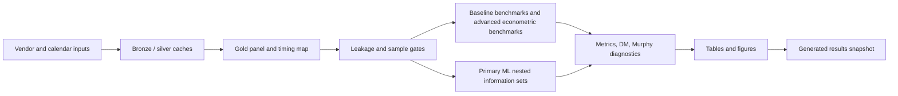

---
hide:
  - navigation
---

# Results And Discussion

> **Research-candidate full-run artifact.** This page is generated from `tailrisk_20160719_20260522_20260527T083659Z_commit_7f628ff4`.
> It summarizes the durable gold modeling sample and run outputs, not the older
> bounded access-check snapshot. It is still a research-candidate artifact:
> final manuscript claims require a clean committed run and author review of the
> tables and notes. It is organized as the paper's Results and Discussion
> section: sample and timing results, model setup, forecasting outcomes,
> diagnostics, tables, figures, and claim boundaries.

## 1. Overview And Link To Paper Plan

This page is the generated Results and Discussion companion to
[Paper Plan](paper_plan.md). It carries forward the planned manuscript sections:
data/timing evidence, model/evaluation setup, benchmark results, ML nested
information-set results, post-screen comparisons, supporting diagnostics, and
claim boundaries. Full data-source detail lives in [Data](data.md).

### Evidence Map

- The left branch binds vendor and calendar inputs into a timestamp-audited gold panel.
- The middle branch compares baseline benchmarks, advanced econometric benchmarks, and ML-tail forecasts on registered loss units.
- The right branch separates primary ML nested information sets, diagnostic model-family comparisons, unconditional DM inference, and supporting figures.

## 2. Data, Target, And Timing Results

### Run Metadata

| Field | Value |
| --- | --- |
| Run ID | `tailrisk_20160719_20260522_20260527T083659Z_commit_7f628ff4` |
| Artifact root | `reports/runs/tailrisk_20160719_20260522_20260527T083659Z_commit_7f628ff4` |
| Claim level | `research_candidate` |
| Requested window | `['2016-07-19', '2026-05-22']` |
| Combined clean start | `2018-06-20` |
| Gold panel dates | `2016-07-19 to 2026-05-22` |
| Forecast sample dates | `2018-06-20 to 2026-05-22 (1722 rows)` |
| Git commit | `7f628ff4f66258a36314f492b652cdf7ef594b7e` |
| Git dirty | `False` |
| FRED vintage safe | `False` |

- `combined_clean_start` is the modeling lower bound; dates before it remain audit history rather than forecast evidence.
- `git_dirty` is recorded so dirty runs can be rejected before manuscript tables are frozen.
- `fred_vintage_safe=False` is an explicit limitation: FRED data are current historical values with conservative release lag, not real-time vintage observations.

### Target Distribution And Tail Diagnostics

- These diagnostics are computed from the raw clean settlement-to-open target `gap_t`; left loss is `-gap_t`, and right loss is `gap_t`.
- The purpose is to show why the dependent variable is a tail-risk object before comparing VaR/ES forecasts.
- Positive tail-shape estimates, heavy empirical tails, and upward mean-excess patterns are empirical support for using heavy-tail approximations such as POT-GPD; they are not a finite-sample proof of Frechet max-domain attraction.
- Raw target diagnostics motivate VaR/ES and EVT modeling. They do not validate LightGBM-EVT forecasts; forecast validity must be read from out-of-sample VaR/ES backtests and loss comparisons.

#### Target Summary

| Measure | Value |
| --- | --- |
| Clean forecast observations | `1722` |
| Date range | `2018-06-20 to 2026-05-22` |
| Mean gap | 0.000599 log (+0.06%) |
| Standard deviation | 0.011039 log (+1.11%) |
| Skewness | -0.066817 |
| Excess kurtosis | 11.159 |
| 1% quantile | -0.031062 log (-3.06%) |
| 5% quantile | -0.015606 log (-1.55%) |
| Median | 0.001031 log (+0.10%) |
| 95% quantile | 0.015357 log (+1.55%) |
| 99% quantile | 0.027480 log (+2.79%) |
| Max drawdown gap | -0.087513 log (-8.38%) on `2020-03-13` |
| Max upside gap | 0.096937 log (+10.18%) on `2025-04-10` |
| Jarque-Bera p-value | 0 |
| Jarque-Bera statistic | 8962.16 |

#### Raw-Tail EVT Diagnostics

| Tail | Threshold probability | Threshold | Exceedances | Mean excess | GPD xi | GPD scale | Hill xi |
| --- | --- | --- | --- | --- | --- | --- | --- |
| left_tail_loss | 0.900 | 0.0160237 | 78 | 0.0104227 | 0.148364 | 0.00886263 | 0.432871 |
| left_tail_loss | 0.925 | 0.0195554 | 59 | 0.00979449 | 0.318986 | 0.00680111 | 0.342056 |
| left_tail_loss | 0.950 | 0.0223228 | 39 | 0.0114201 | 0.232349 | 0.0088172 | 0.354783 |
| left_tail_loss | 0.975 | 0.0293044 | 20 | 0.0127979 | 0.257683 | 0.00960064 | 0.31884 |
| left_tail_loss | 0.990 | 0.0373166 | 8 | 0.0175619 | 0.204438 | 0.0142233 | 0.342351 |
| right_tail_loss | 0.900 | 0.0150066 | 92 | 0.00903798 | 0.403374 | 0.00560621 | 0.381845 |
| right_tail_loss | 0.925 | 0.0169408 | 69 | 0.00984642 | 0.47548 | 0.00563718 | 0.370713 |
| right_tail_loss | 0.950 | 0.0189956 | 46 | 0.0122032 | 0.29399 | 0.00878548 | 0.41336 |
| right_tail_loss | 0.975 | 0.0259629 | 23 | 0.0146916 | 0.225126 | 0.0115191 | 0.383413 |
| right_tail_loss | 0.990 | 0.0369444 | 10 | 0.0171855 | 0.218772 | 0.0136836 | 0.352692 |
| absolute_gap | 0.900 | 0.0155233 | 170 | 0.00965025 | 0.287887 | 0.00694789 | 0.401867 |
| absolute_gap | 0.925 | 0.0175227 | 127 | 0.0106185 | 0.249472 | 0.00801625 | 0.397719 |
| absolute_gap | 0.950 | 0.0208133 | 85 | 0.011767 | 0.256151 | 0.00884033 | 0.383021 |
| absolute_gap | 0.975 | 0.0269986 | 43 | 0.0144273 | 0.164437 | 0.0120976 | 0.372398 |
| absolute_gap | 0.990 | 0.0371795 | 17 | 0.0183049 | 0.0605131 | 0.0172189 | 0.353301 |

- The GPD threshold table is computed on raw left loss, raw right loss, and the absolute gap; it should not be read as a forecast-model diagnostic.
- The Hill and GPD shape estimates are deliberately reported over multiple thresholds because tail-index estimates are sensitive in samples of this length.

#### Target Distribution Figures

| Figure | Tail side | Source | Claim scope | Docs file |
| --- | --- | --- | --- | --- |
| `target_tail_motivation` | `left_right_target_distribution` | `panel/modeling_panel.parquet` | `target_distribution_motivation_not_forecast_validation` | `figures/tailrisk_20160719_20260522_20260527T083659Z_commit_7f628ff4/target_tail_motivation.png` |

### Gold Panel Construction

| Measure | Value |
| --- | --- |
| Gold modeling rows | 2403 |
| Gold columns | 1428 |
| Target-audit rows | 2403 |
| Clean target rows | 2206 |
| Forecast-sample rows | 1722 |
| Rows before combined clean start | 420 |
| Target-not-clean rows | 197 |
| Mapping excluded rows | 64 |

| Target audit reason | Rows |
| --- | --- |
| None | 2206 |
| roll_sq_excluded | 195 |
| missing_previous_jpx_session | 1 |
| missing_reference_price | 1 |

- The cache lower bound is 2016-07-19, but XLC/core predictor coverage pushes the actual forecast sample to the combined clean start.
- Target exclusion is explicit: roll/SQ windows and the single missing reference price are carried as audit evidence, not silently dropped.
- The forecast-sample reason column makes the sample boundary reproducible row by row.

### Calendar And Timing Map

| Measure | Value |
| --- | --- |
| Normal trading mappings | 2333 |
| U.S./Japan desync mappings | 1 |
| NYSE early-close mappings | 32 |
| EDT rows | 1563 |
| EST rows | 840 |

- The map covers EST/EDT, early closes, U.S./Japan holiday desynchronization, and normal trading alignments.
- Desync rows are not treated as normal forecast rows.
- The timing map is part of the leakage-bound gold artifact, not ad hoc evaluation logic.

### Feature Coverage

| Source family | Block | Features | Mean missing | Max missing |
| --- | --- | --- | --- | --- |
| Asia proxy | Asia proxy | 10 | 0.000% | 0.000% |
| Cboe volatility | FRED | 2 | 0.000% | 0.000% |
| Derived cross-market | Asia proxy | 1 | 0.000% | 0.000% |
| Derived cross-market | FRED | 2 | 0.000% | 0.000% |
| Derived cross-market | Japan proxy | 2 | 0.000% | 0.000% |
| Derived cross-market | U.S. core | 2 | 0.000% | 0.000% |
| Event calendar | Calendar controls | 7 | 0.000% | 0.000% |
| FRED | FRED | 9 | 0.000% | 0.000% |
| FRED credit enriched | FRED credit enriched | 4 | 62.398% | 62.427% |
| Foreign exchange | Foreign exchange | 4 | 0.000% | 0.000% |
| Japan history | Japan only | 37 | 0.005% | 0.058% |
| Japan proxy | Japan proxy | 8 | 0.000% | 0.000% |
| J-Quants Nikkei 225 options | Japan only | 30 | 1.605% | 14.634% |
| Massive daily | U.S. core | 40 | 0.001% | 0.058% |
| Massive intraday | Asia proxy | 60 | 0.000% | 0.000% |
| Massive intraday | Japan proxy | 24 | 0.348% | 4.181% |
| Massive intraday | U.S. late session | 84 | 0.000% | 0.000% |
| Massive cross-asset ETF | Massive cross-asset ETF | 2 | 0.000% | 0.000% |

- U.S. core, proxy ETFs, minute late-session features, CBOE VIX, FRED rates, FRED H.10 FX, and any audit-gated options-risk fields are separated by source family and block.
- Credit-spread FRED features are enriched/optional and visibly late-starting, so they do not move the core clean start.
- Feature coverage should be read together with the leakage summary; high coverage alone is not enough without timestamp validity.

### Leakage Audit

| Field | Value |
| --- | --- |
| Status | `pass_with_warnings` |
| Rows audited | `783378` |
| Failures | `0` |
| Warnings | `611790` |
| Warning reasons | `lag_below_conservative_warning_threshold`: `604030` `missing_feature_value_not_evaluable`: `7760` |
| Panel row count | `2403` |
| Panel signature seed | `42` |
| Panel signature | `8094755ffc96b01af6fb904876e0abdd3920370fa1b07e44c2c95681cd3e5431` |

- Zero failures means no audited row violated the hard timestamp invariant.
- Warnings are retained because they identify conservative-lag or missing-feature situations that may matter for interpretation; they are not hard timestamp failures.
- The panel signature is deterministic and binds the leakage check to the current gold panel/config.

## 3. Model And Evaluation Setup

### Pipeline Structure

| Step | Layer | Purpose |
| --- | --- | --- |
| 1 | Vendor and calendar sources | Pull or read J-Quants, Massive, FRED, CBOE, and exchange-calendar inputs. |
| 2 | Bronze and silver cache | Preserve typed vendor/cache rows, then normalize point-in-time research features. |
| 3 | Gold modeling panel | Join targets, calendar map, feature coverage, and leakage-bound signatures. |
| 4 | Leakage and coverage gates | Enforce timestamp ordering and sample eligibility before evaluation. |
| 5 | Baseline benchmarks and ML-tail registry | Run statistical and econometric benchmarks based on lagged opening-gap losses and the LightGBM tail-model families. |
| 6 | Metrics, inference, diagnostics | Build loss matrices, DM/Murphy diagnostics, stress windows, and result matrix artifacts. |
| 7 | Results snapshot | Summarize run-specific evidence and claim boundaries for reader review. |

- Data-access and cache artifacts live under `data/bronze` and `data/silver`.
- Durable modeling evidence lives under `data/gold`; forecast/evaluation/reporting read from gold and reports.
- Run-specific forecasts, metrics, diagnostics, and LaTeX tables live under `reports/runs/<run_id>`.

### Model And Evaluation Protocol

- The registered risk level is `tail_level = 0.95`; the nominal VaR exception rate is 5%.
- A VaR exception is counted when `realized_loss > var_forecast`; this follows the
  standard exception-counting logic of VaR backtesting, but the snapshot does not
  apply Basel green/yellow/red traffic-light capital zones.
- Forecast evaluation is based on coverage diagnostics, Kupiec/Christoffersen
  tests where available, quantile loss, Fissler-Ziegel joint VaR-ES loss, and
  DM inference.
- Benchmarks use lagged opening-gap losses only. ML-tail models add predictors through fixed nested information sets.
- Most specifications use expanding pre-forecast training histories. The rolling-quantile benchmark is the designed exception and uses the most recent 1,000 clean observations.
- LightGBM hyperparameters are held fixed across information sets and refit dates; the snapshot reports model-family evidence rather than tuning-search evidence.
- DM inference is read on average across the unconditional evaluation sample.

## 4. Forecasting Results And Discussion

### 4.1 Benchmark results

Status: `completed`; forecast rows: `15173`; metric rows: `14`; failures: `0`.

| Benchmark layer | Status | Forecast rows | Diagnostic rows | Failures | How to read it |
| --- | --- | --- | --- | --- | --- |
| baseline | `completed` | `8664` | `12` | `0` | Implemented evidence for statistical and econometric benchmarks based on lagged opening-gap losses. |
| advanced econometric | `completed_nonblocking` | `6509` | `2526` | `0` | Implemented nonblocking advanced econometric benchmark forecasts; review with common-sample gates. |

| Model | Information set | Tail side | Rows | VaR breach rate | Exceptions | Mean quantile loss | Mean FZ loss |
| --- | --- | --- | --- | --- | --- | --- | --- |
| EWMA volatility scaling | Lagged opening-gap losses | left_tail | 722 | 5.263% | 38 | 0.00140906 | -3.64746 |
| EWMA volatility scaling | Lagged opening-gap losses | right_tail | 722 | 4.571% | 33 | 0.00134173 | -3.65662 |
| GARCH-t | Lagged opening-gap losses | left_tail | 722 | 6.094% | 44 | 0.00136831 | -3.70108 |
| GARCH-t | Lagged opening-gap losses | right_tail | 722 | 4.155% | 30 | 0.00127794 | -3.70337 |
| GAS-t location-scale | Lagged opening-gap losses | left_tail | 722 | 6.371% | 46 | 0.00135225 | -3.69351 |
| GAS-t location-scale | Lagged opening-gap losses | right_tail | 722 | 4.986% | 36 | 0.00130686 | -3.66834 |
| GJR-GARCH-EVT | Lagged opening-gap losses | left_tail | 722 | 6.094% | 44 | 0.00133021 | -3.74623 |
| GJR-GARCH-EVT | Lagged opening-gap losses | right_tail | 722 | 5.817% | 42 | 0.00123302 | -3.70857 |
| GJR-GARCH-t | Lagged opening-gap losses | left_tail | 722 | 7.064% | 51 | 0.00133844 | -3.72346 |
| GJR-GARCH-t | Lagged opening-gap losses | right_tail | 722 | 4.294% | 31 | 0.00122154 | -3.73971 |
| Historical quantile | Lagged opening-gap losses | left_tail | 722 | 5.540% | 40 | 0.00147622 | -3.54066 |
| Historical quantile | Lagged opening-gap losses | right_tail | 722 | 6.925% | 50 | 0.00150215 | -3.40678 |
| Rolling quantile | Lagged opening-gap losses | left_tail | 722 | 5.817% | 42 | 0.00148114 | -3.52468 |
| Rolling quantile | Lagged opening-gap losses | right_tail | 722 | 7.202% | 52 | 0.00149558 | -3.42732 |

- Baseline benchmark rows provide the statistical and econometric reference based on lagged opening-gap losses.
- Advanced econometric benchmark families are nonblocking; rows with valid forecasts are empirical evidence subject to the same sample and inference gates, while unavailable rows remain diagnostics.
- The table is not a leaderboard by itself; coverage, exception counts, quantile loss, and FZ loss must be read together.
- Common-sample rows are reported directly so readers can see the effective evidence size.

### 4.2 Primary ML specifications across nested information sets

Status: `completed LightGBM forecasts`; implemented models: `LightGBM direct quantile`, `LightGBM empirical location-scale`, `LightGBM mean/scale POT-GPD MLE`, `LightGBM mean/scale POT-GPD UniBM`, `LightGBM median/MAD POT-GPD MLE`, `LightGBM median/MAD POT-GPD UniBM`, `LightGBM median/IQR POT-GPD MLE`, `LightGBM median/IQR POT-GPD UniBM`; forecast rows: `43088`; failures: `0`.

| Model | Information set | Tail side | Rows | VaR breach rate | Exceptions | Mean quantile loss | Mean FZ loss |
| --- | --- | --- | --- | --- | --- | --- | --- |
| LightGBM direct quantile | A: Japan only | left_tail | 527 | 8.159% | 43 | 0.00141174 | -3.48935 |
| LightGBM direct quantile | B: +U.S.-close core | left_tail | 527 | 11.195% | 59 | 0.00115754 | -3.6684 |
| LightGBM direct quantile | C: +Japan proxy | left_tail | 527 | 11.765% | 62 | 0.00111393 | -3.86888 |
| LightGBM direct quantile | D: +Asia proxy | left_tail | 527 | 11.765% | 62 | 0.00111901 | -3.8076 |
| LightGBM direct quantile | A: Japan only | right_tail | 527 | 9.677% | 51 | 0.00130995 | -3.48743 |
| LightGBM direct quantile | B: +U.S.-close core | right_tail | 527 | 11.954% | 63 | 0.00125168 | -3.48624 |
| LightGBM direct quantile | C: +Japan proxy | right_tail | 527 | 11.575% | 61 | 0.00121124 | -3.55746 |
| LightGBM direct quantile | D: +Asia proxy | right_tail | 527 | 12.903% | 68 | 0.00122247 | -3.55915 |

- This primary ML table remains strict and reports only ML-tail rows that pass the registered common-sample and forecast-validity gates; coverage is reviewed separately.
- LightGBM empirical location-scale and LightGBM mean/scale POT-GPD MLE are primary candidates only after their valid out-of-sample coverage, standardized-loss, exceedance, and ES-validity gates pass.
- Differences across information blocks are candidate forecast evidence only after the common-sample, coverage, and inference diagnostics are reviewed.
- Coverage review: `8/8` primary ML rows differ from the expected breach rate by more than 2.5 percentage points, so quantile/FZ loss differences alone must not be read as forecast improvement.

### 4.3 ML-tail artifact relationship

| Artifact | Rows | Role | Claim boundary |
| --- | --- | --- | --- |
| `ml_tail_metrics.parquet` | 8 | Primary ML nested-information-set comparison | Eligible for primary discussion after author review. |
| `ml_tail_metrics_per_model.parquet` | 64 | Per-model diagnostics on each model's own valid out-of-sample rows | Not a cross-model comparison and not a replacement primary ML table. |
| `ml_tail_result_matrix.parquet` | 384 | Restricted common-sample VaR-only and VaR-ES comparisons | Restricted evidence; direct quantile rows here are comparison anchors. |

- `ml_tail_metrics.parquet` is the primary nested-information-set artifact. It contains the ML-tail rows that survived the strict common-sample gate in this run.
- `ml_tail_metrics_per_model.parquet` reports each implemented ML-tail model on its own valid out-of-sample rows; it is useful for debugging coverage but is not a cross-model comparison table.
- `ml_tail_result_matrix.parquet` creates restricted common samples for VaR-only and VaR-ES comparisons across model families and within-model information-set increments.

### 4.4 All-model diagnostic scan

| Suite | Model | Information set | Metric rows | Out-of-sample N mean+-sd | Breach mean+-sd | Abs cov err mean+-sd | Q loss mean+-sd | FZ loss mean+-sd | ES severity mean+-sd |
| --- | --- | --- | --- | --- | --- | --- | --- | --- | --- |
| benchmark_advanced | CARE expectile SAV | Lagged opening-gap losses | 2 | 649.5 +/- 41.7193 | 7.658% +/- 1.250% | 2.658% +/- 1.250% | 0.00141367 +/- 5.95611e-05 | -3.54112 +/- 0.0938805 | 0.00857223 +/- 0.000528859 |
| benchmark_advanced | CARE expectile asymmetric slope | Lagged opening-gap losses | 2 | 653 +/- 36.7696 | 7.884% +/- 0.097% | 2.884% +/- 0.097% | 0.00138317 +/- 8.00061e-05 | -3.57653 +/- 0.0638322 | 0.0082744 +/- 0.000559256 |
| benchmark_advanced | CAViaR SAV | Lagged opening-gap losses | 2 | 501 +/- 4.24264 | 6.086% +/- 0.372% | 1.086% +/- 0.372% | 0.00156273 +/- 6.81431e-06 | -3.47395 +/- 0.093514 | 0.0116523 +/- 3.28833e-05 |
| benchmark_advanced | CAViaR asymmetric slope | Lagged opening-gap losses | 2 | 506 +/- 2.82843 | 6.916% +/- 0.241% | 1.916% +/- 0.241% | 0.00152915 +/- 4.9109e-05 | -3.49931 +/- 0.0468367 | 0.0100652 +/- 0.000926358 |
| benchmark_advanced | GAS-t POT-GPD | Lagged opening-gap losses | 2 | 223 +/- 0 | 6.502% +/- 2.854% | 2.018% +/- 2.124% | 0.00153061 +/- 0.000359334 | -3.41151 +/- 0.534257 | 0.009774 +/- 0.00427048 |
| benchmark_advanced | GAS-t location-scale | Lagged opening-gap losses | 2 | 722 +/- 0 | 5.679% +/- 0.979% | 0.693% +/- 0.960% | 0.00132955 +/- 3.20964e-05 | -3.68092 +/- 0.0177958 | 0.00959201 +/- 0.00130427 |
| benchmark_baseline | EWMA volatility scaling | Lagged opening-gap losses | 2 | 722 +/- 0 | 4.917% +/- 0.490% | 0.346% +/- 0.118% | 0.00137539 +/- 4.76049e-05 | -3.65204 +/- 0.00647254 | 0.00921114 +/- 0.000813727 |
| benchmark_baseline | GARCH-t | Lagged opening-gap losses | 2 | 722 +/- 0 | 5.125% +/- 1.371% | 0.970% +/- 0.176% | 0.00132312 +/- 6.39034e-05 | -3.70223 +/- 0.00162002 | 0.00974876 +/- 0.00161122 |
| benchmark_baseline | GJR-GARCH-EVT | Lagged opening-gap losses | 2 | 722 +/- 0 | 5.956% +/- 0.196% | 0.956% +/- 0.196% | 0.00128162 +/- 6.87209e-05 | -3.7274 +/- 0.0266288 | 0.00830943 +/- 0.000959208 |
| benchmark_baseline | GJR-GARCH-t | Lagged opening-gap losses | 2 | 722 +/- 0 | 5.679% +/- 1.959% | 1.385% +/- 0.960% | 0.00127999 +/- 8.26617e-05 | -3.73159 +/- 0.0114919 | 0.00881549 +/- 0.00205961 |
| benchmark_baseline | Historical quantile | Lagged opening-gap losses | 2 | 722 +/- 0 | 6.233% +/- 0.979% | 1.233% +/- 0.979% | 0.00148919 +/- 1.83406e-05 | -3.47372 +/- 0.0946715 | 0.0120717 +/- 9.68084e-05 |
| benchmark_baseline | Rolling quantile | Lagged opening-gap losses | 2 | 722 +/- 0 | 6.510% +/- 0.979% | 1.510% +/- 0.979% | 0.00148836 +/- 1.02111e-05 | -3.476 +/- 0.068848 | 0.0115817 +/- 0.000143645 |
| ml_tail | LightGBM direct quantile | A: Japan only | 2 | 554 +/- 0 | 8.664% +/- 1.021% | 3.664% +/- 1.021% | 0.00133825 +/- 9.25573e-05 | -3.50275 +/- 0.0392189 | 0.00813676 +/- 0.00113574 |
| ml_tail | LightGBM direct quantile | B: +U.S.-close core | 2 | 554 +/- 0 | 11.101% +/- 0.383% | 6.101% +/- 0.383% | 0.00118022 +/- 4.32589e-05 | -3.61364 +/- 0.0922633 | 0.0064386 +/- 0.000247838 |
| ml_tail | LightGBM direct quantile | C: +Japan proxy | 2 | 527 +/- 0 | 11.670% +/- 0.134% | 6.670% +/- 0.134% | 0.00116259 +/- 6.88028e-05 | -3.71317 +/- 0.220204 | 0.0059796 +/- 0.000662772 |
| ml_tail | LightGBM direct quantile | D: +Asia proxy | 2 | 527 +/- 0 | 12.334% +/- 0.805% | 7.334% +/- 0.805% | 0.00117074 +/- 7.31616e-05 | -3.68337 +/- 0.17568 | 0.00571666 +/- 0.000192238 |
| ml_tail | LightGBM empirical location-scale | A: Japan only | 2 | 508 +/- 0 | 4.823% +/- 0.696% | 0.492% +/- 0.251% | 0.00141628 +/- 9.98491e-05 | -3.56404 +/- 0.0139556 | 0.00998686 +/- 0.000171526 |
| ml_tail | LightGBM empirical location-scale | B: +U.S.-close core | 2 | 505.5 +/- 0.707107 | 6.133% +/- 0.009% | 1.133% +/- 0.009% | 0.00101756 +/- 4.15541e-05 | -4.01111 +/- 0.0557055 | 0.00604578 +/- 0.000458165 |
| ml_tail | LightGBM empirical location-scale | C: +Japan proxy | 2 | 492.5 +/- 0.707107 | 6.295% +/- 0.296% | 1.295% +/- 0.296% | 0.00100557 +/- 2.51561e-05 | -4.08481 +/- 0.0813422 | 0.0059098 +/- 0.000533713 |
| ml_tail | LightGBM empirical location-scale | D: +Asia proxy | 2 | 492 +/- 0 | 6.707% +/- 0.575% | 1.707% +/- 0.575% | 0.00103557 +/- 7.0027e-05 | -3.98452 +/- 0.104636 | 0.00590198 +/- 0.00152973 |
| ml_tail | LightGBM mean/scale POT-GPD MLE | A: Japan only | 2 | 484 +/- 0 | 4.649% +/- 1.315% | 0.930% +/- 0.497% | 0.00144417 +/- 0.000106677 | -3.55083 +/- 0.03612 | 0.0106097 +/- 0.00111591 |
| ml_tail | LightGBM mean/scale POT-GPD MLE | B: +U.S.-close core | 2 | 482 +/- 0 | 5.498% +/- 0.440% | 0.498% +/- 0.440% | 0.00102429 +/- 3.8851e-05 | -4.03154 +/- 0.069105 | 0.00653613 +/- 0.000836497 |
| ml_tail | LightGBM mean/scale POT-GPD MLE | C: +Japan proxy | 2 | 473.5 +/- 0.707107 | 5.808% +/- 0.158% | 0.808% +/- 0.158% | 0.00101213 +/- 3.0664e-05 | -4.0908 +/- 0.0864067 | 0.00623547 +/- 0.000519173 |
| ml_tail | LightGBM mean/scale POT-GPD MLE | D: +Asia proxy | 2 | 473 +/- 0 | 6.131% +/- 0.598% | 1.131% +/- 0.598% | 0.00103841 +/- 7.23005e-05 | -4.00776 +/- 0.117572 | 0.00622715 +/- 0.0016854 |
| ml_tail | LightGBM mean/scale POT-GPD UniBM | A: Japan only | 2 | 484 +/- 0 | 4.855% +/- 1.023% | 0.723% +/- 0.205% | 0.00143954 +/- 0.000108633 | -3.54743 +/- 0.050522 | 0.0101296 +/- 0.000667455 |
| ml_tail | LightGBM mean/scale POT-GPD UniBM | B: +U.S.-close core | 2 | 483 +/- 0 | 5.901% +/- 0.732% | 0.901% +/- 0.732% | 0.00102253 +/- 3.45998e-05 | -4.02862 +/- 0.0642791 | 0.00630662 +/- 0.000886595 |
| ml_tail | LightGBM mean/scale POT-GPD UniBM | C: +Japan proxy | 2 | 473.5 +/- 0.707107 | 6.019% +/- 0.457% | 1.019% +/- 0.457% | 0.00101481 +/- 2.40341e-05 | -4.07568 +/- 0.0784556 | 0.0063269 +/- 0.000530558 |
| ml_tail | LightGBM mean/scale POT-GPD UniBM | D: +Asia proxy | 2 | 473.5 +/- 0.707107 | 6.125% +/- 0.606% | 1.125% +/- 0.606% | 0.00104182 +/- 6.17669e-05 | -3.99333 +/- 0.0899169 | 0.00643634 +/- 0.00132792 |
| ml_tail | LightGBM median/IQR POT-GPD MLE | A: Japan only | 2 | 554 +/- 0 | 3.339% +/- 0.383% | 1.661% +/- 0.383% | 0.00129732 +/- 0.000121471 | -3.71766 +/- 0.0543739 | 0.0104723 +/- 0.000488415 |
| ml_tail | LightGBM median/IQR POT-GPD MLE | B: +U.S.-close core | 2 | 553.5 +/- 0.707107 | 5.330% +/- 0.121% | 0.330% +/- 0.121% | 0.00100641 +/- 5.8567e-05 | -4.05822 +/- 0.117346 | 0.00677553 +/- 9.19624e-05 |
| ml_tail | LightGBM median/IQR POT-GPD MLE | C: +Japan proxy | 2 | 526 +/- 0 | 4.753% +/- 0.000% | 0.247% +/- 0.000% | 0.000972485 +/- 9.62715e-05 | -4.06369 +/- 0.190447 | 0.00717965 +/- 0.000903805 |
| ml_tail | LightGBM median/IQR POT-GPD MLE | D: +Asia proxy | 2 | 527 +/- 0 | 5.977% +/- 0.134% | 0.977% +/- 0.134% | 0.000981802 +/- 9.14751e-05 | -4.07318 +/- 0.21113 | 0.00595077 +/- 0.000647845 |
| ml_tail | LightGBM median/IQR POT-GPD UniBM | A: Japan only | 2 | 554 +/- 0 | 3.430% +/- 0.255% | 1.570% +/- 0.255% | 0.00129247 +/- 0.000128665 | -3.72329 +/- 0.0553233 | 0.0103895 +/- 0.000332801 |
| ml_tail | LightGBM median/IQR POT-GPD UniBM | B: +U.S.-close core | 2 | 553.5 +/- 0.707107 | 5.420% +/- 0.249% | 0.420% +/- 0.249% | 0.001005 +/- 6.42702e-05 | -4.03849 +/- 0.105695 | 0.00680349 +/- 2.92911e-05 |
| ml_tail | LightGBM median/IQR POT-GPD UniBM | C: +Japan proxy | 2 | 527 +/- 0 | 4.934% +/- 0.268% | 0.190% +/- 0.094% | 0.000977369 +/- 9.96524e-05 | -4.07223 +/- 0.267913 | 0.00722562 +/- 0.000739001 |
| ml_tail | LightGBM median/IQR POT-GPD UniBM | D: +Asia proxy | 2 | 527 +/- 0 | 5.882% +/- 0.000% | 0.882% +/- 0.000% | 0.000981983 +/- 9.6245e-05 | -4.07821 +/- 0.191496 | 0.00617459 +/- 0.00100583 |
| ml_tail | LightGBM median/MAD POT-GPD MLE | A: Japan only | 2 | 484 +/- 0 | 5.165% +/- 0.000% | 0.165% +/- 0.000% | 0.00141016 +/- 0.000113401 | -3.60412 +/- 0.009619 | 0.0105104 +/- 0.00101589 |
| ml_tail | LightGBM median/MAD POT-GPD MLE | B: +U.S.-close core | 2 | 484 +/- 0 | 6.818% +/- 0.584% | 1.818% +/- 0.584% | 0.00109354 +/- 3.73982e-05 | -4.05872 +/- 0.0856922 | 0.00790369 +/- 0.000394935 |
| ml_tail | LightGBM median/MAD POT-GPD MLE | C: +Japan proxy | 2 | 473.5 +/- 0.707107 | 7.287% +/- 0.758% | 2.287% +/- 0.758% | 0.00102391 +/- 8.23481e-05 | -4.19814 +/- 0.158674 | 0.00660111 +/- 0.000331299 |
| ml_tail | LightGBM median/MAD POT-GPD MLE | D: +Asia proxy | 2 | 473.5 +/- 0.707107 | 7.076% +/- 0.757% | 2.076% +/- 0.757% | 0.00105943 +/- 9.34222e-05 | -4.09633 +/- 0.245078 | 0.0073057 +/- 0.000570338 |
| ml_tail | LightGBM median/MAD POT-GPD UniBM | A: Japan only | 2 | 484 +/- 0 | 5.579% +/- 0.584% | 0.579% +/- 0.584% | 0.0014127 +/- 0.000111137 | -3.60619 +/- 0.0108432 | 0.0101188 +/- 0.00167497 |
| ml_tail | LightGBM median/MAD POT-GPD UniBM | B: +U.S.-close core | 2 | 484 +/- 0 | 6.921% +/- 0.438% | 1.921% +/- 0.438% | 0.00109506 +/- 3.41604e-05 | -4.06831 +/- 0.110891 | 0.00792169 +/- 0.000308992 |
| ml_tail | LightGBM median/MAD POT-GPD UniBM | C: +Japan proxy | 2 | 473.5 +/- 0.707107 | 7.603% +/- 0.310% | 2.603% +/- 0.310% | 0.00103226 +/- 7.39019e-05 | -4.16953 +/- 0.157826 | 0.00660286 +/- 0.000522774 |
| ml_tail | LightGBM median/MAD POT-GPD UniBM | D: +Asia proxy | 2 | 473.5 +/- 0.707107 | 7.497% +/- 0.161% | 2.497% +/- 0.161% | 0.00106577 +/- 8.54015e-05 | -4.09025 +/- 0.239148 | 0.00711434 +/- 0.000949755 |

- This table joins `benchmark_metrics_per_model.parquet` and `ml_tail_metrics_per_model.parquet` so all benchmark and LightGBM tail-model variants are visible in one place.
- Mean and standard deviation are computed across registered metric rows for the same suite/model/information-set configuration; for most rows this summarizes downside and upside metrics.
- It is a diagnostic scan, not the formal cross-model comparison table. Cross-model claims still require common-sample result-matrix and DM evidence because valid dates and model gates can differ.

### 4.5 Eight-scenario VaR coverage screen and post-screen FZ DM evidence

| LightGBM specification | Eligible / 8 | Breach band / 8 | Kupiec UC / 8 | Christoffersen independence / 8 | Mean exception severity range | Coverage-admissible |
| --- | --- | --- | --- | --- | --- | --- |
| LightGBM direct quantile | 8/8 | 0/8 | 0/8 | 8/8 | 0.005511--0.008940 | no |
| LightGBM empirical location-scale | 8/8 | 8/8 | 7/8 | 8/8 | 0.004820--0.010108 | no |
| LightGBM mean/scale POT-GPD MLE | 8/8 | 8/8 | 8/8 | 8/8 | 0.005035--0.011399 | yes |
| LightGBM mean/scale POT-GPD UniBM | 8/8 | 8/8 | 8/8 | 8/8 | 0.005497--0.010602 | yes |
| LightGBM median/MAD POT-GPD MLE | 8/8 | 6/8 | 5/8 | 7/8 | 0.006367--0.011229 | no |
| LightGBM median/MAD POT-GPD UniBM | 8/8 | 6/8 | 3/8 | 8/8 | 0.006233--0.011303 | no |
| LightGBM median/IQR POT-GPD MLE | 8/8 | 8/8 | 7/8 | 8/8 | 0.005493--0.010818 | no |
| LightGBM median/IQR POT-GPD UniBM | 8/8 | 8/8 | 7/8 | 8/8 | 0.005463--0.010625 | no |

The eight-scenario VaR coverage screen spans two exposures and four information sets. Each scenario applies three criteria: the +/-2.5 percentage-point breach-rate band, Kupiec unconditional coverage, and Christoffersen independence. N >= 450 is an eligibility precondition, not an additional test. The severity range is descriptive and does not enter the screen.

The loss comparison below is deliberately conditional on the eight-scenario VaR coverage screen.
It compares the fixed coverage-admissible set rather than ranking every
implemented model.

| Tail | Candidate | Anchor | Common N | Mean FZ diff. | One-sided p | Status |
| --- | --- | --- | --- | --- | --- | --- |
| Downside | LightGBM mean/scale POT-GPD MLE (C) | GJR-GARCH-EVT | 473 | -0.471644 | 0.001 | ok_block_bootstrap_dm |
| Downside | LightGBM mean/scale POT-GPD UniBM (C) | GJR-GARCH-EVT | 473 | -0.450901 | 0.001 | ok_block_bootstrap_dm |
| Downside | LightGBM mean/scale POT-GPD MLE (C) | LightGBM mean/scale POT-GPD UniBM (C) | 473 | -0.020743 | 0.100 | ok_block_bootstrap_dm |
| Upside | LightGBM mean/scale POT-GPD MLE (C) | GJR-GARCH-EVT | 474 | -0.359663 | 0.004 | ok_block_bootstrap_dm |
| Upside | LightGBM mean/scale POT-GPD UniBM (C) | GJR-GARCH-EVT | 474 | -0.350165 | 0.005 | ok_block_bootstrap_dm |
| Upside | LightGBM mean/scale POT-GPD MLE (C) | LightGBM mean/scale POT-GPD UniBM (C) | 474 | -0.009499 | 0.197 | ok_block_bootstrap_dm |

Mean differences are FZ(candidate - anchor) on one strict global common sample per exposure. Negative values mean that the candidate has lower FZ loss and better joint VaR-ES forecasts. P-values are one-sided circular-block-bootstrap DM p-values.

### 4.6 Restricted common-sample result matrix and DM evidence

| Family | Axis | Loss | Rows | Common N | Date range | Joint exceptions |
| --- | --- | --- | --- | --- | --- | --- |
| nested information sets | information_set_increment | var_coverage | 64 | 471 to 527 | 2023-01-26 to 2026-05-21 | 34 to 80 |
| nested information sets | information_set_increment | var_es_fz_loss | 64 | 471 to 527 | 2023-01-26 to 2026-05-21 | 34 to 80 |
| nested information sets | information_set_increment | var_quantile_loss | 64 | 471 to 527 | 2023-01-26 to 2026-05-21 | 34 to 80 |
| tail_model_family | model_family | var_coverage | 64 | 472 to 484 | 2023-06-16 to 2026-05-21 | 47 to 70 |
| tail_model_family | model_family | var_es_fz_loss | 64 | 472 to 484 | 2023-06-16 to 2026-05-21 | 47 to 70 |
| tail_model_family | model_family | var_quantile_loss | 64 | 472 to 484 | 2023-06-16 to 2026-05-21 | 47 to 70 |

- The result matrix is the right place to compare direct quantile, empirical location-scale, mean/scale POT-GPD, and robust-filter POT-GPD specifications on their restricted common dates.
- It separates VaR-only losses from VaR-ES joint scoring, so VaR-only claims are not confused with ES claims.
- Restricted direct-quantile performance is only a comparison anchor for the tail-model family; it does not replace the primary direct-quantile evidence.
- DM records are emitted only where registered row-count and exception-count gates pass; otherwise the result matrix remains descriptive.

### 4.7 Stress and diagnostic windows

| Suite | Rows | Window labels |
| --- | --- | --- |
| benchmark | 146 | `loss_top_decile` |
| ml_tail | 212 | `loss_top_decile`, `vix_top_decile` |

- Stress windows identify high-loss or high-volatility subsamples for two-sided risk diagnostics.
- These rows use reproducible full-sample classifiers in this first pass, so they should be described as diagnostics rather than a live stress classifier.
- They are useful for finding whether model behavior changes in difficult regimes before writing manuscript discussion.

### 4.8 Integrated interpretation and claim boundaries

<!-- generated: results_discussion -->

#### Data and timing audit

- The gold timing map covers `2016-07-19 to 2026-05-22` and the combined clean start is `2018-06-20`.
- No forecast-sample rows before `2018-06-20` enter the modeling evidence.
- The leakage check reports status `pass_with_warnings` with zero leakage failures and `611790` warnings.
- FRED vintage safety is recorded as `False`; FRED values use conservative release timing but remain current historical observations rather than ALFRED real-time vintages.

#### Baseline benchmarks and advanced econometric benchmarks

- `benchmark_metrics.parquet` reports `14` common-sample rows across `7` baseline benchmark model families and `2` tail side(s), while benchmark forecasts contain `15173` model-date rows.
- Baseline benchmark models are statistical and econometric references based on lagged opening-gap losses; this section does not rank them.
- Advanced econometric benchmark rows are implemented for `6` model families and contribute `6509` nonblocking forecast rows; these rows are claim-gated diagnostics unless a manuscript table explicitly qualifies them through the same sample and inference review.
- Baseline benchmark breach rates have a median of `0.0581717`, within 2.5 percentage points of the nominal level, indicating reasonable coverage calibration relative to the ML-tail models whose breach rates are reported in the nested-information-set section.

#### Primary ML specifications across nested information sets

- `ml_tail_metrics.parquet` defines the primary ML specification comparison across nested information sets for this run.
- The primary ML artifact contains `4` information sets, `1` tail level(s), and `2` tail side(s); the retained primary ML rows are `LightGBM direct quantile`.
- The implemented ML-tail registry is `LightGBM direct quantile`, `LightGBM empirical location-scale`, `LightGBM mean/scale POT-GPD MLE`, `LightGBM mean/scale POT-GPD UniBM`, `LightGBM median/MAD POT-GPD MLE`, `LightGBM median/MAD POT-GPD UniBM`, `LightGBM median/IQR POT-GPD MLE`, `LightGBM median/IQR POT-GPD UniBM`, but the primary nested-information-set comparison should be read only from `ml_tail_metrics.parquet`.
- The nested information sets report downside-risk and upside-risk surfaces separately. The registered artifacts show different left/right patterns, and the generator does not assume that the two sides share the same economic mechanism.
- Coverage warning: all `8` primary ML rows exhibit VaR breach rates (`0.0815939` to `0.129032`) that exceed the nominal level by more than 2.5 percentage points. Quantile-loss and FZ-loss differences across the nested information sets must be interpreted in this context; lower loss scores may partly reflect less conservative VaR estimates rather than better conditional tail calibration.
- For `left_tail / LightGBM direct quantile / tail=0.950`, the largest quantile-loss change occurs at the first information-set augmentation (adding U.S.-close core); subsequent additions of Japan proxy and Asia proxy ETFs contribute diminishing incremental loss changes. This saturation pattern is descriptive and does not automatically reduce the value of the broader information set.
- The nested information sets are used to assess candidate incremental U.S.-close information under strict common-sample rules; they do not by themselves establish forecast improvement.

#### Restricted model-family comparison

- `ml_tail_result_matrix.parquet` contains restricted common-sample comparisons for `8` LightGBM tail-model families.
- The restricted common-N range is `471 to 527` and the joint-exception range is `34 to 80`.
- Recorded claim scopes are `restricted_model_comparison_not_primary`; these rows are restricted evidence and cannot replace the primary ML nested-information-set comparison.
- The tail-model family comparison is severely sample-limited: the largest restricted common-N is `484` rows. No model-family ranking claim is supportable from this restricted sample; extended out-of-sample coverage is needed before tail-model family ranking becomes meaningful.
- Result-matrix inference is recorded separately from the primary suite-level DM: restricted DM records include `208` gate-pass rows and `104` unavailable rows. These entries are restricted common-sample diagnostics, not primary model-family rankings.
- The result matrix is a matched-date diagnostic layer. It should not be worded as one family being better than another.

#### Coverage and inference gates

- Coverage review flags `8/8` primary ML rows with breach rates more than 2.5 percentage points from nominal coverage; Kupiec p-values fall below 0.05 in `8/8` reported rows and Christoffersen p-values fall below 0.05 in `0/8` reported rows.
- Model-eviction artifacts record `8` retained rows and `56` non-retained rows under the primary ML sample policy.
- Block-bootstrap DM artifacts are unconditional forecast-comparison diagnostics; any p-value should be read on average across the unconditional evaluation sample, not as condition-specific evidence.
- Loss differentials alone do not constitute an improvement claim; coverage, exception counts, sample gates, and inference status must be reviewed together.
- Result-matrix tail-event power flags and suite-level inference gates report `0` restricted rows with insufficient tail-event power and `0/18` unavailable DM inference rows.

#### Supporting diagnostics

- Supporting LaTeX diagnostic table files are present for `2/2` registered diagnostic families.
- ES severity diagnostics contain `86` finite rows with mean exceedance severity ranging from `0.00482029` to `0.0121402`; this is conditional-on-exception evidence.
- Stress-window diagnostics contain `358` rows, and Post-screen LightGBM Murphy diagnostics contain `3200` rows.
- Feature-unavailability diagnostics contain `384` rows.
- Figure manifest references:
  - Figure: market_timing_design (Source: manifest.json, config/research_config.json, panel/calendar_map.parquet; Claim scope: design_forecast_origin_not_causal_price_discovery; File: latex/figures/market_timing_design.png).
  - Figure: coverage_breach_rates_left_tail (Source: metrics/benchmark_metrics.parquet, metrics/benchmark_metrics_per_model.parquet, metrics/ml_tail_metrics.parquet, metrics/ml_tail_metrics_per_model.parquet; Claim scope: coverage_diagnostic_not_primary_claim; File: latex/figures/coverage_breach_rates_left_tail.png).
  - Figure: coverage_breach_rates_right_tail (Source: metrics/benchmark_metrics.parquet, metrics/benchmark_metrics_per_model.parquet, metrics/ml_tail_metrics.parquet, metrics/ml_tail_metrics_per_model.parquet; Claim scope: coverage_diagnostic_not_primary_claim; File: latex/figures/coverage_breach_rates_right_tail.png).
  - Figure: cumulative_lgbm_a_anchor_fz_gain (Source: metrics/benchmark_loss_matrix.parquet, metrics/ml_tail_loss_matrix.parquet, forecasts/benchmark_forecasts.parquet, forecasts/ml_tail_forecasts.parquet; Claim scope: headline_lgbm_a_anchor_gjr_evt_and_information_increment_fz_gain; File: latex/figures/cumulative_lgbm_a_anchor_fz_gain.png).
  - Figure: full_sample_var_overlay_left_tail (Source: forecasts/benchmark_forecasts.parquet, forecasts/ml_tail_forecasts.parquet; Claim scope: full_sample_var_overlay_coverage_admissible_set_diagnostic; File: latex/figures/full_sample_var_overlay_left_tail.png).
  - Figure: full_sample_var_overlay_right_tail (Source: forecasts/benchmark_forecasts.parquet, forecasts/ml_tail_forecasts.parquet; Claim scope: full_sample_var_overlay_coverage_admissible_set_diagnostic; File: latex/figures/full_sample_var_overlay_right_tail.png).
  - Figure: benchmark_murphy_left_tail (Source: metrics/benchmark_murphy.parquet; Claim scope: murphy_diagnostic_benchmark_baseline_common_grid; File: latex/figures/benchmark_murphy_left_tail.png).
  - Figure: benchmark_murphy_right_tail (Source: metrics/benchmark_murphy.parquet; Claim scope: murphy_diagnostic_benchmark_baseline_common_grid; File: latex/figures/benchmark_murphy_right_tail.png).
  - Figure: lgbm_24check_murphy_left_tail (Source: metrics/lgbm_24check_murphy.parquet, metrics/ml_tail_metrics_per_model.parquet, forecasts/ml_tail_forecasts.parquet; Claim scope: murphy_diagnostic_lgbm_24check_robust_ladder; File: latex/figures/lgbm_24check_murphy_left_tail.png).
  - Figure: lgbm_24check_murphy_right_tail (Source: metrics/lgbm_24check_murphy.parquet, metrics/ml_tail_metrics_per_model.parquet, forecasts/ml_tail_forecasts.parquet; Claim scope: murphy_diagnostic_lgbm_24check_robust_ladder; File: latex/figures/lgbm_24check_murphy_right_tail.png).
  - Figure: es_severity_left_tail (Source: metrics/benchmark_metrics.parquet, metrics/ml_tail_metrics.parquet, metrics/ml_tail_metrics_per_model.parquet; Claim scope: es_severity_diagnostic_not_model_selection_claim; File: latex/figures/es_severity_left_tail.png).
  - Figure: es_severity_right_tail (Source: metrics/benchmark_metrics.parquet, metrics/ml_tail_metrics.parquet, metrics/ml_tail_metrics_per_model.parquet; Claim scope: es_severity_diagnostic_not_model_selection_claim; File: latex/figures/es_severity_right_tail.png).
  - Figure: var_es_stress_overlay_2024_stress_episode (Source: forecasts/benchmark_forecasts.parquet, forecasts/ml_tail_forecasts.parquet; Claim scope: appendix_stress_overlay_illustration_not_validation; File: latex/figures/var_es_stress_overlay_2024_stress_episode.png).
  - Figure: var_es_stress_overlay_2025_stress_episode (Source: forecasts/benchmark_forecasts.parquet, forecasts/ml_tail_forecasts.parquet; Claim scope: appendix_stress_overlay_illustration_not_validation; File: latex/figures/var_es_stress_overlay_2025_stress_episode.png).
  - Figure: dm_heatmap_left_tail (Source: forecasts/benchmark_forecasts.parquet, forecasts/ml_tail_forecasts.parquet; Claim scope: post_24check_cross_suite_fz_dm_diagnostic; File: latex/figures/dm_heatmap_left_tail.png).
  - Figure: dm_heatmap_right_tail (Source: forecasts/benchmark_forecasts.parquet, forecasts/ml_tail_forecasts.parquet; Claim scope: post_24check_cross_suite_fz_dm_diagnostic; File: latex/figures/dm_heatmap_right_tail.png).

#### Not yet claimed

- No hedge PnL, transaction-cost, or trading-alpha analysis is performed.
- The current forecast artifacts evaluate only `full_gap_settle_to_open`; close-to-open and night-close-to-open target variants remain deferred.
- Downside and upside outputs are distinct economic tail-risk surfaces for futures positions; neither exposure should be promoted beyond the sample, coverage, and inference gates without author review.
- The current evidence does not create an automatic model-selection statement; any manuscript claim still requires author review of sample gates, coverage, loss metrics, and inference diagnostics.

## 5. Figures, Tables, And Source Artifacts

This section merges the former figure/table placement page into the results
snapshot. All generated figures and tables are listed with their intended
interpretation. The words "supporting" and "diagnostic" describe claim scope;
they do not mean the artifact is missing from this page.

### 5.1 Configuration robustness evidence

| Field | Value |
| --- | --- |
| Source primary run | `tailrisk_20160719_20260522_20260527T083659Z_commit_7f628ff4` |
| Scope | `paper` |
| Primary-claim allowed | `False` |
| Selected LightGBM models | `LightGBM mean/scale POT-GPD MLE`, `LightGBM mean/scale POT-GPD UniBM` |
| Selected benchmark models | `GJR-GARCH-EVT` |
| Selected information sets | `C: +Japan proxy` |
| Job counts | `evt_threshold=12, lgbm_capacity=8` |
| Forecast rows | `13096` |
| Metric rows | `20` |
| Status | `ok` |

| Sensitivity family | Rows / classifications |
| --- | --- |
| LightGBM capacity | 8 rows (robust=8) |
| POT threshold | 12 rows (robust=12) |

- The primary design compares pre-specified point-in-time forecast specifications. Configuration sensitivity is post-screen robustness evidence and is not used for model selection or the common-sample FZ DM heatmap.
- The run is fixed to the post-screen paper set. LightGBM rows perturb capacity only for the post-screen C-information LightGBM-EVT specifications, and POT threshold rows perturb those rows plus GJR-GARCH-EVT.
- Robustness classes describe conclusion stability versus the registered primary specification. They do not alter coverage admissibility, canonical forecasts, or post-screen DM evidence.

### 5.2 Generated table manifest

| Table | Source artifacts | Claim scope | Tail side | File |
| --- | --- | --- | --- | --- |
| tailrisk_predictor_block_coverage | `panel/feature_coverage.parquet`, `forecasts/ml_tail_fit_diagnostics.parquet` | `appendix_methods_predictor_block_information_transparency` | `None` | `latex/tables/tailrisk_predictor_block_coverage_table.tex` |
| benchmark_metrics | `metrics/benchmark_metrics.parquet` | `benchmark_common_sample_metric_table` | `None` | `latex/tables/benchmark_metrics_table.tex` |
| benchmark_left_tail_risk | `metrics/benchmark_metrics.parquet` | `left_tail_benchmark_risk_table` | `left_tail` | `latex/tables/benchmark_left_tail_risk_table.tex` |
| benchmark_right_tail_risk | `metrics/benchmark_metrics.parquet` | `right_tail_benchmark_risk_table` | `right_tail` | `latex/tables/benchmark_right_tail_risk_table.tex` |
| ml_tail_metrics | `metrics/ml_tail_metrics.parquet` | `ml_tail_nested_information_set_table` | `None` | `latex/tables/ml_tail_metrics_table.tex` |
| ml_tail_left_tail_risk | `metrics/ml_tail_metrics.parquet` | `left_tail_ml_tail_primary_risk_table` | `left_tail` | `latex/tables/ml_tail_left_tail_risk_table.tex` |
| ml_tail_right_tail_risk | `metrics/ml_tail_metrics.parquet` | `right_tail_ml_tail_primary_risk_table` | `right_tail` | `latex/tables/ml_tail_right_tail_risk_table.tex` |
| tailrisk_model_inventory | `config/research_config.json`, `metrics/benchmark_metrics_per_model.parquet`, `metrics/ml_tail_metrics_per_model.parquet` | `appendix_methods_forecast_construction_inventory` | `None` | `latex/tables/tailrisk_model_inventory_table.tex` |
| appendix_benchmark_all_models | `metrics/benchmark_metrics_per_model.parquet` | `appendix_full_benchmark_results` | `None` | `latex/tables/appendix_benchmark_all_models_table.tex` |
| tailrisk_lgbm_24check | `metrics/ml_tail_metrics_per_model.parquet` | `coverage_admissibility_24check_table` | `None` | `latex/tables/tailrisk_lgbm_24check_table.tex` |
| appendix_lgbm_all_models | `metrics/ml_tail_metrics_per_model.parquet` | `appendix_full_lgbm_results` | `None` | `latex/tables/appendix_lgbm_all_models_table.tex` |
| tailrisk_es_severity | `metrics/benchmark_metrics.parquet`, `metrics/ml_tail_metrics.parquet`, `metrics/ml_tail_metrics_per_model.parquet` | `es_severity_diagnostic_table` | `None` | `latex/tables/tailrisk_es_severity_table.tex` |
| tailrisk_claim_scope | `manifest.json`, `config/research_config.json` | `claim_boundary_reference_table` | `None` | `latex/tables/tailrisk_claim_scope_table.tex` |
| ml_tail_result_matrix | `metrics/ml_tail_result_matrix.parquet` | `restricted_model_comparison_table` | `None` | `latex/tables/ml_tail_result_matrix_table.tex` |
| ml_tail_result_matrix_summary | `metrics/ml_tail_result_matrix.parquet`, `metrics/ml_tail_result_matrix_dm.parquet` | `restricted_result_matrix_summary_table` | `None` | `latex/tables/ml_tail_result_matrix_summary_table.tex` |
| tailrisk_cross_suite_fz_dm | `forecasts/benchmark_forecasts.parquet`, `forecasts/ml_tail_forecasts.parquet` | `post_24check_cross_suite_fz_dm_table` | `None` | `latex/tables/tailrisk_cross_suite_fz_dm_table.tex` |
| appendix_lgbm_configuration_sensitivity | `sensitivity/metrics/lgbm_configuration_sensitivity_metrics.parquet` | `appendix_configuration_robustness_lgbm` | `None` | `sensitivity/latex/tables/appendix_lgbm_configuration_sensitivity_table.tex` |
| appendix_evt_threshold_sensitivity | `sensitivity/metrics/evt_threshold_sensitivity_metrics.parquet` | `appendix_configuration_robustness_evt_threshold` | `None` | `sensitivity/latex/tables/appendix_evt_threshold_sensitivity_table.tex` |

- The table manifest records the generated LaTeX table files, their source artifacts, and their claim scopes.
- Tables are paper-facing exports; the Markdown tables above are snapshot summaries for browser review.

### 5.3 Table interpretation guide

| Results/Discussion role | Artifact | How to read it |
| --- | --- | --- |
| Predictor block and coverage | [tailrisk_predictor_block_coverage_table.tex](tables/tailrisk_20160719_20260522_20260527T083659Z_commit_7f628ff4/tailrisk_predictor_block_coverage_table.tex) | Appendix methods table showing information-set increments, source blocks, candidate-feature counts, representative predictors, and panel missingness for predictors retained by at least one reported LightGBM refit. |
| Model inventory | [tailrisk_model_inventory_table.tex](tables/tailrisk_20160719_20260522_20260527T083659Z_commit_7f628ff4/tailrisk_model_inventory_table.tex) | Methods table explaining model families, information sets, VaR construction, ES construction, and role; performance belongs elsewhere. |
| Benchmark suite summary | [benchmark_metrics_table.tex](tables/tailrisk_20160719_20260522_20260527T083659Z_commit_7f628ff4/benchmark_metrics_table.tex) | Results table for benchmark calibration and loss evidence based on lagged opening-gap losses. |
| Benchmark tail-side details | [benchmark_left_tail_risk_table.tex](tables/tailrisk_20160719_20260522_20260527T083659Z_commit_7f628ff4/benchmark_left_tail_risk_table.tex), [benchmark_right_tail_risk_table.tex](tables/tailrisk_20160719_20260522_20260527T083659Z_commit_7f628ff4/benchmark_right_tail_risk_table.tex) | Tail-specific benchmark rows for left and right risk surfaces. |
| ML information ladder | [ml_tail_metrics_table.tex](tables/tailrisk_20160719_20260522_20260527T083659Z_commit_7f628ff4/ml_tail_metrics_table.tex) | Core nested-information-set table for direct-quantile LightGBM; read loss changes with coverage gates. |
| ML tail-side details | [ml_tail_left_tail_risk_table.tex](tables/tailrisk_20160719_20260522_20260527T083659Z_commit_7f628ff4/ml_tail_left_tail_risk_table.tex), [ml_tail_right_tail_risk_table.tex](tables/tailrisk_20160719_20260522_20260527T083659Z_commit_7f628ff4/ml_tail_right_tail_risk_table.tex) | Tail-specific direct-quantile LightGBM information-set rows. |
| Full benchmark scan | [appendix_benchmark_all_models_table.tex](tables/tailrisk_20160719_20260522_20260527T083659Z_commit_7f628ff4/appendix_benchmark_all_models_table.tex) | Complete benchmark inventory supporting benchmark breadth. |
| Full LightGBM scan | [appendix_lgbm_all_models_table.tex](tables/tailrisk_20160719_20260522_20260527T083659Z_commit_7f628ff4/appendix_lgbm_all_models_table.tex) | Complete per-model LightGBM scan; do not use as a raw leaderboard. |
| Restricted result matrix | [ml_tail_result_matrix_table.tex](tables/tailrisk_20160719_20260522_20260527T083659Z_commit_7f628ff4/ml_tail_result_matrix_table.tex), [ml_tail_result_matrix_summary_table.tex](tables/tailrisk_20160719_20260522_20260527T083659Z_commit_7f628ff4/ml_tail_result_matrix_summary_table.tex) | Restricted common-sample model-family comparison and summary. |
| Coverage-screen and paired DM evidence | [tailrisk_lgbm_24check_table.tex](tables/tailrisk_20160719_20260522_20260527T083659Z_commit_7f628ff4/tailrisk_lgbm_24check_table.tex), [tailrisk_cross_suite_fz_dm_table.tex](tables/tailrisk_20160719_20260522_20260527T083659Z_commit_7f628ff4/tailrisk_cross_suite_fz_dm_table.tex) | Coverage-admissibility counts plus exact paired FZ comparisons; negative loss differences favor the candidate. |
| ES severity | [tailrisk_es_severity_table.tex](tables/tailrisk_20160719_20260522_20260527T083659Z_commit_7f628ff4/tailrisk_es_severity_table.tex) | Conditional-on-exception severity diagnostic; not standalone model selection. |
| Claim boundary | [tailrisk_claim_scope_table.tex](tables/tailrisk_20160719_20260522_20260527T083659Z_commit_7f628ff4/tailrisk_claim_scope_table.tex) | Reference table separating headline, restricted, diagnostic, and robustness claims. |

#### Figure 1. Market Timing Design

- Key readings: the diagram defines JST event timing, the matched U.S.-close cutoff, and the OSE day-open target.
- OSE schedule note: pre-2024-11-05 hours use day close 15:15 JST and night session 16:30-05:30 JST; from 2024-11-05, JPX uses day close 15:45 JST and night session 17:00-06:00 JST, with day open still 08:45 JST.
- The OSE night close is timing context; the forecast origin is the matched U.S. cash close plus the data-availability lag.
- It is a session-alignment schematic, not a structural market-transmission diagram.

_Figure: `market_timing_design`. Source: `manifest.json`, `config/research_config.json`, `panel/calendar_map.parquet`. Claim scope: `design_forecast_origin_not_causal_price_discovery`. Tail side: `design`. Run file: `latex/figures/market_timing_design.png`._

#### Figure 2. Opening-Gap Tail Motivation

- Key readings: the composite figure combines density, log survival, mean-excess, and Hill tail-index diagnostics for the raw opening-gap target.
- It motivates tail-risk modeling and does not validate any forecast model.

_Figure: `target_tail_motivation`. Source: `panel/modeling_panel.parquet`. Claim scope: `target_distribution_motivation_not_forecast_validation`. Tail side: `left_right_target_distribution`. Run file: `latex/figures/target_tail_motivation.png`._

#### Figure 3. Cumulative FZ-Gain Diagnostics

- Key readings: upward movement means the candidate has lower cumulative FZ loss than the corresponding information-set-A anchor.
- Each panel uses the corresponding Japan-only LightGBM-EVT forecast as anchor.
- GJR-GARCH-EVT and information sets B, C, and D are each compared with that same anchor on pair-specific common dates; endpoints are not a common-sample ranking across lines.

_Figure: `cumulative_lgbm_a_anchor_fz_gain`. Source: `metrics/benchmark_loss_matrix.parquet`, `metrics/ml_tail_loss_matrix.parquet`, `forecasts/benchmark_forecasts.parquet`, `forecasts/ml_tail_forecasts.parquet`. Claim scope: `headline_lgbm_a_anchor_gjr_evt_and_information_increment_fz_gain`. Tail side: `left_right`. Run file: `latex/figures/cumulative_lgbm_a_anchor_fz_gain.png`._

#### Figure 4. Full Coverage Breach-Rate Diagnostics

- Key readings: bars report realized VaR exception rates against the nominal line.
- Read this first: exception-rate deviations set the boundary for any loss-based interpretation.

_Figure: `coverage_breach_rates_left_tail`. Source: `metrics/benchmark_metrics.parquet`, `metrics/benchmark_metrics_per_model.parquet`, `metrics/ml_tail_metrics.parquet`, `metrics/ml_tail_metrics_per_model.parquet`. Claim scope: `coverage_diagnostic_not_primary_claim`. Tail side: `left_tail`. Run file: `latex/figures/coverage_breach_rates_left_tail.png`._

_Figure: `coverage_breach_rates_right_tail`. Source: `metrics/benchmark_metrics.parquet`, `metrics/benchmark_metrics_per_model.parquet`, `metrics/ml_tail_metrics.parquet`, `metrics/ml_tail_metrics_per_model.parquet`. Claim scope: `coverage_diagnostic_not_primary_claim`. Tail side: `right_tail`. Run file: `latex/figures/coverage_breach_rates_right_tail.png`._

#### Figure 5. Full-Sample VaR Overlay Diagnostics

- Key readings: full-sample overlays compare realized loss with VaR from the fixed post-screen set: GJR-GARCH-EVT, LightGBM mean/scale POT-GPD MLE (C), and LightGBM mean/scale POT-GPD UniBM (C).
- After each LightGBM model's first valid forecast, a missing display value is the mean of its previous displayed VaR and the same-day GJR-GARCH-EVT VaR; open markers on the realized-loss path identify exceedances of the displayed threshold.
- Carried values and their visual exceedances do not enter formal coverage, loss, or DM calculations.
- Treat the plot as a visual diagnostic. Formal comparison uses coverage checks and strict common-sample FZ DM evidence.

_Figure: `full_sample_var_overlay_left_tail`. Source: `forecasts/benchmark_forecasts.parquet`, `forecasts/ml_tail_forecasts.parquet`. Claim scope: `full_sample_var_overlay_coverage_admissible_set_diagnostic`. Tail side: `left_tail`. Run file: `latex/figures/full_sample_var_overlay_left_tail.png`._

_Figure: `full_sample_var_overlay_right_tail`. Source: `forecasts/benchmark_forecasts.parquet`, `forecasts/ml_tail_forecasts.parquet`. Claim scope: `full_sample_var_overlay_coverage_admissible_set_diagnostic`. Tail side: `right_tail`. Run file: `latex/figures/full_sample_var_overlay_right_tail.png`._

#### Figure 6. VaR/ES Stress-Window Overlays

- Supporting diagnostic: stress-window overlays illustrate threshold behavior in broad out-of-sample stress episodes, with downside and upside exposure sharing each episode's x-axis.
- The LightGBM overlays use information set C, the lowest-FZ row within the two mean/scale LightGBM-EVT specifications that satisfy the coverage screen.
- They do not report hedge PnL, transaction-cost evidence, or trading performance.

_Figure: `var_es_stress_overlay_2024_stress_episode`. Source: `forecasts/benchmark_forecasts.parquet`, `forecasts/ml_tail_forecasts.parquet`. Claim scope: `appendix_stress_overlay_illustration_not_validation`. Tail side: `left_right_tail`. Run file: `latex/figures/var_es_stress_overlay_2024_stress_episode.png`._

_Figure: `var_es_stress_overlay_2025_stress_episode`. Source: `forecasts/benchmark_forecasts.parquet`, `forecasts/ml_tail_forecasts.parquet`. Claim scope: `appendix_stress_overlay_illustration_not_validation`. Tail side: `left_right_tail`. Run file: `latex/figures/var_es_stress_overlay_2025_stress_episode.png`._

#### Figure 7. DM Heatmaps

- Supporting diagnostic: heatmap cells report pairwise FZ-loss differences and one-sided DM p-values for the post-screen comparison set.
- Rows are candidates, columns are anchors, and negative candidate-minus-anchor differences favor the row model.
- Each exposure uses a strict global common sample across GJR-GARCH-EVT, LightGBM mean/scale POT-GPD MLE (C), and LightGBM mean/scale POT-GPD UniBM (C).

_Figure: `dm_heatmap_left_tail`. Source: `forecasts/benchmark_forecasts.parquet`, `forecasts/ml_tail_forecasts.parquet`. Claim scope: `post_24check_cross_suite_fz_dm_diagnostic`. Tail side: `left_tail`. Run file: `latex/figures/dm_heatmap_left_tail.png`._

_Figure: `dm_heatmap_right_tail`. Source: `forecasts/benchmark_forecasts.parquet`, `forecasts/ml_tail_forecasts.parquet`. Claim scope: `post_24check_cross_suite_fz_dm_diagnostic`. Tail side: `right_tail`. Run file: `latex/figures/dm_heatmap_right_tail.png`._

#### Figure 8. Murphy Diagnostics for the Benchmark Suite

- Key readings: curves report elementary-score diagnostics for models in the benchmark suite on a common grid.
- The plot is a scoring-family diagnostic, not a pairwise ranking statement.

_Figure: `benchmark_murphy_left_tail`. Source: `metrics/benchmark_murphy.parquet`. Claim scope: `murphy_diagnostic_benchmark_baseline_common_grid`. Tail side: `left_tail`. Run file: `latex/figures/benchmark_murphy_left_tail.png`._

_Figure: `benchmark_murphy_right_tail`. Source: `metrics/benchmark_murphy.parquet`. Claim scope: `murphy_diagnostic_benchmark_baseline_common_grid`. Tail side: `right_tail`. Run file: `latex/figures/benchmark_murphy_right_tail.png`._

#### Figure 9. LightGBM Murphy Diagnostics after Coverage Screening

- Key readings: curves report only the LightGBM specifications that pass the full tail-by-information-set coverage screen.
- Interpret curve separation as scoring-family sensitivity evidence, not as a standalone model-selection rule.

_Figure: `lgbm_24check_murphy_left_tail`. Source: `metrics/lgbm_24check_murphy.parquet`, `metrics/ml_tail_metrics_per_model.parquet`, `forecasts/ml_tail_forecasts.parquet`. Claim scope: `murphy_diagnostic_lgbm_24check_robust_ladder`. Tail side: `left_tail`. Run file: `latex/figures/lgbm_24check_murphy_left_tail.png`._

_Figure: `lgbm_24check_murphy_right_tail`. Source: `metrics/lgbm_24check_murphy.parquet`, `metrics/ml_tail_metrics_per_model.parquet`, `forecasts/ml_tail_forecasts.parquet`. Claim scope: `murphy_diagnostic_lgbm_24check_robust_ladder`. Tail side: `right_tail`. Run file: `latex/figures/lgbm_24check_murphy_right_tail.png`._

#### Figure 10. ES Severity Diagnostics

- Key readings: bars report conditional-on-exception severity diagnostics.
- Severity is reported for risk interpretation but is not a standalone model-selection claim.

_Figure: `es_severity_left_tail`. Source: `metrics/benchmark_metrics.parquet`, `metrics/ml_tail_metrics.parquet`, `metrics/ml_tail_metrics_per_model.parquet`. Claim scope: `es_severity_diagnostic_not_model_selection_claim`. Tail side: `left_tail`. Run file: `latex/figures/es_severity_left_tail.png`._

_Figure: `es_severity_right_tail`. Source: `metrics/benchmark_metrics.parquet`, `metrics/ml_tail_metrics.parquet`, `metrics/ml_tail_metrics_per_model.parquet`. Claim scope: `es_severity_diagnostic_not_model_selection_claim`. Tail side: `right_tail`. Run file: `latex/figures/es_severity_right_tail.png`._

### 5.4 Source artifact index

| Artifact | Path | Exists |
| --- | --- | --- |
| manifest | `reports/runs/tailrisk_20160719_20260522_20260527T083659Z_commit_7f628ff4/manifest.json` | yes |
| data_vintage | `reports/runs/tailrisk_20160719_20260522_20260527T083659Z_commit_7f628ff4/data_vintage.json` | yes |
| modeling_panel | `/Volumes/ExternalSSD/data/n225-open-gap-tail/gold/tp/tailrisk_20160719_20260522_20260527T083659Z_commit_7f628ff4/modeling_panel.parquet` | yes |
| target_audit | `/Volumes/ExternalSSD/data/n225-open-gap-tail/gold/tp/tailrisk_20160719_20260522_20260527T083659Z_commit_7f628ff4/target_audit.parquet` | yes |
| calendar_map | `/Volumes/ExternalSSD/data/n225-open-gap-tail/gold/tp/tailrisk_20160719_20260522_20260527T083659Z_commit_7f628ff4/calendar_map.parquet` | yes |
| feature_coverage | `/Volumes/ExternalSSD/data/n225-open-gap-tail/gold/tp/tailrisk_20160719_20260522_20260527T083659Z_commit_7f628ff4/feature_coverage.parquet` | yes |
| leakage_summary | `/Volumes/ExternalSSD/data/n225-open-gap-tail/gold/ls/tailrisk_20160719_20260522_20260527T083659Z_commit_7f628ff4/summary.json` | yes |
| benchmark_status | `reports/runs/tailrisk_20160719_20260522_20260527T083659Z_commit_7f628ff4/metrics/benchmark_status.json` | yes |
| benchmark_metrics | `reports/runs/tailrisk_20160719_20260522_20260527T083659Z_commit_7f628ff4/metrics/benchmark_metrics.parquet` | yes |
| benchmark_metrics_per_model | `reports/runs/tailrisk_20160719_20260522_20260527T083659Z_commit_7f628ff4/metrics/benchmark_metrics_per_model.parquet` | yes |
| benchmark_forecasts | `reports/runs/tailrisk_20160719_20260522_20260527T083659Z_commit_7f628ff4/forecasts/benchmark_forecasts.parquet` | yes |
| benchmark_dm_inference | `reports/runs/tailrisk_20160719_20260522_20260527T083659Z_commit_7f628ff4/metrics/benchmark_dm_inference.parquet` | yes |
| ml_tail_status | `reports/runs/tailrisk_20160719_20260522_20260527T083659Z_commit_7f628ff4/metrics/ml_tail_status.json` | yes |
| ml_tail_metrics | `reports/runs/tailrisk_20160719_20260522_20260527T083659Z_commit_7f628ff4/metrics/ml_tail_metrics.parquet` | yes |
| ml_tail_metrics_per_model | `reports/runs/tailrisk_20160719_20260522_20260527T083659Z_commit_7f628ff4/metrics/ml_tail_metrics_per_model.parquet` | yes |
| ml_tail_forecasts | `reports/runs/tailrisk_20160719_20260522_20260527T083659Z_commit_7f628ff4/forecasts/ml_tail_forecasts.parquet` | yes |
| ml_tail_result_matrix | `reports/runs/tailrisk_20160719_20260522_20260527T083659Z_commit_7f628ff4/metrics/ml_tail_result_matrix.parquet` | yes |
| ml_tail_result_matrix_dm | `reports/runs/tailrisk_20160719_20260522_20260527T083659Z_commit_7f628ff4/metrics/ml_tail_result_matrix_dm.parquet` | yes |
| ml_tail_dm_inference | `reports/runs/tailrisk_20160719_20260522_20260527T083659Z_commit_7f628ff4/metrics/ml_tail_dm_inference.parquet` | yes |
| ml_tail_model_eviction | `reports/runs/tailrisk_20160719_20260522_20260527T083659Z_commit_7f628ff4/metrics/ml_tail_model_eviction.parquet` | yes |
| lgbm_24check_murphy | `reports/runs/tailrisk_20160719_20260522_20260527T083659Z_commit_7f628ff4/metrics/lgbm_24check_murphy.parquet` | yes |
| ml_tail_feature_unavailability | `reports/runs/tailrisk_20160719_20260522_20260527T083659Z_commit_7f628ff4/metrics/ml_tail_feature_unavailability.parquet` | yes |
| benchmark_stress_windows | `reports/runs/tailrisk_20160719_20260522_20260527T083659Z_commit_7f628ff4/metrics/benchmark_stress_windows.parquet` | yes |
| ml_tail_stress_windows | `reports/runs/tailrisk_20160719_20260522_20260527T083659Z_commit_7f628ff4/metrics/ml_tail_stress_windows.parquet` | yes |
| figure_manifest | `reports/runs/tailrisk_20160719_20260522_20260527T083659Z_commit_7f628ff4/latex/figure_manifest.json` | yes |
| table_manifest | `reports/runs/tailrisk_20160719_20260522_20260527T083659Z_commit_7f628ff4/latex/table_manifest.json` | yes |
| latex_dir | `reports/runs/tailrisk_20160719_20260522_20260527T083659Z_commit_7f628ff4/latex/tables` | yes |
| claim_scope_table | `reports/runs/tailrisk_20160719_20260522_20260527T083659Z_commit_7f628ff4/latex/tables/tailrisk_claim_scope_table.tex` | yes |
| es_severity_table | `reports/runs/tailrisk_20160719_20260522_20260527T083659Z_commit_7f628ff4/latex/tables/tailrisk_es_severity_table.tex` | yes |
| result_matrix_summary_table | `reports/runs/tailrisk_20160719_20260522_20260527T083659Z_commit_7f628ff4/latex/tables/ml_tail_result_matrix_summary_table.tex` | yes |

- All paths above are local ignored artifacts; they are reproducible outputs, not tracked source files.
- Forecast/reporting rebuilds should read these artifacts and must not call vendor APIs.
- If this page is stale, rerun `just snapshot` after a completed `just full` or pass an explicit run id to the CLI snapshot command.
