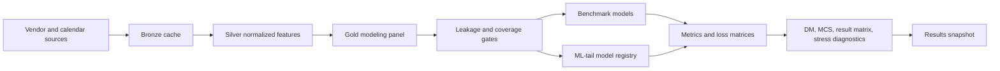

# Results Snapshot

!!! warning "Research-candidate full-run artifact"
    This page is generated from `tailrisk_20160719_20260429_20260429T012650Z_commit_c254a73d`. It summarizes the durable gold modeling sample and run outputs, not the older bounded access-check snapshot. It is still a research-candidate artifact: final manuscript claims require a clean committed run and author review of the tables and notes.

## Discussion Q&A

### What is this project testing?

It tests whether timestamp-safe information available after the U.S. cash close helps forecast the downside tail of the next Osaka Nikkei 225 Futures day-session open.

- The object is tail risk, not average return prediction or a trading signal.
- The comparison is organized as an information ladder: Japan-only history first, then U.S. close core, then Japan proxy ETFs, then Asia proxy ETFs.
- The current page reports what the pipeline produced; it does not automatically claim that any model is best.

### What exactly is being forecast?

The primary target is the loss version of the settle-to-open Nikkei futures gap for the OSE day-session open.

- A positive realized loss means the opening gap moved against the lower-tail risk direction being evaluated.
- Roll/SQ windows and invalid reference prices are excluded from clean target evidence.
- The residual U.S.-close mark target is disabled in this run because there is no licensed timestamped intraday Nikkei mark.

### Why is timing the central issue?

The forecast origin is the U.S. close plus vendor lag, and it must occur before the OSE target open.

- Every joined predictor is audited against `feature_available_ts_utc <= model_cutoff_ts_utc < target_open_ts_utc`.
- FRED features are treated with timestamp-safe release lags; FRED historical values are not ALFRED vintage-safe.
- Leakage audit failures are zero in this run, but warnings remain visible below rather than hidden.

### What has been implemented?

The external benchmark floor and the ML-tail suite are implemented and have completed artifacts in this run.

- Benchmark models include target-history baselines and GARCH/EVT-style econometric floors.
- ML-tail models include direct LightGBM quantile, location-scale LightGBM, and standardized-loss POT-GPD.
- The headline ML-tail table remains strict: it currently keeps direct quantile rows because the newer tail-model variants have shorter common coverage.

### How should broad readers interpret the metrics?

Coverage diagnostics ask whether VaR exceptions are too frequent or too rare; quantile loss scores VaR accuracy; FZ loss scores VaR-ES pairs.

- Lower quantile loss is better only within a common sample and claim boundary.
- FZ loss is only meaningful for valid VaR-ES pairs and needs enough exceptions to avoid short-sample overinterpretation.
- Restricted result-matrix rows are useful diagnostics, not replacements for the headline information-set ladder.

### What is the current bottom line?

The pipeline is now producing full-run research-candidate evidence from the durable gold layer.

- The gold sample starts at the dynamic combined clean start, not the 2016 cache lower bound.
- Benchmark and ML-tail suites both completed with zero recorded forecast failures.
- Before manuscript claims, rerun from a clean commit and review the restricted result matrix, inference gates, and vintage limitations.

## Metadata

| Field | Value |
| --- | --- |
| Run ID | `tailrisk_20160719_20260429_20260429T012650Z_commit_c254a73d` |
| Artifact root | `reports/runs/tailrisk_20160719_20260429_20260429T012650Z_commit_c254a73d` |
| Claim level | `research_candidate` |
| Requested window | `['2016-07-19', '2026-04-29']` |
| Combined clean start | `2018-06-20` |
| Gold panel dates | `2016-07-19 to 2026-04-28` |
| Forecast sample dates | `2018-06-20 to 2026-04-28 (1660 rows)` |
| Git commit | `c254a73d958249c754cacd1eebd2418aeb97fb05` |
| Git dirty | `False` |
| FRED vintage safe | `False` |

- `combined_clean_start` is the modeling lower bound; dates before it remain audit history rather than forecast evidence.
- `git_dirty=True` means this exact run was produced with local uncommitted changes; use a clean committed rerun for manuscript tables.
- `fred_vintage_safe=False` is an explicit limitation: FRED data are current historical values with conservative release lag, not real-time vintage observations.

## Pipeline Structure

- Data-access and cache artifacts live under `data/bronze` and `data/silver`.
- Durable modeling evidence lives under `data/gold`; forecast/evaluation/reporting read from gold and reports.
- Run-specific forecasts, metrics, diagnostics, and LaTeX tables live under `reports/runs/<run_id>`.

## Gold Panel Construction

| Measure | Value |
| --- | --- |
| Gold modeling rows | 2393 |
| Gold columns | 425 |
| Target-audit rows | 2393 |
| Clean target rows | 2197 |
| Forecast-sample rows | 1660 |
| Rows before combined clean start | 412 |
| Target-not-clean rows | 196 |
| Mapping excluded rows | 125 |

| Target audit reason | Rows |
| --- | --- |
| None | 2197 |
| roll_sq_excluded | 195 |
| missing_reference_price | 1 |

- The cache lower bound is 2016-07-19, but XLC/core predictor coverage pushes the actual forecast sample to the combined clean start.
- Target exclusion is explicit: roll/SQ windows and the single missing reference price are carried as audit evidence, not silently dropped.
- The forecast-sample reason column makes the sample boundary reproducible row by row.

## Calendar And Timing Map

| Measure | Value |
| --- | --- |
| Normal trading mappings | 2267 |
| U.S./Japan desync mappings | 126 |
| NYSE early-close mappings | 32 |
| EDT rows | 1549 |
| EST rows | 844 |

- The map covers EST/EDT, early closes, U.S./Japan holiday desynchronization, and normal trading alignments.
- Desync rows are not treated as normal forecast rows.
- The timing map is part of the leakage-bound gold artifact, not ad hoc evaluation logic.

## Feature Coverage

| Source family | Block | Features | Mean missing | Max missing |
| --- | --- | --- | --- | --- |
| asia_proxy | asia_proxy | 6 | 0.000% | 0.000% |
| cboe_volatility | fred_core | 2 | 0.000% | 0.000% |
| fred_core | fred_core | 9 | 0.000% | 0.000% |
| fred_credit_enriched | fred_credit_enriched | 4 | 61.898% | 61.928% |
| fx_core | fx_core | 2 | 0.000% | 0.000% |
| japan_proxy | japan_proxy | 4 | 0.000% | 0.000% |
| massive_daily | us_core | 44 | 0.001% | 0.060% |
| massive_optional | massive_optional | 2 | 0.000% | 0.000% |
| spy_minute | us_late_session | 5 | 0.000% | 0.000% |
| unknown | unknown | 2 | 0.000% | 0.000% |

- U.S. core, proxy ETFs, SPY late-session features, CBOE VIX, FRED rates, and FRED H.10 FX are separated by source family and block.
- Credit-spread FRED features are enriched/optional and visibly late-starting, so they do not move the core clean start.
- Feature coverage should be read together with the leakage summary; high coverage alone is not enough without timestamp validity.

## Leakage Audit

| Field | Value |
| --- | --- |
| Status | `pass_with_warnings` |
| Rows audited | `186654` |
| Failures | `0` |
| Warnings | `181468` |
| Panel row count | `2393` |
| Panel signature seed | `42` |
| Panel signature | `f0981ad53852565aec7396a3be258835587df1eadb2c0b0445683029aa32a209` |

- Zero failures means no audited row violated the hard timestamp invariant.
- Warnings are retained because they identify conservative-lag or missing-feature situations that may matter for interpretation.
- The panel signature is deterministic and binds the leakage check to the current gold panel/config.

## Benchmark Suite

Status: `completed`; forecast rows: `3960`; metric rows: `6`; failures: `0`.

| Model | Information set | Rows | VaR breach rate | Exceptions | Mean quantile loss | Mean FZ loss |
| --- | --- | --- | --- | --- | --- | --- |
| ewma_vol_scaled | target_history_only | 660 | 5.303% | 35 | 0.00139284 | -3.65391 |
| garch_t | target_history_only | 660 | 6.364% | 42 | 0.00135148 | -3.70351 |
| gjr_garch_evt | target_history_only | 660 | 5.606% | 37 | 0.00133621 | -3.73138 |
| gjr_garch_t | target_history_only | 660 | 6.515% | 43 | 0.00134109 | -3.70805 |
| historical_quantile | target_history_only | 660 | 6.061% | 40 | 0.00147857 | -3.51331 |
| rolling_quantile | target_history_only | 660 | 6.061% | 40 | 0.00147852 | -3.50579 |

- Benchmarks set the target-history/econometric floor that ML models should be interpreted against.
- The table is not a leaderboard by itself; coverage, exception counts, quantile loss, and FZ loss must be read together.
- Common-sample rows are reported directly so readers can see the effective evidence size.

## ML-Tail Headline Ladder

Status: `completed_lightgbm_ml_tail_models`; implemented models: `lightgbm_direct_quantile`, `lightgbm_location_scale`, `lightgbm_standardized_loss_pot_gpd`; forecast rows: `3872`; failures: `0`.

| Model | Information set | Rows | VaR breach rate | Exceptions | Mean quantile loss | Mean FZ loss |
| --- | --- | --- | --- | --- | --- | --- |
| lightgbm_direct_quantile | japan_only | 660 | 9.545% | 63 | 0.00147071 | -3.3637 |
| lightgbm_direct_quantile | japan_only_plus_us_close_core | 660 | 11.515% | 76 | 0.00120487 | -3.43912 |
| lightgbm_direct_quantile | japan_only_plus_us_close_core_plus_japan_proxy | 660 | 12.576% | 83 | 0.00115289 | -3.62124 |
| lightgbm_direct_quantile | japan_only_plus_us_close_core_plus_japan_proxy_plus_asia_proxy | 660 | 12.424% | 82 | 0.00115654 | -3.58631 |

- This headline table remains strict and currently reports direct LightGBM quantile across the information ladder.
- Location-scale and POT-GPD are implemented, but their shorter common coverage keeps them out of the headline ladder.
- The apparent improvement in quantile loss as blocks are added is descriptive until inference and coverage diagnostics are reviewed.

## Result Matrix Layer

| Family | Axis | Loss | Rows | Common N | Date range | Joint exceptions |
| --- | --- | --- | --- | --- | --- | --- |
| information_set_ladder | information_set_increment | var_coverage | 12 | 154 to 660 | 2023-03-24 to 2026-04-28 | 16 to 112 |
| information_set_ladder | information_set_increment | var_es_fz_loss | 12 | 154 to 660 | 2023-03-24 to 2026-04-28 | 16 to 112 |
| information_set_ladder | information_set_increment | var_quantile_loss | 12 | 154 to 660 | 2023-03-24 to 2026-04-28 | 16 to 112 |
| tail_model_family | model_family | var_coverage | 12 | 154 to 154 | 2025-08-01 to 2026-04-28 | 17 to 19 |
| tail_model_family | model_family | var_es_fz_loss | 12 | 154 to 154 | 2025-08-01 to 2026-04-28 | 17 to 19 |
| tail_model_family | model_family | var_quantile_loss | 12 | 154 to 154 | 2025-08-01 to 2026-04-28 | 17 to 19 |

- The result matrix is the right place to compare direct quantile, location-scale, and POT-GPD on their restricted common dates.
- It separates VaR-only losses from VaR-ES joint scoring, so VaR-only claims are not confused with ES claims.
- Restricted direct-quantile performance is only a comparison anchor for the tail-model family; it does not replace the headline direct-quantile evidence.

## Stress And Diagnostic Windows

| Suite | Rows | Window labels |
| --- | --- | --- |
| benchmark | 66 | `loss_top_decile` |
| ml_tail | 132 | `loss_top_decile`, `vix_top_decile` |

- Stress windows identify high-loss or high-volatility subsamples for robustness diagnostics.
- These rows use reproducible full-sample classifiers in this first pass, so they should be described as diagnostics rather than a live stress classifier.
- They are useful for finding whether model behavior changes in difficult regimes before writing manuscript discussion.

## Artifact Index

| Artifact | Path | Exists |
| --- | --- | --- |
| manifest | `reports/runs/tailrisk_20160719_20260429_20260429T012650Z_commit_c254a73d/manifest.json` | yes |
| data_vintage | `reports/runs/tailrisk_20160719_20260429_20260429T012650Z_commit_c254a73d/data_vintage.json` | yes |
| modeling_panel | `data/gold/tailrisk_panel/schema_version=1/run_id=tailrisk_20160719_20260429_20260429T012650Z_commit_c254a73d/modeling_panel.parquet` | yes |
| target_audit | `data/gold/tailrisk_panel/schema_version=1/run_id=tailrisk_20160719_20260429_20260429T012650Z_commit_c254a73d/target_audit.parquet` | yes |
| calendar_map | `data/gold/tailrisk_panel/schema_version=1/run_id=tailrisk_20160719_20260429_20260429T012650Z_commit_c254a73d/calendar_map.parquet` | yes |
| feature_coverage | `data/gold/tailrisk_panel/schema_version=1/run_id=tailrisk_20160719_20260429_20260429T012650Z_commit_c254a73d/feature_coverage.parquet` | yes |
| leakage_summary | `data/gold/leakage_summary/schema_version=1/run_id=tailrisk_20160719_20260429_20260429T012650Z_commit_c254a73d/summary.json` | yes |
| benchmark_status | `reports/runs/tailrisk_20160719_20260429_20260429T012650Z_commit_c254a73d/metrics/benchmark_status.json` | yes |
| benchmark_metrics | `reports/runs/tailrisk_20160719_20260429_20260429T012650Z_commit_c254a73d/metrics/benchmark_metrics.parquet` | yes |
| ml_tail_status | `reports/runs/tailrisk_20160719_20260429_20260429T012650Z_commit_c254a73d/metrics/ml_tail_status.json` | yes |
| ml_tail_metrics | `reports/runs/tailrisk_20160719_20260429_20260429T012650Z_commit_c254a73d/metrics/ml_tail_metrics.parquet` | yes |
| ml_tail_metrics_per_model | `reports/runs/tailrisk_20160719_20260429_20260429T012650Z_commit_c254a73d/metrics/ml_tail_metrics_per_model.parquet` | yes |
| ml_tail_result_matrix | `reports/runs/tailrisk_20160719_20260429_20260429T012650Z_commit_c254a73d/metrics/ml_tail_result_matrix.parquet` | yes |
| benchmark_stress_windows | `reports/runs/tailrisk_20160719_20260429_20260429T012650Z_commit_c254a73d/metrics/benchmark_stress_windows.parquet` | yes |
| ml_tail_stress_windows | `reports/runs/tailrisk_20160719_20260429_20260429T012650Z_commit_c254a73d/metrics/ml_tail_stress_windows.parquet` | yes |
| latex_dir | `reports/runs/tailrisk_20160719_20260429_20260429T012650Z_commit_c254a73d/latex/tables` | yes |

- All paths above are local ignored artifacts; they are reproducible outputs, not tracked source files.
- Forecast/reporting rebuilds should read these artifacts and must not call vendor APIs.
- If this page is stale, rerun `just snapshot` after a completed `just full` or pass an explicit run id to the CLI snapshot command.
