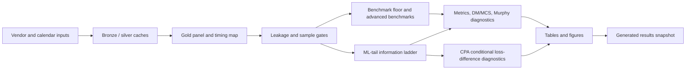

---
hide:
  - navigation
---

# Results Snapshot

> **Research-candidate full-run artifact.** This page is generated from `tailrisk_20160719_20260502_20260501T213508Z_commit_2bdb51ae`.
> It summarizes the durable gold modeling sample and run outputs, not the older
> bounded access-check snapshot. It is still a research-candidate artifact:
> final manuscript claims require a clean committed run and author review of the
> tables and notes.

## Discussion Q&A

### What is this project testing?

It tests whether timestamp-safe information available by the U.S. close cutoff helps forecast left-tail and right-tail risk for the next Osaka Nikkei 225 Futures day-session open.

- The object is tail risk, not average return prediction or an execution rule.
- The comparison is organized as an information ladder: Japan-only history first, then U.S. close core, then Japan proxy ETFs, then Asia proxy ETFs.
- The current page reports what the pipeline produced; it does not automatically make a model-selection claim.

### What exactly is being forecast?

The primary target is the loss version of the settle-to-open Nikkei futures gap for the OSE day-session open.

- Left and right tails are transformed into positive loss units and evaluated separately.
- Roll/SQ windows and invalid reference prices are excluded from clean target evidence.
- The residual U.S.-close mark target is disabled in this run because there is no licensed timestamped intraday Nikkei mark.

### Which Nikkei 225 Futures contract is used when many expiries trade?

The target source is the OSE Nikkei 225 Futures large contract, not mini or micro contracts.

- The J-Quants futures rows are first filtered to rows marked as the central contract month.
- The target audit then requires the day-session open and the previous reference settlement or close to come from the same contract where possible.
- Observations are removed from the clean target evidence when they cross a contract roll, last-trading-day boundary, SQ window, invalid reference price, or missing target field.
- Rule-based quarterly contract metadata exists for audit and diagnostics, but the empirical target is governed by audited J-Quants central-contract flags and same-contract target construction.

### Can returns from different expiries be pooled in one model?

Pooling is done at the observation level, not by stitching raw prices into a naive continuous futures price.

- The target audit first keeps the J-Quants row marked as the central contract month for each trading date.
- It then builds a history by `contract_code` and, for each central-contract row, searches backward inside the same `contract_code` to find the prior reference row.
- The settle-to-open gap is `log(current day-session open) - log(prior settlement)` from that same contract. The close-to-open gap is computed the same way with the same contract's prior day-session close.
- The audit carries `reference_contract_code`, `same_contract_only`, roll/SQ flags, and missing reasons so cross-contract references are visible rather than silently treated as returns.
- A row enters the clean target sample only when the reference is same-contract, the row is outside the roll/SQ window, and required prices are present.
- The model pool is then the time-ordered set of these clean gap observations across successive central quarterly contracts. Benchmarks and ML models fit one active-contract risk process on that pooled clean sample; ML lag and rolling-history features are updated only from clean rows.
- The current headline `Y` is the settle-to-open target: `gap_t = full_gap_settle_to_open`. For left-tail models the positive loss is `-gap_t`; for right-tail models it is `gap_t`. `full_gap_close_to_open` is carried in the panel for audit and alternative diagnostics, but it is not the current headline target family.
- For benchmark models, `X` is target history only: past clean losses/gaps enter empirical quantile, EWMA, GARCH, GJR-GARCH, EVT-style, CAViaR, CARE, GAS, and related benchmark forecasts.
- For ML-tail models, `X` is a nested information ladder. `japan_only` uses lagged clean losses/gaps, rolling loss moments, calendar month terms, DST, and absorption-regime indicators. The next steps add U.S. close core ETF/sector/rates/volatility/FX/late-SPY features, then Japan proxy ETF features, then Asia proxy ETF features.
- `contract_code`, `contract_month`, and roll/SQ flags are retained as audit fields; they are not treated as ordinary ML predictors in the headline ladder.
- This is defensible for forecasting the active large-contract Nikkei 225 futures tail-risk surface. It does not claim that maturity-specific basis, liquidity, or time-to-expiry effects are fully modeled.

### Why carry both settle-to-open and close-to-open gaps?

They are two economically different reference-price definitions, not two targets created to patch missing data.

- `settle-to-open` uses the exchange settlement price as the prior reference. This is the current headline target because settlement is the official futures mark most naturally connected to clearing, margin, and risk-management accounting.
- `close-to-open` uses the prior day-session close as the prior reference. It is more intuitive as a last-traded day-session close-to-next-open return, but it is not the current headline target family.
- The project carries both so the target choice is auditable and so an alternative target can be evaluated without rebuilding the raw futures layer.
- For a pure "information after the U.S. close to OSE open" target, the ideal reference would be a licensed timestamped Nikkei futures mark at the U.S. close cutoff. That target is disabled in this run, so the headline target is explicitly a full settle-to-open opening-gap target.

### Is pre-open tail risk economically meaningful?

Yes, but the claim should be framed as a risk-management channel rather than as evidence that this sample contains observed forced liquidations.

- JPX describes Nikkei 225 Futures as margin-based leveraged contracts and warns that leverage affects losses as well as profits; under market stress, additional cash margin can be needed and losses can exceed the deposited margin ([JPX Nikkei 225 Futures overview](https://www.jpx.co.jp/english/derivatives/products/domestic/225futures/)).
- JPX's margin overview gives the general mechanism: adverse futures and options price movements can create significant losses, and margin is posted to ensure payments when losses occur ([JPX margin overview](https://www.jpx.co.jp/english/derivatives/rules/margin/)).
- JSCC's futures/options margin rules make the channel operational: listed derivatives are margined through JSCC, customer positions require margin, and intraday/emergency margin calls can apply; the emergency margin-call list explicitly includes Nikkei 225 Futures ([JSCC Margin on Futures and Options](https://www.jpx.co.jp/jscc/en/cash/futures/marginsystem/margin.html)).
- JSCC also has margin add-ons for liquidity and concentration risk, including the index-futures group containing Nikkei 225 Futures, which supports the interpretation that tail moves matter through both price risk and market-depth/position-size channels ([JSCC Margin Add-on Rules](https://www.jpx.co.jp/jscc/en/cash/futures/marginsystem/addonim.html)).
- The useful paper insight is therefore not "we observe forced liquidation." It is that pre-open tail forecasts proxy a real risk-management problem: leveraged futures positions can face margin, liquidity, and risk-limit pressure when the opening price jumps before normal day-session liquidity is available.
- Historical cases such as Barings show that Nikkei futures losses and margin/funding pressure can become institutionally material, but they are channel motivation rather than direct sample evidence. Use official/regulatory sources for the collapse record and academic market-stress context ([GOV.UK Barings inquiry report](https://www.gov.uk/government/publications/report-into-the-collapse-of-barings-bank); [Steenbeek 1999, Bank of Japan edited volume metadata](https://pure.eur.nl/en/publications/price-discovery-during-periods-of-stress-barings-the-kobe-quake-a/)).

### Is it fair that benchmarks use less information than ML models?

It is fair only if the comparison is framed correctly.

- Benchmark models are target-history-only floors: the benchmark shards read only forecast dates, clean realized losses, and the underlying gap needed to define left- versus right-tail losses.
- "Target history only" does not mean a naive one-lag regression. Historical and rolling quantiles use empirical target distributions, EWMA and GARCH-style models estimate volatility dynamics, and CAViaR/CARE/GAS-style benchmarks impose their own tail-dynamic structure.
- ML Model A (`japan_only`) is feature engineering on the same target-history source: lagged clean losses/gaps, rolling mean/volatility/tail summaries, calendar month terms, DST, and absorption-regime indicators. It does not use U.S. close predictor blocks.
- This makes Model A broadly comparable as a no-U.S.-information ML baseline, but not a perfectly identical-feature comparison. ML A exposes target-history summaries as tabular predictors; econometric benchmarks encode target-history dynamics through model structure.
- The Model B/C/D ladder is not a pure algorithm horse race against the benchmarks. It is an incremental-information experiment: after the Japan/history baseline, do U.S. close core, Japan proxy, and Asia proxy features add forecast value?
- Therefore the paper should avoid saying "LightGBM beats econometric benchmarks" as a standalone learner claim. The safer claim is that the nested ML-tail ladder tests whether timestamp-safe U.S. close information improves tail-risk forecasts beyond target-history baselines.

### Are benchmark forecasts dynamic, or are their daily tail quantiles fixed?

They are not fixed full-sample quantile lines. Each benchmark forecast is generated as a dated out-of-sample forecast using information available before that forecast date.

- In the broad time-varying-forecast sense, all benchmark models are dynamic: the floor benchmark loop uses only clean target history up to `t-1` when producing the forecast for date `t`.
- Historical and rolling quantiles therefore update as the eligible history changes, although they can move in step-like fashion because empirical tail order statistics often remain unchanged for several adjacent dates.
- EWMA, GARCH-t, GJR-GARCH-t, and GJR-GARCH-EVT produce daily forecasts through volatility or tail-scaling estimates based on the training history.
- In the stricter stateful-model sense, not all benchmarks are dynamic recursion models. CAViaR, CARE, GAS, and Taylor/FZ-style variants are the stateful dynamic benchmark layer: they refit parameters on the registered refit calendar and update the latent VaR/scale state through valid panel dates.
- The current benchmark artifacts should therefore be read as daily out-of-sample VaR/ES forecasts, not as a single in-sample high quantile reused across the whole evaluation window.

### Are the four ML information layers engineered in the same way?

Mostly yes. The layers differ by which source blocks are admitted, not by giving later layers a special feature-engineering recipe.

- Every ML layer includes the same target-history features: lagged clean losses/gaps, rolling means, rolling volatility, rolling tail quantile, calendar month, DST, and absorption-regime indicators.
- Daily ETF and asset-market blocks use the same simple transformations: close-to-close log returns and log high-low ranges, frozen at the audited U.S. close cutoff.
- FRED/Cboe/rates/volatility blocks use levels, first differences, staleness/release-lag diagnostics, and Cboe VIX range where available.
- USDJPY uses timestamp-safe level and return features from the canonical FX source.
- The SPY minute block is the main intraday-engineered block: late 30-minute and 60-minute returns, late-session range, final-window momentum, and late-volume surge.
- The nested difference is source access: `japan_only` has target-history/calendar features; the U.S. core layer adds U.S. ETF/sector/rates/volatility/FX/late-SPY features; Japan proxy adds EWJ/DXJ return/range; Asia proxy adds EWY/EWT/EWH return/range.

### Is the feature engineering strong enough relative to nearby literature?

It is defensible for a timestamp-safe first headline design, but it is not the richest possible tail-risk feature set.

- The current design is aligned with the literature's basic structure: target-history/HAR-like summaries, market returns/ranges, macro-financial predictors, and cross-market spillover variables. Recent realized-volatility ML evidence also warns that extra predictors can help daily/weekly forecasts, but nonlinear ML does not systematically dominate simpler models, so the current conservative ladder is appropriate ([Branco, Rubesam, and Zevallos 2024](https://www.sciencedirect.com/science/article/abs/pii/S0927539824000598)).
- The cross-market motivation is also standard: U.S. and Japanese index futures studies find economically important U.S.-to-Japan return and volatility spillovers, which supports the U.S. close information ladder ([Pan and Hsueh 1998](https://ideas.repec.org/a/kap/apfinm/v5y1998i3p211-225.html)).
- Overnight and intraday decomposition is relevant to the question: ETF/futures evidence treats overnight and daytime returns as different risk objects and evaluates VaR/ES or tail risk separately ([Liu and Tse 2017](https://www.sciencedirect.com/science/article/pii/S1059056016301563)).
- The main gap versus tail-risk frontier papers is high-frequency realized information. Realized-measure VaR/ES models often use realized variance, realized range, and related intraday measures to drive tail dynamics; recent work even adds realized skewness and kurtosis ([Gerlach and Wang 2020](https://www.sciencedirect.com/science/article/pii/S0169207019301992); [Chen, Hsu, and Watanabe 2023](https://www.sciencedirect.com/science/article/pii/S1544612322005050); [Dynamic tail risk forecasting with realized skewness and kurtosis, 2024](https://arxiv.org/abs/2409.13516)).
- The most relevant next additions are therefore not more generic U.S. ETFs. They are timestamp-safe Nikkei/OSE-specific realized features: intraday realized volatility, realized range, downside/upside semivariance, realized skewness/kurtosis, jump/range indicators, night-session partial measures if available before the cutoff, Nikkei implied-volatility/options measures, and liquidity or depth variables such as volume, open interest changes, spreads, and days-to-expiry controls.
- These additions should enter an enriched or robustness information set first, not the current headline ladder. The clean sample has only about 1.6k forecast rows, so adding many high-dimensional predictors without stronger gates would raise overfitting and data-snooping concerns.

### Why is timing the central issue?

The forecast origin is the U.S. close plus vendor lag, and it must occur before the OSE target open. "U.S. close information" means information available by this cutoff; it does not mean all U.S. after-close or overnight news.

- Every joined predictor is audited against `feature_available_ts_utc <= model_cutoff_ts_utc < target_open_ts_utc`.
- FRED features are treated with timestamp-safe release lags; FRED historical values are not ALFRED vintage-safe.
- Leakage audit failures are zero in this run, but warnings remain visible below rather than hidden.

### Why does the clean sample start in 2018?

The requested data window begins earlier, but the clean forecast sample starts only when all required target and predictor blocks satisfy the registered coverage and timing gates.

- Earlier rows remain useful for target-history audit, raw-cache checks, and training history, but they are not forecast evidence under the current clean-sample contract.
- The clean start is driven by combined J-Quants required-field coverage, Massive daily entitlement coverage, required FRED coverage, and canonical FX timing coverage.
- Post-2018 rows satisfy the current clean-sample gates for the required headline blocks; isolated feature-level gaps are still audited, and enriched or optional blocks can have shorter histories unless promoted by a future specification.

### What has been implemented?

The benchmark floor, advanced benchmark suite, and ML-tail suite are implemented and have completed artifacts in this run.

- Benchmark floor models include target-history baselines and GARCH/EVT-style econometric floors.
- Advanced benchmark families such as CAViaR, CARE/expectile, Taylor ALD, direct FZ-loss, and GAS now produce nonblocking empirical forecast rows; their interpretation still follows the benchmark/restricted-sample gates.
- ML-tail models include direct LightGBM quantile, location-scale LightGBM, and standardized-loss POT-GPD.
- The headline ML-tail table remains strict: it currently keeps direct quantile rows because the newer tail-model variants have shorter common coverage.

### Why call CAViaR, CARE, GAS, and FZ-style models "advanced" if they are benchmarks?

They are benchmarks. "Advanced" is an internal tier label, not a claim that they are the paper's primary model family.

- The benchmark suite has two target-history-only tiers: floor benchmarks and advanced econometric benchmarks.
- Floor benchmarks are simple, robust reference points such as historical quantile, rolling quantile, EWMA, GARCH-t, GJR-GARCH-t, and GJR-GARCH-EVT.
- Advanced benchmarks are still target-history-only, but they are more specialized tail-risk models: CAViaR recursively models VaR, CARE uses expectile-based tail dynamics, GAS updates a parametric state by score dynamics, and Taylor/FZ-style variants optimize VaR-ES-oriented losses.
- The reason to separate them is practical and interpretive: these models have heavier optimization, recursive state updates, calibration choices, and shorter or more fragile valid-sample gates.
- A referee will usually view all of them as benchmark/econometric comparators rather than as a separate contribution. The paper should therefore call them "advanced econometric benchmarks" or "extended benchmark suite," not present them as a third headline model class competing with the information-set ladder.

### Why use LightGBM as the ML learner?

LightGBM is used as a fixed, tabular, nonlinear learner for the nested information-set experiment, not as an algorithmic novelty claim.

- It handles mixed market predictors, nonlinearities, and interactions without turning the paper into a broad model tournament.
- Hyperparameters are held fixed across information sets and refit dates to limit data-dependent tuning.
- The econometric benchmark suite remains the main non-ML comparison layer; LightGBM is the ML information-extraction layer.

### Why are POT-GPD and location-scale not in the headline ML table?

They are implemented, but they do not replace the headline direct-quantile ladder.

- The headline ladder uses the strict shared information-set sample and currently retains direct LightGBM quantile rows.
- Location-scale and standardized-loss POT-GPD rows are restricted or diagnostic evidence when their common-sample and tail-event gates are shorter.
- EVT should therefore be described as a tail-calibration and robustness layer in this run, not as the central headline empirical result.

### What performance metrics are used, and how should they be read?

The main metric tables report a tail-risk forecast evaluation panel, not a single leaderboard.

- The core headline columns are `rows`, `var_breach_rate`, `expected_breach_rate`, `exceedance_count`, `kupiec_pvalue`, `christoffersen_pvalue`, `mean_quantile_loss`, `mean_fz_loss`, and `mean_exceedance_severity`.
- `rows` is the number of valid out-of-sample forecasts. `var_breach_rate` is the fraction of realized losses exceeding the VaR forecast, and `expected_breach_rate` is the nominal rate implied by the tail level. At `tail_level = 0.95`, the nominal breach rate is 5%.
- `exceedance_count` records the number of VaR exceptions. `kupiec_pvalue` tests unconditional VaR coverage, while `christoffersen_pvalue` tests whether exceptions show serial dependence.
- `mean_quantile_loss` is the VaR pinball loss. `mean_fz_loss` is the joint VaR-ES Fissler-Ziegel score for valid VaR-ES forecast pairs. `mean_exceedance_severity` measures how far realized losses exceed VaR conditional on an exception.
- These columns are present in both `benchmark_metrics.parquet` and `ml_tail_metrics.parquet`, so benchmark and ML-tail rows can be read through the same metric vocabulary.

### What dimensions do the performance metrics cover?

The evaluation design separates four dimensions.

- Calibration and coverage: breach rates, expected breach rates, Kupiec tests, and Christoffersen tests ask whether VaR exceptions are too frequent, too rare, or clustered.
- Scoring accuracy: quantile loss evaluates VaR forecasts, and FZ loss evaluates joint VaR-ES forecast pairs. These scoring losses matter because a model can have a near-nominal breach rate while setting VaR too conservatively.
- Tail severity: exceedance counts and mean exceedance severity describe how often the forecast fails and how large the misses are, which is economically relevant for margin, liquidity, and risk-limit interpretation.
- Statistical comparison: block-bootstrap DM records, HLN/Tmax MCS records, restricted result-matrix rows, CPA conditional loss-difference diagnostics, Murphy elementary-score diagnostics, stress-window diagnostics, and DST attenuation diagnostics keep model comparisons from resting on raw average losses alone.

### Are these metrics comprehensive and standard enough for this research?

For the current research question, the metric set is comprehensive enough and is organized conservatively.

- The project does not rely only on breach rates or only on scoring losses. It checks VaR coverage, exception independence, VaR loss, joint VaR-ES loss, exception severity, common-sample fairness, loss-difference inference, information-set increments, and stress/DST diagnostics.
- The classic components are standard in VaR and forecast-evaluation work: Kupiec unconditional coverage, Christoffersen independence, quantile loss, Diebold-Mariano-style forecast comparison, and Model Confidence Set.
- The more modern tail-risk components are also appropriate for current VaR/ES work: Fissler-Ziegel joint VaR-ES scoring, Murphy-style elementary-score diagnostics, CPA conditional predictive ability diagnostics, common-sample/model-eviction gates, and restricted result matrices for avoiding sample-mismatch comparisons.
- The design is therefore not just a legacy backtest, and it is not an unconstrained collection of diagnostics. The headline layer stays conservative, while the diagnostic layer records how robust the interpretation is.
- The current reading discipline is to inspect `breach_rate`, `Kupiec`, `Christoffersen`, `quantile_loss`, `FZ_loss`, `exception_count`, common-sample status, and inference status together. In this run, benchmark floor rows have breach rates closer to the nominal 5% level, while some ML-tail information sets have lower loss scores; that pattern should be interpreted as a coverage-versus-scoring tradeoff, not as a standalone statement that the lower-loss model is better calibrated.
- Restricted result-matrix rows and downstream diagnostics are useful evidence, but they do not replace the headline information-set ladder unless they pass the registered sample and claim gates.

### Why can benchmarks have better breach rates while ML has lower loss?

This pattern is supported by the current artifacts as a cautious interpretation, not as a model-selection claim.

- Benchmark floor breach rates are closer to the nominal 5% VaR level, so they are better calibrated on coverage.
- Some LightGBM information sets have lower quantile or FZ loss because their VaR levels are less conservative on average.
- Lower loss can therefore partly reflect a sharper or more aggressive VaR forecast, which is why coverage, loss, exception counts, and inference gates must be read together.

### Where does LightGBM help relative to benchmarks?

The current evidence supports a candidate information-extraction role, especially in the left-tail ladder after adding U.S. close core variables.

- It does not support a blanket statement that LightGBM is better calibrated than the benchmark floor.
- The reported tables evaluate average loss and breach behavior, not median conditional forecast quality.
- A median-effect claim would need an explicit median loss or paired distribution diagnostic; it is not a current headline result.

### What differs between left-tail and right-tail results?

The two risk surfaces are intentionally separated.

- Left-tail quantile loss changes most when U.S. close core variables are first added to Japan-only history.
- Right-tail changes are smaller at the U.S. core step and appear more dependent on later proxy blocks in the current ladder.
- The paper should therefore avoid treating upside and downside opening-gap risk as one symmetric mechanism.

### Which U.S. close core variables may be contributing?

The core block aggregates U.S. equity, sector, volatility, FX, rates, credit-risk, and late-session SPY features available by the cutoff.

- Plausible contributors include broad index ETFs, sector dispersion, VIX/Cboe volatility measures, Treasury-rate changes, USD/JPY controls, credit-risk proxies, and SPY late-session pressure.
- The current tables support block-level interpretation more than feature-level attribution.
- Any feature-level story should be presented as descriptive diagnostics unless supported by a dedicated attribution design.

### Do Japan proxy or Asia proxy ETFs add more?

In the current headline ladder, the largest change generally appears when U.S. close core variables are added.

- After U.S. close core, Japan proxy ETFs add more visible marginal loss reduction than the Asia proxy block.
- The Asia proxy block adds little incremental improvement in the current headline quantile-loss ladder and can slightly worsen the left-tail row.
- These proxy-block patterns are descriptive and should not be written as structural regional price-discovery claims.

### Which journals look like plausible homes for a paper from this project?

The strongest fit depends on whether the paper is framed as a futures-market paper, a forecasting paper, or an Asia-Pacific market-information paper.

- **Journal of Futures Markets** is the most natural finance-market outlet because the object is an exchange-traded futures contract and the evidence concerns tail-risk forecasting, market information, and risk-management interpretation. Recent Journal of Futures Markets contents include futures volatility forecasting, downside risk, option-implied risk, tail-risk spillovers, and machine-learning/interpretable-model work ([Journal page](https://onlinelibrary.wiley.com/journal/10969934); [recent RePEc contents](https://ideas.repec.org/s/wly/jfutmk.html)).
- **International Journal of Forecasting** is a higher-stretch but credible fit if the contribution is written as a timestamp-safe forecasting design. Its scope explicitly includes financial forecasting, forecast evaluation, implementation, forecast uncertainty, machine-learning forecasting, and reproducible online supplements ([IJF aims and scope](https://www.sciencedirect.com/journal/international-journal-of-forecasting)).
- **Pacific-Basin Finance Journal** is a strong fit if the manuscript emphasizes Japan/OSE, Asia-Pacific capital markets, and useful empirical finance. Its scope focuses on reliable empirical research on Asia-Pacific capital markets and useful research for real financial-market decision problems ([PBFJ aims and scope](https://www.sciencedirect.com/journal/pacific-basin-finance-journal)); it has also published Nikkei futures volatility work ([Bacha and Vila 1994](https://www.sciencedirect.com/science/article/pii/0927538X94900175)).
- **Journal of Forecasting** is a reasonable fallback for a benchmark-rich financial forecasting article, especially if the evaluation framework and forecast comparison are foregrounded ([Journal page](https://onlinelibrary.wiley.com/journal/1099131x); [recent RePEc contents](https://ideas.repec.org/s/wly/jforec.html)).
- **The Journal of Risk** is a conditional fit if the manuscript is recast around VaR/ES risk measurement and model validation. Its scope targets financial risk measurement, management, volatility/jumps, risk measures, and AI/ML in financial risk management ([Journal of Risk scope](https://www.risk.net/journal-of-risk)).
- **Quantitative Finance** is possible but more demanding: its scope includes financial econometrics, market dynamics and prediction, derivatives, microstructure, liquidity, and operational risk, but it will likely expect stronger quantitative or methodological novelty than a single-market information-ladder application ([Quantitative Finance aims and scope](https://www.tandfonline.com/journals/rquf20/about-this-journal)).
- **Finance Research Letters** is better as a compressed short-paper venue. It lists forecasting, financial econometrics, financial markets, microstructure, and risk among finance areas, but the full benchmark/diagnostic design is probably too large for a letter-length paper ([FRL aims and scope](https://www.sciencedirect.com/journal/finance-research-letters)).

### What manuscript story versions are feasible?

The safest stories keep the claim inside the evidence gates.

- **Story A: timestamp-safe U.S. close information for OSE pre-open tail risk.** This is the main recommendation. The contribution is the information ladder: Japan-only history, U.S. close core, Japan proxy, and Asia proxy blocks under strict timing and leakage audits. Likely outlets are Journal of Futures Markets, Pacific-Basin Finance Journal, and International Journal of Forecasting.
- **Story B: futures opening-risk management.** The paper frames settle-to-open VaR/ES as a margin, liquidity, and risk-limit problem for leveraged Nikkei futures. The empirical punchline is not that ML is perfectly calibrated, but that richer timestamp-safe information can sharpen loss forecasts under a clear coverage caveat. Likely outlets are Journal of Futures Markets, The Journal of Risk, and Pacific-Basin Finance Journal.
- **Story C: forecast-evaluation discipline for financial tail risk.** The paper emphasizes common samples, benchmark floors, FZ scoring, DM/MCS, CPA, Murphy diagnostics, and claim gates. This is most suitable for International Journal of Forecasting or Journal of Forecasting if the paper is written as a reusable evaluation design rather than a narrow Nikkei case study.
- **Story D: left/right asymmetry and partial overnight absorption.** This is a secondary story. It stresses that "U.S. close information" means information available by the cutoff, not all overnight news, and that left and right opening-tail surfaces should be evaluated separately. This story is useful in the introduction and discussion, but probably should not be the only headline claim.
- Across all versions, avoid claims that LightGBM unconditionally beats econometric benchmarks, that proxy ETFs prove regional price discovery, that the study observes forced liquidation, or that the disabled U.S.-close residual target has been estimated.

### What is the main referee risk in the current evidence?

The most likely challenge is not whether the pipeline ran, but whether the claims are kept inside the evidence gates.

- ML headline breach rates are too high relative to the nominal VaR level, even where loss metrics improve.
- EVT and location-scale models are implemented but not headline-retained.
- "U.S. close information" must be defined as information available by the cutoff, not all after-close news.
- FRED is conservatively lagged but not ALFRED vintage-safe, and feature-level explanations remain descriptive.
- Final manuscript claims require a clean committed run and author review of tables, sample gates, and inference diagnostics.

### What is the current bottom line?

The pipeline is now producing full-run research-candidate evidence from the durable gold layer.

- The gold sample starts at the dynamic combined clean start, not the 2016 cache lower bound.
- Benchmark floor, advanced benchmark, and ML-tail suites completed with zero recorded forecast failures; advanced rows are implemented evidence but remain nonblocking until author-reviewed against the same sample/inference gates.
- Before manuscript claims, review the headline/restricted/diagnostic boundaries, inference gates, and vintage limitations rather than selecting a model from one metric.

### Which results can support headline claims?

| Evidence layer | Can support headline claim? | How to read it |
| --- | --- | --- |
| Benchmark common-sample table | Yes, after review | External target-history/econometric floor on a shared sample. |
| ML-tail headline ladder | Yes, after review | Strict information-set ladder; currently direct quantile survived the gate. |
| ML-tail per-model rows | No | Model-specific OOS diagnostics; samples need not match across model families. |
| Restricted result matrix | No headline claim | Matched-date comparison for model families and within-model increments. |
| DST, stress, Murphy, hedge-trigger diagnostics | Diagnostic only | Useful for interpretation and risk monitoring, not automatic model-selection evidence. |

- Headline claims require a clean committed run, a shared common sample, zero leakage failures, and author-reviewed tables.
- Restricted rows can explain model-family behavior on matched dates, but they cannot replace the headline information ladder.
- Diagnostic rows can motivate discussion and future checks; they should not be worded as model-selection or risk-management usefulness claims without their own evidence gates.

## Results And Discussion

<!-- generated: results_discussion -->

### Data and timing audit

- The gold timing map covers `2016-07-19 to 2026-05-01` and the combined clean start is `2018-06-20`.
- No forecast-sample rows before `2018-06-20` enter the modeling evidence.
- The leakage check reports status `pass_with_warnings` with zero leakage failures and `572328` warnings.
- FRED vintage safety is recorded as `False`; FRED values use conservative release timing but remain current historical observations rather than ALFRED real-time vintages.

### Benchmark floor and advanced benchmarks

- `benchmark_metrics.parquet` reports `12` common-sample rows across `6` benchmark model families and `2` tail side(s), while benchmark forecasts contain `21146` model-date rows.
- Benchmark-floor models are external target-history and econometric baselines; this section does not rank them.
- Advanced benchmark rows are implemented for `10` model families and contribute `13214` nonblocking forecast rows; these rows are claim-gated diagnostics unless a manuscript table explicitly promotes them through the same sample and inference review.
- Benchmark-floor breach rates have a median of `0.0605144`, within 2.5 percentage points of the nominal level, indicating reasonable coverage calibration relative to the ML-tail models whose breach rates are reported in the headline ladder section.

### Left/right ML-tail headline ladder

- `ml_tail_metrics.parquet` defines the headline ML-tail information-set ladder for this run.
- The headline artifact contains `2` information sets, `1` tail level(s), and `2` tail side(s); the retained headline model rows are `lightgbm_direct_quantile`.
- The implemented ML-tail registry is `lightgbm_direct_quantile`, `lightgbm_location_scale`, `lightgbm_standardized_loss_pot_gpd`, but the headline ladder should be read only from `ml_tail_metrics.parquet`.
- The ladder reports downside-risk and upside-risk surfaces separately. The registered artifacts show different left/right patterns, and the generator does not assume that the two sides share the same economic mechanism.
- Coverage warning: all `4` headline rows exhibit VaR breach rates (`0.0922844` to `0.118003`) that exceed the nominal level by more than 2.5 percentage points. Quantile-loss and FZ-loss differences across the information ladder must be interpreted in this context; lower loss scores may partly reflect more aggressive VaR levels rather than better conditional tail calibration.
- The ladder is used to assess candidate incremental U.S.-close information under strict common-sample rules; it does not by itself establish forecast improvement.

### Restricted model-family comparison

- `ml_tail_result_matrix.parquet` contains restricted common-sample comparisons for `3` LightGBM tail-model families.
- The restricted common-N range is `138 to 626` and the joint-exception range is `10 to 102`.
- Recorded claim scopes are `restricted_model_comparison_not_headline`; these rows are restricted evidence and cannot replace the headline information-set ladder.
- The tail-model family comparison is severely sample-limited: the largest restricted common-N is `155` rows. No model-family ranking claim is supportable from this restricted sample; extended OOS coverage is needed before tail-model family ranking becomes meaningful.
- Result-matrix inference is recorded separately from the headline suite-level DM/MCS: restricted DM records include `68` gate-pass rows and `34` unavailable rows; restricted MCS records include `0` gate-pass rows and `72` unavailable rows. These entries are restricted common-sample diagnostics, not headline model-family rankings.
- The result matrix is a matched-date diagnostic layer. It should not be worded as one family being better than another.

### Coverage and inference gates

- Coverage review flags `4/4` headline rows with breach rates more than 2.5 percentage points from nominal coverage; Kupiec p-values fall below 0.05 in `4/4` rows and Christoffersen p-values fall below 0.05 in `0/4` rows where reported.
- Model-eviction artifacts record `4` retained rows and `20` non-retained rows under the headline sample policy.
- Block-bootstrap DM and HLN Tmax MCS artifacts are unconditional forecast-comparison diagnostics; any p-value should be read on average across the unconditional evaluation sample, not as condition-specific evidence.
- Loss differentials alone do not constitute an improvement claim; coverage, exception counts, sample gates, and inference status must be reviewed together.
- Result-matrix tail-event power flags and suite-level inference gates report `0` restricted rows with insufficient tail-event power and `0/28` unavailable DM/MCS inference rows.

### CPA as conditional loss-difference diagnostics

- The ML-tail information-ladder CPA artifact is a conditional loss-difference diagnostic across `2` tail side(s), with `18` registered row(s), `18` HAC-Wald gate pass(es), and loss families `var_es_fz_loss`, `var_quantile_loss`.
- The registered cross-model CPA artifact is a conditional loss-difference diagnostic with `288` row(s), `288` HAC-Wald gate pass(es), and loss families `var_es_fz_loss`, `var_quantile_loss`.
- Quantile-loss CPA and FZ-loss CPA are downstream inference over existing loss differentials; CPA does not generate VaR/ES forecasts and does not replace DM/MCS.

### Supporting diagnostics

- Supporting LaTeX diagnostic table files are present for `4/4` registered diagnostic families.
- `ml_tail_dst_attenuation.parquet` contains `12` DST attenuation rows; these are descriptive timing-regime forecast diagnostics. They do not establish a structural timing mechanism.
- ES severity diagnostics contain `40` finite rows with mean exceedance severity ranging from `0.00462224` to `0.0199697`; this is conditional-on-exception evidence.
- The diagnostic 75th-percentile VaR trigger rule marks `7257` model-date rows; `605` of those rows coincide with VaR exceptions out of `1934` total exceptions, and mean triggered exception severity is `0.0134817`. This is a pre-open risk-monitoring diagnostic, not hedge PnL, transaction-cost, or trading-alpha evidence.
- Stress-window diagnostics contain `402` rows, and Murphy diagnostics contain `800` ML-tail rows.
- Feature-unavailability diagnostics contain `24` rows.
- Figure manifest references:
  - Figure: coverage_breach_rates_left_tail (Source: metrics/benchmark_metrics.parquet, metrics/benchmark_metrics_per_model.parquet, metrics/ml_tail_metrics.parquet, metrics/ml_tail_metrics_per_model.parquet; Claim scope: coverage_diagnostic_not_headline_claim; File: latex/figures/coverage_breach_rates_left_tail.png).
  - Figure: coverage_breach_rates_right_tail (Source: metrics/benchmark_metrics.parquet, metrics/benchmark_metrics_per_model.parquet, metrics/ml_tail_metrics.parquet, metrics/ml_tail_metrics_per_model.parquet; Claim scope: coverage_diagnostic_not_headline_claim; File: latex/figures/coverage_breach_rates_right_tail.png).
  - Figure: benchmark_murphy_left_tail (Source: metrics/benchmark_murphy.parquet; Claim scope: murphy_diagnostic_benchmark_floor_common_grid; File: latex/figures/benchmark_murphy_left_tail.png).
  - Figure: benchmark_murphy_right_tail (Source: metrics/benchmark_murphy.parquet; Claim scope: murphy_diagnostic_benchmark_floor_common_grid; File: latex/figures/benchmark_murphy_right_tail.png).
  - Figure: ml_tail_murphy_left_tail (Source: metrics/ml_tail_murphy.parquet; Claim scope: murphy_diagnostic_ml_tail_headline_ladder_common_grid; File: latex/figures/ml_tail_murphy_left_tail.png).
  - Figure: ml_tail_murphy_right_tail (Source: metrics/ml_tail_murphy.parquet; Claim scope: murphy_diagnostic_ml_tail_headline_ladder_common_grid; File: latex/figures/ml_tail_murphy_right_tail.png).
  - Figure: dst_attenuation_left_tail (Source: metrics/ml_tail_dst_attenuation.parquet; Claim scope: descriptive_dst_attenuation_not_structural_causal_identification; File: latex/figures/dst_attenuation_left_tail.png).
  - Figure: dst_attenuation_right_tail (Source: metrics/ml_tail_dst_attenuation.parquet; Claim scope: descriptive_dst_attenuation_not_structural_causal_identification; File: latex/figures/dst_attenuation_right_tail.png).
  - Figure: es_severity_left_tail (Source: metrics/benchmark_metrics.parquet, metrics/ml_tail_metrics.parquet, metrics/ml_tail_metrics_per_model.parquet; Claim scope: es_severity_diagnostic_not_model_selection_claim; File: latex/figures/es_severity_left_tail.png).
  - Figure: es_severity_right_tail (Source: metrics/benchmark_metrics.parquet, metrics/ml_tail_metrics.parquet, metrics/ml_tail_metrics_per_model.parquet; Claim scope: es_severity_diagnostic_not_model_selection_claim; File: latex/figures/es_severity_right_tail.png).
  - Figure: trigger_diagnostics_left_tail (Source: forecasts/benchmark_forecasts.parquet, forecasts/ml_tail_forecasts.parquet; Claim scope: trigger_diagnostic_not_pnl_cost_or_alpha; File: latex/figures/trigger_diagnostics_left_tail.png).
  - Figure: trigger_diagnostics_right_tail (Source: forecasts/benchmark_forecasts.parquet, forecasts/ml_tail_forecasts.parquet; Claim scope: trigger_diagnostic_not_pnl_cost_or_alpha; File: latex/figures/trigger_diagnostics_right_tail.png).

### Not yet claimed

- DST attenuation rows are descriptive forecast evidence; structural DST causal identification is not claimed.
- No hedge PnL, transaction-cost, or trading-alpha analysis is performed. The trigger table is a pre-open risk-monitoring diagnostic only.
- Left-tail and right-tail outputs are both economic tail-risk surfaces for futures positions; neither side should be promoted beyond the sample, coverage, and inference gates without author review.
- The current evidence does not create an automatic model-selection statement; any manuscript claim still requires author review of sample gates, coverage, loss metrics, and inference diagnostics.

## Run Metadata

| Field | Value |
| --- | --- |
| Run ID | `tailrisk_20160719_20260502_20260501T213508Z_commit_2bdb51ae` |
| Artifact root | `reports/runs/tailrisk_20160719_20260502_20260501T213508Z_commit_2bdb51ae` |
| Claim level | `research_candidate` |
| Requested window | `['2016-07-19', '2026-05-02']` |
| Combined clean start | `2018-06-20` |
| Gold panel dates | `2016-07-19 to 2026-05-01` |
| Forecast sample dates | `2018-06-20 to 2026-05-01 (1661 rows)` |
| Git commit | `2bdb51ae80e0b59ff202a24d704af5ae47f4d7cc` |
| Git dirty | `True` |
| FRED vintage safe | `False` |

- `combined_clean_start` is the modeling lower bound; dates before it remain audit history rather than forecast evidence.
- `git_dirty` is recorded so dirty runs can be rejected before manuscript tables are frozen.
- `fred_vintage_safe=False` is an explicit limitation: FRED data are current historical values with conservative release lag, not real-time vintage observations.

## Technical Infrastructure Note

- Runtime imports are explicit at the module boundary; no dynamic runtime namespace bridge is required to generate this snapshot. This infrastructure note is separate from empirical claim boundaries.

## Evidence Map

- The left branch binds vendor and calendar inputs into a timestamp-audited gold panel.
- The middle branch compares benchmark floors, advanced econometric benchmarks, and ML-tail forecasts on registered loss units.
- The right branch separates headline ladders, restricted model-family comparisons, unconditional DM/MCS inference, CPA diagnostics, and supporting figures.

## Pipeline Structure

| Step | Layer | Purpose |
| --- | --- | --- |
| 1 | Vendor and calendar sources | Pull or read J-Quants, Massive, FRED, CBOE, and exchange-calendar inputs. |
| 2 | Bronze and silver cache | Preserve typed vendor/cache rows, then normalize timestamp-safe research features. |
| 3 | Gold modeling panel | Join targets, calendar map, feature coverage, and leakage-bound signatures. |
| 4 | Leakage and coverage gates | Enforce timestamp ordering and sample eligibility before evaluation. |
| 5 | Benchmark floor and ML-tail registry | Run target-history/econometric floors and LightGBM tail-model families. |
| 6 | Metrics, inference, diagnostics | Build loss matrices, DM/MCS/Murphy diagnostics, stress windows, and result matrix artifacts. |
| 7 | Results snapshot | Summarize run-specific evidence and claim boundaries for reader review. |

- Data-access and cache artifacts live under `data/bronze` and `data/silver`.
- Durable modeling evidence lives under `data/gold`; forecast/evaluation/reporting read from gold and reports.
- Run-specific forecasts, metrics, diagnostics, and LaTeX tables live under `reports/runs/<run_id>`.

## Gold Panel Construction

| Measure | Value |
| --- | --- |
| Gold modeling rows | 2395 |
| Gold columns | 1176 |
| Target-audit rows | 2395 |
| Clean target rows | 2199 |
| Forecast-sample rows | 1661 |
| Rows before combined clean start | 412 |
| Target-not-clean rows | 196 |
| Mapping excluded rows | 126 |

| Target audit reason | Rows |
| --- | --- |
| None | 2199 |
| roll_sq_excluded | 195 |
| missing_reference_price | 1 |

- The cache lower bound is 2016-07-19, but XLC/core predictor coverage pushes the actual forecast sample to the combined clean start.
- Target exclusion is explicit: roll/SQ windows and the single missing reference price are carried as audit evidence, not silently dropped.
- The forecast-sample reason column makes the sample boundary reproducible row by row.

## Calendar And Timing Map

| Measure | Value |
| --- | --- |
| Normal trading mappings | 2268 |
| U.S./Japan desync mappings | 127 |
| NYSE early-close mappings | 32 |
| EDT rows | 1551 |
| EST rows | 844 |

- The map covers EST/EDT, early closes, U.S./Japan holiday desynchronization, and normal trading alignments.
- Desync rows are not treated as normal forecast rows.
- The timing map is part of the leakage-bound gold artifact, not ad hoc evaluation logic.

## Feature Coverage

| Source family | Block | Features | Mean missing | Max missing |
| --- | --- | --- | --- | --- |
| asia_proxy | asia_proxy | 6 | 0.000% | 0.000% |
| cboe_volatility | fred_core | 2 | 0.000% | 0.000% |
| fred_core | fred_core | 9 | 0.000% | 0.000% |
| fred_credit_enriched | fred_credit_enriched | 4 | 61.890% | 61.890% |
| fx_core | fx_core | 2 | 0.000% | 0.000% |
| japan_history | japan_only | 23 | 0.000% | 0.000% |
| japan_proxy | japan_proxy | 4 | 0.000% | 0.000% |
| massive_daily | us_core | 44 | 0.001% | 0.060% |
| massive_minute | asia_proxy | 60 | 0.000% | 0.000% |
| massive_minute | japan_proxy | 24 | 0.341% | 4.094% |
| massive_minute | us_late_session | 84 | 0.000% | 0.000% |
| massive_optional | massive_optional | 2 | 0.000% | 0.000% |
| unknown | unknown | 2 | 0.000% | 0.000% |

- U.S. core, proxy ETFs, SPY late-session features, CBOE VIX, FRED rates, and FRED H.10 FX are separated by source family and block.
- Credit-spread FRED features are enriched/optional and visibly late-starting, so they do not move the core clean start.
- Feature coverage should be read together with the leakage summary; high coverage alone is not enough without timestamp validity.

## Leakage Audit

| Field | Value |
| --- | --- |
| Status | `pass_with_warnings` |
| Rows audited | `622700` |
| Failures | `0` |
| Warnings | `572328` |
| Panel row count | `2395` |
| Panel signature seed | `42` |
| Panel signature | `63ea2acb4baad92e9cb757fc661e47e8852e1f9b7ef78714a2a8eb564417da13` |

- Zero failures means no audited row violated the hard timestamp invariant.
- Warnings are retained because they identify conservative-lag or missing-feature situations that may matter for interpretation.
- The panel signature is deterministic and binds the leakage check to the current gold panel/config.

## Benchmark Suite

Status: `completed`; forecast rows: `21146`; metric rows: `12`; failures: `0`.

| Benchmark layer | Status | Forecast rows | Diagnostic rows | Failures | How to read it |
| --- | --- | --- | --- | --- | --- |
| floor | `completed` | `7932` | `12` | `0` | Implemented benchmark evidence for target-history and econometric floor models. |
| advanced | `completed_nonblocking` | `13214` | `806` | `0` | Implemented nonblocking advanced benchmark forecasts; review with common-sample gates. |

| Model | Information set | Tail side | Rows | VaR breach rate | Exceptions | Mean quantile loss | Mean FZ loss |
| --- | --- | --- | --- | --- | --- | --- | --- |
| ewma_vol_scaled | target_history_only | left_tail | 661 | 5.295% | 35 | 0.00139273 | -3.65402 |
| ewma_vol_scaled | target_history_only | right_tail | 661 | 4.539% | 30 | 0.00131562 | -3.69642 |
| garch_t | target_history_only | left_tail | 661 | 6.354% | 42 | 0.00135048 | -3.70463 |
| garch_t | target_history_only | right_tail | 661 | 3.933% | 26 | 0.00122176 | -3.78739 |
| gjr_garch_evt | target_history_only | left_tail | 661 | 5.598% | 37 | 0.00133528 | -3.73239 |
| gjr_garch_evt | target_history_only | right_tail | 661 | 5.295% | 35 | 0.00117898 | -3.80163 |
| gjr_garch_t | target_history_only | left_tail | 661 | 6.505% | 43 | 0.0013401 | -3.7092 |
| gjr_garch_t | target_history_only | right_tail | 661 | 3.782% | 25 | 0.00117343 | -3.81523 |
| historical_quantile | target_history_only | left_tail | 661 | 6.051% | 40 | 0.00147767 | -3.5142 |
| historical_quantile | target_history_only | right_tail | 661 | 6.354% | 42 | 0.0014632 | -3.43894 |
| rolling_quantile | target_history_only | left_tail | 661 | 6.051% | 40 | 0.00147769 | -3.5066 |
| rolling_quantile | target_history_only | right_tail | 661 | 6.657% | 44 | 0.00147041 | -3.43407 |

- Benchmark floor rows set the target-history/econometric floor that ML models should be interpreted against.
- Advanced benchmark families are nonblocking; rows with valid forecasts are empirical evidence subject to the same sample and inference gates, while unavailable rows remain diagnostics.
- The table is not a leaderboard by itself; coverage, exception counts, quantile loss, and FZ loss must be read together.
- Common-sample rows are reported directly so readers can see the effective evidence size.

## ML-Tail Headline Ladder

Status: `completed_lightgbm_ml_tail_models`; implemented models: `lightgbm_direct_quantile`, `lightgbm_location_scale`, `lightgbm_standardized_loss_pot_gpd`; forecast rows: `7768`; failures: `0`.

| Model | Information set | Tail side | Rows | VaR breach rate | Exceptions | Mean quantile loss | Mean FZ loss |
| --- | --- | --- | --- | --- | --- | --- | --- |
| lightgbm_direct_quantile | japan_only | left_tail | 661 | 9.228% | 61 | 0.00144915 | -3.36364 |
| lightgbm_direct_quantile | japan_only_plus_us_close_core | left_tail | 661 | 11.800% | 78 | 0.00118813 | -3.5417 |
| lightgbm_direct_quantile | japan_only | right_tail | 661 | 9.380% | 62 | 0.00133047 | -3.48589 |
| lightgbm_direct_quantile | japan_only_plus_us_close_core | right_tail | 661 | 11.649% | 77 | 0.00129577 | -3.41439 |

- This headline table remains strict and currently reports direct LightGBM quantile across the information ladder.
- Location-scale and POT-GPD are implemented, but their shorter common coverage keeps them out of the headline ladder.
- Differences across information blocks are candidate forecast evidence only after the common-sample, coverage, and inference diagnostics are reviewed.
- Coverage review: `4/4` headline rows differ from the expected breach rate by more than 2.5 percentage points, so quantile/FZ loss differences alone must not be read as forecast improvement.

### ML-tail artifact relationship

| Artifact | Rows | Role | Claim boundary |
| --- | --- | --- | --- |
| `ml_tail_metrics.parquet` | 4 | Headline ML-tail information-set ladder | Eligible for headline discussion after author review. |
| `ml_tail_metrics_per_model.parquet` | 24 | Per-model diagnostics on each model's own valid OOS rows | Not a cross-model comparison and not a replacement headline table. |
| `ml_tail_result_matrix.parquet` | 144 | Restricted common-sample VaR-only and VaR-ES comparisons | Restricted evidence; direct quantile rows here are comparison anchors. |

- `ml_tail_metrics.parquet` is the headline ladder artifact. In this run it contains direct-quantile rows that survived the strict common-sample gate.
- `ml_tail_metrics_per_model.parquet` reports each implemented ML-tail model on its own valid OOS rows; it is useful for debugging coverage but is not a cross-model comparison table.
- `ml_tail_result_matrix.parquet` creates restricted common samples for VaR-only and VaR-ES comparisons across model families and within-model information-set increments.

## Result Matrix Layer

| Family | Axis | Loss | Rows | Common N | Date range | Joint exceptions |
| --- | --- | --- | --- | --- | --- | --- |
| information_set_ladder | information_set_increment | var_coverage | 24 | 138 to 626 | 2023-03-24 to 2026-05-01 | 10 to 102 |
| information_set_ladder | information_set_increment | var_es_fz_loss | 24 | 138 to 626 | 2023-03-24 to 2026-05-01 | 10 to 102 |
| information_set_ladder | information_set_increment | var_quantile_loss | 24 | 138 to 626 | 2023-03-24 to 2026-05-01 | 10 to 102 |
| tail_model_family | model_family | var_coverage | 24 | 138 to 155 | 2025-08-01 to 2026-05-01 | 15 to 19 |
| tail_model_family | model_family | var_es_fz_loss | 24 | 138 to 155 | 2025-08-01 to 2026-05-01 | 15 to 19 |
| tail_model_family | model_family | var_quantile_loss | 24 | 138 to 155 | 2025-08-01 to 2026-05-01 | 15 to 19 |

- The result matrix is the right place to compare direct quantile, location-scale, and POT-GPD on their restricted common dates.
- It separates VaR-only losses from VaR-ES joint scoring, so VaR-only claims are not confused with ES claims.
- Restricted direct-quantile performance is only a comparison anchor for the tail-model family; it does not replace the headline direct-quantile evidence.
- DM and MCS records are emitted only where registered row-count and exception-count gates pass; otherwise the result matrix remains descriptive.

## Paper-Facing Table And Figure Gallery

### Table Manifest

| Table | Source artifacts | Claim scope | Tail side | File |
| --- | --- | --- | --- | --- |
| benchmark_metrics | `metrics/benchmark_metrics.parquet` | `benchmark_common_sample_metric_table` | `None` | `latex/tables/benchmark_metrics_table.tex` |
| benchmark_left_tail_risk | `metrics/benchmark_metrics.parquet` | `left_tail_benchmark_risk_table` | `left_tail` | `latex/tables/benchmark_left_tail_risk_table.tex` |
| benchmark_right_tail_risk | `metrics/benchmark_metrics.parquet` | `right_tail_benchmark_risk_table` | `right_tail` | `latex/tables/benchmark_right_tail_risk_table.tex` |
| ml_tail_metrics | `metrics/ml_tail_metrics.parquet` | `ml_tail_headline_ladder_table` | `None` | `latex/tables/ml_tail_metrics_table.tex` |
| ml_tail_left_tail_risk | `metrics/ml_tail_metrics.parquet` | `left_tail_ml_tail_headline_risk_table` | `left_tail` | `latex/tables/ml_tail_left_tail_risk_table.tex` |
| ml_tail_right_tail_risk | `metrics/ml_tail_metrics.parquet` | `right_tail_ml_tail_headline_risk_table` | `right_tail` | `latex/tables/ml_tail_right_tail_risk_table.tex` |
| tailrisk_es_severity | `metrics/benchmark_metrics.parquet`, `metrics/ml_tail_metrics.parquet`, `metrics/ml_tail_metrics_per_model.parquet` | `es_severity_diagnostic_table` | `None` | `latex/tables/tailrisk_es_severity_table.tex` |
| tailrisk_trigger_diagnostics | `forecasts/benchmark_forecasts.parquet`, `forecasts/ml_tail_forecasts.parquet` | `trigger_diagnostic_table` | `None` | `latex/tables/tailrisk_hedge_trigger_diagnostics_table.tex` |
| tailrisk_claim_scope | `manifest.json`, `config/research_config.json` | `claim_boundary_reference_table` | `None` | `latex/tables/tailrisk_claim_scope_table.tex` |
| ml_tail_result_matrix | `metrics/ml_tail_result_matrix.parquet` | `restricted_model_comparison_table` | `None` | `latex/tables/ml_tail_result_matrix_table.tex` |
| ml_tail_result_matrix_summary | `metrics/ml_tail_result_matrix.parquet`, `metrics/ml_tail_result_matrix_dm.parquet`, `metrics/ml_tail_result_matrix_mcs.parquet` | `restricted_result_matrix_summary_table` | `None` | `latex/tables/ml_tail_result_matrix_summary_table.tex` |
| ml_tail_dst_attenuation | `metrics/ml_tail_dst_attenuation.parquet` | `descriptive_dst_attenuation_table` | `None` | `latex/tables/ml_tail_dst_attenuation_table.tex` |

- The table manifest records the generated LaTeX table files, their source artifacts, and their claim scopes.
- Tables are paper-facing exports; the Markdown tables above are snapshot summaries for browser review.

### Figure 1. Coverage Breach-Rate Diagnostics

- Key readings: bars report realized VaR exception rates against the nominal line.
- Read this first: exception-rate deviations set the boundary for any loss-based interpretation.

_Figure: `coverage_breach_rates_left_tail`. Source: `metrics/benchmark_metrics.parquet`, `metrics/benchmark_metrics_per_model.parquet`, `metrics/ml_tail_metrics.parquet`, `metrics/ml_tail_metrics_per_model.parquet`. Claim scope: `coverage_diagnostic_not_headline_claim`. Tail side: `left_tail`. Run file: `latex/figures/coverage_breach_rates_left_tail.png`._

_Figure: `coverage_breach_rates_right_tail`. Source: `metrics/benchmark_metrics.parquet`, `metrics/benchmark_metrics_per_model.parquet`, `metrics/ml_tail_metrics.parquet`, `metrics/ml_tail_metrics_per_model.parquet`. Claim scope: `coverage_diagnostic_not_headline_claim`. Tail side: `right_tail`. Run file: `latex/figures/coverage_breach_rates_right_tail.png`._

### Figure 2. Benchmark Murphy Diagnostics

- Key readings: curves report benchmark elementary-score diagnostics on a common grid.
- The plot is a scoring-family diagnostic, not a pairwise ranking statement.

_Figure: `benchmark_murphy_left_tail`. Source: `metrics/benchmark_murphy.parquet`. Claim scope: `murphy_diagnostic_benchmark_floor_common_grid`. Tail side: `left_tail`. Run file: `latex/figures/benchmark_murphy_left_tail.png`._

_Figure: `benchmark_murphy_right_tail`. Source: `metrics/benchmark_murphy.parquet`. Claim scope: `murphy_diagnostic_benchmark_floor_common_grid`. Tail side: `right_tail`. Run file: `latex/figures/benchmark_murphy_right_tail.png`._

### Figure 3. ML-Tail Murphy Diagnostics

- Key readings: curves report the ML-tail headline information ladder on a common grid.
- Interpret curve separation together with the headline coverage warning and unconditional inference gates.

_Figure: `ml_tail_murphy_left_tail`. Source: `metrics/ml_tail_murphy.parquet`. Claim scope: `murphy_diagnostic_ml_tail_headline_ladder_common_grid`. Tail side: `left_tail`. Run file: `latex/figures/ml_tail_murphy_left_tail.png`._

_Figure: `ml_tail_murphy_right_tail`. Source: `metrics/ml_tail_murphy.parquet`. Claim scope: `murphy_diagnostic_ml_tail_headline_ladder_common_grid`. Tail side: `right_tail`. Run file: `latex/figures/ml_tail_murphy_right_tail.png`._

### Figure 4. DST Attenuation Diagnostics

- Key readings: bars summarize timing-regime forecast diagnostics.
- Treat this as descriptive timing evidence; left/right patterns should not be assigned a shared structural mechanism.

_Figure: `dst_attenuation_left_tail`. Source: `metrics/ml_tail_dst_attenuation.parquet`. Claim scope: `descriptive_dst_attenuation_not_structural_causal_identification`. Tail side: `left_tail`. Run file: `latex/figures/dst_attenuation_left_tail.png`._

_Figure: `dst_attenuation_right_tail`. Source: `metrics/ml_tail_dst_attenuation.parquet`. Claim scope: `descriptive_dst_attenuation_not_structural_causal_identification`. Tail side: `right_tail`. Run file: `latex/figures/dst_attenuation_right_tail.png`._

### Figure 5. ES Severity Diagnostics

- Key readings: bars report conditional-on-exception severity diagnostics.
- Severity is reported for risk interpretation but is not a standalone model-selection claim.

_Figure: `es_severity_left_tail`. Source: `metrics/benchmark_metrics.parquet`, `metrics/ml_tail_metrics.parquet`, `metrics/ml_tail_metrics_per_model.parquet`. Claim scope: `es_severity_diagnostic_not_model_selection_claim`. Tail side: `left_tail`. Run file: `latex/figures/es_severity_left_tail.png`._

_Figure: `es_severity_right_tail`. Source: `metrics/benchmark_metrics.parquet`, `metrics/ml_tail_metrics.parquet`, `metrics/ml_tail_metrics_per_model.parquet`. Claim scope: `es_severity_diagnostic_not_model_selection_claim`. Tail side: `right_tail`. Run file: `latex/figures/es_severity_right_tail.png`._

### Figure 6. Trigger Diagnostics

- Key readings: bars report pre-open risk-trigger diagnostics by model family.
- The trigger output is a monitoring diagnostic, not an execution-performance result.

_Figure: `trigger_diagnostics_left_tail`. Source: `forecasts/benchmark_forecasts.parquet`, `forecasts/ml_tail_forecasts.parquet`. Claim scope: `trigger_diagnostic_not_pnl_cost_or_alpha`. Tail side: `left_tail`. Run file: `latex/figures/trigger_diagnostics_left_tail.png`._

_Figure: `trigger_diagnostics_right_tail`. Source: `forecasts/benchmark_forecasts.parquet`, `forecasts/ml_tail_forecasts.parquet`. Claim scope: `trigger_diagnostic_not_pnl_cost_or_alpha`. Tail side: `right_tail`. Run file: `latex/figures/trigger_diagnostics_right_tail.png`._

## Stress And Diagnostic Windows

| Suite | Rows | Window labels |
| --- | --- | --- |
| benchmark | 134 | `loss_top_decile` |
| ml_tail | 268 | `loss_top_decile`, `vix_top_decile` |

- Stress windows identify high-loss or high-volatility subsamples for two-sided risk diagnostics.
- These rows use reproducible full-sample classifiers in this first pass, so they should be described as diagnostics rather than a live stress classifier.
- They are useful for finding whether model behavior changes in difficult regimes before writing manuscript discussion.

## Artifact Index

| Artifact | Path | Exists |
| --- | --- | --- |
| manifest | `reports/runs/tailrisk_20160719_20260502_20260501T213508Z_commit_2bdb51ae/manifest.json` | yes |
| data_vintage | `reports/runs/tailrisk_20160719_20260502_20260501T213508Z_commit_2bdb51ae/data_vintage.json` | yes |
| modeling_panel | `data/gold/tailrisk_panel/schema_version=1/run_id=tailrisk_20160719_20260502_20260501T213508Z_commit_2bdb51ae/modeling_panel.parquet` | yes |
| target_audit | `data/gold/tailrisk_panel/schema_version=1/run_id=tailrisk_20160719_20260502_20260501T213508Z_commit_2bdb51ae/target_audit.parquet` | yes |
| calendar_map | `data/gold/tailrisk_panel/schema_version=1/run_id=tailrisk_20160719_20260502_20260501T213508Z_commit_2bdb51ae/calendar_map.parquet` | yes |
| feature_coverage | `data/gold/tailrisk_panel/schema_version=1/run_id=tailrisk_20160719_20260502_20260501T213508Z_commit_2bdb51ae/feature_coverage.parquet` | yes |
| leakage_summary | `data/gold/leakage_summary/schema_version=1/run_id=tailrisk_20160719_20260502_20260501T213508Z_commit_2bdb51ae/summary.json` | yes |
| benchmark_status | `reports/runs/tailrisk_20160719_20260502_20260501T213508Z_commit_2bdb51ae/metrics/benchmark_status.json` | yes |
| benchmark_metrics | `reports/runs/tailrisk_20160719_20260502_20260501T213508Z_commit_2bdb51ae/metrics/benchmark_metrics.parquet` | yes |
| benchmark_forecasts | `reports/runs/tailrisk_20160719_20260502_20260501T213508Z_commit_2bdb51ae/forecasts/benchmark_forecasts.parquet` | yes |
| benchmark_dm_inference | `reports/runs/tailrisk_20160719_20260502_20260501T213508Z_commit_2bdb51ae/metrics/benchmark_dm_inference.parquet` | yes |
| benchmark_mcs | `reports/runs/tailrisk_20160719_20260502_20260501T213508Z_commit_2bdb51ae/metrics/benchmark_mcs.parquet` | yes |
| ml_tail_status | `reports/runs/tailrisk_20160719_20260502_20260501T213508Z_commit_2bdb51ae/metrics/ml_tail_status.json` | yes |
| ml_tail_metrics | `reports/runs/tailrisk_20160719_20260502_20260501T213508Z_commit_2bdb51ae/metrics/ml_tail_metrics.parquet` | yes |
| ml_tail_metrics_per_model | `reports/runs/tailrisk_20160719_20260502_20260501T213508Z_commit_2bdb51ae/metrics/ml_tail_metrics_per_model.parquet` | yes |
| ml_tail_forecasts | `reports/runs/tailrisk_20160719_20260502_20260501T213508Z_commit_2bdb51ae/forecasts/ml_tail_forecasts.parquet` | yes |
| ml_tail_result_matrix | `reports/runs/tailrisk_20160719_20260502_20260501T213508Z_commit_2bdb51ae/metrics/ml_tail_result_matrix.parquet` | yes |
| ml_tail_result_matrix_dm | `reports/runs/tailrisk_20160719_20260502_20260501T213508Z_commit_2bdb51ae/metrics/ml_tail_result_matrix_dm.parquet` | yes |
| ml_tail_result_matrix_mcs | `reports/runs/tailrisk_20160719_20260502_20260501T213508Z_commit_2bdb51ae/metrics/ml_tail_result_matrix_mcs.parquet` | yes |
| ml_tail_dm_inference | `reports/runs/tailrisk_20160719_20260502_20260501T213508Z_commit_2bdb51ae/metrics/ml_tail_dm_inference.parquet` | yes |
| ml_tail_mcs | `reports/runs/tailrisk_20160719_20260502_20260501T213508Z_commit_2bdb51ae/metrics/ml_tail_mcs.parquet` | yes |
| ml_tail_cpa_inference | `reports/runs/tailrisk_20160719_20260502_20260501T213508Z_commit_2bdb51ae/metrics/ml_tail_cpa_inference.parquet` | yes |
| cross_model_cpa_inference | `reports/runs/tailrisk_20160719_20260502_20260501T213508Z_commit_2bdb51ae/metrics/cross_model_cpa_inference.parquet` | yes |
| ml_tail_model_eviction | `reports/runs/tailrisk_20160719_20260502_20260501T213508Z_commit_2bdb51ae/metrics/ml_tail_model_eviction.parquet` | yes |
| ml_tail_dst_attenuation | `reports/runs/tailrisk_20160719_20260502_20260501T213508Z_commit_2bdb51ae/metrics/ml_tail_dst_attenuation.parquet` | yes |
| ml_tail_murphy | `reports/runs/tailrisk_20160719_20260502_20260501T213508Z_commit_2bdb51ae/metrics/ml_tail_murphy.parquet` | yes |
| ml_tail_feature_unavailability | `reports/runs/tailrisk_20160719_20260502_20260501T213508Z_commit_2bdb51ae/metrics/ml_tail_feature_unavailability.parquet` | yes |
| benchmark_stress_windows | `reports/runs/tailrisk_20160719_20260502_20260501T213508Z_commit_2bdb51ae/metrics/benchmark_stress_windows.parquet` | yes |
| ml_tail_stress_windows | `reports/runs/tailrisk_20160719_20260502_20260501T213508Z_commit_2bdb51ae/metrics/ml_tail_stress_windows.parquet` | yes |
| figure_manifest | `reports/runs/tailrisk_20160719_20260502_20260501T213508Z_commit_2bdb51ae/latex/figure_manifest.json` | yes |
| table_manifest | `reports/runs/tailrisk_20160719_20260502_20260501T213508Z_commit_2bdb51ae/latex/table_manifest.json` | yes |
| latex_dir | `reports/runs/tailrisk_20160719_20260502_20260501T213508Z_commit_2bdb51ae/latex/tables` | yes |
| claim_scope_table | `reports/runs/tailrisk_20160719_20260502_20260501T213508Z_commit_2bdb51ae/latex/tables/tailrisk_claim_scope_table.tex` | yes |
| es_severity_table | `reports/runs/tailrisk_20160719_20260502_20260501T213508Z_commit_2bdb51ae/latex/tables/tailrisk_es_severity_table.tex` | yes |
| hedge_trigger_table | `reports/runs/tailrisk_20160719_20260502_20260501T213508Z_commit_2bdb51ae/latex/tables/tailrisk_hedge_trigger_diagnostics_table.tex` | yes |
| dst_attenuation_table | `reports/runs/tailrisk_20160719_20260502_20260501T213508Z_commit_2bdb51ae/latex/tables/ml_tail_dst_attenuation_table.tex` | yes |
| result_matrix_summary_table | `reports/runs/tailrisk_20160719_20260502_20260501T213508Z_commit_2bdb51ae/latex/tables/ml_tail_result_matrix_summary_table.tex` | yes |

- All paths above are local ignored artifacts; they are reproducible outputs, not tracked source files.
- Forecast/reporting rebuilds should read these artifacts and must not call vendor APIs.
- If this page is stale, rerun `just snapshot` after a completed `just full` or pass an explicit run id to the CLI snapshot command.
