---
hide:
  - navigation
---

# Results Snapshot

> **Research-candidate full-run artifact.** This page is generated from `tailrisk_20160719_20260502_20260501T213508Z_commit_2bdb51ae`.
> It summarizes the durable gold modeling sample and run outputs, not the older
> bounded access-check snapshot. It is still a research-candidate artifact:
> final manuscript claims require a clean committed run and author review of the
> tables and notes.

## Discussion Q&A

### What is the empirical question?

The study asks whether information observable by the U.S. cash-market close improves point-in-time forecasts of OSE Nikkei 225 Futures opening-tail risk.

- The object is the next OSE day-session open of the large Nikkei 225 Futures contract.
- The study evaluates left-tail and right-tail risks separately because both are economically relevant for futures positions.
- The comparison is built around nested information sets: Japan-only history, U.S. close core variables, Japan proxy ETFs, Asia proxy ETFs, and an audit-gated options-risk layer that remains disabled unless historical options data pass source, coverage, liquidity, and timestamp checks.
- The snapshot reports research-candidate evidence. It is not a model-selection statement by itself.

### Why is this an economically meaningful risk problem?

Opening gaps matter because leveraged futures positions can face margin, liquidity, and risk-limit pressure before regular day-session liquidity is available.

- In the current clean headline sample (`n=1661`), the settle-to-open gap ranges from `-0.087513 log (-8.38%)` on `2020-03-13` to `0.096937 log (+10.18%)` on `2025-04-10`.
- The largest absolute clean settle-to-open gap is `0.096937 log (+10.18%)` on `2025-04-10`; this is large enough to make opening-gap tail risk a substantive risk-management forecasting problem rather than a cosmetic return-prediction exercise.
- The clean 1% to 99% settle-to-open range is `-0.028446 log (-2.80%)` to `0.027351 log (+2.77%)`, so the extremes are far outside the usual daily opening-gap range.
- Even after the night-session close, the clean night-close-to-open residual ranges from `-0.038278 log (-3.76%)` to `0.042071 log (+4.30%)`, with maximum absolute residual `0.042071 log (+4.30%)`.
- These magnitudes make the empirical object an opening-tail risk problem, not only an average next-open return-forecasting problem.

- JPX describes Nikkei 225 Futures as margin-based leveraged contracts and warns that leverage affects losses as well as profits; under market stress, additional cash margin can be needed and losses can exceed the deposited margin ([JPX Nikkei 225 Futures overview](https://www.jpx.co.jp/english/derivatives/products/domestic/225futures/)).
- JPX's margin overview gives the general mechanism: adverse futures and options price movements can create significant losses, and margin is posted to ensure payments when losses occur ([JPX margin overview](https://www.jpx.co.jp/english/derivatives/rules/margin/)).
- JSCC's futures/options margin rules make the channel operational: listed derivatives are margined through JSCC, customer positions require margin, and intraday/emergency margin calls can apply; the emergency margin-call list explicitly includes Nikkei 225 Futures ([JSCC Margin on Futures and Options](https://www.jpx.co.jp/jscc/en/cash/futures/marginsystem/margin.html)).
- JSCC also has margin add-ons for liquidity and concentration risk, including the index-futures group containing Nikkei 225 Futures ([JSCC Margin Add-on Rules](https://www.jpx.co.jp/jscc/en/cash/futures/marginsystem/addonim.html)).
- Historical cases such as Barings motivate the channel, but they are not direct sample evidence ([GOV.UK Barings inquiry report](https://www.gov.uk/government/publications/report-into-the-collapse-of-barings-bank); [Steenbeek 1999, Bank of Japan edited volume metadata](https://pure.eur.nl/en/publications/price-discovery-during-periods-of-stress-barings-the-kobe-quake-a/)).

### What is forecast, and how is the target constructed?

The current headline target is the loss version of the settle-to-open gap: `gap_t = full_gap_settle_to_open`.

- For left-tail models, the positive loss is `-gap_t`; for right-tail models, it is `gap_t`.
- The target source is the OSE Nikkei 225 Futures large contract, not mini or micro contracts.
- J-Quants futures rows are filtered to central-contract-month observations, and the target audit requires the day-session open and the previous reference settlement or close to come from the same contract where possible.
- Observations are removed from clean target evidence when they cross a contract roll, last-trading-day boundary, SQ window, invalid reference price, or missing target field.
- The model sample pools clean observations across successive central quarterly contracts. This is an active-contract risk process, not a naive continuous-price splice.
- `full_gap_close_to_open` is carried for audit and alternative diagnostics. It is not the current headline target.
- `residual_nightclose_to_day_open` is used for residual and absorption diagnostics when the night close is available.
- A pure U.S.-close-mark-to-open target would require a licensed timestamped Nikkei futures mark at the U.S. close cutoff. That target is disabled in this run.

### How are look-ahead bias controls handled?

The forecast origin is the U.S. close plus the relevant vendor lag, and it must occur before the OSE target open.

- Every joined predictor is audited against `feature_available_ts_utc <= model_cutoff_ts_utc < target_open_ts_utc`.
- "U.S. close information" means information available by the cutoff. It does not include all after-close or overnight news.
- FRED features are treated with conservative release lags, but FRED historical values are not ALFRED vintage-safe.
- The requested data window begins before the forecast sample. The clean forecast sample starts only when target fields, J-Quants futures coverage, Massive coverage, FRED coverage, and canonical FX timing satisfy the registered gates.
- Earlier rows can support cache checks, target-history construction, and training history, but they are not forecast evidence under the current clean-sample contract.

### What information enters the forecasts?

Benchmark models and ML models answer related but different questions.

- Benchmark models are target-history-only reference models. Historical and rolling quantiles use empirical target distributions; EWMA, GARCH, GJR-GARCH, and EVT-style benchmarks estimate volatility or tail scaling; CAViaR, CARE, GAS, and Taylor/FZ-style variants add stateful tail-risk dynamics.
- ML Model A, `japan_only`, uses lagged clean losses and gaps, rolling moments, rolling tail summaries, lagged N225 futures session/volume/OI features, lagged J-Quants N225 large-option implied-state aggregates, calendar month terms, DST, and absorption-regime indicators. It does not use U.S. close predictor blocks.
- The later ML information sets add U.S. ETF, sector, rates, volatility, FX, credit-risk, and minute-based U.S. close features, followed by Japan proxy ETFs and Asia proxy ETFs.
- Daily ETF and asset-market blocks use close-to-close log returns and log high-low ranges, frozen at the audited U.S. close cutoff.
- FRED, Cboe, rates, volatility, and USD/JPY blocks use levels, first differences, staleness and release-lag diagnostics, and Cboe VIX range where available.
- The minute block includes late-session returns, realized variance, up/down semivariance, range, final-window momentum, and within-ticker volume-pressure measures. Minute skewness and kurtosis are recorded as noisy small-sample diagnostics.
- J-Quants N225 large-option features are domestic `japan_only` predictors and use only prior available option-chain aggregates. The U.S.-listed options-risk layer is registered but not active headline evidence unless historical options entitlement, liquidity, coverage, and timestamp checks pass.

### What models are compared?

The benchmark floor, advanced benchmark suite, and ML-tail suite are implemented and have completed artifacts in this run.

- Benchmark floor models include target-history baselines and GARCH/EVT-style econometric floors.
- Advanced benchmark families such as CAViaR, CARE/expectile, Taylor ALD, direct FZ-loss, and GAS now produce nonblocking empirical forecast rows; their interpretation still follows the benchmark/restricted-sample gates.
- ML-tail models include direct LightGBM quantile, location-scale empirical tail calibration, and standardized-loss POT-GPD variants.
- LightGBM is used as a fixed, tabular, nonlinear learner for the nested-information-set experiment, not as an algorithmic novelty claim.
- Hyperparameters are held fixed across information sets and refit dates to limit data-dependent tuning.
- Advanced econometric benchmarks are still benchmarks. They are more specialized target-history-only comparators, not a third headline contribution.

### How do the LightGBM tail variants work?

The direct-quantile model estimates the VaR level directly. The location-scale and POT-GPD variants separate conditional filtering from tail calibration.

- The location-scale variant first estimates the conditional center and conditional scale of positive losses, then estimates the high tail on standardized losses.
- For each monthly refit, training uses clean history strictly before the forecast date.
- Blocked expanding out-of-sample predictions are used to construct prior standardized losses, so tail calibration is not based on full-sample residuals.
- The empirical location-scale model maps standardized VaR and ES back to loss units as `location + scale times standardized tail level`.
- The POT-GPD variants fit a Generalized Pareto tail to out-of-fold standardized losses above the registered 0.90 threshold.
- Plain MLE remains the standard filtered-EVT comparator.
- The stabilized POT-GPD variant is a finite-sample regularized filtered-EVT variant. It uses diagnostic EVI anchoring, extremal-index weighting, shape caps, and a conditional scale refit where available. Intermediate capped-MLE, EVI-shrink, and EI-weighted variants are ablation evidence.
- Location-scale and POT-GPD rows enter headline tables only if their OOS coverage, standardized-loss counts, exceedance counts, ES validity, and common-sample gates pass.

### How are forecasts evaluated?

The evaluation is a tail-risk forecast panel, not a single leaderboard.

- The core headline columns are `rows`, `var_breach_rate`, `expected_breach_rate`, `exceedance_count`, `kupiec_pvalue`, `christoffersen_pvalue`, `mean_quantile_loss`, `mean_fz_loss`, and `mean_exceedance_severity`.
- At `tail_level = 0.95`, the nominal breach rate is 5%.
- `var_breach_rate` should be close to `expected_breach_rate`; it is not better simply because it is smaller.
- Kupiec tests unconditional VaR coverage. Christoffersen tests whether exceptions show serial dependence.
- Quantile loss evaluates VaR forecasts. Fissler-Ziegel loss evaluates joint VaR-ES forecast pairs where valid ES forecasts exist.
- Mean exceedance severity measures how far realized losses exceed VaR conditional on an exception, so it must be read with exception counts and coverage.
- DM and MCS records are average-sample inference on registered loss differentials. They do not establish conditional predictive ability.
- CPA records are conditional loss-difference diagnostics: loss differentials are regressed on ex-ante observables such as VIX, DST, absorption timing, and lagged loss differences. CPA does not generate VaR or ES forecasts.
- Murphy diagrams, stress-window summaries, DST attenuation, ES severity, and trigger diagnostics are supporting evidence, not replacements for headline coverage and inference gates.

### How should the current benchmark-versus-ML pattern be read?

The current evidence should be read as a coverage-versus-scoring tradeoff.

- Benchmark floor rows generally have breach rates closer to the nominal 5% VaR level.
- Some LightGBM information sets show lower average loss on the registered sample, but their VaR breach rates are higher than nominal.
- Lower loss may partly reflect less conservative VaR estimates rather than better conditional tail calibration.
- The safer interpretation is not that LightGBM as an algorithm defeats the econometric benchmark suite. The safer interpretation is that nested ML information sets test whether point-in-time U.S. close information changes tail-loss forecasts beyond target-history baselines.
- Any lower-loss statement must be read together with coverage, exception counts, Kupiec/Christoffersen diagnostics, DM/MCS, CPA diagnostics, and common-sample gates.

### What do left-tail and right-tail results imply?

Left-tail and right-tail forecasts are both real futures risk surfaces, but they should not be combined into one symmetric mechanism.

- The left tail corresponds to adverse downside opening gaps; the right tail corresponds to adverse upside opening gaps for short exposure.
- The current artifacts show different left/right patterns, including differences in coverage, information-set changes, and DST diagnostics.
- The paper should report both sides separately and avoid averaging them into one tail-risk result.
- Feature-level explanations remain descriptive unless supported by a dedicated attribution design.
- Proxy-block patterns should not be written as structural regional price-discovery claims.

### Which evidence can support manuscript claims?

| Evidence layer | Can support headline claim? | How to read it |
| --- | --- | --- |
| Benchmark common-sample table | Yes, after review | External target-history/econometric floor on a shared sample. |
| ML-tail nested information sets | Yes, after review | Strict nested-information-set comparison; currently direct quantile survived the gate. |
| ML-tail per-model rows | No | Model-specific OOS diagnostics; samples need not match across model families. |
| Restricted result matrix | No headline claim | Matched-date comparison for model families and within-model increments. |
| DST, stress, Murphy, hedge-trigger diagnostics | Diagnostic only | Useful for interpretation and risk monitoring, not automatic model-selection evidence. |

- Headline claims require a clean committed run, a shared common sample, zero leakage failures, and author-reviewed tables.
- Restricted rows can explain model-family behavior on matched dates, but they cannot replace the headline nested-information-set evidence.
- Diagnostic rows can motivate interpretation and future checks, but they should not be worded as model-selection or risk-management usefulness claims without their own evidence gates.

### What are the main manuscript risks and feasible paper framing?

The main risk is not whether the pipeline ran; it is whether the claims stay inside the evidence.

- ML headline breach rates are high relative to the nominal VaR level, even where loss metrics improve.
- EVT and location-scale models are implemented, but their headline status depends on OOS coverage, ES validity, and common-sample gates.
- FRED is conservatively lagged but not ALFRED vintage-safe.
- The residual U.S.-close-mark target is disabled because a licensed timestamped Nikkei futures mark at the U.S. close cutoff is not available in this run.
- A natural manuscript framing is point-in-time U.S. close information for OSE pre-open tail-risk forecasting, with futures opening-risk management and forecast-evaluation discipline as supporting angles.
- Plausible outlets depend on emphasis: Journal of Futures Markets for futures-market risk, International Journal of Forecasting or Journal of Forecasting for forecast evaluation, Pacific-Basin Finance Journal for Japan and Asia-Pacific market information, and The Journal of Risk for VaR/ES validation.
- The current bottom line is that the pipeline produces research-candidate evidence from the durable gold layer; Benchmark floor, advanced benchmark, and ML-tail suites completed with zero recorded forecast failures; advanced rows are implemented evidence but remain nonblocking until author-reviewed against the same sample/inference gates.

## Results And Discussion

<!-- generated: results_discussion -->

### Data and timing audit

- The gold timing map covers `2016-07-19 to 2026-05-01` and the combined clean start is `2018-06-20`.
- No forecast-sample rows before `2018-06-20` enter the modeling evidence.
- The leakage check reports status `pass_with_warnings` with zero leakage failures and `572328` warnings.
- FRED vintage safety is recorded as `False`; FRED values use conservative release timing but remain current historical observations rather than ALFRED real-time vintages.

### Benchmark floor and advanced benchmarks

- `benchmark_metrics.parquet` reports `12` common-sample rows across `6` benchmark model families and `2` tail side(s), while benchmark forecasts contain `21146` model-date rows.
- Benchmark-floor models are external target-history and econometric baselines; this section does not rank them.
- Advanced benchmark rows are implemented for `10` model families and contribute `13214` nonblocking forecast rows; these rows are claim-gated diagnostics unless a manuscript table explicitly promotes them through the same sample and inference review.
- Benchmark-floor breach rates have a median of `0.0605144`, within 2.5 percentage points of the nominal level, indicating reasonable coverage calibration relative to the ML-tail models whose breach rates are reported in the nested-information-set section.

### Left/right ML-tail nested information sets

- `ml_tail_metrics.parquet` defines the headline ML-tail comparison across nested information sets for this run.
- The headline artifact contains `2` information sets, `1` tail level(s), and `2` tail side(s); the retained headline model rows are `lightgbm_direct_quantile`.
- The implemented ML-tail registry is `lightgbm_direct_quantile`, `lightgbm_location_scale`, `lightgbm_standardized_loss_pot_gpd`, but the headline nested-information-set comparison should be read only from `ml_tail_metrics.parquet`.
- The nested information sets report downside-risk and upside-risk surfaces separately. The registered artifacts show different left/right patterns, and the generator does not assume that the two sides share the same economic mechanism.
- Coverage warning: all `4` headline rows exhibit VaR breach rates (`0.0922844` to `0.118003`) that exceed the nominal level by more than 2.5 percentage points. Quantile-loss and FZ-loss differences across the nested information sets must be interpreted in this context; lower loss scores may partly reflect less conservative VaR estimates rather than better conditional tail calibration.
- The nested information sets are used to assess candidate incremental U.S.-close information under strict common-sample rules; they do not by themselves establish forecast improvement.

### Restricted model-family comparison

- `ml_tail_result_matrix.parquet` contains restricted common-sample comparisons for `3` LightGBM tail-model families.
- The restricted common-N range is `138 to 626` and the joint-exception range is `10 to 102`.
- Recorded claim scopes are `restricted_model_comparison_not_headline`; these rows are restricted evidence and cannot replace the headline nested-information-set comparison.
- The tail-model family comparison is severely sample-limited: the largest restricted common-N is `155` rows. No model-family ranking claim is supportable from this restricted sample; extended OOS coverage is needed before tail-model family ranking becomes meaningful.
- Result-matrix inference is recorded separately from the headline suite-level DM/MCS: restricted DM records include `68` gate-pass rows and `34` unavailable rows; restricted MCS records include `0` gate-pass rows and `72` unavailable rows. These entries are restricted common-sample diagnostics, not headline model-family rankings.
- The result matrix is a matched-date diagnostic layer. It should not be worded as one family being better than another.

### Coverage and inference gates

- Coverage review flags `4/4` headline rows with breach rates more than 2.5 percentage points from nominal coverage; Kupiec p-values fall below 0.05 in `4/4` rows and Christoffersen p-values fall below 0.05 in `0/4` rows where reported.
- Model-eviction artifacts record `4` retained rows and `20` non-retained rows under the headline sample policy.
- Block-bootstrap DM and HLN Tmax MCS artifacts are unconditional forecast-comparison diagnostics; any p-value should be read on average across the unconditional evaluation sample, not as condition-specific evidence.
- Loss differentials alone do not constitute an improvement claim; coverage, exception counts, sample gates, and inference status must be reviewed together.
- Result-matrix tail-event power flags and suite-level inference gates report `0` restricted rows with insufficient tail-event power and `0/28` unavailable DM/MCS inference rows.

### CPA as conditional loss-difference diagnostics

- The ML-tail nested-information-set CPA artifact is a conditional loss-difference diagnostic across `2` tail side(s), with `18` registered row(s), `18` HAC-Wald gate pass(es), and loss families `var_es_fz_loss`, `var_quantile_loss`.
- The registered cross-model CPA artifact is a conditional loss-difference diagnostic with `288` row(s), `288` HAC-Wald gate pass(es), and loss families `var_es_fz_loss`, `var_quantile_loss`.
- Quantile-loss CPA and FZ-loss CPA are downstream inference over existing loss differentials; CPA does not generate VaR/ES forecasts and does not replace DM/MCS.

### Supporting diagnostics

- Supporting LaTeX diagnostic table files are present for `4/4` registered diagnostic families.
- `ml_tail_dst_attenuation.parquet` contains `12` DST attenuation rows; these are descriptive timing-regime forecast diagnostics. They do not establish a structural timing mechanism.
- ES severity diagnostics contain `40` finite rows with mean exceedance severity ranging from `0.00462224` to `0.0199697`; this is conditional-on-exception evidence.
- The diagnostic 75th-percentile VaR trigger rule marks `7257` model-date rows; `605` of those rows coincide with VaR exceptions out of `1934` total exceptions, and mean triggered exception severity is `0.0134817`. This is a pre-open risk-monitoring diagnostic, not hedge PnL, transaction-cost, or trading-alpha evidence.
- Stress-window diagnostics contain `402` rows, and Murphy diagnostics contain `800` ML-tail rows.
- Feature-unavailability diagnostics contain `24` rows.
- Figure manifest references:
  - Figure: coverage_breach_rates_left_tail (Source: metrics/benchmark_metrics.parquet, metrics/benchmark_metrics_per_model.parquet, metrics/ml_tail_metrics.parquet, metrics/ml_tail_metrics_per_model.parquet; Claim scope: coverage_diagnostic_not_headline_claim; File: latex/figures/coverage_breach_rates_left_tail.png).
  - Figure: coverage_breach_rates_right_tail (Source: metrics/benchmark_metrics.parquet, metrics/benchmark_metrics_per_model.parquet, metrics/ml_tail_metrics.parquet, metrics/ml_tail_metrics_per_model.parquet; Claim scope: coverage_diagnostic_not_headline_claim; File: latex/figures/coverage_breach_rates_right_tail.png).
  - Figure: benchmark_murphy_left_tail (Source: metrics/benchmark_murphy.parquet; Claim scope: murphy_diagnostic_benchmark_floor_common_grid; File: latex/figures/benchmark_murphy_left_tail.png).
  - Figure: benchmark_murphy_right_tail (Source: metrics/benchmark_murphy.parquet; Claim scope: murphy_diagnostic_benchmark_floor_common_grid; File: latex/figures/benchmark_murphy_right_tail.png).
  - Figure: ml_tail_murphy_left_tail (Source: metrics/ml_tail_murphy.parquet; Claim scope: murphy_diagnostic_ml_tail_nested_information_sets_common_grid; File: latex/figures/ml_tail_murphy_left_tail.png).
  - Figure: ml_tail_murphy_right_tail (Source: metrics/ml_tail_murphy.parquet; Claim scope: murphy_diagnostic_ml_tail_nested_information_sets_common_grid; File: latex/figures/ml_tail_murphy_right_tail.png).
  - Figure: dst_attenuation_left_tail (Source: metrics/ml_tail_dst_attenuation.parquet; Claim scope: descriptive_dst_attenuation_not_structural_causal_identification; File: latex/figures/dst_attenuation_left_tail.png).
  - Figure: dst_attenuation_right_tail (Source: metrics/ml_tail_dst_attenuation.parquet; Claim scope: descriptive_dst_attenuation_not_structural_causal_identification; File: latex/figures/dst_attenuation_right_tail.png).
  - Figure: es_severity_left_tail (Source: metrics/benchmark_metrics.parquet, metrics/ml_tail_metrics.parquet, metrics/ml_tail_metrics_per_model.parquet; Claim scope: es_severity_diagnostic_not_model_selection_claim; File: latex/figures/es_severity_left_tail.png).
  - Figure: es_severity_right_tail (Source: metrics/benchmark_metrics.parquet, metrics/ml_tail_metrics.parquet, metrics/ml_tail_metrics_per_model.parquet; Claim scope: es_severity_diagnostic_not_model_selection_claim; File: latex/figures/es_severity_right_tail.png).
  - Figure: trigger_diagnostics_left_tail (Source: forecasts/benchmark_forecasts.parquet, forecasts/ml_tail_forecasts.parquet; Claim scope: trigger_diagnostic_not_pnl_cost_or_alpha; File: latex/figures/trigger_diagnostics_left_tail.png).
  - Figure: trigger_diagnostics_right_tail (Source: forecasts/benchmark_forecasts.parquet, forecasts/ml_tail_forecasts.parquet; Claim scope: trigger_diagnostic_not_pnl_cost_or_alpha; File: latex/figures/trigger_diagnostics_right_tail.png).

### Not yet claimed

- DST attenuation rows are descriptive forecast evidence; structural DST causal identification is not claimed.
- No hedge PnL, transaction-cost, or trading-alpha analysis is performed. The trigger table is a pre-open risk-monitoring diagnostic only.
- Left-tail and right-tail outputs are both economic tail-risk surfaces for futures positions; neither side should be promoted beyond the sample, coverage, and inference gates without author review.
- The current evidence does not create an automatic model-selection statement; any manuscript claim still requires author review of sample gates, coverage, loss metrics, and inference diagnostics.

## Run Metadata

| Field | Value |
| --- | --- |
| Run ID | `tailrisk_20160719_20260502_20260501T213508Z_commit_2bdb51ae` |
| Artifact root | `reports/runs/tailrisk_20160719_20260502_20260501T213508Z_commit_2bdb51ae` |
| Claim level | `research_candidate` |
| Requested window | `['2016-07-19', '2026-05-02']` |
| Combined clean start | `2018-06-20` |
| Gold panel dates | `2016-07-19 to 2026-05-01` |
| Forecast sample dates | `2018-06-20 to 2026-05-01 (1661 rows)` |
| Git commit | `2bdb51ae80e0b59ff202a24d704af5ae47f4d7cc` |
| Git dirty | `True` |
| FRED vintage safe | `False` |

- `combined_clean_start` is the modeling lower bound; dates before it remain audit history rather than forecast evidence.
- `git_dirty` is recorded so dirty runs can be rejected before manuscript tables are frozen.
- `fred_vintage_safe=False` is an explicit limitation: FRED data are current historical values with conservative release lag, not real-time vintage observations.

## Technical Infrastructure Note

- Runtime imports are explicit at the module boundary; no dynamic runtime namespace bridge is required to generate this snapshot. This infrastructure note is separate from empirical claim boundaries.

## Evidence Map

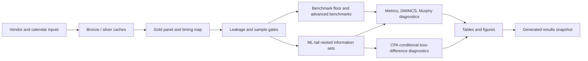

- The left branch binds vendor and calendar inputs into a timestamp-audited gold panel.
- The middle branch compares benchmark floors, advanced econometric benchmarks, and ML-tail forecasts on registered loss units.
- The right branch separates headline nested information sets, restricted model-family comparisons, unconditional DM/MCS inference, CPA diagnostics, and supporting figures.

## Pipeline Structure

| Step | Layer | Purpose |
| --- | --- | --- |
| 1 | Vendor and calendar sources | Pull or read J-Quants, Massive, FRED, CBOE, and exchange-calendar inputs. |
| 2 | Bronze and silver cache | Preserve typed vendor/cache rows, then normalize timestamp-safe research features. |
| 3 | Gold modeling panel | Join targets, calendar map, feature coverage, and leakage-bound signatures. |
| 4 | Leakage and coverage gates | Enforce timestamp ordering and sample eligibility before evaluation. |
| 5 | Benchmark floor and ML-tail registry | Run target-history/econometric floors and LightGBM tail-model families. |
| 6 | Metrics, inference, diagnostics | Build loss matrices, DM/MCS/Murphy diagnostics, stress windows, and result matrix artifacts. |
| 7 | Results snapshot | Summarize run-specific evidence and claim boundaries for reader review. |

- Data-access and cache artifacts live under `data/bronze` and `data/silver`.
- Durable modeling evidence lives under `data/gold`; forecast/evaluation/reporting read from gold and reports.
- Run-specific forecasts, metrics, diagnostics, and LaTeX tables live under `reports/runs/<run_id>`.

## Gold Panel Construction

| Measure | Value |
| --- | --- |
| Gold modeling rows | 2395 |
| Gold columns | 1176 |
| Target-audit rows | 2395 |
| Clean target rows | 2199 |
| Forecast-sample rows | 1661 |
| Rows before combined clean start | 412 |
| Target-not-clean rows | 196 |
| Mapping excluded rows | 126 |

| Target audit reason | Rows |
| --- | --- |
| None | 2199 |
| roll_sq_excluded | 195 |
| missing_reference_price | 1 |

- The cache lower bound is 2016-07-19, but XLC/core predictor coverage pushes the actual forecast sample to the combined clean start.
- Target exclusion is explicit: roll/SQ windows and the single missing reference price are carried as audit evidence, not silently dropped.
- The forecast-sample reason column makes the sample boundary reproducible row by row.

## Calendar And Timing Map

| Measure | Value |
| --- | --- |
| Normal trading mappings | 2268 |
| U.S./Japan desync mappings | 127 |
| NYSE early-close mappings | 32 |
| EDT rows | 1551 |
| EST rows | 844 |

- The map covers EST/EDT, early closes, U.S./Japan holiday desynchronization, and normal trading alignments.
- Desync rows are not treated as normal forecast rows.
- The timing map is part of the leakage-bound gold artifact, not ad hoc evaluation logic.

## Feature Coverage

| Source family | Block | Features | Mean missing | Max missing |
| --- | --- | --- | --- | --- |
| asia_proxy | asia_proxy | 6 | 0.000% | 0.000% |
| cboe_volatility | fred_core | 2 | 0.000% | 0.000% |
| fred_core | fred_core | 9 | 0.000% | 0.000% |
| fred_credit_enriched | fred_credit_enriched | 4 | 61.890% | 61.890% |
| fx_core | fx_core | 2 | 0.000% | 0.000% |
| japan_history | japan_only | 23 | 0.000% | 0.000% |
| japan_proxy | japan_proxy | 4 | 0.000% | 0.000% |
| massive_daily | us_core | 44 | 0.001% | 0.060% |
| massive_minute | asia_proxy | 60 | 0.000% | 0.000% |
| massive_minute | japan_proxy | 24 | 0.341% | 4.094% |
| massive_minute | us_late_session | 84 | 0.000% | 0.000% |
| massive_optional | massive_optional | 2 | 0.000% | 0.000% |
| unknown | unknown | 2 | 0.000% | 0.000% |

- U.S. core, proxy ETFs, minute late-session features, CBOE VIX, FRED rates, FRED H.10 FX, and any audit-gated options-risk fields are separated by source family and block.
- Credit-spread FRED features are enriched/optional and visibly late-starting, so they do not move the core clean start.
- Feature coverage should be read together with the leakage summary; high coverage alone is not enough without timestamp validity.

## Leakage Audit

| Field | Value |
| --- | --- |
| Status | `pass_with_warnings` |
| Rows audited | `622700` |
| Failures | `0` |
| Warnings | `572328` |
| Panel row count | `2395` |
| Panel signature seed | `42` |
| Panel signature | `63ea2acb4baad92e9cb757fc661e47e8852e1f9b7ef78714a2a8eb564417da13` |

- Zero failures means no audited row violated the hard timestamp invariant.
- Warnings are retained because they identify conservative-lag or missing-feature situations that may matter for interpretation.
- The panel signature is deterministic and binds the leakage check to the current gold panel/config.

## Benchmark Suite

Status: `completed`; forecast rows: `21146`; metric rows: `12`; failures: `0`.

| Benchmark layer | Status | Forecast rows | Diagnostic rows | Failures | How to read it |
| --- | --- | --- | --- | --- | --- |
| floor | `completed` | `7932` | `12` | `0` | Implemented benchmark evidence for target-history and econometric floor models. |
| advanced | `completed_nonblocking` | `13214` | `806` | `0` | Implemented nonblocking advanced benchmark forecasts; review with common-sample gates. |

| Model | Information set | Tail side | Rows | VaR breach rate | Exceptions | Mean quantile loss | Mean FZ loss |
| --- | --- | --- | --- | --- | --- | --- | --- |
| ewma_vol_scaled | target_history_only | left_tail | 661 | 5.295% | 35 | 0.00139273 | -3.65402 |
| ewma_vol_scaled | target_history_only | right_tail | 661 | 4.539% | 30 | 0.00131562 | -3.69642 |
| garch_t | target_history_only | left_tail | 661 | 6.354% | 42 | 0.00135048 | -3.70463 |
| garch_t | target_history_only | right_tail | 661 | 3.933% | 26 | 0.00122176 | -3.78739 |
| gjr_garch_evt | target_history_only | left_tail | 661 | 5.598% | 37 | 0.00133528 | -3.73239 |
| gjr_garch_evt | target_history_only | right_tail | 661 | 5.295% | 35 | 0.00117898 | -3.80163 |
| gjr_garch_t | target_history_only | left_tail | 661 | 6.505% | 43 | 0.0013401 | -3.7092 |
| gjr_garch_t | target_history_only | right_tail | 661 | 3.782% | 25 | 0.00117343 | -3.81523 |
| historical_quantile | target_history_only | left_tail | 661 | 6.051% | 40 | 0.00147767 | -3.5142 |
| historical_quantile | target_history_only | right_tail | 661 | 6.354% | 42 | 0.0014632 | -3.43894 |
| rolling_quantile | target_history_only | left_tail | 661 | 6.051% | 40 | 0.00147769 | -3.5066 |
| rolling_quantile | target_history_only | right_tail | 661 | 6.657% | 44 | 0.00147041 | -3.43407 |

- Benchmark floor rows set the target-history/econometric floor that ML models should be interpreted against.
- Advanced benchmark families are nonblocking; rows with valid forecasts are empirical evidence subject to the same sample and inference gates, while unavailable rows remain diagnostics.
- The table is not a leaderboard by itself; coverage, exception counts, quantile loss, and FZ loss must be read together.
- Common-sample rows are reported directly so readers can see the effective evidence size.

## ML-Tail Headline Ladder

Status: `completed_lightgbm_ml_tail_models`; implemented models: `lightgbm_direct_quantile`, `lightgbm_location_scale`, `lightgbm_standardized_loss_pot_gpd`; forecast rows: `7768`; failures: `0`.

| Model | Information set | Tail side | Rows | VaR breach rate | Exceptions | Mean quantile loss | Mean FZ loss |
| --- | --- | --- | --- | --- | --- | --- | --- |
| lightgbm_direct_quantile | japan_only | left_tail | 661 | 9.228% | 61 | 0.00144915 | -3.36364 |
| lightgbm_direct_quantile | japan_only_plus_us_close_core | left_tail | 661 | 11.800% | 78 | 0.00118813 | -3.5417 |
| lightgbm_direct_quantile | japan_only | right_tail | 661 | 9.380% | 62 | 0.00133047 | -3.48589 |
| lightgbm_direct_quantile | japan_only_plus_us_close_core | right_tail | 661 | 11.649% | 77 | 0.00129577 | -3.41439 |

- This headline table remains strict and reports only ML-tail rows that pass the registered common-sample and coverage gates.
- Location-scale empirical, plain POT-GPD, and stabilized POT-GPD are headline candidates only after their valid OOS coverage, standardized-loss, exceedance, and ES-validity gates pass.
- Differences across information blocks are candidate forecast evidence only after the common-sample, coverage, and inference diagnostics are reviewed.
- Coverage review: `4/4` headline rows differ from the expected breach rate by more than 2.5 percentage points, so quantile/FZ loss differences alone must not be read as forecast improvement.

### ML-tail artifact relationship

| Artifact | Rows | Role | Claim boundary |
| --- | --- | --- | --- |
| `ml_tail_metrics.parquet` | 4 | Headline ML-tail nested-information-set comparison | Eligible for headline discussion after author review. |
| `ml_tail_metrics_per_model.parquet` | 24 | Per-model diagnostics on each model's own valid OOS rows | Not a cross-model comparison and not a replacement headline table. |
| `ml_tail_result_matrix.parquet` | 144 | Restricted common-sample VaR-only and VaR-ES comparisons | Restricted evidence; direct quantile rows here are comparison anchors. |

- `ml_tail_metrics.parquet` is the headline nested-information-set artifact. It contains the ML-tail rows that survived the strict common-sample gate in this run.
- `ml_tail_metrics_per_model.parquet` reports each implemented ML-tail model on its own valid OOS rows; it is useful for debugging coverage but is not a cross-model comparison table.
- `ml_tail_result_matrix.parquet` creates restricted common samples for VaR-only and VaR-ES comparisons across model families and within-model information-set increments.

## Result Matrix Layer

| Family | Axis | Loss | Rows | Common N | Date range | Joint exceptions |
| --- | --- | --- | --- | --- | --- | --- |
| nested information sets | information_set_increment | var_coverage | 24 | 138 to 626 | 2023-03-24 to 2026-05-01 | 10 to 102 |
| nested information sets | information_set_increment | var_es_fz_loss | 24 | 138 to 626 | 2023-03-24 to 2026-05-01 | 10 to 102 |
| nested information sets | information_set_increment | var_quantile_loss | 24 | 138 to 626 | 2023-03-24 to 2026-05-01 | 10 to 102 |
| tail_model_family | model_family | var_coverage | 24 | 138 to 155 | 2025-08-01 to 2026-05-01 | 15 to 19 |
| tail_model_family | model_family | var_es_fz_loss | 24 | 138 to 155 | 2025-08-01 to 2026-05-01 | 15 to 19 |
| tail_model_family | model_family | var_quantile_loss | 24 | 138 to 155 | 2025-08-01 to 2026-05-01 | 15 to 19 |

- The result matrix is the right place to compare direct quantile, location-scale empirical, plain POT-GPD, stabilized POT-GPD, and ablation variants on their restricted common dates.
- It separates VaR-only losses from VaR-ES joint scoring, so VaR-only claims are not confused with ES claims.
- Restricted direct-quantile performance is only a comparison anchor for the tail-model family; it does not replace the headline direct-quantile evidence.
- DM and MCS records are emitted only where registered row-count and exception-count gates pass; otherwise the result matrix remains descriptive.

## Paper-Facing Table And Figure Gallery

### Table Manifest

| Table | Source artifacts | Claim scope | Tail side | File |
| --- | --- | --- | --- | --- |
| benchmark_metrics | `metrics/benchmark_metrics.parquet` | `benchmark_common_sample_metric_table` | `None` | `latex/tables/benchmark_metrics_table.tex` |
| benchmark_left_tail_risk | `metrics/benchmark_metrics.parquet` | `left_tail_benchmark_risk_table` | `left_tail` | `latex/tables/benchmark_left_tail_risk_table.tex` |
| benchmark_right_tail_risk | `metrics/benchmark_metrics.parquet` | `right_tail_benchmark_risk_table` | `right_tail` | `latex/tables/benchmark_right_tail_risk_table.tex` |
| ml_tail_metrics | `metrics/ml_tail_metrics.parquet` | `ml_tail_nested_information_set_table` | `None` | `latex/tables/ml_tail_metrics_table.tex` |
| ml_tail_left_tail_risk | `metrics/ml_tail_metrics.parquet` | `left_tail_ml_tail_headline_risk_table` | `left_tail` | `latex/tables/ml_tail_left_tail_risk_table.tex` |
| ml_tail_right_tail_risk | `metrics/ml_tail_metrics.parquet` | `right_tail_ml_tail_headline_risk_table` | `right_tail` | `latex/tables/ml_tail_right_tail_risk_table.tex` |
| tailrisk_es_severity | `metrics/benchmark_metrics.parquet`, `metrics/ml_tail_metrics.parquet`, `metrics/ml_tail_metrics_per_model.parquet` | `es_severity_diagnostic_table` | `None` | `latex/tables/tailrisk_es_severity_table.tex` |
| tailrisk_trigger_diagnostics | `forecasts/benchmark_forecasts.parquet`, `forecasts/ml_tail_forecasts.parquet` | `trigger_diagnostic_table` | `None` | `latex/tables/tailrisk_hedge_trigger_diagnostics_table.tex` |
| tailrisk_claim_scope | `manifest.json`, `config/research_config.json` | `claim_boundary_reference_table` | `None` | `latex/tables/tailrisk_claim_scope_table.tex` |
| ml_tail_result_matrix | `metrics/ml_tail_result_matrix.parquet` | `restricted_model_comparison_table` | `None` | `latex/tables/ml_tail_result_matrix_table.tex` |
| ml_tail_result_matrix_summary | `metrics/ml_tail_result_matrix.parquet`, `metrics/ml_tail_result_matrix_dm.parquet`, `metrics/ml_tail_result_matrix_mcs.parquet` | `restricted_result_matrix_summary_table` | `None` | `latex/tables/ml_tail_result_matrix_summary_table.tex` |
| ml_tail_dst_attenuation | `metrics/ml_tail_dst_attenuation.parquet` | `descriptive_dst_attenuation_table` | `None` | `latex/tables/ml_tail_dst_attenuation_table.tex` |

- The table manifest records the generated LaTeX table files, their source artifacts, and their claim scopes.
- Tables are paper-facing exports; the Markdown tables above are snapshot summaries for browser review.

### Figure 1. Coverage Breach-Rate Diagnostics

- Key readings: bars report realized VaR exception rates against the nominal line.
- Read this first: exception-rate deviations set the boundary for any loss-based interpretation.

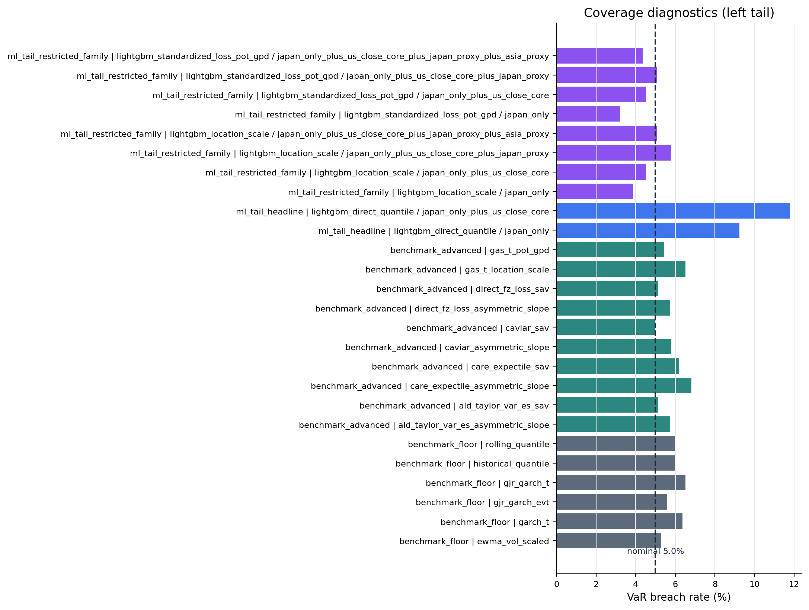

_Figure: `coverage_breach_rates_left_tail`. Source: `metrics/benchmark_metrics.parquet`, `metrics/benchmark_metrics_per_model.parquet`, `metrics/ml_tail_metrics.parquet`, `metrics/ml_tail_metrics_per_model.parquet`. Claim scope: `coverage_diagnostic_not_headline_claim`. Tail side: `left_tail`. Run file: `latex/figures/coverage_breach_rates_left_tail.png`._

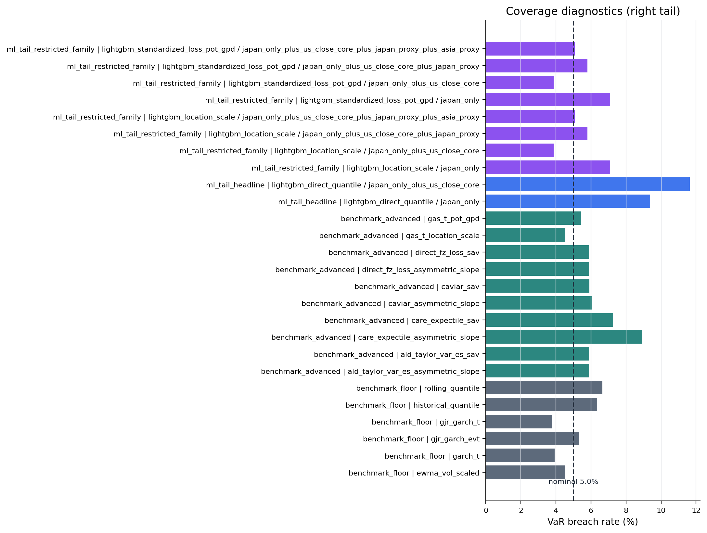

_Figure: `coverage_breach_rates_right_tail`. Source: `metrics/benchmark_metrics.parquet`, `metrics/benchmark_metrics_per_model.parquet`, `metrics/ml_tail_metrics.parquet`, `metrics/ml_tail_metrics_per_model.parquet`. Claim scope: `coverage_diagnostic_not_headline_claim`. Tail side: `right_tail`. Run file: `latex/figures/coverage_breach_rates_right_tail.png`._

### Figure 2. Benchmark Murphy Diagnostics

- Key readings: curves report benchmark elementary-score diagnostics on a common grid.
- The plot is a scoring-family diagnostic, not a pairwise ranking statement.

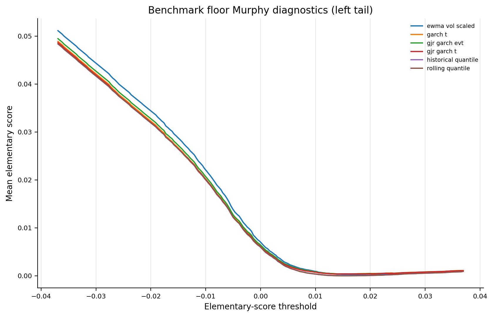

_Figure: `benchmark_murphy_left_tail`. Source: `metrics/benchmark_murphy.parquet`. Claim scope: `murphy_diagnostic_benchmark_floor_common_grid`. Tail side: `left_tail`. Run file: `latex/figures/benchmark_murphy_left_tail.png`._

_Figure: `benchmark_murphy_right_tail`. Source: `metrics/benchmark_murphy.parquet`. Claim scope: `murphy_diagnostic_benchmark_floor_common_grid`. Tail side: `right_tail`. Run file: `latex/figures/benchmark_murphy_right_tail.png`._

### Figure 3. ML-Tail Murphy Diagnostics

- Key readings: curves report the ML-tail nested information sets on a common grid.
- Interpret curve separation together with the headline coverage warning and unconditional inference gates.

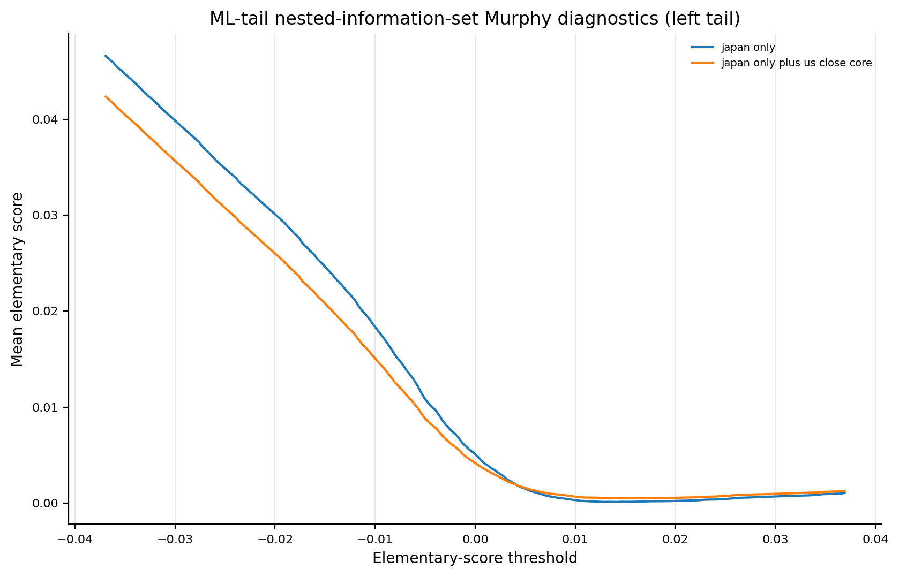

_Figure: `ml_tail_murphy_left_tail`. Source: `metrics/ml_tail_murphy.parquet`. Claim scope: `murphy_diagnostic_ml_tail_nested_information_sets_common_grid`. Tail side: `left_tail`. Run file: `latex/figures/ml_tail_murphy_left_tail.png`._

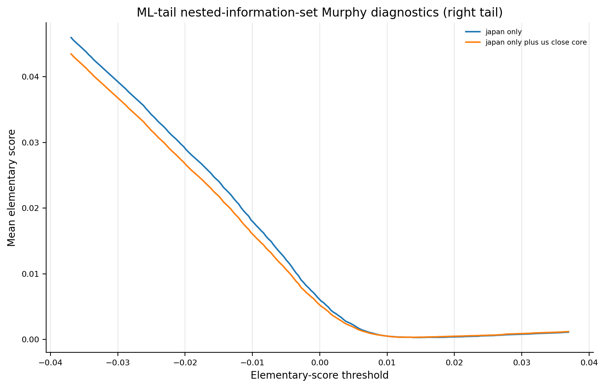

_Figure: `ml_tail_murphy_right_tail`. Source: `metrics/ml_tail_murphy.parquet`. Claim scope: `murphy_diagnostic_ml_tail_nested_information_sets_common_grid`. Tail side: `right_tail`. Run file: `latex/figures/ml_tail_murphy_right_tail.png`._

### Figure 4. DST Attenuation Diagnostics

- Key readings: bars summarize timing-regime forecast diagnostics.
- Treat this as descriptive timing evidence; left/right patterns should not be assigned a shared structural mechanism.

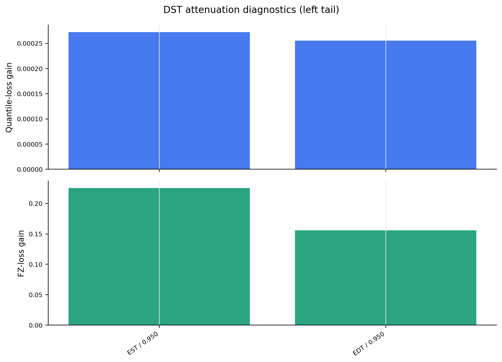

_Figure: `dst_attenuation_left_tail`. Source: `metrics/ml_tail_dst_attenuation.parquet`. Claim scope: `descriptive_dst_attenuation_not_structural_causal_identification`. Tail side: `left_tail`. Run file: `latex/figures/dst_attenuation_left_tail.png`._

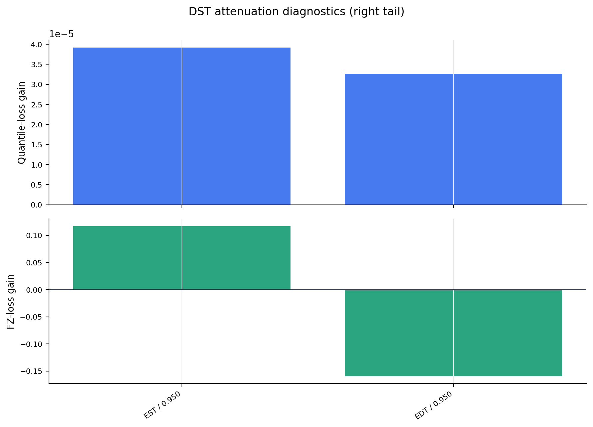

_Figure: `dst_attenuation_right_tail`. Source: `metrics/ml_tail_dst_attenuation.parquet`. Claim scope: `descriptive_dst_attenuation_not_structural_causal_identification`. Tail side: `right_tail`. Run file: `latex/figures/dst_attenuation_right_tail.png`._

### Figure 5. ES Severity Diagnostics

- Key readings: bars report conditional-on-exception severity diagnostics.
- Severity is reported for risk interpretation but is not a standalone model-selection claim.

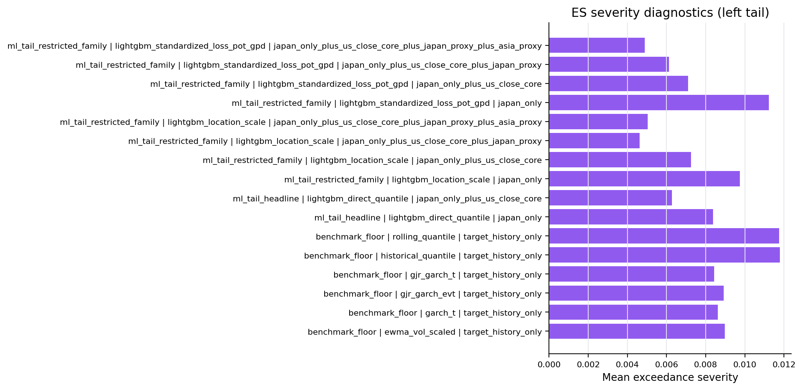

_Figure: `es_severity_left_tail`. Source: `metrics/benchmark_metrics.parquet`, `metrics/ml_tail_metrics.parquet`, `metrics/ml_tail_metrics_per_model.parquet`. Claim scope: `es_severity_diagnostic_not_model_selection_claim`. Tail side: `left_tail`. Run file: `latex/figures/es_severity_left_tail.png`._

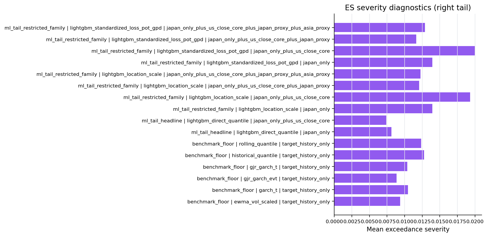

_Figure: `es_severity_right_tail`. Source: `metrics/benchmark_metrics.parquet`, `metrics/ml_tail_metrics.parquet`, `metrics/ml_tail_metrics_per_model.parquet`. Claim scope: `es_severity_diagnostic_not_model_selection_claim`. Tail side: `right_tail`. Run file: `latex/figures/es_severity_right_tail.png`._

### Figure 6. Trigger Diagnostics

- Key readings: bars report pre-open risk-trigger diagnostics by model family.
- The trigger output is a monitoring diagnostic, not an execution-performance result.

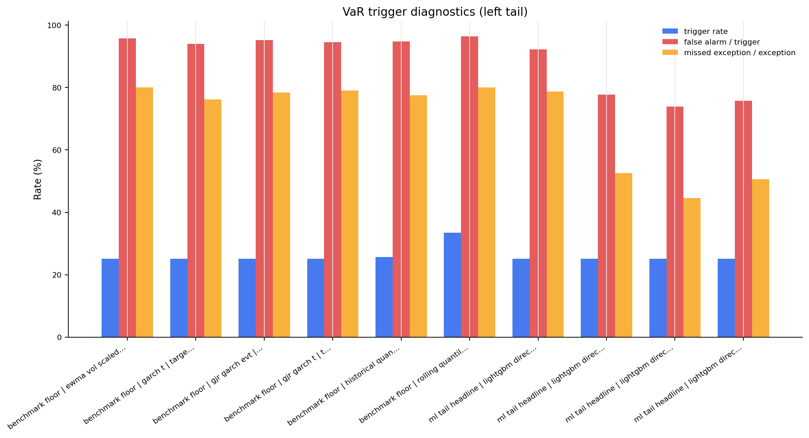

_Figure: `trigger_diagnostics_left_tail`. Source: `forecasts/benchmark_forecasts.parquet`, `forecasts/ml_tail_forecasts.parquet`. Claim scope: `trigger_diagnostic_not_pnl_cost_or_alpha`. Tail side: `left_tail`. Run file: `latex/figures/trigger_diagnostics_left_tail.png`._

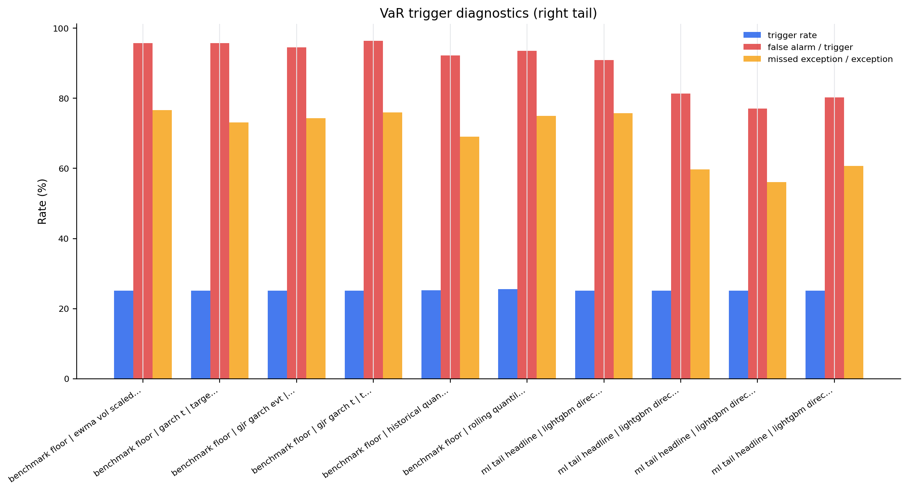

_Figure: `trigger_diagnostics_right_tail`. Source: `forecasts/benchmark_forecasts.parquet`, `forecasts/ml_tail_forecasts.parquet`. Claim scope: `trigger_diagnostic_not_pnl_cost_or_alpha`. Tail side: `right_tail`. Run file: `latex/figures/trigger_diagnostics_right_tail.png`._

## Stress And Diagnostic Windows

| Suite | Rows | Window labels |
| --- | --- | --- |
| benchmark | 134 | `loss_top_decile` |
| ml_tail | 268 | `loss_top_decile`, `vix_top_decile` |

- Stress windows identify high-loss or high-volatility subsamples for two-sided risk diagnostics.
- These rows use reproducible full-sample classifiers in this first pass, so they should be described as diagnostics rather than a live stress classifier.
- They are useful for finding whether model behavior changes in difficult regimes before writing manuscript discussion.

## Artifact Index

| Artifact | Path | Exists |
| --- | --- | --- |
| manifest | `reports/runs/tailrisk_20160719_20260502_20260501T213508Z_commit_2bdb51ae/manifest.json` | yes |
| data_vintage | `reports/runs/tailrisk_20160719_20260502_20260501T213508Z_commit_2bdb51ae/data_vintage.json` | yes |
| modeling_panel | `data/gold/tailrisk_panel/schema_version=1/run_id=tailrisk_20160719_20260502_20260501T213508Z_commit_2bdb51ae/modeling_panel.parquet` | yes |
| target_audit | `data/gold/tailrisk_panel/schema_version=1/run_id=tailrisk_20160719_20260502_20260501T213508Z_commit_2bdb51ae/target_audit.parquet` | yes |
| calendar_map | `data/gold/tailrisk_panel/schema_version=1/run_id=tailrisk_20160719_20260502_20260501T213508Z_commit_2bdb51ae/calendar_map.parquet` | yes |
| feature_coverage | `data/gold/tailrisk_panel/schema_version=1/run_id=tailrisk_20160719_20260502_20260501T213508Z_commit_2bdb51ae/feature_coverage.parquet` | yes |
| leakage_summary | `data/gold/leakage_summary/schema_version=1/run_id=tailrisk_20160719_20260502_20260501T213508Z_commit_2bdb51ae/summary.json` | yes |
| benchmark_status | `reports/runs/tailrisk_20160719_20260502_20260501T213508Z_commit_2bdb51ae/metrics/benchmark_status.json` | yes |
| benchmark_metrics | `reports/runs/tailrisk_20160719_20260502_20260501T213508Z_commit_2bdb51ae/metrics/benchmark_metrics.parquet` | yes |
| benchmark_forecasts | `reports/runs/tailrisk_20160719_20260502_20260501T213508Z_commit_2bdb51ae/forecasts/benchmark_forecasts.parquet` | yes |
| benchmark_dm_inference | `reports/runs/tailrisk_20160719_20260502_20260501T213508Z_commit_2bdb51ae/metrics/benchmark_dm_inference.parquet` | yes |
| benchmark_mcs | `reports/runs/tailrisk_20160719_20260502_20260501T213508Z_commit_2bdb51ae/metrics/benchmark_mcs.parquet` | yes |
| ml_tail_status | `reports/runs/tailrisk_20160719_20260502_20260501T213508Z_commit_2bdb51ae/metrics/ml_tail_status.json` | yes |
| ml_tail_metrics | `reports/runs/tailrisk_20160719_20260502_20260501T213508Z_commit_2bdb51ae/metrics/ml_tail_metrics.parquet` | yes |
| ml_tail_metrics_per_model | `reports/runs/tailrisk_20160719_20260502_20260501T213508Z_commit_2bdb51ae/metrics/ml_tail_metrics_per_model.parquet` | yes |
| ml_tail_forecasts | `reports/runs/tailrisk_20160719_20260502_20260501T213508Z_commit_2bdb51ae/forecasts/ml_tail_forecasts.parquet` | yes |
| ml_tail_result_matrix | `reports/runs/tailrisk_20160719_20260502_20260501T213508Z_commit_2bdb51ae/metrics/ml_tail_result_matrix.parquet` | yes |
| ml_tail_result_matrix_dm | `reports/runs/tailrisk_20160719_20260502_20260501T213508Z_commit_2bdb51ae/metrics/ml_tail_result_matrix_dm.parquet` | yes |
| ml_tail_result_matrix_mcs | `reports/runs/tailrisk_20160719_20260502_20260501T213508Z_commit_2bdb51ae/metrics/ml_tail_result_matrix_mcs.parquet` | yes |
| ml_tail_dm_inference | `reports/runs/tailrisk_20160719_20260502_20260501T213508Z_commit_2bdb51ae/metrics/ml_tail_dm_inference.parquet` | yes |
| ml_tail_mcs | `reports/runs/tailrisk_20160719_20260502_20260501T213508Z_commit_2bdb51ae/metrics/ml_tail_mcs.parquet` | yes |
| ml_tail_cpa_inference | `reports/runs/tailrisk_20160719_20260502_20260501T213508Z_commit_2bdb51ae/metrics/ml_tail_cpa_inference.parquet` | yes |
| cross_model_cpa_inference | `reports/runs/tailrisk_20160719_20260502_20260501T213508Z_commit_2bdb51ae/metrics/cross_model_cpa_inference.parquet` | yes |
| ml_tail_model_eviction | `reports/runs/tailrisk_20160719_20260502_20260501T213508Z_commit_2bdb51ae/metrics/ml_tail_model_eviction.parquet` | yes |
| ml_tail_dst_attenuation | `reports/runs/tailrisk_20160719_20260502_20260501T213508Z_commit_2bdb51ae/metrics/ml_tail_dst_attenuation.parquet` | yes |
| ml_tail_murphy | `reports/runs/tailrisk_20160719_20260502_20260501T213508Z_commit_2bdb51ae/metrics/ml_tail_murphy.parquet` | yes |
| ml_tail_feature_unavailability | `reports/runs/tailrisk_20160719_20260502_20260501T213508Z_commit_2bdb51ae/metrics/ml_tail_feature_unavailability.parquet` | yes |
| benchmark_stress_windows | `reports/runs/tailrisk_20160719_20260502_20260501T213508Z_commit_2bdb51ae/metrics/benchmark_stress_windows.parquet` | yes |
| ml_tail_stress_windows | `reports/runs/tailrisk_20160719_20260502_20260501T213508Z_commit_2bdb51ae/metrics/ml_tail_stress_windows.parquet` | yes |
| figure_manifest | `reports/runs/tailrisk_20160719_20260502_20260501T213508Z_commit_2bdb51ae/latex/figure_manifest.json` | yes |
| table_manifest | `reports/runs/tailrisk_20160719_20260502_20260501T213508Z_commit_2bdb51ae/latex/table_manifest.json` | yes |
| latex_dir | `reports/runs/tailrisk_20160719_20260502_20260501T213508Z_commit_2bdb51ae/latex/tables` | yes |
| claim_scope_table | `reports/runs/tailrisk_20160719_20260502_20260501T213508Z_commit_2bdb51ae/latex/tables/tailrisk_claim_scope_table.tex` | yes |
| es_severity_table | `reports/runs/tailrisk_20160719_20260502_20260501T213508Z_commit_2bdb51ae/latex/tables/tailrisk_es_severity_table.tex` | yes |
| hedge_trigger_table | `reports/runs/tailrisk_20160719_20260502_20260501T213508Z_commit_2bdb51ae/latex/tables/tailrisk_hedge_trigger_diagnostics_table.tex` | yes |
| dst_attenuation_table | `reports/runs/tailrisk_20160719_20260502_20260501T213508Z_commit_2bdb51ae/latex/tables/ml_tail_dst_attenuation_table.tex` | yes |
| result_matrix_summary_table | `reports/runs/tailrisk_20160719_20260502_20260501T213508Z_commit_2bdb51ae/latex/tables/ml_tail_result_matrix_summary_table.tex` | yes |

- All paths above are local ignored artifacts; they are reproducible outputs, not tracked source files.
- Forecast/reporting rebuilds should read these artifacts and must not call vendor APIs.
- If this page is stale, rerun `just snapshot` after a completed `just full` or pass an explicit run id to the CLI snapshot command.
