---
hide:
  - navigation
---

# Results Snapshot

> **Research-candidate full-run artifact.** This page is generated from `tailrisk_20160719_20260429_20260508T053721Z_commit_14205f41`.
> It summarizes the durable gold modeling sample and run outputs, not the older
> bounded access-check snapshot. It is still a research-candidate artifact:
> final manuscript claims require a clean committed run and author review of the
> tables and notes.

## Introduction

The framing questions have moved to [Discussion Q&A](discussion_qa.md). This snapshot is organized as a paper-facing evidence map: data and target construction first, model and evaluation design second, results third, and paper-facing exports and artifact provenance at the end.

The main result tables are in the Results section. Full table and figure provenance is collected in the Appendix section, including source artifacts and claim scopes for paper-facing outputs.

### Evidence Map

```mermaid
flowchart LR
  A["Vendor and calendar inputs"] --> B["Bronze / silver caches"]
  B --> C["Gold panel and timing map"]
  C --> D["Leakage and sample gates"]
  D --> E["Baseline benchmarks and advanced econometric benchmarks"]
  D --> F["Primary ML nested information sets"]
  E --> G["Metrics, DM/MCS, Murphy diagnostics"]
  F --> G
  F --> H["CPA conditional loss-difference diagnostics"]
  G --> I["Tables and figures"]
  H --> I
  I --> J["Generated results snapshot"]
```

- The left branch binds vendor and calendar inputs into a timestamp-audited gold panel.
- The middle branch compares baseline benchmarks, advanced econometric benchmarks, and ML-tail forecasts on registered loss units.
- The right branch separates primary ML nested information sets, diagnostic model-family comparisons, unconditional DM/MCS inference, CPA diagnostics, and supporting figures.

## Materials: Data And Target

### Run Metadata

| Field | Value |
| --- | --- |
| Run ID | `tailrisk_20160719_20260429_20260508T053721Z_commit_14205f41` |
| Artifact root | `reports/runs/tailrisk_20160719_20260429_20260508T053721Z_commit_14205f41` |
| Claim level | `research_candidate` |
| Requested window | `['2016-07-19', '2026-04-29']` |
| Combined clean start | `2018-06-20` |
| Gold panel dates | `2016-07-19 to 2026-04-28` |
| Forecast sample dates | `2018-06-20 to 2026-04-28 (1660 rows)` |
| Git commit | `14205f41a281d98c439eda19b12912cb0ef72ae9` |
| Git dirty | `False` |
| FRED vintage safe | `False` |

- `combined_clean_start` is the modeling lower bound; dates before it remain audit history rather than forecast evidence.
- `git_dirty` is recorded so dirty runs can be rejected before manuscript tables are frozen.
- `fred_vintage_safe=False` is an explicit limitation: FRED data are current historical values with conservative release lag, not real-time vintage observations.

### Target Distribution And Tail Diagnostics

- These diagnostics are computed from the raw clean settlement-to-open target `gap_t`; left loss is `-gap_t`, and right loss is `gap_t`.
- The purpose is to show why the dependent variable is a tail-risk object before comparing VaR/ES forecasts.
- Positive tail-shape estimates, heavy empirical tails, and upward mean-excess patterns are empirical support for using heavy-tail approximations such as POT-GPD; they are not a finite-sample proof of Frechet max-domain attraction.
- Raw target diagnostics motivate VaR/ES and EVT modeling. They do not validate LightGBM+EVT forecasts; forecast validity must be read from standardized residual-loss EVT diagnostics and out-of-sample VaR/ES backtests.

#### Target Summary

| Measure | Value |
| --- | --- |
| Clean forecast observations | `1660` |
| Date range | `2018-06-20 to 2026-04-28` |
| Mean gap | 0.000520 log (+0.05%) |
| Standard deviation | 0.010652 log (+1.07%) |
| Skewness | -0.0332669 |
| Excess kurtosis | 13.1243 |
| 1% quantile | -0.028703 log (-2.83%) |
| 5% quantile | -0.014877 log (-1.48%) |
| Median | 0.000884 log (+0.09%) |
| 95% quantile | 0.014346 log (+1.44%) |
| 99% quantile | 0.027362 log (+2.77%) |
| Max drawdown gap | -0.087513 log (-8.38%) on `2020-03-13` |
| Max upside gap | 0.096937 log (+10.18%) on `2025-04-10` |
| Jarque-Bera p-value | 0 |
| Jarque-Bera statistic | 11949.5 |

#### Raw-Tail EVT Diagnostics

| Tail | Threshold probability | Threshold | Exceedances | Mean excess | GPD xi | GPD scale | Hill xi |
| --- | --- | --- | --- | --- | --- | --- | --- |
| left_tail_loss | 0.900 | 0.0104721 | 166 | 0.00809239 | 0.204758 | 0.00641653 | 0.476705 |
| left_tail_loss | 0.925 | 0.0124109 | 125 | 0.00847471 | 0.235189 | 0.00647829 | 0.433857 |
| left_tail_loss | 0.950 | 0.0148774 | 83 | 0.0095954 | 0.213641 | 0.00753687 | 0.418714 |
| left_tail_loss | 0.975 | 0.0210588 | 42 | 0.0102315 | 0.448645 | 0.00605884 | 0.331429 |
| left_tail_loss | 0.990 | 0.028703 | 17 | 0.013958 | 0.285238 | 0.0101702 | 0.34578 |
| right_tail_loss | 0.900 | 0.0108683 | 166 | 0.00720651 | 0.346548 | 0.00472062 | 0.408732 |
| right_tail_loss | 0.925 | 0.0124498 | 125 | 0.00772676 | 0.426833 | 0.00457611 | 0.384777 |
| right_tail_loss | 0.950 | 0.014346 | 83 | 0.00923846 | 0.420735 | 0.00558204 | 0.398242 |
| right_tail_loss | 0.975 | 0.0184693 | 42 | 0.0122829 | 0.408765 | 0.00772493 | 0.419593 |
| right_tail_loss | 0.990 | 0.0273616 | 17 | 0.0165885 | 0.191308 | 0.0135487 | 0.404539 |
| absolute_gap | 0.900 | 0.0146904 | 166 | 0.0093444 | 0.331127 | 0.00635167 | 0.402974 |
| absolute_gap | 0.925 | 0.0164704 | 125 | 0.0103486 | 0.304402 | 0.00728946 | 0.402961 |
| absolute_gap | 0.950 | 0.0196326 | 83 | 0.011665 | 0.313174 | 0.00816878 | 0.387247 |
| absolute_gap | 0.975 | 0.0259941 | 42 | 0.0141694 | 0.298257 | 0.0101914 | 0.36961 |
| absolute_gap | 0.990 | 0.0363439 | 17 | 0.0183368 | 0.215266 | 0.0146983 | 0.357836 |

- The GPD threshold table is computed on raw left loss, raw right loss, and the absolute gap; it should not be read as a forecast-model diagnostic.
- The Hill and GPD shape estimates are deliberately reported over multiple thresholds because tail-index estimates are sensitive in samples of this length.

#### Target Distribution Figures

| Figure | Tail side | Source | Claim scope | Docs file |
| --- | --- | --- | --- | --- |
| `target_gap_histogram_density` | `target_distribution` | `panel/modeling_panel.parquet` | `target_distribution_motivation_not_forecast_validation` | `figures/tailrisk_20160719_20260429_20260508T053721Z_commit_14205f41/target_gap_histogram_density.png` |
| `target_loss_qq_left_tail` | `left_tail` | `panel/modeling_panel.parquet` | `target_distribution_motivation_not_forecast_validation` | `figures/tailrisk_20160719_20260429_20260508T053721Z_commit_14205f41/target_loss_qq_left_tail.png` |
| `target_loss_qq_right_tail` | `right_tail` | `panel/modeling_panel.parquet` | `target_distribution_motivation_not_forecast_validation` | `figures/tailrisk_20160719_20260429_20260508T053721Z_commit_14205f41/target_loss_qq_right_tail.png` |
| `target_log_survival` | `left_right_target_distribution` | `panel/modeling_panel.parquet` | `target_distribution_motivation_not_forecast_validation` | `figures/tailrisk_20160719_20260429_20260508T053721Z_commit_14205f41/target_log_survival.png` |
| `target_mean_excess` | `left_right_target_distribution` | `panel/modeling_panel.parquet` | `target_distribution_motivation_not_forecast_validation` | `figures/tailrisk_20160719_20260429_20260508T053721Z_commit_14205f41/target_mean_excess.png` |
| `target_hill_plot` | `left_right_target_distribution` | `panel/modeling_panel.parquet` | `target_distribution_motivation_not_forecast_validation` | `figures/tailrisk_20160719_20260429_20260508T053721Z_commit_14205f41/target_hill_plot.png` |

### Gold Panel Construction

| Measure | Value |
| --- | --- |
| Gold modeling rows | 2393 |
| Gold columns | 1384 |
| Target-audit rows | 2393 |
| Clean target rows | 2197 |
| Forecast-sample rows | 1660 |
| Rows before combined clean start | 412 |
| Target-not-clean rows | 196 |
| Mapping excluded rows | 125 |

| Target audit reason | Rows |
| --- | --- |
| None | 2197 |
| roll_sq_excluded | 195 |
| missing_reference_price | 1 |

- The cache lower bound is 2016-07-19, but XLC/core predictor coverage pushes the actual forecast sample to the combined clean start.
- Target exclusion is explicit: roll/SQ windows and the single missing reference price are carried as audit evidence, not silently dropped.
- The forecast-sample reason column makes the sample boundary reproducible row by row.

### Calendar And Timing Map

| Measure | Value |
| --- | --- |
| Normal trading mappings | 2267 |
| U.S./Japan desync mappings | 126 |
| NYSE early-close mappings | 32 |
| EDT rows | 1549 |
| EST rows | 844 |

- The map covers EST/EDT, early closes, U.S./Japan holiday desynchronization, and normal trading alignments.
- Desync rows are not treated as normal forecast rows.
- The timing map is part of the leakage-bound gold artifact, not ad hoc evaluation logic.

### Feature Coverage

| Source family | Block | Features | Mean missing | Max missing |
| --- | --- | --- | --- | --- |
| Asia proxy | Asia proxy | 10 | 0.000% | 0.000% |
| Asia proxy options | Asia proxy | 7 | 49.096% | 49.096% |
| cboe_volatility | fred_core | 2 | 0.000% | 0.000% |
| fred_core | fred_core | 9 | 0.000% | 0.000% |
| FRED credit enriched | FRED credit enriched | 4 | 62.018% | 62.048% |
| fx_core | fx_core | 2 | 0.000% | 0.000% |
| JP history | JP only | 23 | 0.000% | 0.000% |
| JP proxy | JP proxy | 8 | 0.000% | 0.000% |
| JP proxy options | JP proxy | 13 | 54.708% | 68.313% |
| J-Quants N225 options | JP only | 14 | 1.136% | 5.301% |
| massive_daily | US core | 40 | 0.002% | 0.060% |
| massive_minute | Asia proxy | 60 | 0.000% | 0.000% |
| massive_minute | JP proxy | 24 | 0.341% | 4.096% |
| massive_minute | US late session | 84 | 0.000% | 0.000% |
| massive_optional | massive_optional | 2 | 0.000% | 0.000% |
| unknown | unknown | 2 | 0.000% | 0.000% |
| US core options | US core | 21 | 49.096% | 49.096% |

- U.S. core, proxy ETFs, minute late-session features, CBOE VIX, FRED rates, FRED H.10 FX, and any audit-gated options-risk fields are separated by source family and block.
- Credit-spread FRED features are enriched/optional and visibly late-starting, so they do not move the core clean start.
- Feature coverage should be read together with the leakage summary; high coverage alone is not enough without timestamp validity.

### Leakage Audit

| Field | Value |
| --- | --- |
| Status | `pass_with_warnings` |
| Rows audited | `729865` |
| Failures | `0` |
| Warnings | `679535` |
| Panel row count | `2393` |
| Panel signature seed | `42` |
| Panel signature | `f0981ad53852565aec7396a3be258835587df1eadb2c0b0445683029aa32a209` |

- Zero failures means no audited row violated the hard timestamp invariant.
- Warnings are retained because they identify conservative-lag or missing-feature situations that may matter for interpretation.
- The panel signature is deterministic and binds the leakage check to the current gold panel/config.

## Methods: Model Configuration And Evaluation

### Pipeline Structure

| Step | Layer | Purpose |
| --- | --- | --- |
| 1 | Vendor and calendar sources | Pull or read J-Quants, Massive, FRED, CBOE, and exchange-calendar inputs. |
| 2 | Bronze and silver cache | Preserve typed vendor/cache rows, then normalize point-in-time research features. |
| 3 | Gold modeling panel | Join targets, calendar map, feature coverage, and leakage-bound signatures. |
| 4 | Leakage and coverage gates | Enforce timestamp ordering and sample eligibility before evaluation. |
| 5 | Baseline benchmarks and ML-tail registry | Run target-history/econometric baseline benchmarks and LightGBM tail-model families. |
| 6 | Metrics, inference, diagnostics | Build loss matrices, DM/MCS/Murphy diagnostics, stress windows, and result matrix artifacts. |
| 7 | Results snapshot | Summarize run-specific evidence and claim boundaries for reader review. |

- Data-access and cache artifacts live under `data/bronze` and `data/silver`.
- Durable modeling evidence lives under `data/gold`; forecast/evaluation/reporting read from gold and reports.
- Run-specific forecasts, metrics, diagnostics, and LaTeX tables live under `reports/runs/<run_id>`.

### Model And Evaluation Protocol

- The registered risk level is `tail_level = 0.95`; the nominal VaR exception rate is 5%.
- A VaR exception is counted when `realized_loss > var_forecast`; this follows the
  standard exception-counting logic of VaR backtesting, but the snapshot does not
  apply Basel green/yellow/red traffic-light capital zones.
- Forecast evaluation is based on coverage diagnostics, Kupiec/Christoffersen
  tests where available, quantile loss, Fissler-Ziegel joint VaR-ES loss, and
  DM/MCS inference.
- Benchmarks use target-history information only. ML-tail models add predictors through fixed nested information sets.
- Most specifications use expanding pre-forecast training histories. The rolling-quantile benchmark is the designed exception and uses the most recent 1,000 clean observations.
- LightGBM hyperparameters are held fixed across information sets and refit dates; the snapshot reports model-family evidence rather than tuning-search evidence.
- DM/MCS inference is read on average across the unconditional evaluation sample. CPA is read as a conditional loss-difference diagnostic, not as a forecasting model.

## Results And Discussion

### Main result tables

#### Benchmark Suite

Status: `completed`; forecast rows: `21114`; metric rows: `12`; failures: `0`.

| Benchmark layer | Status | Forecast rows | Diagnostic rows | Failures | How to read it |
| --- | --- | --- | --- | --- | --- |
| baseline | `completed` | `7920` | `12` | `0` | Implemented evidence for target-history and econometric baseline benchmark models. |
| advanced econometric | `completed_nonblocking` | `13194` | `766` | `0` | Implemented nonblocking advanced econometric benchmark forecasts; review with common-sample gates. |

| Model | Information set | Tail side | Rows | VaR breach rate | Exceptions | Mean quantile loss | Mean FZ loss |
| --- | --- | --- | --- | --- | --- | --- | --- |
| ewma_vol_scaled | Target history | left_tail | 660 | 5.303% | 35 | 0.00139284 | -3.65391 |
| ewma_vol_scaled | Target history | right_tail | 660 | 4.545% | 30 | 0.00131597 | -3.69643 |
| garch_t | Target history | left_tail | 660 | 6.364% | 42 | 0.00135148 | -3.70351 |
| garch_t | Target history | right_tail | 660 | 3.939% | 26 | 0.00122288 | -3.78658 |
| gjr_garch_evt | Target history | left_tail | 660 | 5.606% | 37 | 0.00133621 | -3.73138 |
| gjr_garch_evt | Target history | right_tail | 660 | 5.303% | 35 | 0.00118016 | -3.80061 |
| gjr_garch_t | Target history | left_tail | 660 | 6.515% | 43 | 0.00134109 | -3.70805 |
| gjr_garch_t | Target history | right_tail | 660 | 3.788% | 25 | 0.00117451 | -3.81439 |
| historical_quantile | Target history | left_tail | 660 | 6.061% | 40 | 0.00147857 | -3.51331 |
| historical_quantile | Target history | right_tail | 660 | 6.364% | 42 | 0.00146455 | -3.43788 |
| rolling_quantile | Target history | left_tail | 660 | 6.061% | 40 | 0.00147852 | -3.50579 |
| rolling_quantile | Target history | right_tail | 660 | 6.667% | 44 | 0.00147175 | -3.43306 |

- Baseline benchmark rows set the target-history/econometric reference that ML models should be interpreted against.
- Advanced econometric benchmark families are nonblocking; rows with valid forecasts are empirical evidence subject to the same sample and inference gates, while unavailable rows remain diagnostics.
- The table is not a leaderboard by itself; coverage, exception counts, quantile loss, and FZ loss must be read together.
- Common-sample rows are reported directly so readers can see the effective evidence size.

#### Primary ML Specifications

Status: `completed LGBM ML-tail models`; implemented models: `LGBM direct quantile`, `LGBM location-scale empirical`, `LGBM POT-GPD plain MLE`, `LGBM POT-GPD UniBM block-maxima shape`, `LGBM median/MAD POT-GPD plain MLE`, `LGBM median/MAD POT-GPD UniBM block-maxima shape`, `LGBM median/IQR POT-GPD plain MLE`, `LGBM median/IQR POT-GPD UniBM block-maxima shape`; forecast rows: `38480`; failures: `0`.

| Model | Information set | Tail side | Rows | VaR breach rate | Exceptions | Mean quantile loss | Mean FZ loss |
| --- | --- | --- | --- | --- | --- | --- | --- |
| LGBM direct quantile | JP only | left_tail | 549 | 7.650% | 42 | 0.0013708 | -3.51506 |
| LGBM direct quantile | JP + US close core | left_tail | 549 | 11.111% | 61 | 0.00116001 | -3.66507 |
| LGBM direct quantile | JP + US close core + JP proxy | left_tail | 549 | 11.658% | 64 | 0.00113756 | -3.75846 |
| LGBM direct quantile | JP + US close core + JP proxy + Asia proxy | left_tail | 549 | 12.022% | 66 | 0.00116646 | -3.699 |
| LGBM direct quantile | JP only | right_tail | 549 | 9.654% | 53 | 0.00131455 | -3.54796 |
| LGBM direct quantile | JP + US close core | right_tail | 549 | 12.386% | 68 | 0.00131723 | -3.38438 |
| LGBM direct quantile | JP + US close core + JP proxy | right_tail | 549 | 12.022% | 66 | 0.00129378 | -3.44895 |
| LGBM direct quantile | JP + US close core + JP proxy + Asia proxy | right_tail | 549 | 12.750% | 70 | 0.0012751 | -3.51351 |

- This primary ML table remains strict and reports only ML-tail rows that pass the registered common-sample and coverage gates.
- Location-scale empirical and plain POT-GPD are primary candidates only after their valid OOS coverage, standardized-loss, exceedance, and ES-validity gates pass.
- Differences across information blocks are candidate forecast evidence only after the common-sample, coverage, and inference diagnostics are reviewed.
- Coverage review: `8/8` primary ML rows differ from the expected breach rate by more than 2.5 percentage points, so quantile/FZ loss differences alone must not be read as forecast improvement.

#### Side-specific ML-tail Promotion Gate

| Role | Model | Information set | Tail side | Rows | Breach | Q loss | FZ loss | DM q | DM FZ | MCS q/FZ | Gate |
| --- | --- | --- | --- | --- | --- | --- | --- | --- | --- | --- | --- |
| left promoted | LGBM median/IQR POT-GPD plain MLE | JP + US close core + JP proxy + Asia proxy | left_tail | 549 | 4.736% | 0.000904352 | -4.28626 | -0.000292973; p=0.004; reject10 | -0.672158; p=0.007; reject10 | in / in | pass |
| right promoted | LGBM location-scale empirical | JP + US close core + JP proxy | right_tail | 500 | 4.600% | 0.0010397 | -4.19692 | -0.000334726; p=0.051; reject10 | -0.868782; p=0.017; reject10 | in / in | pass |

- This paper-facing bridge promotes side-specific ML-tail candidates only after the N/coverage gate and restricted common-sample inference are visible.
- In the current run the left-tail promoted row is median/IQR POT-GPD, while the right-tail promoted row is location-scale empirical.
- This is not a universal model-family ranking and does not replace the strict primary nested-information-set table above.

#### ML-tail artifact relationship

| Artifact | Rows | Role | Claim boundary |
| --- | --- | --- | --- |
| `ml_tail_metrics.parquet` | 8 | Primary ML nested-information-set comparison | Eligible for primary discussion after author review. |
| `ml_tail_metrics_per_model.parquet` | 64 | Per-model diagnostics on each model's own valid OOS rows | Not a cross-model comparison and not a replacement primary ML table. |
| `ml_tail_result_matrix.parquet` | 384 | Restricted common-sample VaR-only and VaR-ES comparisons | Restricted evidence; direct quantile rows here are comparison anchors. |

- `ml_tail_metrics.parquet` is the primary nested-information-set artifact. It contains the ML-tail rows that survived the strict common-sample gate in this run.
- `ml_tail_metrics_per_model.parquet` reports each implemented ML-tail model on its own valid OOS rows; it is useful for debugging coverage but is not a cross-model comparison table.
- `ml_tail_result_matrix.parquet` creates restricted common samples for VaR-only and VaR-ES comparisons across model families and within-model information-set increments.

### Other result tables

#### All-model diagnostic scan

| Suite | Model | Information set | Metric rows | OOS N mean+-sd | Breach mean+-sd | Abs cov err mean+-sd | Q loss mean+-sd | FZ loss mean+-sd | ES severity mean+-sd |
| --- | --- | --- | --- | --- | --- | --- | --- | --- | --- |
| benchmark_advanced | ald_taylor_var_es_asymmetric_slope | Target history | 2 | 660 +/- 0 | 5.833% +/- 0.107% | 0.833% +/- 0.107% | 0.00127691 +/- 8.02831e-05 | -3.72523 +/- 0.0334511 | 0.00869969 +/- 0.000405801 |
| benchmark_advanced | ald_taylor_var_es_sav | Target history | 2 | 660 +/- 0 | 5.530% +/- 0.536% | 0.530% +/- 0.536% | 0.00128379 +/- 3.7948e-05 | -3.72955 +/- 0.00711344 | 0.00886176 +/- 0.000129554 |
| benchmark_advanced | care_expectile_asymmetric_slope | Target history | 2 | 660 +/- 0 | 7.879% +/- 1.500% | 2.879% +/- 1.500% | 0.00127844 +/- 8.31021e-05 | -3.69897 +/- 0.012998 | 0.0073354 +/- 0.00110666 |
| benchmark_advanced | care_expectile_sav | Target history | 2 | 660 +/- 0 | 6.742% +/- 0.750% | 1.742% +/- 0.750% | 0.00129518 +/- 4.26712e-05 | -3.68439 +/- 0.0444806 | 0.00850544 +/- 0.000289762 |
| benchmark_advanced | caviar_asymmetric_slope | Target history | 2 | 657.5 +/- 0.707107 | 5.931% +/- 0.209% | 0.931% +/- 0.209% | 0.00127327 +/- 7.4127e-05 | -3.74136 +/- 0.031609 | 0.00850709 +/- 0.000182887 |
| benchmark_advanced | caviar_sav | Target history | 2 | 659.5 +/- 0.707107 | 5.459% +/- 0.649% | 0.459% +/- 0.649% | 0.00128806 +/- 4.03153e-05 | -3.72811 +/- 0.00429839 | 0.00935712 +/- 0.000659042 |
| benchmark_advanced | direct_fz_loss_asymmetric_slope | Target history | 2 | 660 +/- 0 | 5.833% +/- 0.107% | 0.833% +/- 0.107% | 0.00127691 +/- 8.02831e-05 | -3.72523 +/- 0.0334511 | 0.00869969 +/- 0.000405801 |
| benchmark_advanced | direct_fz_loss_sav | Target history | 2 | 660 +/- 0 | 5.530% +/- 0.536% | 0.530% +/- 0.536% | 0.00128379 +/- 3.7948e-05 | -3.72955 +/- 0.00711344 | 0.00886176 +/- 0.000129554 |
| benchmark_advanced | gas_t_location_scale | Target history | 2 | 660 +/- 0 | 5.530% +/- 1.393% | 0.985% +/- 0.750% | 0.00128623 +/- 5.78357e-05 | -3.73125 +/- 0.0421153 | 0.00939352 +/- 0.00130429 |
| benchmark_advanced | gas_t_pot_gpd | Target history | 2 | 660 +/- 0 | 5.455% +/- 0.000% | 0.455% +/- 0.000% | 0.0012906 +/- 4.63485e-05 | -3.74097 +/- 0.00831409 | 0.00945829 +/- 0.000793522 |
| benchmark_baseline | ewma_vol_scaled | Target history | 2 | 660 +/- 0 | 4.924% +/- 0.536% | 0.379% +/- 0.107% | 0.00135441 +/- 5.43544e-05 | -3.67517 +/- 0.0300702 | 0.00916441 +/- 0.000276157 |
| benchmark_baseline | garch_t | Target history | 2 | 660 +/- 0 | 5.152% +/- 1.714% | 1.212% +/- 0.214% | 0.00128718 +/- 9.09349e-05 | -3.74504 +/- 0.0587427 | 0.00955344 +/- 0.00130639 |
| benchmark_baseline | gjr_garch_evt | Target history | 2 | 660 +/- 0 | 5.455% +/- 0.214% | 0.455% +/- 0.214% | 0.00125818 +/- 0.000110342 | -3.766 +/- 0.0489515 | 0.00888388 +/- 6.5351e-05 |
| benchmark_baseline | gjr_garch_t | Target history | 2 | 660 +/- 0 | 5.152% +/- 1.928% | 1.364% +/- 0.214% | 0.0012578 +/- 0.000117789 | -3.76122 +/- 0.0751917 | 0.00940623 +/- 0.00137493 |
| benchmark_baseline | historical_quantile | Target history | 2 | 660 +/- 0 | 6.212% +/- 0.214% | 1.212% +/- 0.214% | 0.00147156 +/- 9.91516e-06 | -3.4756 +/- 0.0533374 | 0.0122667 +/- 0.000676839 |
| benchmark_baseline | rolling_quantile | Target history | 2 | 660 +/- 0 | 6.364% +/- 0.429% | 1.364% +/- 0.429% | 0.00147514 +/- 4.78332e-06 | -3.46943 +/- 0.0514295 | 0.0120561 +/- 0.000415452 |
| ml_tail | LGBM POT-GPD UniBM block-maxima shape | JP only | 2 | 474 +/- 0 | 5.063% +/- 0.895% | 0.633% +/- 0.090% | 0.00143922 +/- 0.000161644 | -3.53632 +/- 0.0844084 | 0.0101719 +/- 0.000339824 |
| ml_tail | LGBM POT-GPD UniBM block-maxima shape | JP + US close core | 2 | 474 +/- 0 | 5.274% +/- 0.298% | 0.274% +/- 0.298% | 0.00113852 +/- 1.62709e-06 | -3.8789 +/- 0.0410188 | 0.00900382 +/- 0.00074143 |
| ml_tail | LGBM POT-GPD UniBM block-maxima shape | JP + US close core + JP proxy | 2 | 460 +/- 0 | 4.783% +/- 0.307% | 0.217% +/- 0.307% | 0.00105659 +/- 3.15693e-05 | -3.85672 +/- 0.239576 | 0.00883243 +/- 0.000269318 |
| ml_tail | LGBM POT-GPD UniBM block-maxima shape | JP + US close core + JP proxy + Asia proxy | 2 | 460 +/- 0 | 4.783% +/- 1.230% | 0.870% +/- 0.307% | 0.00108285 +/- 8.5314e-05 | -3.82234 +/- 0.464195 | 0.00931502 +/- 0.000187782 |
| ml_tail | LGBM POT-GPD plain MLE | JP only | 2 | 474 +/- 0 | 5.274% +/- 1.492% | 1.055% +/- 0.388% | 0.00143949 +/- 0.00016126 | -3.53012 +/- 0.0778324 | 0.00982267 +/- 0.00111104 |
| ml_tail | LGBM POT-GPD plain MLE | JP + US close core | 2 | 474 +/- 0 | 5.380% +/- 0.149% | 0.380% +/- 0.149% | 0.00114066 +/- 4.63296e-06 | -3.86886 +/- 0.0728299 | 0.008734 +/- 0.000331215 |
| ml_tail | LGBM POT-GPD plain MLE | JP + US close core + JP proxy | 2 | 460 +/- 0 | 4.783% +/- 0.307% | 0.217% +/- 0.307% | 0.00106015 +/- 3.05639e-05 | -4.07779 +/- 0.0701357 | 0.00874401 +/- 0.000328547 |
| ml_tail | LGBM POT-GPD plain MLE | JP + US close core + JP proxy + Asia proxy | 2 | 460 +/- 0 | 4.891% +/- 1.383% | 0.978% +/- 0.154% | 0.00108208 +/- 9.11581e-05 | -3.82215 +/- 0.444394 | 0.0089437 +/- 0.000138481 |
| ml_tail | LGBM direct quantile | JP only | 2 | 576 +/- 0 | 8.420% +/- 1.350% | 3.420% +/- 1.350% | 0.00132024 +/- 6.01432e-05 | -3.55467 +/- 0.0489533 | 0.00840518 +/- 0.0010658 |
| ml_tail | LGBM direct quantile | JP + US close core | 2 | 576 +/- 0 | 11.285% +/- 0.737% | 6.285% +/- 0.737% | 0.00121404 +/- 8.40784e-05 | -3.55869 +/- 0.1528 | 0.00672302 +/- 0.000475093 |
| ml_tail | LGBM direct quantile | JP + US close core + JP proxy | 2 | 549 +/- 0 | 11.840% +/- 0.258% | 6.840% +/- 0.258% | 0.00121567 +/- 0.000110466 | -3.60371 +/- 0.218853 | 0.0065262 +/- 0.000939602 |
| ml_tail | LGBM direct quantile | JP + US close core + JP proxy + Asia proxy | 2 | 549 +/- 0 | 12.386% +/- 0.515% | 7.386% +/- 0.515% | 0.00122078 +/- 7.6816e-05 | -3.60625 +/- 0.131156 | 0.00621849 +/- 0.000425778 |
| ml_tail | LGBM location-scale empirical | JP only | 2 | 514 +/- 0 | 4.961% +/- 1.238% | 0.875% +/- 0.055% | 0.00140011 +/- 0.000149488 | -3.5625 +/- 0.0778668 | 0.00974933 +/- 0.000687947 |
| ml_tail | LGBM location-scale empirical | JP + US close core | 2 | 514 +/- 0 | 5.253% +/- 0.275% | 0.253% +/- 0.275% | 0.00109575 +/- 3.20424e-06 | -3.9344 +/- 0.0798744 | 0.00846113 +/- 0.000659386 |
| ml_tail | LGBM location-scale empirical | JP + US close core + JP proxy | 2 | 500 +/- 0 | 4.800% +/- 0.283% | 0.200% +/- 0.283% | 0.0010148 +/- 3.52091e-05 | -4.16293 +/- 0.0480671 | 0.00818853 +/- 0.000719827 |
| ml_tail | LGBM location-scale empirical | JP + US close core + JP proxy + Asia proxy | 2 | 500 +/- 0 | 4.900% +/- 1.273% | 0.900% +/- 0.141% | 0.00103605 +/- 8.14332e-05 | -3.90085 +/- 0.432398 | 0.00837342 +/- 0.000141066 |
| ml_tail | LGBM median/IQR POT-GPD UniBM block-maxima shape | JP only | 2 | 576 +/- 0 | 4.080% +/- 0.123% | 0.920% +/- 0.123% | 0.001272 +/- 0.000135415 | -3.75738 +/- 0.12718 | 0.0101841 +/- 0.000620908 |
| ml_tail | LGBM median/IQR POT-GPD UniBM block-maxima shape | JP + US close core | 2 | 576 +/- 0 | 5.556% +/- 0.737% | 0.556% +/- 0.737% | 0.00105299 +/- 9.75016e-05 | -4.01608 +/- 0.118246 | 0.00837685 +/- 0.000736627 |
| ml_tail | LGBM median/IQR POT-GPD UniBM block-maxima shape | JP + US close core + JP proxy | 2 | 549 +/- 0 | 5.373% +/- 0.129% | 0.373% +/- 0.129% | 0.00101315 +/- 0.000123714 | -3.9555 +/- 0.289224 | 0.00802305 +/- 0.00173135 |
| ml_tail | LGBM median/IQR POT-GPD UniBM block-maxima shape | JP + US close core + JP proxy + Asia proxy | 2 | 549 +/- 0 | 5.738% +/- 0.644% | 0.738% +/- 0.644% | 0.000997412 +/- 0.000130913 | -4.10541 +/- 0.244071 | 0.00716742 +/- 0.00120153 |
| ml_tail | LGBM median/IQR POT-GPD plain MLE | JP only | 2 | 576 +/- 0 | 3.559% +/- 0.368% | 1.441% +/- 0.368% | 0.00127023 +/- 0.000132111 | -3.7583 +/- 0.12543 | 0.01132 +/- 0.000407257 |
| ml_tail | LGBM median/IQR POT-GPD plain MLE | JP + US close core | 2 | 576 +/- 0 | 5.642% +/- 0.614% | 0.642% +/- 0.614% | 0.00105501 +/- 9.13892e-05 | -4.0163 +/- 0.118024 | 0.00813274 +/- 0.00076531 |
| ml_tail | LGBM median/IQR POT-GPD plain MLE | JP + US close core + JP proxy | 2 | 549 +/- 0 | 5.282% +/- 0.258% | 0.282% +/- 0.258% | 0.00101328 +/- 0.000123972 | -3.66944 +/- 0.724102 | 0.0080073 +/- 0.00158447 |
| ml_tail | LGBM median/IQR POT-GPD plain MLE | JP + US close core + JP proxy + Asia proxy | 2 | 549 +/- 0 | 5.464% +/- 1.030% | 0.729% +/- 0.657% | 0.000994409 +/- 0.00012736 | -4.09484 +/- 0.270706 | 0.00729911 +/- 0.000596698 |
| ml_tail | LGBM median/MAD POT-GPD UniBM block-maxima shape | JP only | 2 | 474 +/- 0 | 6.224% +/- 1.044% | 1.224% +/- 1.044% | 0.00136611 +/- 0.000161832 | -3.69164 +/- 0.130624 | 0.00911309 +/- 0.00206526 |
| ml_tail | LGBM median/MAD POT-GPD UniBM block-maxima shape | JP + US close core | 2 | 474 +/- 0 | 7.489% +/- 0.149% | 2.489% +/- 0.149% | 0.00119702 +/- 7.17034e-05 | -3.88664 +/- 0.0995143 | 0.00878933 +/- 0.00123546 |
| ml_tail | LGBM median/MAD POT-GPD UniBM block-maxima shape | JP + US close core + JP proxy | 2 | 460 +/- 0 | 7.283% +/- 0.769% | 2.283% +/- 0.769% | 0.00113494 +/- 0.000112278 | -3.99753 +/- 0.238416 | 0.00831437 +/- 0.000955863 |
| ml_tail | LGBM median/MAD POT-GPD UniBM block-maxima shape | JP + US close core + JP proxy + Asia proxy | 2 | 460 +/- 0 | 7.065% +/- 1.383% | 2.065% +/- 1.383% | 0.00111529 +/- 0.00013593 | -3.96488 +/- 0.323771 | 0.00831779 +/- 0.000703234 |
| ml_tail | LGBM median/MAD POT-GPD plain MLE | JP only | 2 | 474 +/- 0 | 5.696% +/- 0.597% | 0.696% +/- 0.597% | 0.00136208 +/- 0.000164482 | -3.69172 +/- 0.128252 | 0.00951711 +/- 0.00170501 |
| ml_tail | LGBM median/MAD POT-GPD plain MLE | JP + US close core | 2 | 474 +/- 0 | 7.384% +/- 0.298% | 2.384% +/- 0.298% | 0.00119445 +/- 7.67526e-05 | -3.87685 +/- 0.123321 | 0.00878918 +/- 0.00120023 |
| ml_tail | LGBM median/MAD POT-GPD plain MLE | JP + US close core + JP proxy | 2 | 460 +/- 0 | 7.065% +/- 0.769% | 2.065% +/- 0.769% | 0.00113162 +/- 0.000118074 | -3.96101 +/- 0.243857 | 0.00844573 +/- 0.00109905 |
| ml_tail | LGBM median/MAD POT-GPD plain MLE | JP + US close core + JP proxy + Asia proxy | 2 | 460 +/- 0 | 6.848% +/- 1.691% | 1.848% +/- 1.691% | 0.00111311 +/- 0.000137523 | -3.96904 +/- 0.331339 | 0.00847972 +/- 0.00042278 |

- This table joins `benchmark_metrics_per_model.parquet` and `ml_tail_metrics_per_model.parquet` so all benchmark and LGBM tail-model variants are visible in one place.
- Mean and standard deviation are computed across registered metric rows for the same suite/model/information-set configuration; for most rows this summarizes left- and right-tail metrics.
- It is a diagnostic scan, not the formal cross-model comparison table. Cross-model claims still require common-sample result-matrix, DM, and MCS evidence because valid dates and model gates can differ.

#### Restricted Common-Sample Result Matrix

| Family | Axis | Loss | Rows | Common N | Date range | Joint exceptions |
| --- | --- | --- | --- | --- | --- | --- |
| nested information sets | information_set_increment | var_coverage | 64 | 460 to 549 | 2023-03-24 to 2026-04-28 | 46 to 87 |
| nested information sets | information_set_increment | var_es_fz_loss | 64 | 460 to 549 | 2023-03-24 to 2026-04-28 | 46 to 87 |
| nested information sets | information_set_increment | var_quantile_loss | 64 | 460 to 549 | 2023-03-24 to 2026-04-28 | 46 to 87 |
| tail_model_family | model_family | var_coverage | 64 | 460 to 474 | 2023-09-08 to 2026-04-28 | 46 to 70 |
| tail_model_family | model_family | var_es_fz_loss | 64 | 460 to 474 | 2023-09-08 to 2026-04-28 | 46 to 70 |
| tail_model_family | model_family | var_quantile_loss | 64 | 460 to 474 | 2023-09-08 to 2026-04-28 | 46 to 70 |

- The result matrix is the right place to compare direct quantile, location-scale empirical, plain POT-GPD, and the robust plain POT-GPD routes on their restricted common dates.
- It separates VaR-only losses from VaR-ES joint scoring, so VaR-only claims are not confused with ES claims.
- Restricted direct-quantile performance is only a comparison anchor for the tail-model family; it does not replace the primary direct-quantile evidence.
- DM and MCS records are emitted only where registered row-count and exception-count gates pass; otherwise the result matrix remains descriptive.

#### Stress And Diagnostic Windows

| Suite | Rows | Window labels |
| --- | --- | --- |
| benchmark | 132 | `loss_top_decile` |
| ml_tail | 220 | `loss_top_decile`, `vix_top_decile` |

- Stress windows identify high-loss or high-volatility subsamples for two-sided risk diagnostics.
- These rows use reproducible full-sample classifiers in this first pass, so they should be described as diagnostics rather than a live stress classifier.
- They are useful for finding whether model behavior changes in difficult regimes before writing manuscript discussion.

### Results interpretation and claim boundaries

<!-- generated: results_discussion -->

#### Data and timing audit

- The gold timing map covers `2016-07-19 to 2026-04-28` and the combined clean start is `2018-06-20`.
- No forecast-sample rows before `2018-06-20` enter the modeling evidence.
- The leakage check reports status `pass_with_warnings` with zero leakage failures and `679535` warnings.
- FRED vintage safety is recorded as `False`; FRED values use conservative release timing but remain current historical observations rather than ALFRED real-time vintages.

#### Baseline benchmarks and advanced econometric benchmarks

- `benchmark_metrics.parquet` reports `12` common-sample rows across `6` baseline benchmark model families and `2` tail side(s), while benchmark forecasts contain `21114` model-date rows.
- Baseline benchmark models are external target-history and econometric references; this section does not rank them.
- Advanced econometric benchmark rows are implemented for `10` model families and contribute `13194` nonblocking forecast rows; these rows are claim-gated diagnostics unless a manuscript table explicitly promotes them through the same sample and inference review.
- Baseline benchmark breach rates have a median of `0.0606061`, within 2.5 percentage points of the nominal level, indicating reasonable coverage calibration relative to the ML-tail models whose breach rates are reported in the nested-information-set section.

#### Primary ML specifications across nested information sets

- `ml_tail_metrics.parquet` defines the primary ML specification comparison across nested information sets for this run.
- The primary ML artifact contains `4` information sets, `1` tail level(s), and `2` tail side(s); the retained primary ML rows are `LGBM direct quantile`.
- The implemented ML-tail registry is `LGBM direct quantile`, `LGBM location-scale empirical`, `LGBM POT-GPD plain MLE`, `LGBM POT-GPD UniBM block-maxima shape`, `LGBM median/MAD POT-GPD plain MLE`, `LGBM median/MAD POT-GPD UniBM block-maxima shape`, `LGBM median/IQR POT-GPD plain MLE`, `LGBM median/IQR POT-GPD UniBM block-maxima shape`, but the primary nested-information-set comparison should be read only from `ml_tail_metrics.parquet`.
- The nested information sets report downside-risk and upside-risk surfaces separately. The registered artifacts show different left/right patterns, and the generator does not assume that the two sides share the same economic mechanism.
- Coverage warning: all `8` primary ML rows exhibit VaR breach rates (`0.0765027` to `0.127505`) that exceed the nominal level by more than 2.5 percentage points. Quantile-loss and FZ-loss differences across the nested information sets must be interpreted in this context; lower loss scores may partly reflect less conservative VaR estimates rather than better conditional tail calibration.
- On `left_tail`, the largest quantile-loss change occurs at the first information-set augmentation (adding U.S. close core); subsequent additions of Japan proxy and Asia proxy ETFs contribute diminishing incremental loss changes. This saturation pattern is descriptive and does not automatically reduce the value of the broader information set.
- The nested information sets are used to assess candidate incremental U.S.-close information under strict common-sample rules; they do not by themselves establish forecast improvement.

#### Restricted model-family comparison

- `ml_tail_result_matrix.parquet` contains restricted common-sample comparisons for `8` LightGBM tail-model families.
- The restricted common-N range is `460 to 549` and the joint-exception range is `46 to 87`.
- Recorded claim scopes are `restricted_model_comparison_not_primary`; these rows are restricted evidence and cannot replace the primary ML nested-information-set comparison.
- The tail-model family comparison is severely sample-limited: the largest restricted common-N is `474` rows. No model-family ranking claim is supportable from this restricted sample; extended OOS coverage is needed before tail-model family ranking becomes meaningful.
- Result-matrix inference is recorded separately from the primary suite-level DM/MCS: restricted DM records include `208` gate-pass rows and `104` unavailable rows; restricted MCS records include `128` gate-pass rows and `64` unavailable rows. These entries are restricted common-sample diagnostics, not primary model-family rankings.
- The result matrix is a matched-date diagnostic layer. It should not be worded as one family being better than another.

#### Coverage and inference gates

- Coverage review flags `8/8` primary ML rows with breach rates more than 2.5 percentage points from nominal coverage; Kupiec p-values fall below 0.05 in `8/8` rows and Christoffersen p-values fall below 0.05 in `0/8` rows where reported.
- Model-eviction artifacts record `8` retained rows and `56` non-retained rows under the primary ML sample policy.
- Block-bootstrap DM and HLN Tmax MCS artifacts are unconditional forecast-comparison diagnostics; any p-value should be read on average across the unconditional evaluation sample, not as condition-specific evidence.
- Loss differentials alone do not constitute an improvement claim; coverage, exception counts, sample gates, and inference status must be reviewed together.
- Result-matrix tail-event power flags and suite-level inference gates report `0` restricted rows with insufficient tail-event power and `0/36` unavailable DM/MCS inference rows.

#### CPA as conditional loss-difference diagnostics

- The ML-tail nested-information-set CPA artifact is a conditional loss-difference diagnostic across `2` tail side(s), with `24` registered row(s), `24` HAC-Wald gate pass(es), and loss families `var_es_fz_loss`, `var_quantile_loss`.
- The registered cross-model CPA artifact is a conditional loss-difference diagnostic with `368` row(s), `368` HAC-Wald gate pass(es), and loss families `var_es_fz_loss`, `var_quantile_loss`.
- Quantile-loss CPA and FZ-loss CPA are downstream inference over existing loss differentials; CPA does not generate VaR/ES forecasts and does not replace DM/MCS.

#### Supporting diagnostics

- Supporting LaTeX diagnostic table files are present for `4/4` registered diagnostic families.
- `ml_tail_dst_attenuation.parquet` contains `6` DST attenuation rows; these are descriptive timing-regime forecast diagnostics. They do not establish a structural timing mechanism.
- ES severity diagnostics contain `84` finite rows with mean exceedance severity ranging from `0.0058618` to `0.0127453`; this is conditional-on-exception evidence.
- The diagnostic 75th-percentile VaR trigger rule marks `13544` model-date rows; `966` of those rows coincide with VaR exceptions out of `3269` total exceptions, and mean triggered exception severity is `0.0140451`. This is a pre-open risk-monitoring diagnostic, not hedge PnL, transaction-cost, or trading-alpha evidence.
- Stress-window diagnostics contain `352` rows, and Murphy diagnostics contain `1600` ML-tail rows.
- Feature-unavailability diagnostics contain `256` rows.
- Figure manifest references:
  - Figure: coverage_breach_rates_left_tail (Source: metrics/benchmark_metrics.parquet, metrics/benchmark_metrics_per_model.parquet, metrics/ml_tail_metrics.parquet, metrics/ml_tail_metrics_per_model.parquet; Claim scope: coverage_diagnostic_not_primary_claim; File: latex/figures/coverage_breach_rates_left_tail.png).
  - Figure: coverage_breach_rates_right_tail (Source: metrics/benchmark_metrics.parquet, metrics/benchmark_metrics_per_model.parquet, metrics/ml_tail_metrics.parquet, metrics/ml_tail_metrics_per_model.parquet; Claim scope: coverage_diagnostic_not_primary_claim; File: latex/figures/coverage_breach_rates_right_tail.png).
  - Figure: selected_model_performance_left_tail (Source: metrics/benchmark_metrics_per_model.parquet, metrics/ml_tail_metrics_per_model.parquet; Claim scope: selected_benchmark_vs_lgbm_main_figure_not_full_result_set; File: latex/figures/selected_model_performance_left_tail.png).
  - Figure: selected_model_performance_right_tail (Source: metrics/benchmark_metrics_per_model.parquet, metrics/ml_tail_metrics_per_model.parquet; Claim scope: selected_benchmark_vs_lgbm_main_figure_not_full_result_set; File: latex/figures/selected_model_performance_right_tail.png).
  - Figure: benchmark_murphy_left_tail (Source: metrics/benchmark_murphy.parquet; Claim scope: murphy_diagnostic_benchmark_baseline_common_grid; File: latex/figures/benchmark_murphy_left_tail.png).
  - Figure: benchmark_murphy_right_tail (Source: metrics/benchmark_murphy.parquet; Claim scope: murphy_diagnostic_benchmark_baseline_common_grid; File: latex/figures/benchmark_murphy_right_tail.png).
  - Figure: ml_tail_murphy_left_tail (Source: metrics/ml_tail_murphy.parquet; Claim scope: murphy_diagnostic_ml_tail_nested_information_sets_common_grid; File: latex/figures/ml_tail_murphy_left_tail.png).
  - Figure: ml_tail_murphy_right_tail (Source: metrics/ml_tail_murphy.parquet; Claim scope: murphy_diagnostic_ml_tail_nested_information_sets_common_grid; File: latex/figures/ml_tail_murphy_right_tail.png).
  - Figure: dst_attenuation_left_tail (Source: metrics/ml_tail_dst_attenuation.parquet; Claim scope: descriptive_dst_attenuation_not_structural_causal_identification; File: latex/figures/dst_attenuation_left_tail.png).
  - Figure: dst_attenuation_right_tail (Source: metrics/ml_tail_dst_attenuation.parquet; Claim scope: descriptive_dst_attenuation_not_structural_causal_identification; File: latex/figures/dst_attenuation_right_tail.png).
  - Figure: es_severity_left_tail (Source: metrics/benchmark_metrics.parquet, metrics/ml_tail_metrics.parquet, metrics/ml_tail_metrics_per_model.parquet; Claim scope: es_severity_diagnostic_not_model_selection_claim; File: latex/figures/es_severity_left_tail.png).
  - Figure: es_severity_right_tail (Source: metrics/benchmark_metrics.parquet, metrics/ml_tail_metrics.parquet, metrics/ml_tail_metrics_per_model.parquet; Claim scope: es_severity_diagnostic_not_model_selection_claim; File: latex/figures/es_severity_right_tail.png).
  - Figure: trigger_diagnostics_left_tail (Source: forecasts/benchmark_forecasts.parquet, forecasts/ml_tail_forecasts.parquet; Claim scope: trigger_diagnostic_not_pnl_cost_or_alpha; File: latex/figures/trigger_diagnostics_left_tail.png).
  - Figure: trigger_diagnostics_right_tail (Source: forecasts/benchmark_forecasts.parquet, forecasts/ml_tail_forecasts.parquet; Claim scope: trigger_diagnostic_not_pnl_cost_or_alpha; File: latex/figures/trigger_diagnostics_right_tail.png).
  - Figure: evt_standardized_qq_left_tail (Source: forecasts/ml_tail_forecasts.parquet; Claim scope: evt_standardized_residual_diagnostic_not_forecast_claim; File: latex/figures/evt_standardized_qq_left_tail.png).
  - Figure: evt_standardized_log_survival_left_tail (Source: forecasts/ml_tail_forecasts.parquet; Claim scope: evt_standardized_residual_diagnostic_not_forecast_claim; File: latex/figures/evt_standardized_log_survival_left_tail.png).
  - Figure: evt_standardized_mean_excess_left_tail (Source: forecasts/ml_tail_forecasts.parquet; Claim scope: evt_standardized_residual_diagnostic_not_forecast_claim; File: latex/figures/evt_standardized_mean_excess_left_tail.png).
  - Figure: evt_standardized_hill_left_tail (Source: forecasts/ml_tail_forecasts.parquet; Claim scope: evt_standardized_residual_diagnostic_not_forecast_claim; File: latex/figures/evt_standardized_hill_left_tail.png).
  - Figure: evt_standardized_threshold_stability_left_tail (Source: forecasts/ml_tail_forecasts.parquet; Claim scope: evt_standardized_residual_diagnostic_not_forecast_claim; File: latex/figures/evt_standardized_threshold_stability_left_tail.png).
  - Figure: evt_standardized_qq_right_tail (Source: forecasts/ml_tail_forecasts.parquet; Claim scope: evt_standardized_residual_diagnostic_not_forecast_claim; File: latex/figures/evt_standardized_qq_right_tail.png).
  - Figure: evt_standardized_log_survival_right_tail (Source: forecasts/ml_tail_forecasts.parquet; Claim scope: evt_standardized_residual_diagnostic_not_forecast_claim; File: latex/figures/evt_standardized_log_survival_right_tail.png).
  - Figure: evt_standardized_mean_excess_right_tail (Source: forecasts/ml_tail_forecasts.parquet; Claim scope: evt_standardized_residual_diagnostic_not_forecast_claim; File: latex/figures/evt_standardized_mean_excess_right_tail.png).
  - Figure: evt_standardized_hill_right_tail (Source: forecasts/ml_tail_forecasts.parquet; Claim scope: evt_standardized_residual_diagnostic_not_forecast_claim; File: latex/figures/evt_standardized_hill_right_tail.png).
  - Figure: evt_standardized_threshold_stability_right_tail (Source: forecasts/ml_tail_forecasts.parquet; Claim scope: evt_standardized_residual_diagnostic_not_forecast_claim; File: latex/figures/evt_standardized_threshold_stability_right_tail.png).

#### Not yet claimed

- DST attenuation rows are descriptive forecast evidence; structural DST causal identification is not claimed.
- No hedge PnL, transaction-cost, or trading-alpha analysis is performed. The trigger table is a pre-open risk-monitoring diagnostic only.
- Left-tail and right-tail outputs are both economic tail-risk surfaces for futures positions; neither side should be promoted beyond the sample, coverage, and inference gates without author review.
- The current evidence does not create an automatic model-selection statement; any manuscript claim still requires author review of sample gates, coverage, loss metrics, and inference diagnostics.

## Appendix: Tables, Figures, And Run Artifacts

The appendix collects generated exports and provenance. The main Results section refers back to these files when a table or figure is suitable for manuscript use.

### Paper-Facing Table And Figure Gallery

#### Table Manifest

| Table | Source artifacts | Claim scope | Tail side | File |
| --- | --- | --- | --- | --- |
| benchmark_metrics | `metrics/benchmark_metrics.parquet` | `benchmark_common_sample_metric_table` | `None` | `latex/tables/benchmark_metrics_table.tex` |
| benchmark_left_tail_risk | `metrics/benchmark_metrics.parquet` | `left_tail_benchmark_risk_table` | `left_tail` | `latex/tables/benchmark_left_tail_risk_table.tex` |
| benchmark_right_tail_risk | `metrics/benchmark_metrics.parquet` | `right_tail_benchmark_risk_table` | `right_tail` | `latex/tables/benchmark_right_tail_risk_table.tex` |
| ml_tail_metrics | `metrics/ml_tail_metrics.parquet` | `ml_tail_nested_information_set_table` | `None` | `latex/tables/ml_tail_metrics_table.tex` |
| ml_tail_left_tail_risk | `metrics/ml_tail_metrics.parquet` | `left_tail_ml_tail_primary_risk_table` | `left_tail` | `latex/tables/ml_tail_left_tail_risk_table.tex` |
| ml_tail_right_tail_risk | `metrics/ml_tail_metrics.parquet` | `right_tail_ml_tail_primary_risk_table` | `right_tail` | `latex/tables/ml_tail_right_tail_risk_table.tex` |
| tailrisk_selected_model_performance | `metrics/benchmark_metrics_per_model.parquet`, `metrics/ml_tail_metrics_per_model.parquet` | `selected_benchmark_vs_lgbm_main_figure_rows` | `None` | `latex/tables/tailrisk_selected_model_performance_table.tex` |
| appendix_benchmark_all_models | `metrics/benchmark_metrics_per_model.parquet` | `appendix_full_benchmark_results` | `None` | `latex/tables/appendix_benchmark_all_models_table.tex` |
| ml_tail_promoted_tail_models | `metrics/ml_tail_metrics_per_model.parquet`, `metrics/ml_tail_result_matrix_dm.parquet`, `metrics/ml_tail_result_matrix_mcs.parquet` | `side_specific_ml_tail_promotion_gate` | `None` | `latex/tables/ml_tail_promoted_tail_models_table.tex` |
| appendix_lgbm_all_models | `metrics/ml_tail_metrics_per_model.parquet` | `appendix_full_lgbm_results` | `None` | `latex/tables/appendix_lgbm_all_models_table.tex` |
| tailrisk_es_severity | `metrics/benchmark_metrics.parquet`, `metrics/ml_tail_metrics.parquet`, `metrics/ml_tail_metrics_per_model.parquet` | `es_severity_diagnostic_table` | `None` | `latex/tables/tailrisk_es_severity_table.tex` |
| tailrisk_trigger_diagnostics | `forecasts/benchmark_forecasts.parquet`, `forecasts/ml_tail_forecasts.parquet` | `trigger_diagnostic_table` | `None` | `latex/tables/tailrisk_hedge_trigger_diagnostics_table.tex` |
| tailrisk_claim_scope | `manifest.json`, `config/research_config.json` | `claim_boundary_reference_table` | `None` | `latex/tables/tailrisk_claim_scope_table.tex` |
| ml_tail_result_matrix | `metrics/ml_tail_result_matrix.parquet` | `restricted_model_comparison_table` | `None` | `latex/tables/ml_tail_result_matrix_table.tex` |
| ml_tail_result_matrix_summary | `metrics/ml_tail_result_matrix.parquet`, `metrics/ml_tail_result_matrix_dm.parquet`, `metrics/ml_tail_result_matrix_mcs.parquet` | `restricted_result_matrix_summary_table` | `None` | `latex/tables/ml_tail_result_matrix_summary_table.tex` |
| ml_tail_dst_attenuation | `metrics/ml_tail_dst_attenuation.parquet` | `descriptive_dst_attenuation_table` | `None` | `latex/tables/ml_tail_dst_attenuation_table.tex` |

- The table manifest records the generated LaTeX table files, their source artifacts, and their claim scopes.
- Tables are paper-facing exports; the Markdown tables above are snapshot summaries for browser review.

#### Figure 1. Target Distribution And Tail Diagnostics

- Key readings: these figures describe the raw settlement-to-open gap and the left/right loss tails.
- They motivate VaR/ES and POT-GPD modeling, but they do not validate LightGBM+EVT forecasts.

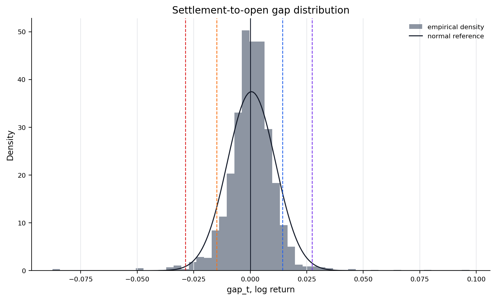

_Figure: `target_gap_histogram_density`. Source: `panel/modeling_panel.parquet`. Claim scope: `target_distribution_motivation_not_forecast_validation`. Tail side: `target_distribution`. Run file: `latex/figures/target_gap_histogram_density.png`._

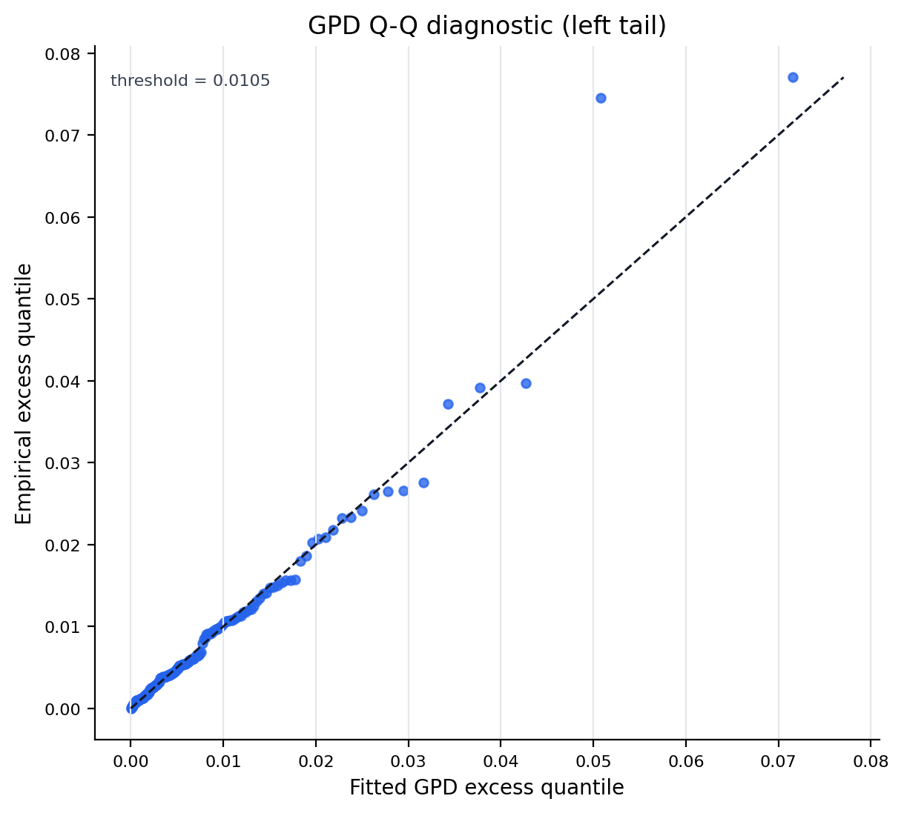

_Figure: `target_loss_qq_left_tail`. Source: `panel/modeling_panel.parquet`. Claim scope: `target_distribution_motivation_not_forecast_validation`. Tail side: `left_tail`. Run file: `latex/figures/target_loss_qq_left_tail.png`._

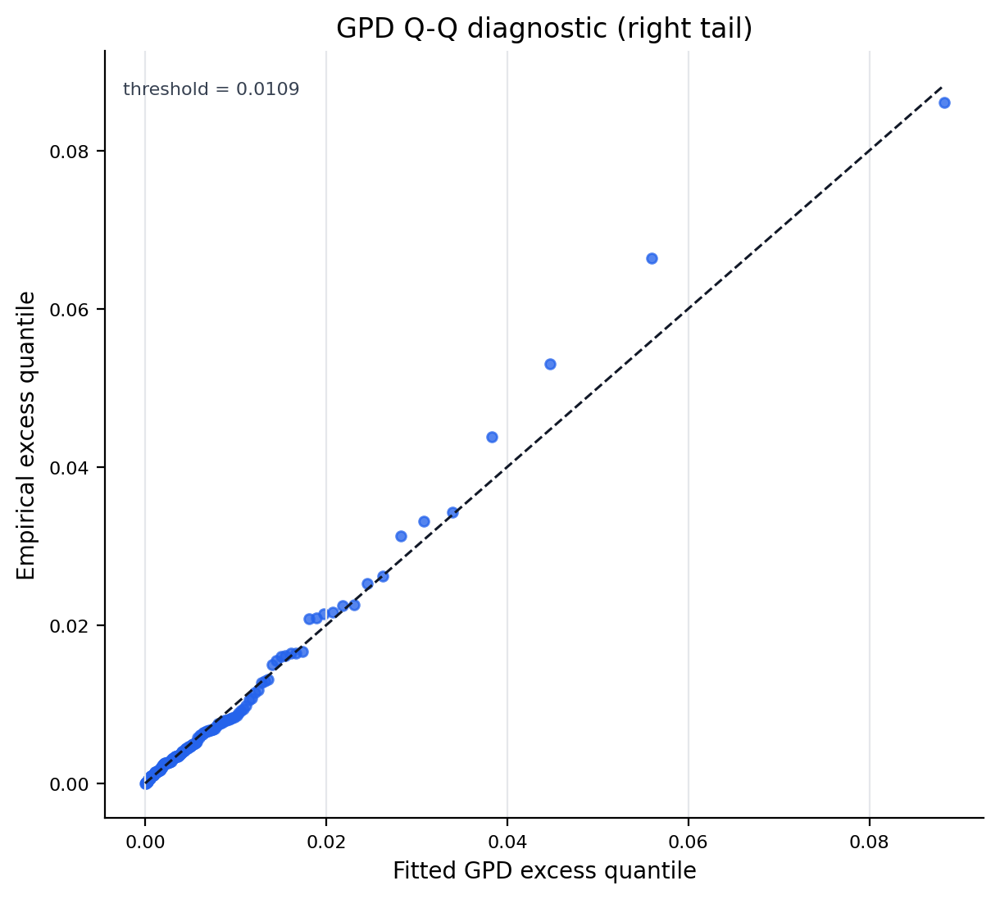

_Figure: `target_loss_qq_right_tail`. Source: `panel/modeling_panel.parquet`. Claim scope: `target_distribution_motivation_not_forecast_validation`. Tail side: `right_tail`. Run file: `latex/figures/target_loss_qq_right_tail.png`._

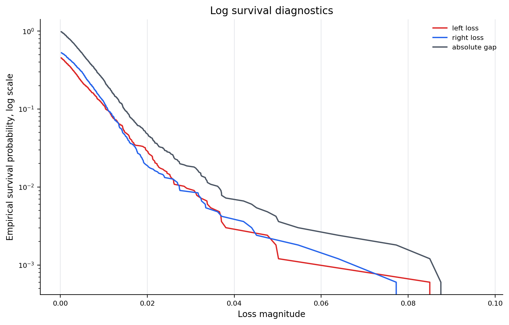

_Figure: `target_log_survival`. Source: `panel/modeling_panel.parquet`. Claim scope: `target_distribution_motivation_not_forecast_validation`. Tail side: `left_right_target_distribution`. Run file: `latex/figures/target_log_survival.png`._

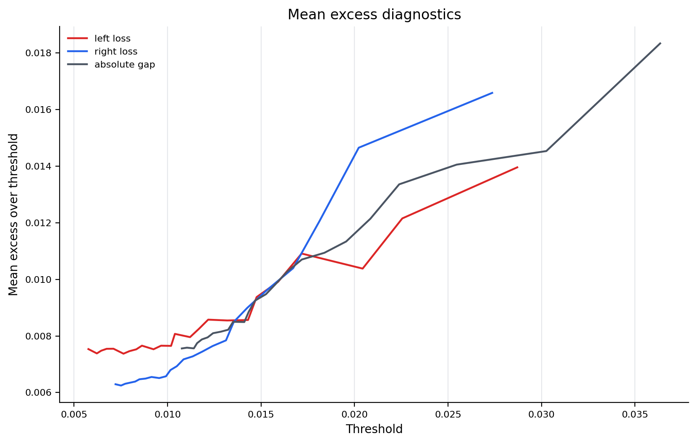

_Figure: `target_mean_excess`. Source: `panel/modeling_panel.parquet`. Claim scope: `target_distribution_motivation_not_forecast_validation`. Tail side: `left_right_target_distribution`. Run file: `latex/figures/target_mean_excess.png`._

_Figure: `target_hill_plot`. Source: `panel/modeling_panel.parquet`. Claim scope: `target_distribution_motivation_not_forecast_validation`. Tail side: `left_right_target_distribution`. Run file: `latex/figures/target_hill_plot.png`._

#### Figure 2. Coverage Breach-Rate Diagnostics

- Key readings: bars report realized VaR exception rates against the nominal line.
- Read this first: exception-rate deviations set the boundary for any loss-based interpretation.

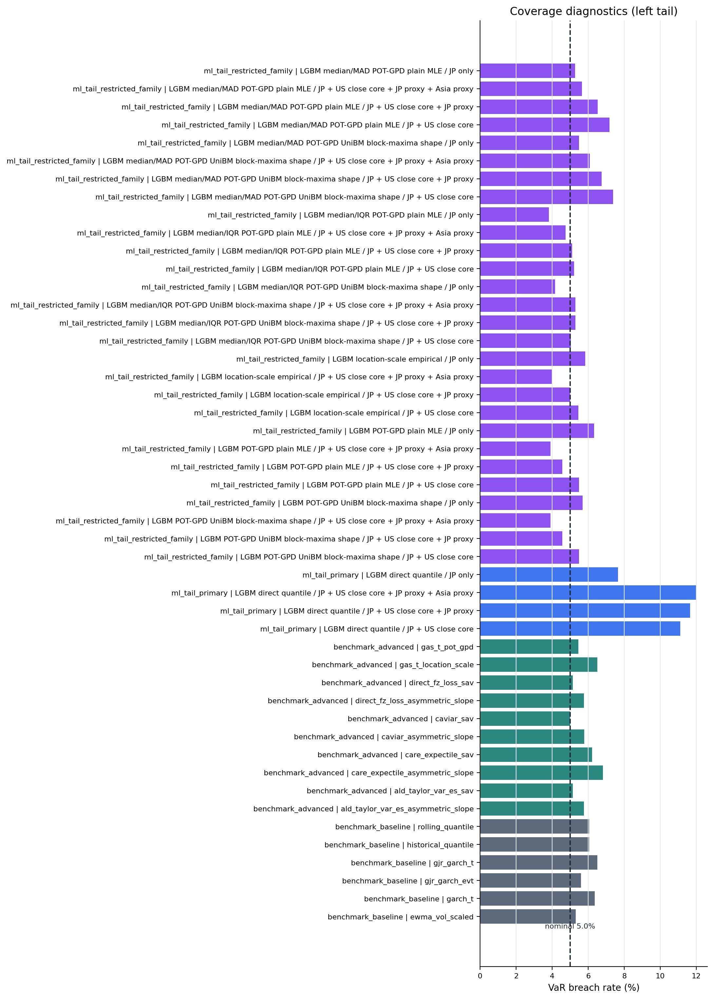

_Figure: `coverage_breach_rates_left_tail`. Source: `metrics/benchmark_metrics.parquet`, `metrics/benchmark_metrics_per_model.parquet`, `metrics/ml_tail_metrics.parquet`, `metrics/ml_tail_metrics_per_model.parquet`. Claim scope: `coverage_diagnostic_not_primary_claim`. Tail side: `left_tail`. Run file: `latex/figures/coverage_breach_rates_left_tail.png`._

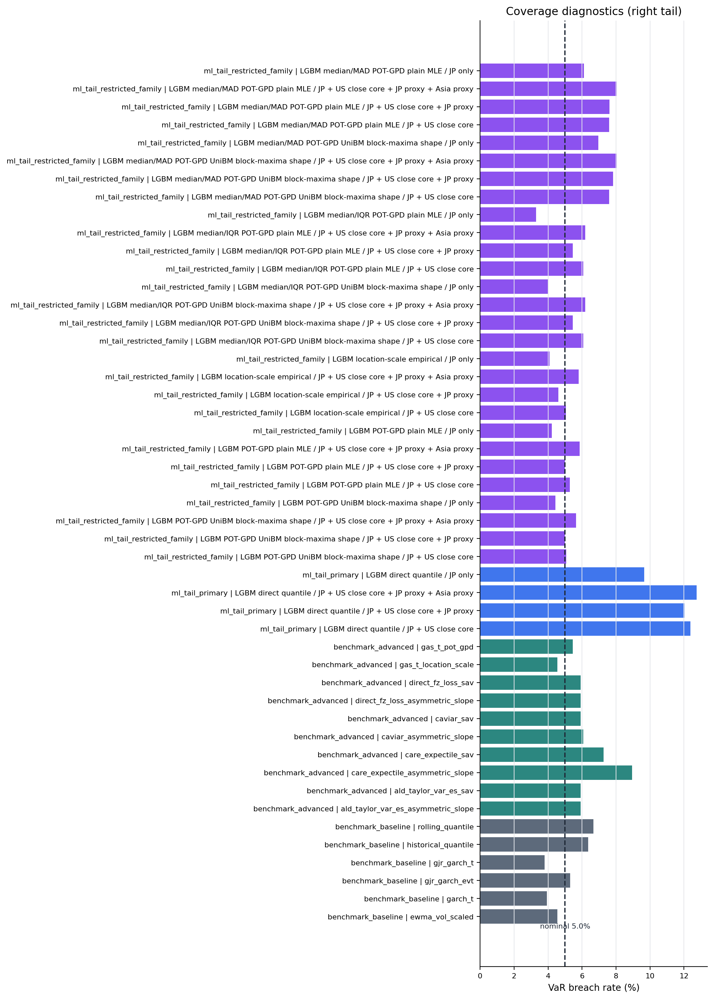

_Figure: `coverage_breach_rates_right_tail`. Source: `metrics/benchmark_metrics.parquet`, `metrics/benchmark_metrics_per_model.parquet`, `metrics/ml_tail_metrics.parquet`, `metrics/ml_tail_metrics_per_model.parquet`. Claim scope: `coverage_diagnostic_not_primary_claim`. Tail side: `right_tail`. Run file: `latex/figures/coverage_breach_rates_right_tail.png`._

#### Figure 3. Selected Benchmark-vs-LGBM Performance

- Key readings: compact main-figure rows split models into two broad groups, Benchmark and LGBM.
- Within each tail and group, rows are selected by sufficient sample size, VaR coverage near 5%, then lower FZ loss and quantile loss.
- Full benchmark and LGBM per-model results are exported in appendix tables, so this figure is a readable summary rather than the full result set.

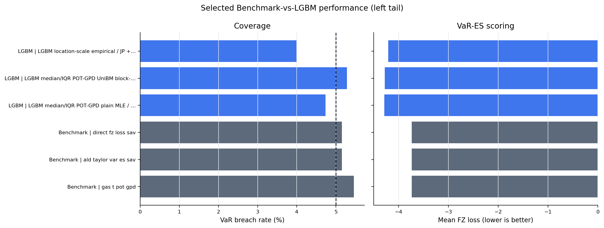

_Figure: `selected_model_performance_left_tail`. Source: `metrics/benchmark_metrics_per_model.parquet`, `metrics/ml_tail_metrics_per_model.parquet`. Claim scope: `selected_benchmark_vs_lgbm_main_figure_not_full_result_set`. Tail side: `left_tail`. Run file: `latex/figures/selected_model_performance_left_tail.png`._

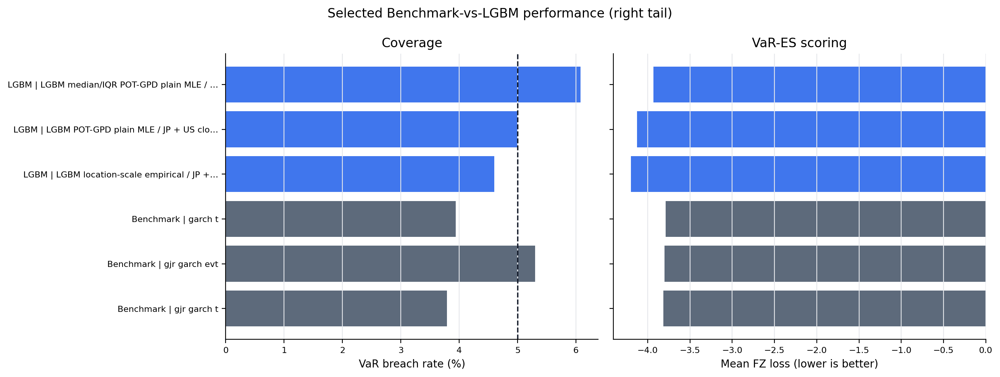

_Figure: `selected_model_performance_right_tail`. Source: `metrics/benchmark_metrics_per_model.parquet`, `metrics/ml_tail_metrics_per_model.parquet`. Claim scope: `selected_benchmark_vs_lgbm_main_figure_not_full_result_set`. Tail side: `right_tail`. Run file: `latex/figures/selected_model_performance_right_tail.png`._

#### Figure 4. Benchmark Murphy Diagnostics

- Key readings: curves report benchmark elementary-score diagnostics on a common grid.
- The plot is a scoring-family diagnostic, not a pairwise ranking statement.

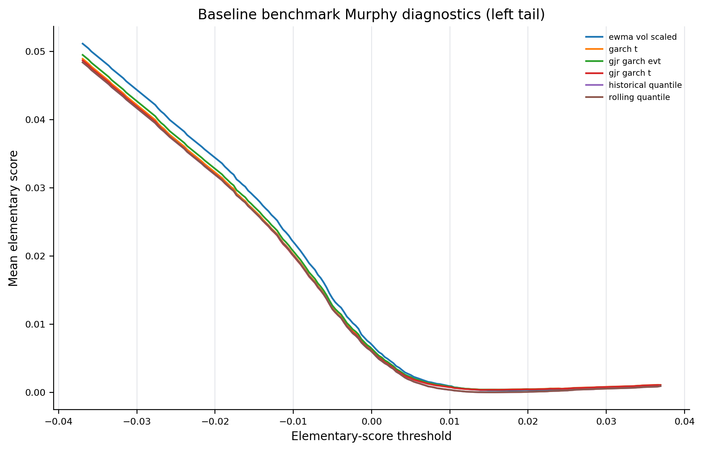

_Figure: `benchmark_murphy_left_tail`. Source: `metrics/benchmark_murphy.parquet`. Claim scope: `murphy_diagnostic_benchmark_baseline_common_grid`. Tail side: `left_tail`. Run file: `latex/figures/benchmark_murphy_left_tail.png`._

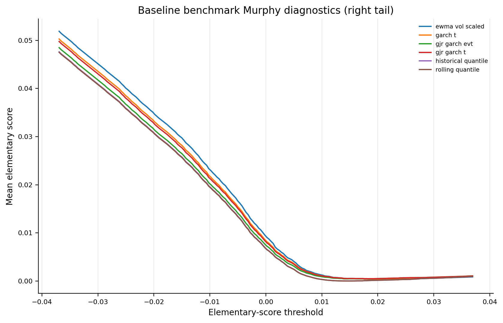

_Figure: `benchmark_murphy_right_tail`. Source: `metrics/benchmark_murphy.parquet`. Claim scope: `murphy_diagnostic_benchmark_baseline_common_grid`. Tail side: `right_tail`. Run file: `latex/figures/benchmark_murphy_right_tail.png`._

#### Figure 5. ML-Tail Murphy Diagnostics

- Key readings: curves report the ML-tail nested information sets on a common grid.
- Interpret curve separation together with the primary ML coverage warning and unconditional inference gates.

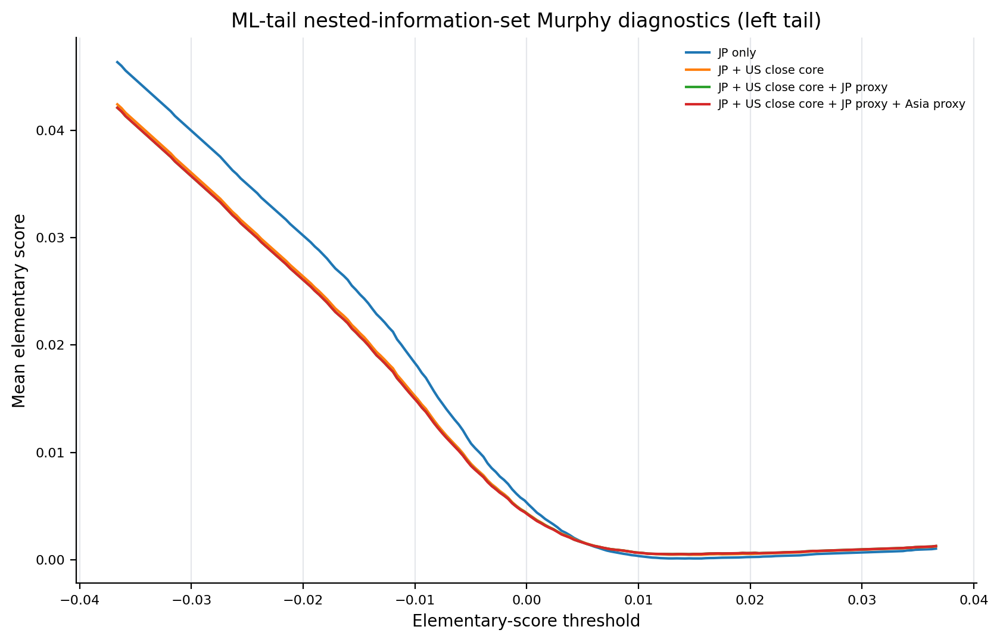

_Figure: `ml_tail_murphy_left_tail`. Source: `metrics/ml_tail_murphy.parquet`. Claim scope: `murphy_diagnostic_ml_tail_nested_information_sets_common_grid`. Tail side: `left_tail`. Run file: `latex/figures/ml_tail_murphy_left_tail.png`._

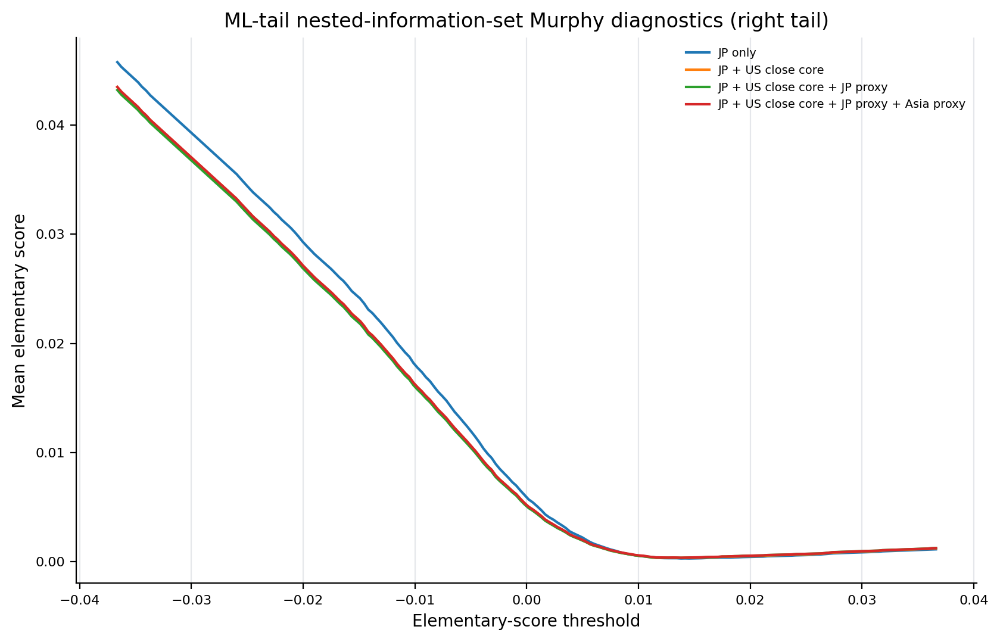

_Figure: `ml_tail_murphy_right_tail`. Source: `metrics/ml_tail_murphy.parquet`. Claim scope: `murphy_diagnostic_ml_tail_nested_information_sets_common_grid`. Tail side: `right_tail`. Run file: `latex/figures/ml_tail_murphy_right_tail.png`._

#### Figure 6. ES Severity Diagnostics

- Key readings: bars report conditional-on-exception severity diagnostics.
- Severity is reported for risk interpretation but is not a standalone model-selection claim.

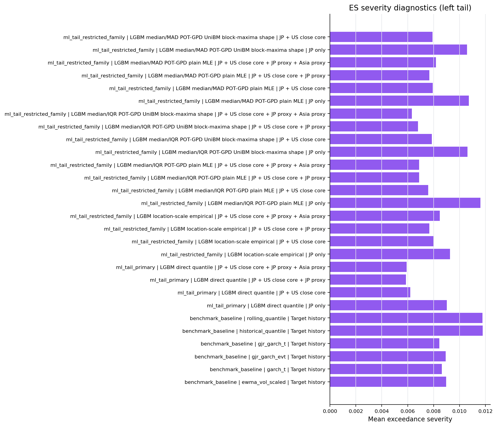

_Figure: `es_severity_left_tail`. Source: `metrics/benchmark_metrics.parquet`, `metrics/ml_tail_metrics.parquet`, `metrics/ml_tail_metrics_per_model.parquet`. Claim scope: `es_severity_diagnostic_not_model_selection_claim`. Tail side: `left_tail`. Run file: `latex/figures/es_severity_left_tail.png`._

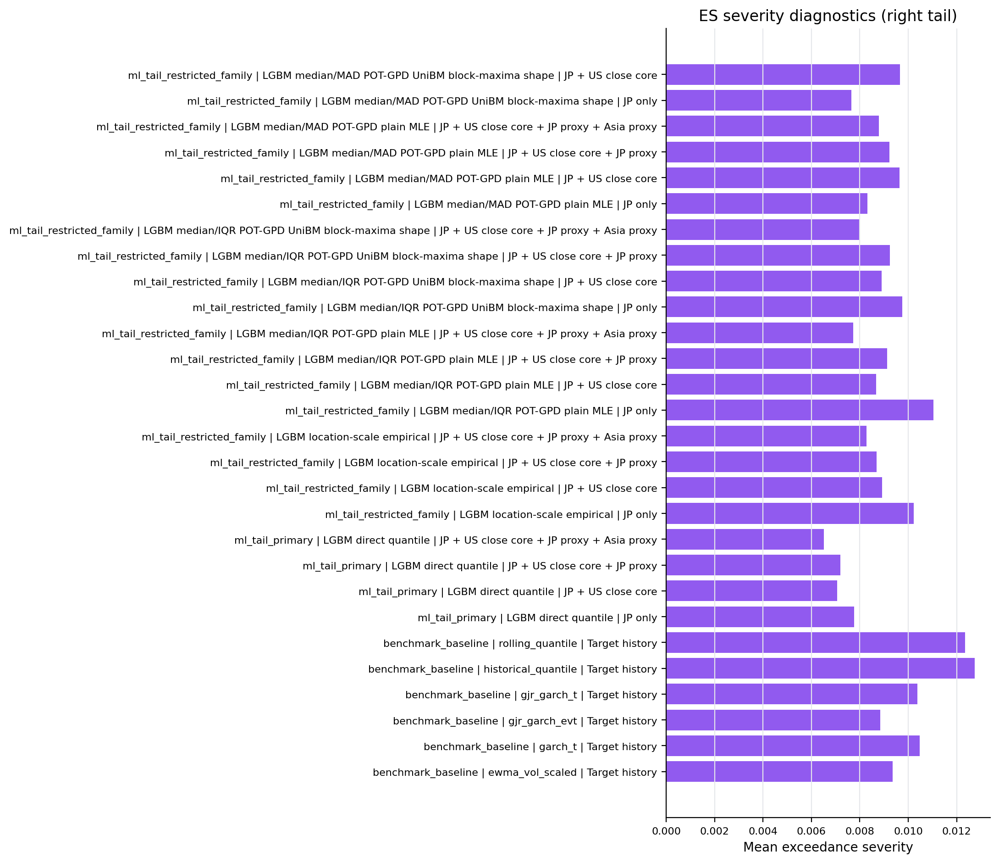

_Figure: `es_severity_right_tail`. Source: `metrics/benchmark_metrics.parquet`, `metrics/ml_tail_metrics.parquet`, `metrics/ml_tail_metrics_per_model.parquet`. Claim scope: `es_severity_diagnostic_not_model_selection_claim`. Tail side: `right_tail`. Run file: `latex/figures/es_severity_right_tail.png`._

#### Figure 7. Selected Trigger Diagnostics

- Key readings: bars report pre-open VaR-trigger diagnostics for the same selected Benchmark-vs-LGBM candidates used in the compact performance figures.
- The trigger rule is within-model: `trigger = VaR forecast above that model's 75th-percentile VaR forecast` on the evaluation sample.
- This top-quartile rule is separate from the 95% VaR forecast target: VaR calibration is evaluated by breach rates, coverage tests, quantile loss, and FZ loss.
- Lower false-alarm and missed-exception rates are better; the trigger-rate bar is omitted because it is expected to be near 25% by construction.
- The trigger output is a monitoring diagnostic, not hedge PnL, not transaction-cost evidence, and not an execution-performance result.

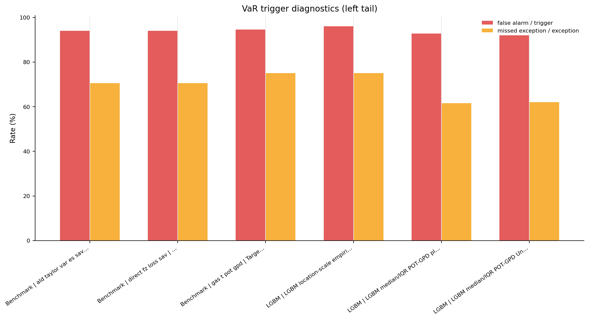

_Figure: `trigger_diagnostics_left_tail`. Source: `forecasts/benchmark_forecasts.parquet`, `forecasts/ml_tail_forecasts.parquet`. Claim scope: `trigger_diagnostic_not_pnl_cost_or_alpha`. Tail side: `left_tail`. Run file: `latex/figures/trigger_diagnostics_left_tail.png`._

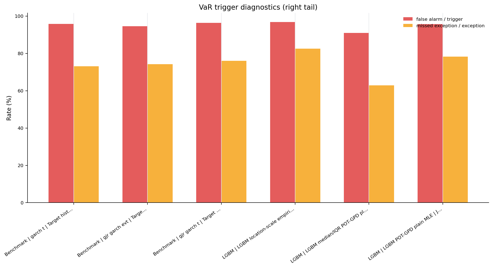

_Figure: `trigger_diagnostics_right_tail`. Source: `forecasts/benchmark_forecasts.parquet`, `forecasts/ml_tail_forecasts.parquet`. Claim scope: `trigger_diagnostic_not_pnl_cost_or_alpha`. Tail side: `right_tail`. Run file: `latex/figures/trigger_diagnostics_right_tail.png`._

#### Figure 8. EVT Standardized-Residual Diagnostics

- Key readings: figures show EVT diagnostics for LightGBM location-scale standardized residuals.
- QQ, log-survival, mean-excess, Hill, and threshold-stability diagnostics validate the POT-GPD tail assumption.
- These are assumption-validation diagnostics, not forecast-performance claims.

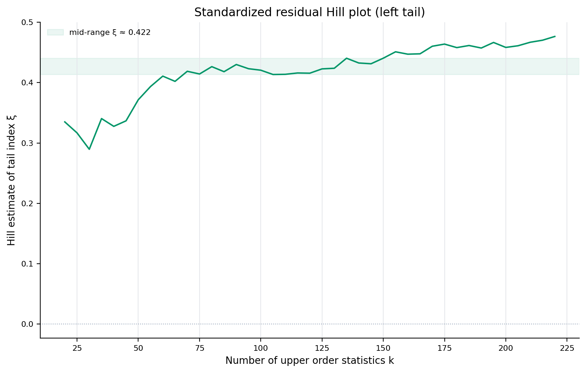

_Figure: `evt_standardized_hill_left_tail`. Source: `forecasts/ml_tail_forecasts.parquet`. Claim scope: `evt_standardized_residual_diagnostic_not_forecast_claim`. Tail side: `left_tail`. Run file: `latex/figures/evt_standardized_hill_left_tail.png`._

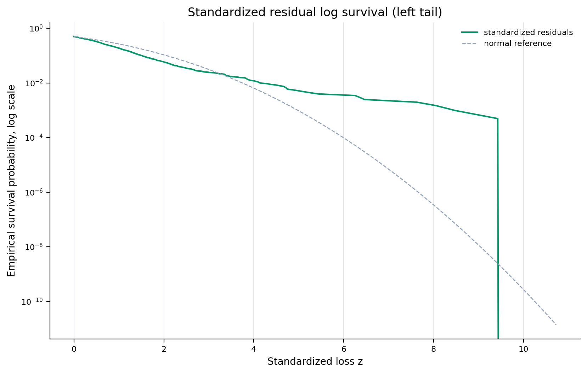

_Figure: `evt_standardized_log_survival_left_tail`. Source: `forecasts/ml_tail_forecasts.parquet`. Claim scope: `evt_standardized_residual_diagnostic_not_forecast_claim`. Tail side: `left_tail`. Run file: `latex/figures/evt_standardized_log_survival_left_tail.png`._

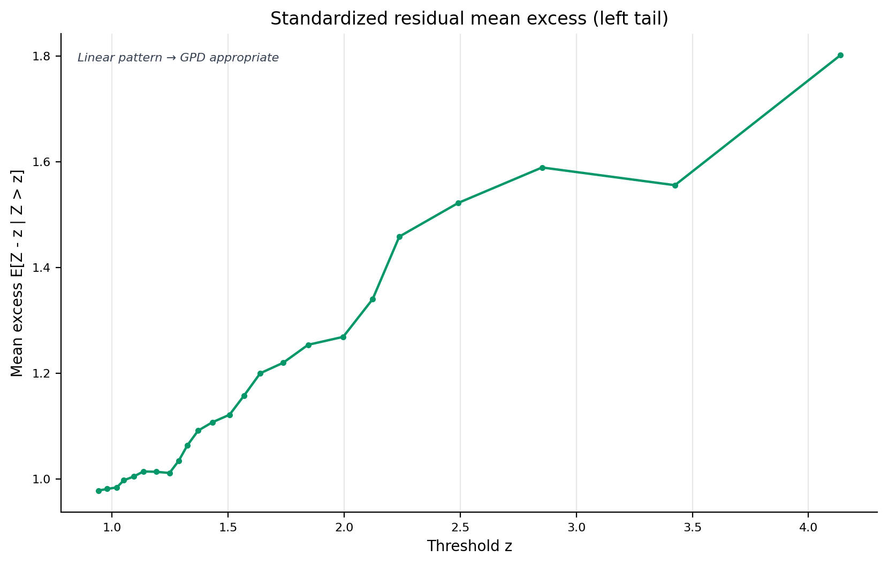

_Figure: `evt_standardized_mean_excess_left_tail`. Source: `forecasts/ml_tail_forecasts.parquet`. Claim scope: `evt_standardized_residual_diagnostic_not_forecast_claim`. Tail side: `left_tail`. Run file: `latex/figures/evt_standardized_mean_excess_left_tail.png`._

_Figure: `evt_standardized_qq_left_tail`. Source: `forecasts/ml_tail_forecasts.parquet`. Claim scope: `evt_standardized_residual_diagnostic_not_forecast_claim`. Tail side: `left_tail`. Run file: `latex/figures/evt_standardized_qq_left_tail.png`._

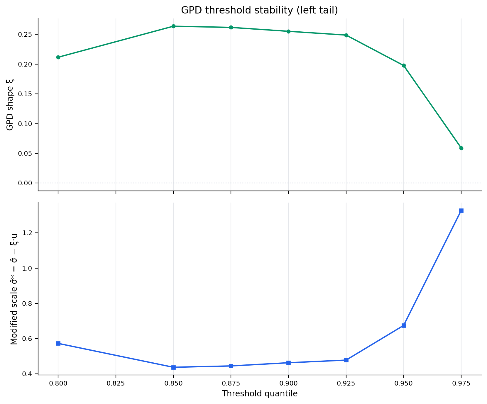

_Figure: `evt_standardized_threshold_stability_left_tail`. Source: `forecasts/ml_tail_forecasts.parquet`. Claim scope: `evt_standardized_residual_diagnostic_not_forecast_claim`. Tail side: `left_tail`. Run file: `latex/figures/evt_standardized_threshold_stability_left_tail.png`._

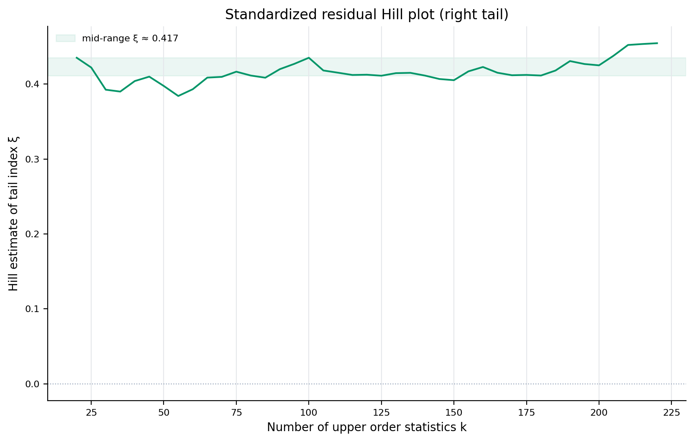

_Figure: `evt_standardized_hill_right_tail`. Source: `forecasts/ml_tail_forecasts.parquet`. Claim scope: `evt_standardized_residual_diagnostic_not_forecast_claim`. Tail side: `right_tail`. Run file: `latex/figures/evt_standardized_hill_right_tail.png`._

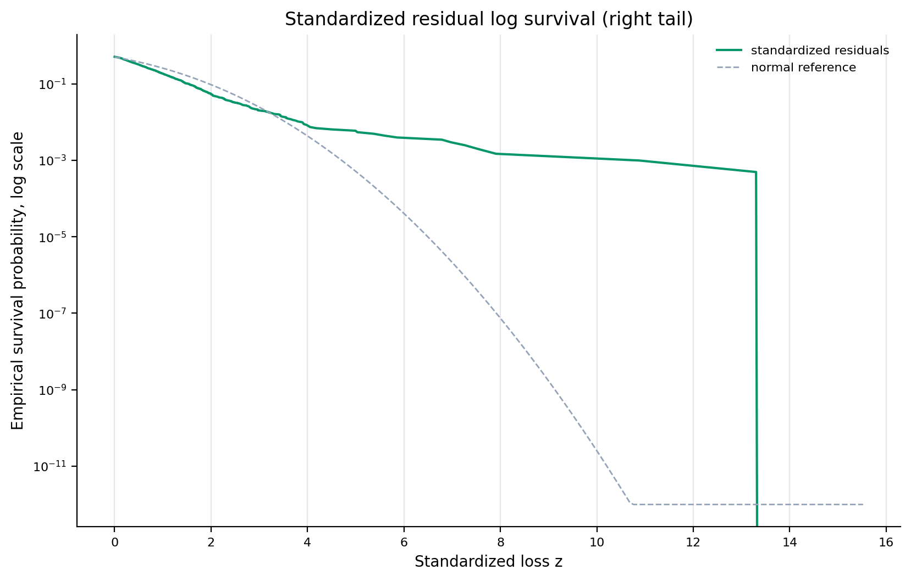

_Figure: `evt_standardized_log_survival_right_tail`. Source: `forecasts/ml_tail_forecasts.parquet`. Claim scope: `evt_standardized_residual_diagnostic_not_forecast_claim`. Tail side: `right_tail`. Run file: `latex/figures/evt_standardized_log_survival_right_tail.png`._

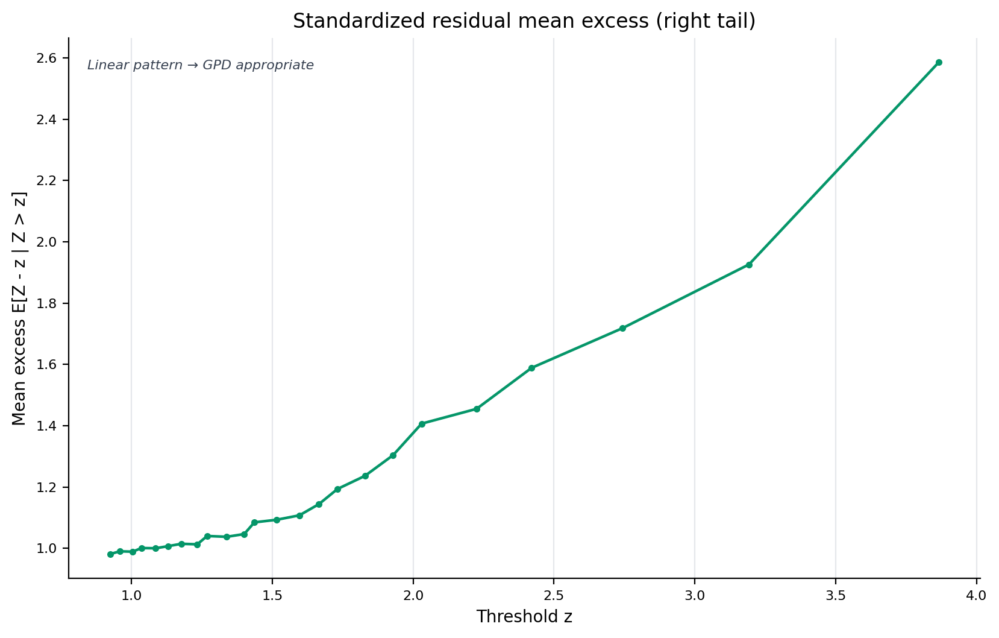

_Figure: `evt_standardized_mean_excess_right_tail`. Source: `forecasts/ml_tail_forecasts.parquet`. Claim scope: `evt_standardized_residual_diagnostic_not_forecast_claim`. Tail side: `right_tail`. Run file: `latex/figures/evt_standardized_mean_excess_right_tail.png`._

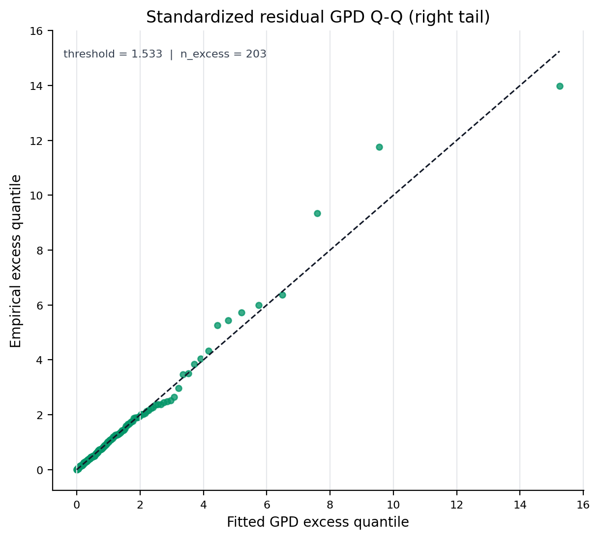

_Figure: `evt_standardized_qq_right_tail`. Source: `forecasts/ml_tail_forecasts.parquet`. Claim scope: `evt_standardized_residual_diagnostic_not_forecast_claim`. Tail side: `right_tail`. Run file: `latex/figures/evt_standardized_qq_right_tail.png`._

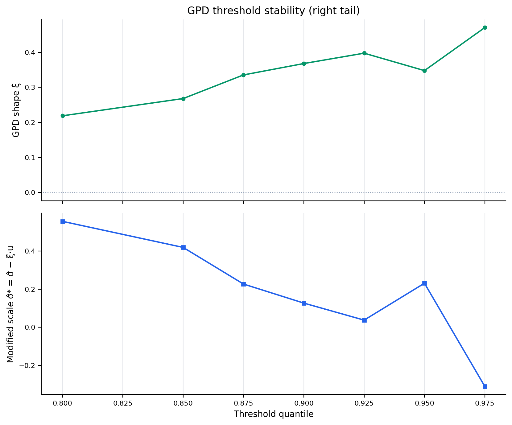

_Figure: `evt_standardized_threshold_stability_right_tail`. Source: `forecasts/ml_tail_forecasts.parquet`. Claim scope: `evt_standardized_residual_diagnostic_not_forecast_claim`. Tail side: `right_tail`. Run file: `latex/figures/evt_standardized_threshold_stability_right_tail.png`._

#### Appendix Figure A. DST Attenuation Diagnostics

- Appendix-only diagnostic: the left/right timing-regime patterns are not stable enough for a main-text claim.
- Key readings: bars report loss gains from adding `JP + US close core` to `JP only`, split by EST/EDT timing regime.
- A positive gain means the expanded information set has lower average loss; a negative gain means it performs worse on that loss metric.
- This diagnostic is computed for the current primary nested-information-set anchor, `LGBM direct quantile`; it is not an average across all LightGBM/EVT variants or a best-model selection.
- Treat this as descriptive timing evidence; left/right patterns should not be assigned a shared structural mechanism.

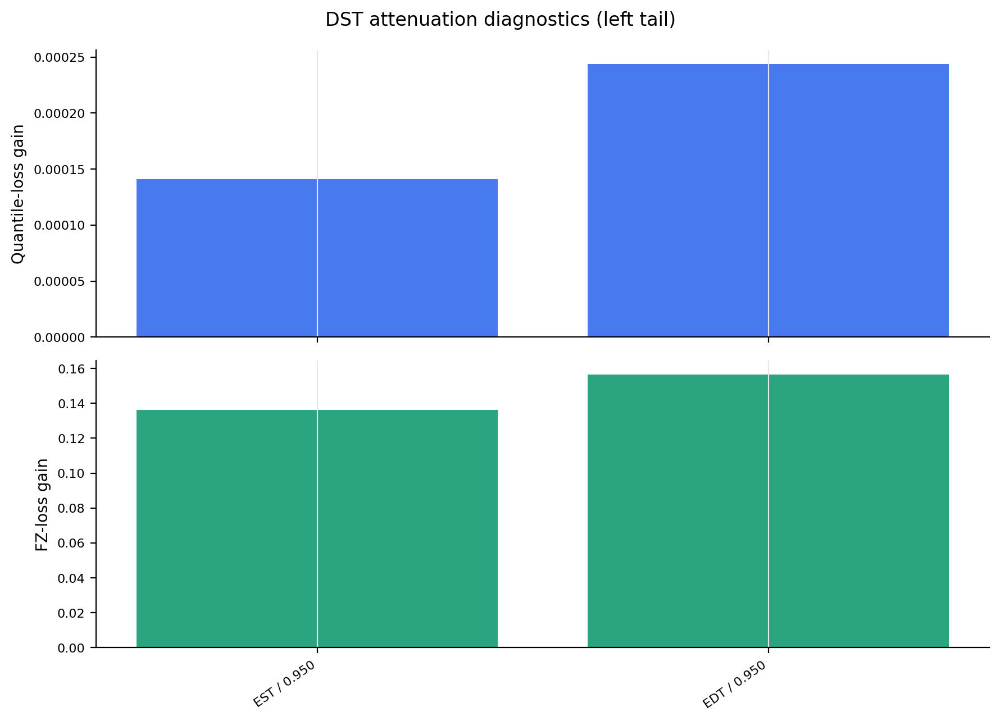

_Figure: `dst_attenuation_left_tail`. Source: `metrics/ml_tail_dst_attenuation.parquet`. Claim scope: `descriptive_dst_attenuation_not_structural_causal_identification`. Tail side: `left_tail`. Run file: `latex/figures/dst_attenuation_left_tail.png`._

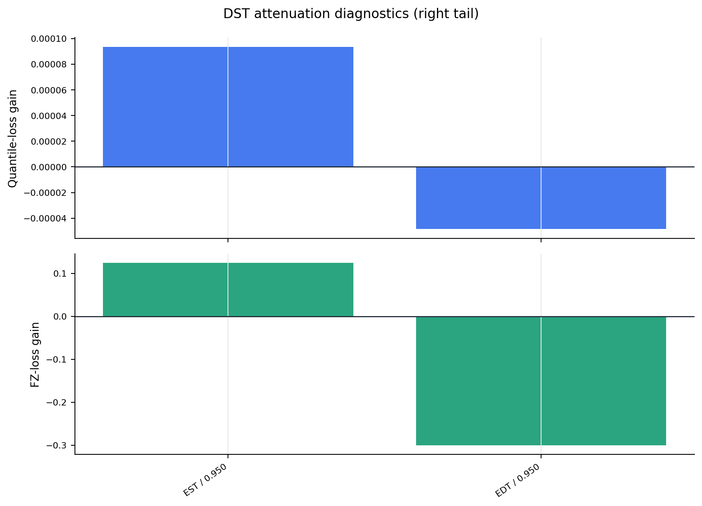

_Figure: `dst_attenuation_right_tail`. Source: `metrics/ml_tail_dst_attenuation.parquet`. Claim scope: `descriptive_dst_attenuation_not_structural_causal_identification`. Tail side: `right_tail`. Run file: `latex/figures/dst_attenuation_right_tail.png`._

### Artifact Index

| Artifact | Path | Exists |
| --- | --- | --- |
| manifest | `reports/runs/tailrisk_20160719_20260429_20260508T053721Z_commit_14205f41/manifest.json` | yes |
| data_vintage | `reports/runs/tailrisk_20160719_20260429_20260508T053721Z_commit_14205f41/data_vintage.json` | yes |
| modeling_panel | `data/gold/tp/tailrisk_20160719_20260429_20260508T053721Z_commit_14205f41/modeling_panel.parquet` | yes |
| target_audit | `data/gold/tp/tailrisk_20160719_20260429_20260508T053721Z_commit_14205f41/target_audit.parquet` | yes |
| calendar_map | `data/gold/tp/tailrisk_20160719_20260429_20260508T053721Z_commit_14205f41/calendar_map.parquet` | yes |
| feature_coverage | `data/gold/tp/tailrisk_20160719_20260429_20260508T053721Z_commit_14205f41/feature_coverage.parquet` | yes |
| leakage_summary | `data/gold/ls/tailrisk_20160719_20260429_20260508T053721Z_commit_14205f41/summary.json` | yes |
| benchmark_status | `reports/runs/tailrisk_20160719_20260429_20260508T053721Z_commit_14205f41/metrics/benchmark_status.json` | yes |
| benchmark_metrics | `reports/runs/tailrisk_20160719_20260429_20260508T053721Z_commit_14205f41/metrics/benchmark_metrics.parquet` | yes |
| benchmark_metrics_per_model | `reports/runs/tailrisk_20160719_20260429_20260508T053721Z_commit_14205f41/metrics/benchmark_metrics_per_model.parquet` | yes |
| benchmark_forecasts | `reports/runs/tailrisk_20160719_20260429_20260508T053721Z_commit_14205f41/forecasts/benchmark_forecasts.parquet` | yes |
| benchmark_dm_inference | `reports/runs/tailrisk_20160719_20260429_20260508T053721Z_commit_14205f41/metrics/benchmark_dm_inference.parquet` | yes |
| benchmark_mcs | `reports/runs/tailrisk_20160719_20260429_20260508T053721Z_commit_14205f41/metrics/benchmark_mcs.parquet` | yes |
| ml_tail_status | `reports/runs/tailrisk_20160719_20260429_20260508T053721Z_commit_14205f41/metrics/ml_tail_status.json` | yes |
| ml_tail_metrics | `reports/runs/tailrisk_20160719_20260429_20260508T053721Z_commit_14205f41/metrics/ml_tail_metrics.parquet` | yes |
| ml_tail_metrics_per_model | `reports/runs/tailrisk_20160719_20260429_20260508T053721Z_commit_14205f41/metrics/ml_tail_metrics_per_model.parquet` | yes |
| ml_tail_forecasts | `reports/runs/tailrisk_20160719_20260429_20260508T053721Z_commit_14205f41/forecasts/ml_tail_forecasts.parquet` | yes |
| ml_tail_result_matrix | `reports/runs/tailrisk_20160719_20260429_20260508T053721Z_commit_14205f41/metrics/ml_tail_result_matrix.parquet` | yes |
| ml_tail_result_matrix_dm | `reports/runs/tailrisk_20160719_20260429_20260508T053721Z_commit_14205f41/metrics/ml_tail_result_matrix_dm.parquet` | yes |
| ml_tail_result_matrix_mcs | `reports/runs/tailrisk_20160719_20260429_20260508T053721Z_commit_14205f41/metrics/ml_tail_result_matrix_mcs.parquet` | yes |
| ml_tail_dm_inference | `reports/runs/tailrisk_20160719_20260429_20260508T053721Z_commit_14205f41/metrics/ml_tail_dm_inference.parquet` | yes |
| ml_tail_mcs | `reports/runs/tailrisk_20160719_20260429_20260508T053721Z_commit_14205f41/metrics/ml_tail_mcs.parquet` | yes |
| ml_tail_cpa_inference | `reports/runs/tailrisk_20160719_20260429_20260508T053721Z_commit_14205f41/metrics/ml_tail_cpa_inference.parquet` | yes |
| cross_model_cpa_inference | `reports/runs/tailrisk_20160719_20260429_20260508T053721Z_commit_14205f41/metrics/cross_model_cpa_inference.parquet` | yes |
| ml_tail_model_eviction | `reports/runs/tailrisk_20160719_20260429_20260508T053721Z_commit_14205f41/metrics/ml_tail_model_eviction.parquet` | yes |
| ml_tail_dst_attenuation | `reports/runs/tailrisk_20160719_20260429_20260508T053721Z_commit_14205f41/metrics/ml_tail_dst_attenuation.parquet` | yes |
| ml_tail_murphy | `reports/runs/tailrisk_20160719_20260429_20260508T053721Z_commit_14205f41/metrics/ml_tail_murphy.parquet` | yes |
| ml_tail_feature_unavailability | `reports/runs/tailrisk_20160719_20260429_20260508T053721Z_commit_14205f41/metrics/ml_tail_feature_unavailability.parquet` | yes |
| benchmark_stress_windows | `reports/runs/tailrisk_20160719_20260429_20260508T053721Z_commit_14205f41/metrics/benchmark_stress_windows.parquet` | yes |
| ml_tail_stress_windows | `reports/runs/tailrisk_20160719_20260429_20260508T053721Z_commit_14205f41/metrics/ml_tail_stress_windows.parquet` | yes |
| figure_manifest | `reports/runs/tailrisk_20160719_20260429_20260508T053721Z_commit_14205f41/latex/figure_manifest.json` | yes |
| table_manifest | `reports/runs/tailrisk_20160719_20260429_20260508T053721Z_commit_14205f41/latex/table_manifest.json` | yes |
| latex_dir | `reports/runs/tailrisk_20160719_20260429_20260508T053721Z_commit_14205f41/latex/tables` | yes |
| claim_scope_table | `reports/runs/tailrisk_20160719_20260429_20260508T053721Z_commit_14205f41/latex/tables/tailrisk_claim_scope_table.tex` | yes |
| es_severity_table | `reports/runs/tailrisk_20160719_20260429_20260508T053721Z_commit_14205f41/latex/tables/tailrisk_es_severity_table.tex` | yes |
| hedge_trigger_table | `reports/runs/tailrisk_20160719_20260429_20260508T053721Z_commit_14205f41/latex/tables/tailrisk_hedge_trigger_diagnostics_table.tex` | yes |
| dst_attenuation_table | `reports/runs/tailrisk_20160719_20260429_20260508T053721Z_commit_14205f41/latex/tables/ml_tail_dst_attenuation_table.tex` | yes |
| result_matrix_summary_table | `reports/runs/tailrisk_20160719_20260429_20260508T053721Z_commit_14205f41/latex/tables/ml_tail_result_matrix_summary_table.tex` | yes |

- All paths above are local ignored artifacts; they are reproducible outputs, not tracked source files.
- Forecast/reporting rebuilds should read these artifacts and must not call vendor APIs.
- If this page is stale, rerun `just snapshot` after a completed `just full` or pass an explicit run id to the CLI snapshot command.

### Technical Infrastructure Note

- Runtime imports are explicit at the module boundary; no dynamic runtime namespace bridge is required to generate this snapshot. This infrastructure note is separate from empirical claim boundaries.
