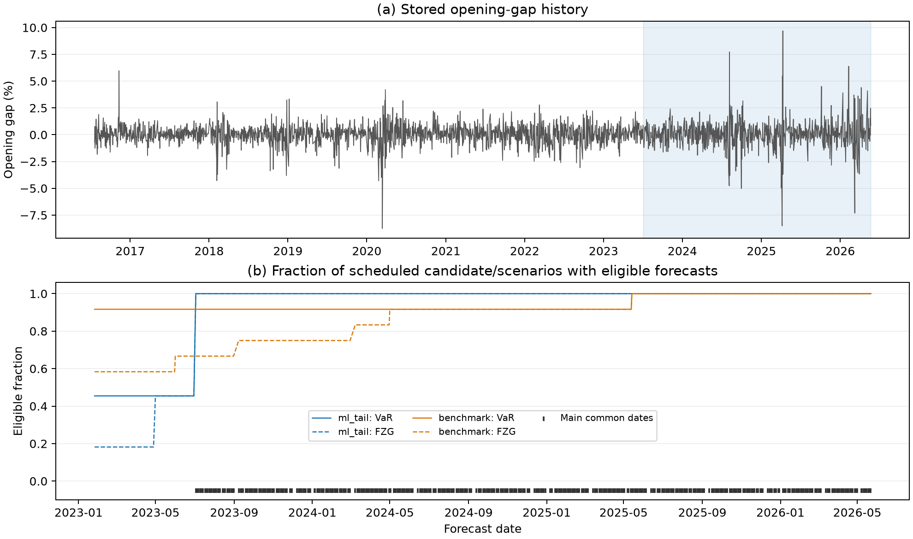
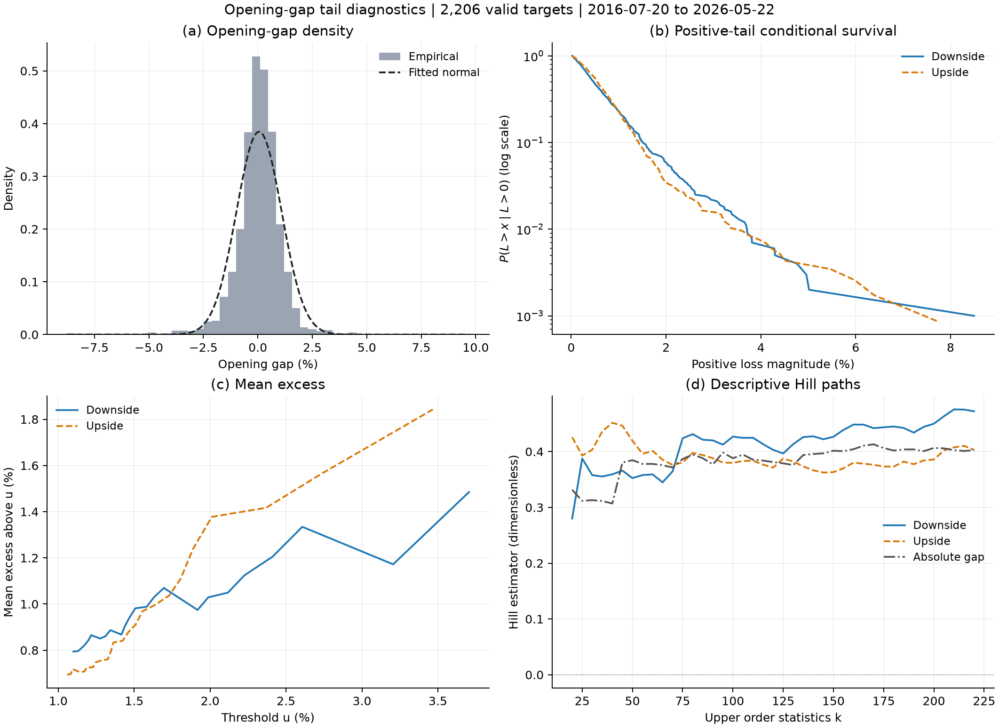
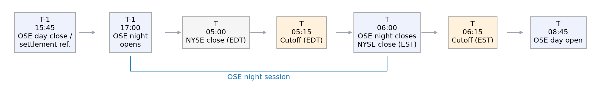
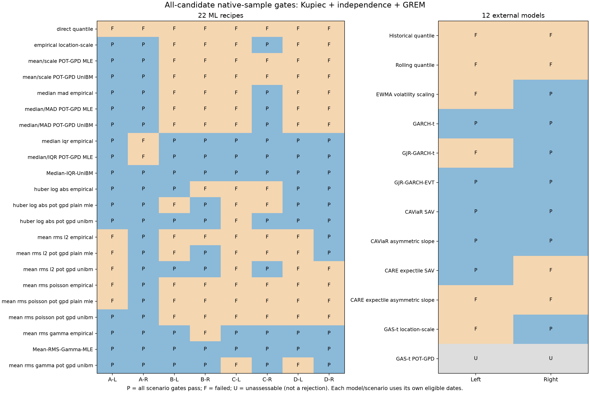
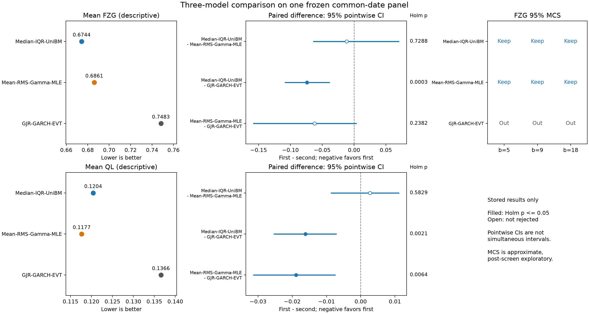
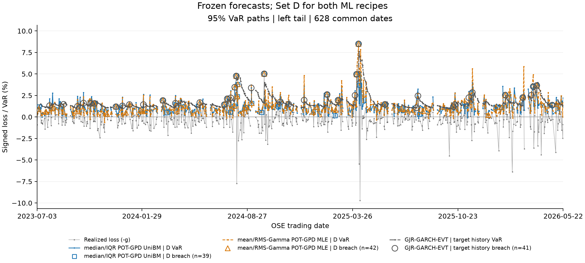
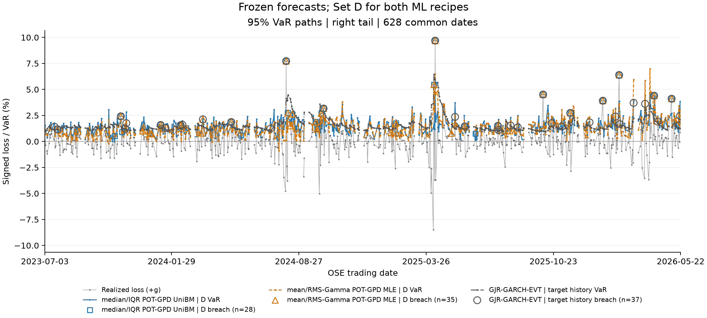
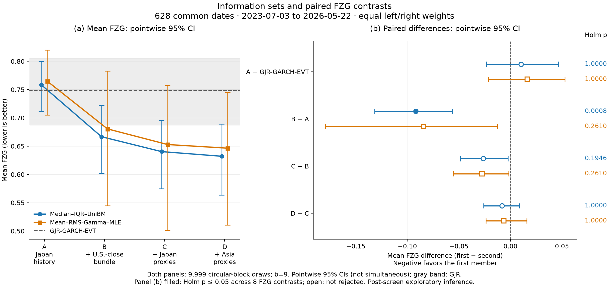
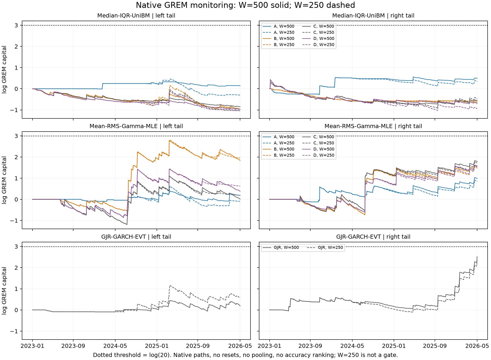

---
hide:
  - navigation
---

# Results Snapshot

Updated 2026-09-21 from `artifacts/paper_bundle_20260921`, the designated
paper figure/table entrypoint. This page mirrors its figures and summarizes the
completed frozen-forecast reevaluation. The [Paper Plan](paper_plan.md) defines
the current methods and evaluation contract; [Data](data.md) documents sources
and timing. This is exploratory research evidence, not a fresh holdout test.

## Main finding

Two of the 22 ML recipes pass all eight native scenarios under Kupiec,
Christoffersen independence and W500 ES-GREM:

- **IQR:** Median–IQR–UniBM (`lightgbm_median_iqr_pot_gpd_unibm`).
- **Gamma:** Mean–RMS-Gamma–POT-MLE (`lightgbm_mean_rms_gamma_pot_gpd_plain_mle`).

Four of 12 external models pass both tails. External-only joint-date FZG
selection chooses **GJR-GARCH-EVT** (`gjr_garch_evt`, abbreviated GJR).
It was selected again, not assumed to remain the reference.

On the fixed 628-date comparison panel, IQR has the lowest mean FZG and Gamma
the lowest mean quantile loss. FZG MCS retains both ML models and excludes GJR.
**The evidence does not establish a uniquely best ML model.**

## Evidence and sample

| Item | Frozen evidence |
|---|---|
| Forecast source | `artifacts/body22_expanding_oof_cov97_full_20260913` |
| Reevaluation | `artifacts/reevaluation_fzg_grem_20260921` |
| Recorded forecast rows | 143,402 |
| Native scenarios | 200 = 22×8 ML + 12×2 external |
| Scheduled OOS | 2023-01-26–2026-05-22; 722 clean target dates |
| Full OOS target-session axis | 811 sessions |
| External-reference selection | 466 joint dates; 2024-04-01–2026-05-22 |
| Main comparison | 628 joint dates; 2023-07-03–2026-05-22 |
| Main comparison calendar span | 704 target sessions, including 76 excluded sessions |
| Daily scores | 1,884 = 628 dates×3 models |
| Paired inference | 18 rows = 3 pairs×2 scores×3 block lengths |
| MCS | 9 rows = 3 models×3 block lengths; FZG only |

The 94 early scheduled dates excluded from the main comparison have frozen Gamma
failures labelled `EVT calibration has insufficient standardized losses`.
The remaining calendar holes come from the original sample mask. They are not
compressed into consecutive sessions when constructing bootstrap blocks.

The external selection panel requires all four admitted external models and
both tails. After fixing GJR, the main panel requires only GJR and the admitted
ML models; it can therefore contain more dates. These are two defined comparison
questions, not a disjoint selection/test split or reference reselection to enlarge
the sample.

### Sample, target distribution and forecast timing

The shaded history span is not a gap-free comparison sample. The lower panel
distinguishes native VaR and joint-score availability; black ticks identify the
628 common dates used for the main comparison.

The target diagnostics use **2,206 finite target-clean observations**,
2016-07-20–2026-05-22, independently of predictor availability or model eligibility.
They do not use the inherited 1,722-row predictor-clean sample or the 628-date
comparison panel. Gap and loss magnitudes are expressed as 100 times log return.
The four panels show the histogram against a normal reference fitted to this
sample, conditional-positive left/right survival, mean-excess curves and Hill
paths (including absolute gaps). Survival denominators contain only positive
losses in the corresponding tail; they are not unconditional breach probabilities.
Mean-excess and Hill paths are threshold-dependent descriptive diagnostics,
not fitted forecast-model parameters or new hypothesis tests. These plots motivate
attention to empirical tail behavior; they do not prove regular variation, a
power-law tail, optimality of an EVT method or forecast calibration.

The timeline is a current-hours schematic in JST, not to scale: OSE day close
is 15:45 and night opening is 17:00, using the schedule effective 5 November 2024,
not all historical sample hours. T-1 and T denote adjacent calendar days in an
ordinary weekday example, not exchange trading-day labels. The settlement
reference is the preceding trading day's official settlement; 15:45 labels the
day-session close, not settlement publication time.
Morning nodes use actual stored regular-session examples. Forecast cutoff is
the matched official NYSE close plus 15 minutes; early-close and holiday-matched
dates retain their actual mappings unchanged in the bundle's `timing.csv`.
The target remains settlement-to-day-open, not night-close-to-open.
EDT and EST nodes are alternative seasonal cases on one shared clock axis,
not two successive U.S. closes. The OSE night-session bracket ends at 06:00 JST
for the evaluated period. Figure titles and explanatory notes are left to the
manuscript caption.

### Signed ES and units

Losses and forecasts retain their signs. FZG accepts finite coherent ES >= VaR,
including ES <= 0; the GREM input domain remains ES > VaR. FZG and quantile loss
are evaluated in percentage-point units, without changing decimal training labels.

Across native scenarios, FZG retains 314 coherent records outside the positive-ES
FZ0 domain. The main panel includes seven negative-ES Gamma records across
2023-10-16, 2023-11-15 and 2024-07-25. No clamp, imputation or date deletion was
used to make these records scoreable. IQR and GJR have no nonpositive ES on this panel.

## Admission before comparison

Each ML recipe must pass **all eight** A–D × left/right scenarios. Native valid
VaR N >= 450, Kupiec p >= 0.05 and Christoffersen independence p >= 0.05 are
required. W500 GREM additionally requires a complete assessable native sequence,
at least 450 eligible observations and historical running maximum <20.
The fixed breach-rate band is descriptive only; W250 is sensitivity, not a gate.

P denotes pass, F failure and U unassessable. Each cell uses its own native
eligible dates, not the common comparison sample.

Cells below show **VaR-only pass count → combined pass count**, out of eight.

| LGBM body | Empirical tail | POT-MLE | UniBM |
|---|---:|---:|---:|
| Mean–log-absolute | 5→3 | 2→2 | 2→2 |
| Median–MAD | 3→3 | 3→3 | 3→3 |
| Median–IQR | 7→7 | 7→7 | **8→8** |
| Huber–log-absolute | 7→5 | 7→5 | 7→7 |
| Mean–RMS-L2 | 7→2 | **8→3** | 7→4 |
| Mean–RMS-Poisson | 5→1 | 4→1 | 2→2 |
| Mean–RMS-Gamma | 7→7 | **8→8** | 6→6 |

Direct quantile: 0→0. All 176 ML scenarios are assessable.
Of the three former VaR-gate winners, **Mean–RMS-L2–POT-MLE is excluded by GREM**:
A/left, B/left, C/left, C/right and D/left previously crossed 20.
A/left first crossed on 2024-08-05 and reached a historical peak of 136.475.
This is a change in the admission rule, not retraining-induced deterioration.

| External candidate | VaR gates /2 | Combined gates /2 |
|---|---:|---:|
| Historical quantile | 0 | 0 |
| Rolling quantile | 0 | 0 |
| EWMA volatility-scaled | 2 | 1 |
| GARCH-t | 2 | 2 |
| GJR-GARCH-t | 1 | 1 |
| GJR-GARCH-EVT | 2 | 2 |
| CAViaR-SAV | 2 | 2 |
| CAViaR asymmetric slope | 2 | 2 |
| CARE expectile SAV | 1 | 1 |
| CARE expectile asymmetric slope | 0 | 0 |
| GAS-t location-scale | 2 | 1 |
| GAS-t POT-GPD | 0 | 0 |

EWMA and GAS-t location-scale lose left-tail admission through GREM alarms.
GAS-t POT-GPD has only 223 native/eligible observations per tail and is
**unassessable** under the 450-observation policy; it is not counted as a
statistical rejection merely for insufficient history. Its right tail also
has recorded Kupiec rejection and GREM crossing.

External-only mean FZG on the 466 joint dates is 0.794786 for GJR, 0.803825 for
GARCH-t, 0.807911 for CAViaR asymmetric slope and 0.812629 for CAViaR-SAV.
GJR is selected without a tie.

## Global scores and paired evidence

Every model uses the same 628 dates. Average eight scenarios equally within
each date, then average dates equally. External predictions are reused across
A–D, not treated as additional independent observations. Lower scores are better.

Mean-score points are descriptive. The paired intervals are pointwise 95%
intervals; filled markers indicate rejection after the stated Holm adjustment.

| Model | Mean FZG: primary | Mean quantile loss: secondary |
|---|---:|---:|
| IQR | **0.674394** | 0.120409 |
| Gamma | 0.686129 | **0.117668** |
| GJR | 0.748252 | 0.136578 |

Paired differences are first minus second; negative favors the first model.
Main block length is 9, with 9999 circular-block replicates and seed 225.
These are two-sided centered bootstrap tests of mean score differences
(DM-style), not separately computed normal/HAC-DM p-values.
Intervals are pointwise 95% basic bootstrap intervals, not simultaneous intervals;
Holm adjustment is separate within each score family.

| Score | Pair | Mean difference | 95% basic CI | Raw p | Holm p |
|---|---|---:|---|---:|---:|
| FZG | IQR − Gamma | −0.011735 | [−0.064379, 0.071128] | 0.7288 | 0.7288 |
| FZG | IQR − GJR | −0.073858 | [−0.108917, −0.038060] | 0.0001 | **0.0003** |
| FZG | Gamma − GJR | −0.062123 | [−0.158611, 0.004248] | 0.1191 | 0.2382 |
| QL | IQR − Gamma | 0.002741 | [−0.008774, 0.011283] | 0.5829 | 0.5829 |
| QL | IQR − GJR | −0.016169 | [−0.025465, −0.007007] | 0.0007 | **0.0021** |
| QL | Gamma − GJR | −0.018910 | [−0.031443, −0.007334] | 0.0032 | **0.0064** |

Pairwise exception-date unions are respectively 139, 130 and 138, exceeding the
five-date reporting floor; N=628 exceeds the 120-date floor. All 9999 draws are
usable in every configuration. The minimum paired p=0.0001 reflects plus-one
Monte Carlo resolution, not a zero probability.

### Block-length sensitivity

| Score / pair: Holm p | b=5 | b=9: main | b=18 |
|---|---:|---:|---:|
| FZG: IQR − Gamma | 0.7193 | 0.7288 | 0.7251 |
| FZG: IQR − GJR | 0.0012 | 0.0003 | 0.0006 |
| FZG: Gamma − GJR | 0.2452 | 0.2382 | 0.2478 |
| QL: IQR − Gamma | 0.5568 | 0.5829 | 0.5913 |
| QL: IQR − GJR | 0.0030 | 0.0021 | 0.0009 |
| QL: Gamma − GJR | 0.0036 | 0.0064 | 0.0090 |

Lower aggregate loss is not scenario-by-scenario dominance. For example,
A/left FZG is 0.768243 for IQR and 0.744149 for GJR. All-scenario admission
and comparative performance answer different questions.

## FZG model confidence set

| Model | MCS p: b=5 | b=9: main | b=18 | Nominal 95% set |
|---|---:|---:|---:|---|
| IQR | 1.000000 | 1.000000 | 1.000000 | Retained |
| Gamma | 0.719272 | 0.728773 | 0.725073 | Retained |
| GJR | 0.002100 | 0.001200 | 0.000900 | Excluded |

The Hansen–Lunde–Nason T_R procedure uses the `arch` R-method strict empirical
step-p convention and cumulative maxima along elimination. IQR's p=1 is the
last-retained-model convention, **not a 100% probability of being optimal**.
MCS exclusion of GJR does not require both ML-versus-GJR paired tests to reject.
Retaining both ML models establishes neither equivalence nor a unique winner.

## D-configuration VaR paths

Both tail figures show **IQR-D, Gamma-D and GJR**, with actual signed loss and
95% VaR on the same 628 common dates (2023-07-03–2026-05-22). Loss is
\(L_t=-g_t\) for the left tail and \(L_t=g_t\) for the right tail. Dates excluded
from the comparison remain gaps on the native session axis; forecasts are not
filled, interpolated or averaged across information sets.
Hollow squares (IQR), triangles (Gamma) and circles (GJR) mark the actual loss
on dates where it strictly exceeds that model's VaR. Equality is not a breach.
Legend counts refer to these common dates, not the native samples used by gates.

D has the lowest **two-tail average** FZG among A–D for each admitted ML recipe
(IQR: 0.632125; Gamma: 0.646397). It is selected once per model for illustration,
not separately for each tail; GJR remains target-history-only. This is an
observed-sample descriptive selection, not evidence that D significantly dominates
the other information sets. In particular, the stored global paired tests and
MCS average all eight scenarios: they are **not D-only inference** and must not
be attached to these selected paths as significance claims. Native gate decisions
also remain unchanged.

## Matched baseline and information contrasts

The follow-up in `artifacts/information_contrasts_20260921` keeps the same two
admitted ML recipes, GJR reference and 628 common dates. It averages left/right
scores within each information set/date, rather than averaging A–D first.
There is no retraining, gate recomputation, reference reselection or new MCS.

Panel (a) shows sample means with pointwise 95% basic bootstrap CIs: vertical
intervals for the two ML recipes (slightly offset for readability) and one gray
horizontal band for GJR. The nine
mean intervals use 9999 joint circular-block draws, b=9 and seed 225, preserving
the native-session calendar mask; the plotted points remain the original sample
means. These are not prediction intervals or simultaneous confidence bands.
Panel (b) shows the eight paired differences and their existing pointwise 95%
basic bootstrap intervals. Negative differences
favor the first member. Blue circles denote IQR and orange squares Gamma in both
panels. In panel (b), filled markers indicate Holm-adjusted p≤0.05; open markers mean no
rejection after adjustment, even when the pointwise interval excludes zero.
Only the mean-level CIs were added; the stored scores, paired tests and MCS
were not changed. Numerical interval rows are in `mean_intervals.parquet`
alongside the original artifacts; the additive render has its own small manifest.

The largest estimated score reduction for both recipes is A→B. A−GJR changes
both model and inputs; B−A adds the **U.S.-close information bundle**, not solely
U.S. equity returns. C−B and D−C add Japan-related and Asia proxies respectively.

The eight FZG contrasts below form one Holm family, separate from the earlier
three global model pairs. Main b=9, 9999 joint calendar-mask CBB draws, seed 225;
two-sided tests and pointwise 95% basic intervals. Negative favors the first
member. An interval excluding zero does not imply Holm-adjusted significance.

Holm permits arbitrary dependence between valid individual p-values; sharing
dates and nested information sets is therefore not an independence violation
([R documentation](https://stat.ethz.ch/R-manual/R-devel/library/stats/html/p.adjust.html)).
The eight-test family is retained regardless of the observed signs or p-values.
Validity of the underlying time-series bootstrap still requires appropriate
dependence/moment and distribution-stability conditions; joint mask resampling
does not establish those conditions or correct prior model/reference screening.
Inference remains approximate and post-screen exploratory. The equal-tailed
basic CIs and absolute-centered two-sided bootstrap tests are not exact inverses
under skewness; use the reported p-values for the declared testing decisions.

| Recipe | Contrast | Mean FZG difference | 95% basic CI | Raw p | Holm p |
|---|---|---:|---|---:|---:|
| IQR | A − GJR | 0.010169 | [−0.023295, 0.046599] | 0.5750 | 1.0000 |
| IQR | B − A | −0.091738 | [−0.131669, −0.056092] | 0.0001 | **0.0008** |
| IQR | C − B | −0.026336 | [−0.048785, −0.002264] | 0.0278 | 0.1946 |
| IQR | D − C | −0.008221 | [−0.025999, 0.008738] | 0.3497 | 1.0000 |
| Gamma | A − GJR | 0.016479 | [−0.021271, 0.052837] | 0.3799 | 1.0000 |
| Gamma | B − A | −0.084212 | [−0.179593, −0.012761] | 0.0453 | 0.2610 |
| Gamma | C − B | −0.027651 | [−0.055226, −0.001535] | 0.0435 | 0.2610 |
| Gamma | D − C | −0.006471 | [−0.023726, 0.015919] | 0.5217 | 1.0000 |

For FZG, only **IQR B−A** survives Holm at 5%; its adjusted p=0.0008 for all
three block lengths (5/9/18). All other FZG contrasts remain non-rejections
under each block length. Both recipes' mean scores decline from A through D,
but this does not establish significance at every step or dominance in each tail.
Neither A specification has evidence of outperforming GJR.

QL is a separate secondary eight-contrast family, not a replacement for FZG:

| Recipe | Contrast | Mean QL difference | Holm p: b=5 | b=9 | b=18 |
|---|---|---:|---:|---:|---:|
| IQR | A − GJR | 0.005539 | 0.5559 | 0.5553 | 0.4032 |
| IQR | B − A | −0.024922 | 0.0008 | 0.0008 | 0.0008 |
| IQR | C − B | −0.005873 | 0.0048 | 0.0060 | 0.0090 |
| IQR | D − C | −0.000320 | 0.7745 | 0.7681 | 0.7759 |
| Gamma | A − GJR | 0.008247 | 0.2044 | 0.2052 | 0.1680 |
| Gamma | B − A | −0.031844 | 0.0008 | 0.0008 | 0.0008 |
| Gamma | C − B | −0.006009 | 0.0060 | 0.0105 | 0.0510 |
| Gamma | D − C | −0.001078 | 0.5559 | 0.5553 | 0.4294 |

Thus B−A has QL evidence for both recipes across all three block lengths.
Gamma C−B loses QL significance at b=18; retain that sensitivity rather than
selecting a favorable block. The joint VaR/ES FZG claim remains strongest for
IQR, not both models. These are post-screen exploratory comparisons, not a
causal U.S. equity effect or an increment beyond contemporaneous OSE night prices.

The follow-up stores 5,652 daily scores (628×9 model/information configurations),
18 mean scores and 48 contrast rows (8×2 scores×3 block lengths). Every contrast
has 78–92 distinct exception dates, and every configuration uses all 9999 draws.
Independent vectorized rescoring agreed within 7.11×10⁻¹⁵; a separate native-axis
NaN-bootstrap and statsmodels Holm reconstruction matched all 48 results.
The old six global scores, 18 paired rows and nine MCS rows reproduced exactly.
The measured CLI run took 3.07 seconds, with about 612 MiB peak resident memory.

## Native ES-GREM

| Model | Eligible N per scenario | Maximum scenario peak: W500 | W250 | W500 alarms |
|---|---:|---:|---:|---:|
| IQR | 722 | 1.752892 | 1.697281 | 0/8 |
| Gamma | 628 | 15.832726 | 16.718305 | 0/8 |
| GJR | 722 | 12.383278 | 10.525448 | 0/2 |

These are maxima of individual scenario peaks, not averaged e-values, a combined
e-process or accuracy ranks. Native exposure differs by model. Lower peaks do
not establish significantly better calibration, and no alarm is not proof of
correct calibration. No recipe-level 5% guarantee is asserted.

The minimum native Kupiec/independence p-values are 0.070052/0.059350 for IQR,
0.064339/0.064821 for Gamma and 0.191472/0.720172 for GJR. Several ML scenarios
are close to the 0.05 cutoff: admission is practical satisficing on this evidence,
not a promise of stability on future samples.

## Paper figure/table bundle

`artifacts/paper_bundle_20260921` assembles the frozen evidence without retraining
or recomputing scores, gates or inference. Its compact `README.md` provides a
visual index and captions; `manifest.json` binds the consumed files and exports.

| Figure | Scope |
|---|---|
| `sample.pdf` | Stored gap history, candidate availability and fixed common dates |
| `timeline.pdf` | Current-hours schematic, T-1/T and regular-session EDT/EST alternatives; historical mappings retained in CSV |
| `gates.pdf` | All 22 ML recipes and 12 external models; failure distinguished from unassessable |
| `global_comparison.pdf` | FZG/QL means, stored paired CIs/Holm tests and FZG-only MCS |
| `information_scores.pdf` | Unchanged information-increment figure shown above |
| `grem.pdf` | Admitted native paths: W500 main and W250 sensitivity |
| `var_paths_left_tail.pdf` | IQR-D, Gamma-D and GJR VaR paths on the 628 common dates |
| `var_paths_right_tail.pdf` | The same three configurations and dates, with right-tail loss |
| `target_tail_motivation.pdf` | Four descriptive tail diagnostics on 2,206 target-clean observations |

Each figure also has a PNG. CSVs preserve sample/admission details, all-candidate
GREM summaries and the stored comparison results; `paper_tables.tex` contains
compact LaTeX table fragments. This page displays byte-identical PNG copies from
the bundle under `docs/figures/paper_bundle_20260921`; it does not publish the
licensed raw data or forecast CSVs. PDF figures and full supporting tables remain
in the local bundle. Nothing is inserted into the manuscript by this update.

## Provenance and interpretation boundaries

The reevaluation did not retrain or change source data/forecasts. Six input-file
SHA256 values were verified unchanged. The manifest records 106 evaluator-module
hashes and the dirty evaluator revision; this is not a clean committed release.
All 400 GREM summaries match the preceding reevaluation exactly.

Independent reconstruction of 1,884 daily FZG values from source forecasts agreed
within 3.56×10⁻¹⁵ and reproduced the 466-date external selection. The evaluation
implementation checkpoint passed 491 offline tests with 95.24% coverage; MCS
was checked against `arch.MCS(method="R")` on complete-series draws. This is
software verification, not proof of the inferential assumptions.

The information-contrast implementation checkpoint passed 509 offline tests
with 95.29% coverage. Its manifest binds the frozen source and evaluation
inputs and records the updated evaluator hashes; the source forecasts and
original reevaluation artifacts were not modified.

The refreshed nine-figure bundle passed **543 offline tests with 95.48% coverage**
and the complete `just check`: Ruff, strict mypy, the architecture/legacy-name/
ignore-debt guards and a strict local MkDocs build. Its 52 input SHA256 values,
38 output SHA256 values and three exporter-source hashes were checked. All
1,977 files in the source, evaluation and information-contrast directories stayed
byte-identical. Five original PNGs and 16 CSV/LaTeX files are unchanged; the
nine website PNG copies match the bundle exactly. The compact timeline and
breach-marked VaR PDFs were rendered and visually inspected, following the
earlier review of the remaining figures. Breach flags were checked directly
against source forecasts; this descriptive display does not rerun native gates.
Three pre-existing Matplotlib deprecation warnings remain in the legacy figure
exporter. No retraining, new inference, manuscript edit or deployment was part
of this refresh.

Run-local evidence is in `manifest.json`, `gate_scenarios.parquet`,
`admissibility.parquet`, `external_selection.parquet`, `references.parquet`,
`availability_by_date.parquet`, `target_schedule.parquet`, `common_sample.parquet`,
`scenario_scores.parquet`, `daily_scores.parquet`, `global_scores.parquet`,
`pairwise.parquet`, `mcs.parquet`, `grem_summary.parquet` and `grem_curves.parquet`.
Licensed/raw data and local artifacts are not bundled into this website.

Repeated OOS inspection, gate screening and reference selection are not removed
by Holm or MCS. Dependence, moments, expanding refits and the joint missingness
mask require assumptions beyond passing software tests. The nominal 95% MCS
does not give end-to-end 95% coverage for the adaptive research process.

The defensible conclusion is two robust-satisficing ML contenders, with IQR
leading the specified FZG average and showing exploratory comparative evidence
against GJR. The matched follow-up supports an IQR-specific joint-score benefit
from the U.S.-close information bundle, with QL support for both recipes.
Do not infer universal score dominance, causal information gains, trading profits
or deployment readiness. Manuscript framing and integration remain separate work.
